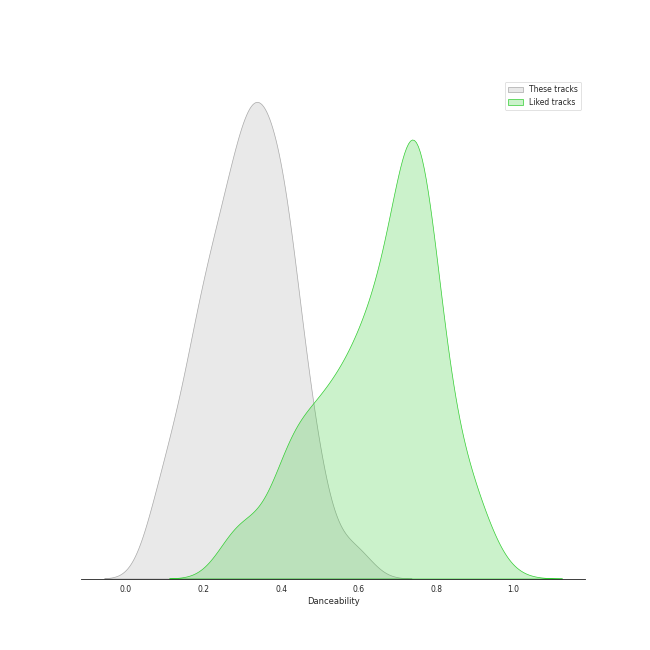
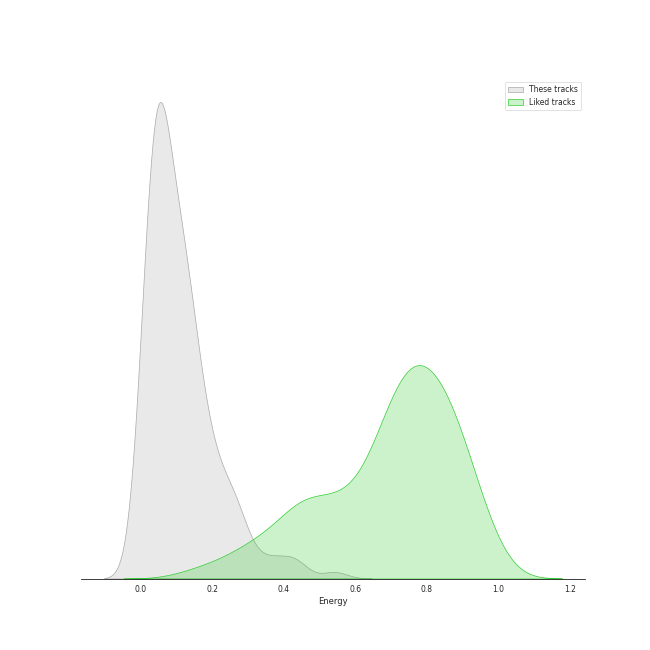
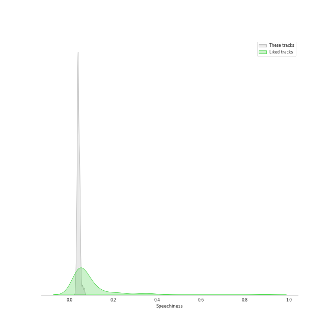
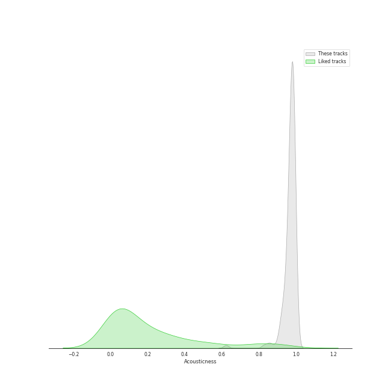
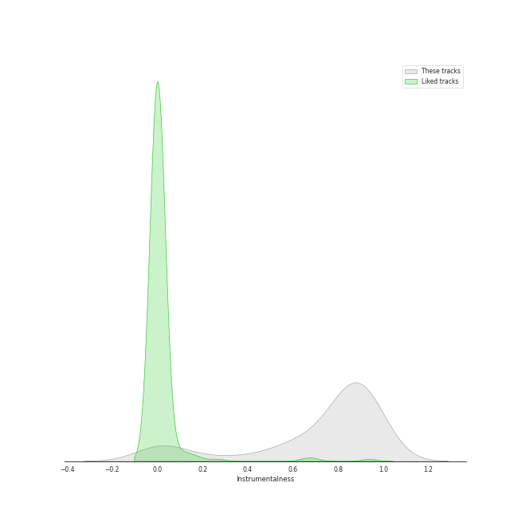
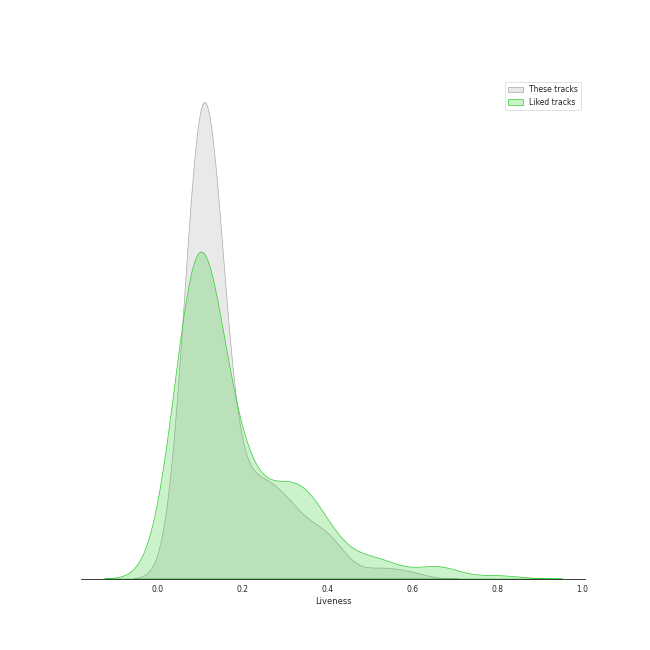
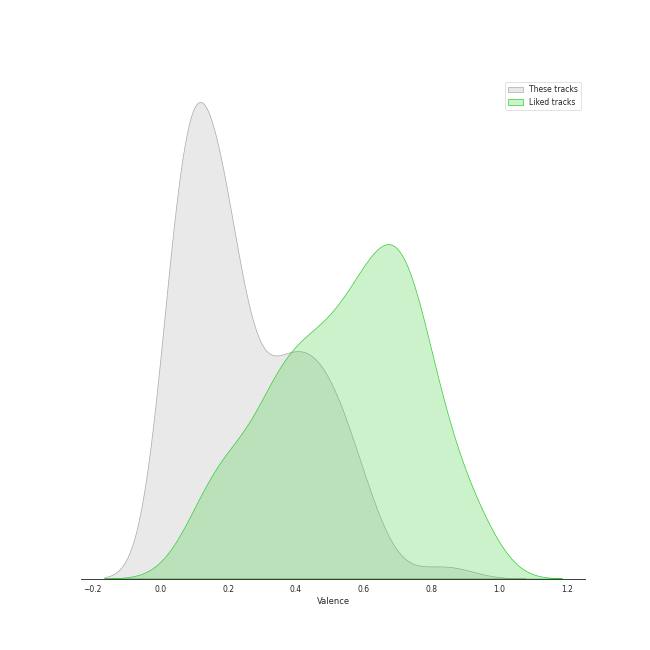
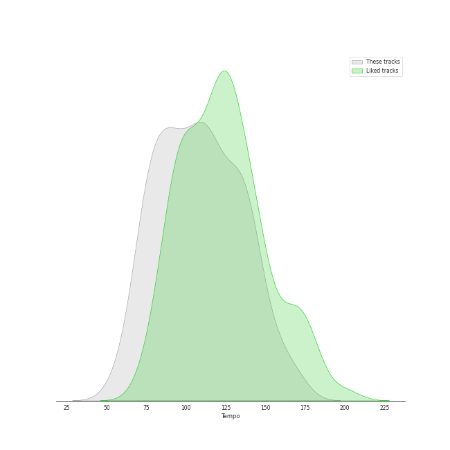

# Track Features for Wolfgang Amadeus Mozart

## Danceability

| ​ | 10 most Danceable tracks | ​​ | 10 least Danceable tracks |
|:---|:---|:---|:---|
|  | String Quartet No. 4 in C Major, K. 157: III. Presto (0.614) |  | Die Zauberflöte, K.620 / Act 2: "O Isis und Osiris, welche Wonne!" (0.0663) |
|  | Divertimento No. 11 in D, K.251 "Nannerl-Septett": Menuetto (Tema con variazioni) (0.593) |  | Horn Concerto No. 4 in E-Flat Major, K. 495: II. Romanza. Andante (0.0683) |
|  | Piano Sonata No. 11 in A Major, K. 331 "Turkish March": III. Alla turca (0.571) |  | Requiem In D Minor, K.626: 7. Agnus Dei (0.0749) |
|  | Piano Sonata No. 11 in A Major, K. 331: 3. Alla Turca. Allegretto (0.55) |  | Divertimento No. 15 in B Flat Major, K. 287: IV. Adagio (0.0898) |
|  | Violin Concerto No. 3 in G Major, K. 216: III. Rondo (Allegro) (0.507) |  | Horn Concerto No. 2 in E-Flat Major, K. 417: II. Andante (0.099) |
|  | Die Zauberflöte, K.620 / Act 2: "Pa-Pa-Pa-Pa-Pa-Pa-Papagena!" (0.504) |  | Divertimento in D, K.334 - Orchestral Version: 4. Adagio (0.101) |
|  | Die Zauberflöte, K.620 / Act 2: Alles fühlt der Liebe Freuden (Monostatos) (0.499) |  | Symphony No. 33 in B flat, K.319: 2. Andante moderato (0.116) |
|  | Piano Sonata No. 16 in C Major, K. 545 "Sonata facile": III. Rondo (0.49) |  | Mass in C Major, K. 317 "Coronation Mass": 1. Kyrie (0.117) |
|  | Piano Sonata No. 12 in F Major, K. 332: II. Adagio (0.486) |  | Requiem In D Minor, K.626: 3. Sequentia: Confutatis (0.118) |
|  | Piano Sonata No. 9 in D Major, K. 311: II. Andante con expressione (0.485) |  | Symphony No. 35 in D Major, K. 385 "Haffner": 2. Andante (0.124) |

## Energy

| ​ | 10 most Energetic tracks | ​​ | 10 least Energetic tracks |
|:---|:---|:---|:---|
|  | Requiem, K. 626: 3a. Sequientia: Dies irae (0.542) |  | Piano Sonata No. 10 in C Major, K. 330: II. Andante cantabile (0.00316) |
|  | Symphony No. 39 in E-Flat Major, K. 543: 4. Finale (Allegro) (0.441) |  | Die Zauberflöte, K.620 / Act 2: "Seid uns zum zweiten Mal willkommen" (0.00404) |
|  | Mass in C Major, K. 317 "Coronation Mass": 3. Credo (0.433) |  | Symphony No. 40 in G Minor, K. 550: II. Andante (0.0102) |
|  | Symphony No. 41 in C Major, K. 551 "Jupiter": 4. Molto allegro (0.408) |  | Piano Sonata No. 16 in C, K.545 "Sonata facile": 2. Andante (0.0117) |
|  | Mass in C Major, K. 317 "Coronation Mass": 4. Sanctus (0.373) |  | Piano Concerto No. 23 in A Major, K. 488: II. Adagio (0.0131) |
|  | Requiem In D Minor, K.626: 5. Sanctus (0.363) |  | Piano Sonata No. 9 in D Major, K. 311: II. Andante con expressione (0.0132) |
|  | Requiem In D Minor, K.626: 2. Kyrie (0.33) |  | Piano Sonata No. 16 in C Major, K. 545 "Sonata facile": II. Andante (0.0138) |
|  | Symphony No. 40 in G Minor, K. 550: 4. Finale (Allegro assai) (0.295) |  | Piano Concerto No. 27 in B-Flat Major, K. 595: II. Larghetto (0.0142) |
|  | Symphony No. 40 in G Minor, K. 550: 1. Molto allegro (0.295) |  | Divertimento No. 15 in B-Flat Major, K. 287: 5. Menuetto (0.0183) |
|  | Symphony No. 35 in D Major, K. 385 "Haffner": 1. Allegro con spirito (0.275) |  | Requiem In D Minor, K.626: 3. Sequentia: Confutatis (0.0185) |

## Speechiness

| ​ | 10 most Speechy tracks | ​​ | 10 least Speechy tracks |
|:---|:---|:---|:---|
|  | Divertimento No. 11 in D, K.251 "Nannerl-Septett": Menuetto (Tema con variazioni) (0.068) |  | Requiem In D Minor, K.626: 4. Offertorium: Domine Jesu (0.0293) |
|  | Die Zauberflöte, K.620 / Act 2: Alles fühlt der Liebe Freuden (Monostatos) (0.0662) |  | Symphony No. 39 in E-Flat Major, K. 543: 3. Menuetto (Allegretto) (0.0297) |
|  | Die Zauberflöte, K.620 / Act 1: "Bei Männern, welche Liebe fühlen" (0.0611) |  | Requiem In D Minor, K.626: 5. Sanctus (0.0301) |
|  | Die Zauberflöte, K.620 / Act 1: Zu Hilfe! Zu Hilfe! (Tamino, Die drei Damen) (0.0591) |  | Requiem In D Minor, K.626: 2. Kyrie (0.0304) |
|  | Serenade in G, K.525 "Eine kleine Nachtmusik": 1. Allegro (0.0585) |  | Requiem In D Minor, K.626: 3. Sequentia: Rex tremendae (0.0315) |
|  | Piano Sonata No. 10 in C Major, K. 330: II. Andante cantabile (0.0534) |  | Requiem In D Minor, K.626: 4. Offertorium: Hostias (0.0316) |
|  | Die Zauberflöte, K.620 / Act 1: Der Vogelfänger bin ich ja (Papageno) (0.0522) |  | Requiem, K. 626: 8.Communio: Lux aeterna (0.0317) |
|  | Die Zauberflöte, K.620 / Act 2: Der Hölle Rache kocht in meinem Herzen (Königin der Nacht) (0.0521) |  | Mass in C Major, K. 317 "Coronation Mass": 4. Sanctus (0.0321) |
|  | Die Zauberflöte, K.620 / Act 2: "Pa-Pa-Pa-Pa-Pa-Pa-Papagena!" (0.052) |  | Requiem, K. 626: 3a. Sequientia: Dies irae (0.0325) |
|  | Piano Sonata No. 9 in D Major, K. 311: II. Andante con expressione (0.0509) |  | Divertimento No. 11 in D, K.251 "Nannerl-Septett": Marcia alla francese (0.0334) |

## Acousticness

| ​ | 10 most Acoustic tracks | ​​ | 10 least Acoustic tracks |
|:---|:---|:---|:---|
|  | Piano Sonata No. 10 in C Major, K. 330: II. Andante cantabile (0.996) |  | Die Zauberflöte, K.620 / Act 2: Ein Mädchen oder Weibchen (Papageno) (0.623) |
|  | Piano Sonata No. 16 in C Major, K. 545 "Sonata facile": II. Andante (0.995) |  | Serenade In G, K.525 "Eine kleine Nachtmusik": 3. Menuetto (Allegretto) (0.828) |
|  | Piano Sonata No. 9 in D Major, K. 311: II. Andante con expressione (0.995) |  | Symphony No. 41 in C Major, K. 551 "Jupiter": 4. Molto allegro (0.852) |
|  | Piano Sonata No. 12 in F Major, K. 332: II. Adagio (0.995) |  | Die Zauberflöte, K.620 / Act 2: Alles fühlt der Liebe Freuden (Monostatos) (0.865) |
|  | Piano Sonata No. 18 in D Major, K. 576: I. Allegro (0.994) |  | Symphony No. 35 in D Major, K. 385 "Haffner": 4. Finale (Presto) (0.896) |
|  | Piano Sonata No. 10 in C Major, K. 330: I. Allegro moderato (0.994) |  | Eine kleine Nachtmusik, K. 525: 2. Romance (Andante) (0.912) |
|  | Piano Sonata No. 16 in C, K.545 "Sonata facile": 3. Rondo (Allegro) (0.994) |  | Symphony No. 40 in G Minor, K. 550: 1. Molto allegro (0.917) |
|  | Piano Sonata No. 16 in C, K.545 "Sonata facile": 2. Andante (0.994) |  | Divertimento in B-Flat Major, K. 287 (Orch. Perf.): 4. Adagio (0.919) |
|  | Piano Sonata No. 11 in A Major, K. 331: 1. Tema (Andante grazioso) con variazioni (0.994) |  | Serenade in G, K.525 "Eine kleine Nachtmusik": 1. Allegro (0.919) |
|  | Piano Sonata No. 11 in A Major, K. 331 "Turkish March": III. Alla turca (0.994) |  | Symphony No. 36 in C Major, K. 425 "Linz": 2. Andante (0.92) |

## Instrumentalness

| ​ | 10 most Instrumental tracks | ​​ | 10 least Instrumental tracks |
|:---|:---|:---|:---|
|  | Divertimento No. 11 in D, K.251 "Nannerl-Septett": Menuetto (Tema con variazioni) (0.958) |  | Die Zauberflöte, K.620 / Act 2: Ein Mädchen oder Weibchen (Papageno) (0.0) |
|  | Horn Concerto No. 2 in E-Flat Major, K. 417: II. Andante (0.954) |  | Die Zauberflöte, K.620 / Act 1: "Bei Männern, welche Liebe fühlen" (0.0) |
|  | Piano Sonata No. 16 in C Major, K. 545 "Sonata facile": III. Rondo (0.954) |  | Die Zauberflöte, K.620 / Act 1: Der Vogelfänger bin ich ja (Papageno) (1.03e-05) |
|  | Horn Concerto No. 1 in D Major, K. 386b (K. 412 & 514): I. (Allegro) K. 412 (0.95) |  | Die Zauberflöte, K.620 / Act 2: "Seid uns zum zweiten Mal willkommen" (1.46e-05) |
|  | Piano Sonata No. 16 in C, K.545 "Sonata facile": 1. Allegro (0.949) |  | Die Zauberflöte, K.620 / Act 1: Zu Hilfe! Zu Hilfe! (Tamino, Die drei Damen) (5.54e-05) |
|  | Horn Concerto No. 4 in E-Flat Major, K. 495: II. Romanza. Andante (0.949) |  | Die Zauberflöte, K.620 / Act 2: Alles fühlt der Liebe Freuden (Monostatos) (5.9e-05) |
|  | Piano Concerto No. 20 in D Minor, K. 466: I. Allegro (0.948) |  | Requiem In D Minor, K.626: 3. Sequentia: Recordare (0.000349) |
|  | Requiem In D Minor, K.626: 3. Sequentia: Confutatis (0.944) |  | Requiem In D Minor, K.626: 3. Sequentia: Tuba mirum (0.0004) |
|  | Symphony No. 40 in G Minor, K. 550: 4. Finale (Allegro assai) (0.941) |  | Requiem In D Minor, K.626: 6. Benedictus (0.000441) |
|  | Piano Sonata No. 11 in A Major, K. 331: 1. Tema (Andante grazioso) con variazioni (0.941) |  | Die Zauberflöte, K.620 / Act 1: Dies Bildnis ist bezaubernd schön (Tamino) (0.00077) |

## Liveness

| ​ | 10 most Live tracks | ​​ | 10 least Live tracks |
|:---|:---|:---|:---|
|  | Symphony No. 36 in C Major, K. 425 "Linz": 3. Menuetto (0.594) |  | Piano Sonata No. 10 in C Major, K. 330: II. Andante cantabile (0.0583) |
|  | Requiem In D Minor, K.626: 3. Sequentia: Recordare (0.541) |  | Piano Sonata No. 16 in C Major, K. 545 "Sonata facile": II. Andante (0.0625) |
|  | Die Zauberflöte, K.620 / Act 2: Alles fühlt der Liebe Freuden (Monostatos) (0.508) |  | Divertimento in D, K.334 - Orchestral Version: 2. Thema mit Variationen (Andante) (0.0641) |
|  | Requiem, K. 626: 3a. Sequientia: Dies irae (0.444) |  | Violin Concerto No. 5 in A Major, K. 219 "Turkish": III. Rondeau (Tempo di minuetto) (0.0665) |
|  | Die Zauberflöte, K.620 / Act 1: Der Vogelfänger bin ich ja (Papageno) (0.421) |  | Violin Concerto No. 5 in A Major, K. 219 "Turkish": I. Allegro aperto (0.0674) |
|  | Divertimento In F, K.247: Menuetto (0.412) |  | String Quartet No. 17 in B-Flat Major, K. 458 "The Hunt": I. Allegro vivace assai (0.0676) |
|  | Symphony No. 33 in B flat, K.319: 3. Menuetto (0.409) |  | Piano Sonata No. 10 in C Major, K. 330: I. Allegro moderato (0.0702) |
|  | Divertimento No. 11 in D, K.251 "Nannerl-Septett": Marcia alla francese (0.392) |  | Requiem, K. 626: 8.Communio: Lux aeterna (0.0716) |
|  | Die Zauberflöte, K.620 / Act 2: "Seid uns zum zweiten Mal willkommen" (0.386) |  | Die Zauberflöte, K.620 / Act 2: Der Hölle Rache kocht in meinem Herzen (Königin der Nacht) (0.0743) |
|  | Symphony No. 41 in C Major, K. 551 "Jupiter": 3. Menuetto (Allegretto) (0.384) |  | Symphony No. 39 in E-Flat Major, K. 543: 2. Andante con moto (0.0759) |

## Valence

| ​ | 10 most Happy tracks | ​​ | 10 least Happy tracks |
|:---|:---|:---|:---|
|  | String Quartet No. 4 in C Major, K. 157: III. Presto (0.878) |  | Requiem In D Minor, K.626: 7. Agnus Dei (0.0338) |
|  | Die Zauberflöte, K.620 / Act 2: Alles fühlt der Liebe Freuden (Monostatos) (0.792) |  | Requiem In D Minor, K.626: 3. Sequentia: Confutatis (0.0351) |
|  | Mozart: Serenade No. 13 in G Major, K. 525 "Eine kleine Nachtmusik": IV. Rondo. Allegro (0.646) |  | Die Zauberflöte, K.620 / Act 2: O Isis und Osiris (Sarastro, Chor) (0.0353) |
|  | Serenade In G, K.525 "Eine kleine Nachtmusik": 4. Rondo (Allegro) (0.64) |  | Die Zauberflöte, K.620 / Act 2: Ach, ich fühl's, es ist verschwunden (Pamina) (0.0373) |
|  | Piano Sonata No. 10 in C Major, K. 330: I. Allegro moderato (0.616) |  | Divertimento In F, K.247: Adagio (0.0381) |
|  | Piano Sonata No. 11 in A Major, K. 331 "Turkish March": III. Alla turca (0.612) |  | Mass in C Major, K. 317 "Coronation Mass": 6. Agnus Dei (0.0384) |
|  | Requiem, K. 626: 3a. Sequientia: Dies irae (0.596) |  | Symphony No. 41 in C Major, K. 551 "Jupiter": 2. Andante cantabile (0.0385) |
|  | Divertimento No. 11 in D, K.251 "Nannerl-Septett": Menuetto (Tema con variazioni) (0.57) |  | Symphony No. 40 in G Minor, K. 550: 2. Andante (0.0392) |
|  | String Quartet No. 4 in C Major, K. 157: I. Allegro (0.567) |  | Requiem, K. 626: 3. Sequentia: Lacrimosa (0.0394) |
|  | Piano Sonata No. 11 in A Major, K. 331: 3. Alla Turca. Allegretto (0.562) |  | Divertimento in D, K.334 - Orchestral Version: 4. Adagio (0.04) |

## Tempo

| ​ | 10 most Fast tracks | ​​ | 10 least Fast tracks |
|:---|:---|:---|:---|
|  | Divertimento in D, K.334 - Orchestral Version: 4. Adagio (168.802) |  | Divertimento No. 15 in B Flat Major, K. 287: IV. Adagio (56.647) |
|  | Piano Sonata No. 14 in C Minor, K. 457: I. Molto allegro (168.671) |  | Mass in C Major, K. 317 "Coronation Mass": 5. Benedictus (57.355) |
|  | Symphony No. 33 in B flat, K.319: 2. Andante moderato (165.957) |  | Horn Concerto No. 4 in E-Flat Major, K. 495: III. Rondo. Allegro vivace (63.172) |
|  | Symphony No. 33 in B flat, K.319: 1. Allegro assai (165.933) |  | Requiem In D Minor, K.626: 3. Sequentia: Confutatis (65.236) |
|  | String Quartet No. 22 in B-Flat Major, K. 589, "Prussian": IV. Allegro assai (156.406) |  | Piano Sonata No. 16 in C, K.545 "Sonata facile": 2. Andante (67.143) |
|  | String Quartet No. 17 in B-Flat Major, K. 458 "The Hunt": IV. Allegro assai (154.058) |  | Requiem In D Minor, K.626: 5. Sanctus (68.345) |
|  | Divertimento No. 15 in B Flat Major, K. 287: I. Allegro (153.666) |  | Mozart: Serenade No. 13 in G Major, K. 525 "Eine kleine Nachtmusik": II. Romance. Andante (69.457) |
|  | Eine kleine Nachtmusik, K. 525: 2. Romance (Andante) (153.555) |  | Die Zauberflöte, K.620 / Act 1: Zu Hilfe! Zu Hilfe! (Tamino, Die drei Damen) (70.475) |
|  | Symphony No. 39 in E-Flat Major, K. 543: 1. Adagio - Allegro (153.184) |  | Symphony No. 40 in G Minor, K. 550: III. Menuetto. Allegretto (72.476) |
|  | Mass in C Major, K. 317 "Coronation Mass": 2. Gloria (152.459) |  | Die Zauberflöte, K.620 / Act 2: "O Isis und Osiris, welche Wonne!" (73.462) |
