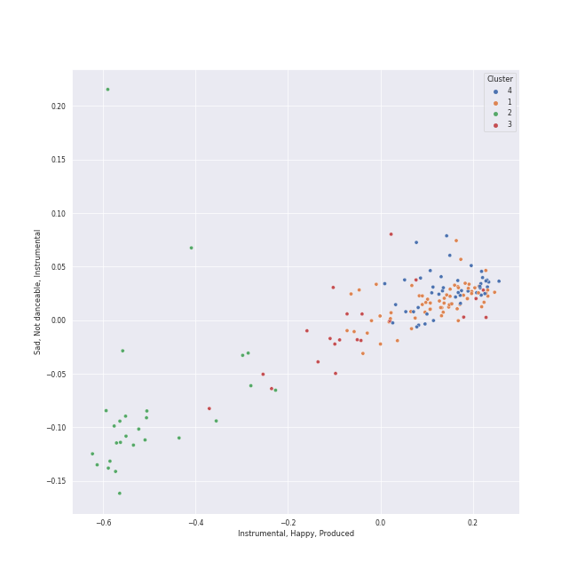

# Clusters in Wolfgang Amadeus Mozart

## Cluster #1

57 tracks

| Art | Track | Album | Artists | Label | 💚 | 🔗 |
|:---|:---|:---|:---|:---|:---|:---|
|  | String Quartet No. 4 in C Major, K. 157: II. Andante | Mozart: String Quartets Nos. 4, 17 & 22 | [Wolfgang Amadeus Mozart](../../overview.md), [Jerusalem Quartet](../../../jerusalem_quartet/overview.md) | [harmonia mundi](../../../../labels/harmonia_mundi) | | [🔗](https://open.spotify.com/track/4V6p7SY0ALq9I5iuOgkVNK) |
|  | Divertimento In F, K.247: Andante grazioso | Karajan - Mozart | [Wolfgang Amadeus Mozart](../../overview.md), [Berliner Philharmoniker](../../../berliner_philharmoniker/overview.md), [Herbert von Karajan](../../../herbert_von_karajan/overview.md) | [UME - Global Clearing House](../../../../labels/ume___global_clearing_house) | | [🔗](https://open.spotify.com/track/3iaBg32tC3kAL7lsYkr8Ff) |
|  | Divertimento No. 15 in B Flat Major, K. 287: III. Menuetto (I) | Karajan - Mozart | [Wolfgang Amadeus Mozart](../../overview.md), [Berliner Philharmoniker](../../../berliner_philharmoniker/overview.md), [Herbert von Karajan](../../../herbert_von_karajan/overview.md) | [UME - Global Clearing House](../../../../labels/ume___global_clearing_house) | | [🔗](https://open.spotify.com/track/6TQjyU0bNyhYwSBfqJUm6O) |
|  | Divertimento No. 15 in B-Flat Major, K. 287: 3. Menuetto | Karajan - Mozart | [Wolfgang Amadeus Mozart](../../overview.md), [Berliner Philharmoniker](../../../berliner_philharmoniker/overview.md), [Herbert von Karajan](../../../herbert_von_karajan/overview.md) | [UME - Global Clearing House](../../../../labels/ume___global_clearing_house) | | [🔗](https://open.spotify.com/track/3doNQlb1qU7MRMzWAvdOSK) |
|  | Requiem In D Minor, K.626: 8.Communio: Lux aeterna | Karajan - Mozart | [Wolfgang Amadeus Mozart](../../overview.md), Wiener Singverein, Wiener Philharmoniker, [Herbert von Karajan](../../../herbert_von_karajan/overview.md) | [UME - Global Clearing House](../../../../labels/ume___global_clearing_house) | | [🔗](https://open.spotify.com/track/6EkyeAw8TnpzH516EBWgW2) |
|  | Symphony No. 32 in G Major, K. 318: 1. Allegro - 2. Andante - 3. Tempo I | Karajan - Mozart | [Wolfgang Amadeus Mozart](../../overview.md), [Berliner Philharmoniker](../../../berliner_philharmoniker/overview.md), [Herbert von Karajan](../../../herbert_von_karajan/overview.md) | [UME - Global Clearing House](../../../../labels/ume___global_clearing_house) | | [🔗](https://open.spotify.com/track/21cATdRkPAVU27StFK9Zfo) |
|  | Symphony No. 36 in C Major, K. 425 "Linz": 1. Adagio - Allegro spiritoso | Karajan - Mozart | [Wolfgang Amadeus Mozart](../../overview.md), [Berliner Philharmoniker](../../../berliner_philharmoniker/overview.md), [Herbert von Karajan](../../../herbert_von_karajan/overview.md) | [UME - Global Clearing House](../../../../labels/ume___global_clearing_house) | | [🔗](https://open.spotify.com/track/2j4BI5TZsucyNmOe3WA2Yq) |
|  | Piano Concerto No. 20 in D Minor, K. 466: II. Romance | Mozart Piano Pieces | [Wolfgang Amadeus Mozart](../../overview.md), Roberte Mamou, Gerard Oskamp, Berliner Symphoniker | [Warner Music Group - X5 Music Group](../../../../labels/warner_music_group___x5_music_group) | | [🔗](https://open.spotify.com/track/2XY6ID1TAueZidFAfkjUCK) |
|  | Piano Concerto No. 24 in C Minor, K. 491: I. Allegro | Mozart Piano Pieces | [Wolfgang Amadeus Mozart](../../overview.md), Carmen Piazzini, Mikhail Gantvarg, The St. Petersburg Soloists | [Warner Music Group - X5 Music Group](../../../../labels/warner_music_group___x5_music_group) | | [🔗](https://open.spotify.com/track/2OA3ADPrHocxY3hOhgO3r6) |
|  | Piano Concerto No. 24 in C Minor, K. 491: II. Larghetto | Mozart Piano Pieces | [Wolfgang Amadeus Mozart](../../overview.md), Carmen Piazzini, Mikhail Gantvarg, The St. Petersburg Soloists | [Warner Music Group - X5 Music Group](../../../../labels/warner_music_group___x5_music_group) | | [🔗](https://open.spotify.com/track/1So9jHVpEqcbNX6rU9wUDC) |
## Cluster #2

25 tracks

| Art | Track | Album | Artists | Label | 💚 | 🔗 |
|:---|:---|:---|:---|:---|:---|:---|
|  | Mozart: Eine kleine Nachtmusik, K. 525: II. Romance. Andante | Mozart: Eine Kleine Nachtmusik etc. | [Wolfgang Amadeus Mozart](../../overview.md), Sir Neville Marriner, Academy of St. Martin in the Fields | [Warner Classics](../../../../labels/warner_classics) | | [🔗](https://open.spotify.com/track/5c8aHvonwKaBAoOIXmHQdt) |
|  | Die Zauberflöte, K.620 / Act 1: "Bei Männern, welche Liebe fühlen" | Karajan - Mozart | [Wolfgang Amadeus Mozart](../../overview.md), Edith Mathis, Gottfried Hornik, [Berliner Philharmoniker](../../../berliner_philharmoniker/overview.md), [Herbert von Karajan](../../../herbert_von_karajan/overview.md) | [UME - Global Clearing House](../../../../labels/ume___global_clearing_house) | | [🔗](https://open.spotify.com/track/7earPy3QwSWpSKX2eYX9US) |
|  | Die Zauberflöte, K.620 / Act 1: "O zittre nicht, mein lieber Sohn" | Karajan - Mozart | [Wolfgang Amadeus Mozart](../../overview.md), Karin Ott, [Berliner Philharmoniker](../../../berliner_philharmoniker/overview.md), [Herbert von Karajan](../../../herbert_von_karajan/overview.md) | [UME - Global Clearing House](../../../../labels/ume___global_clearing_house) | | [🔗](https://open.spotify.com/track/6DT54QnrQN2kHlWCf6KroH) |
|  | Die Zauberflöte, K.620 / Act 1: Dies Bildnis ist bezaubernd schön (Tamino) | Karajan - Mozart | [Wolfgang Amadeus Mozart](../../overview.md), Francisco Araiza, [Berliner Philharmoniker](../../../berliner_philharmoniker/overview.md), [Herbert von Karajan](../../../herbert_von_karajan/overview.md) | [UME - Global Clearing House](../../../../labels/ume___global_clearing_house) | | [🔗](https://open.spotify.com/track/3A5Hdmjl3cQWctF2KPHPDT) |
|  | Die Zauberflöte, K.620 / Act 1: Zu Hilfe! Zu Hilfe! (Tamino, Die drei Damen) | Karajan - Mozart | [Wolfgang Amadeus Mozart](../../overview.md), Francisco Araiza, Anna Tomowa-Sintow, Agnes Baltsa, Hanna Schwarz, [Berliner Philharmoniker](../../../berliner_philharmoniker/overview.md), [Herbert von Karajan](../../../herbert_von_karajan/overview.md) | [UME - Global Clearing House](../../../../labels/ume___global_clearing_house) | | [🔗](https://open.spotify.com/track/3dFThyBhorrpp8sOOUIS0o) |
|  | Mass In C, K.317 "Coronation": 2. Gloria | Karajan - Mozart | [Wolfgang Amadeus Mozart](../../overview.md), Anna Tomowa-Sintow, Agnes Baltsa, Werner Krenn, José van Dam, [Berliner Philharmoniker](../../../berliner_philharmoniker/overview.md), [Herbert von Karajan](../../../herbert_von_karajan/overview.md), Wiener Singverein | [UME - Global Clearing House](../../../../labels/ume___global_clearing_house) | | [🔗](https://open.spotify.com/track/0nN6oNjnxZ9yUfNP3Vq5VY) |
|  | Mass In C, K.317 "Coronation": 7. Agnus Dei. Dona nobis pacem - Allegro con spirito | Karajan - Mozart | [Wolfgang Amadeus Mozart](../../overview.md), Anna Tomowa-Sintow, Agnes Baltsa, Werner Krenn, José van Dam, [Berliner Philharmoniker](../../../berliner_philharmoniker/overview.md), [Herbert von Karajan](../../../herbert_von_karajan/overview.md), Wiener Singverein | [UME - Global Clearing House](../../../../labels/ume___global_clearing_house) | | [🔗](https://open.spotify.com/track/5xoJs5tSHWZ0u8Y3GkRvem) |
|  | Requiem In D Minor, K.626: 3. Sequentia: Tuba mirum | Karajan - Mozart | [Wolfgang Amadeus Mozart](../../overview.md), Anna Tomowa-Sintow, Helga Muller-Molinari, Vinson Cole, Paata Burchuladze, Wiener Philharmoniker, [Herbert von Karajan](../../../herbert_von_karajan/overview.md) | [UME - Global Clearing House](../../../../labels/ume___global_clearing_house) | | [🔗](https://open.spotify.com/track/5xItkHeimSWCAWwh6WvV86) |
|  | Requiem In D Minor, K.626: 4. Offertorium: Domine Jesu | Karajan - Mozart | [Wolfgang Amadeus Mozart](../../overview.md), Anna Tomowa-Sintow, Helga Muller-Molinari, Vinson Cole, Paata Burchuladze, Wiener Singverein, Wiener Philharmoniker, [Herbert von Karajan](../../../herbert_von_karajan/overview.md) | [UME - Global Clearing House](../../../../labels/ume___global_clearing_house) | | [🔗](https://open.spotify.com/track/7rFbjvOVAjimxhIMVVatF6) |
|  | Requiem In D Minor, K.626: 6. Benedictus | Karajan - Mozart | [Wolfgang Amadeus Mozart](../../overview.md), Anna Tomowa-Sintow, Helga Muller-Molinari, Vinson Cole, Paata Burchuladze, Wiener Singverein, Wiener Philharmoniker, [Herbert von Karajan](../../../herbert_von_karajan/overview.md) | [UME - Global Clearing House](../../../../labels/ume___global_clearing_house) | | [🔗](https://open.spotify.com/track/0HFIawlgXNMh01tMP3rur4) |
## Cluster #3

52 tracks

| Art | Track | Album | Artists | Label | 💚 | 🔗 |
|:---|:---|:---|:---|:---|:---|:---|
|  | String Quartet No. 17 in B-Flat Major, K. 458 "The Hunt": IV. Allegro assai | Mozart: String Quartets Nos. 4, 17 & 22 | [Wolfgang Amadeus Mozart](../../overview.md), [Jerusalem Quartet](../../../jerusalem_quartet/overview.md) | [harmonia mundi](../../../../labels/harmonia_mundi) | | [🔗](https://open.spotify.com/track/6AgF5rgvW3hRwe6A8KCcwl) |
|  | String Quartet No. 22 in B-Flat Major, K. 589, "Prussian": IV. Allegro assai | Mozart: String Quartets Nos. 4, 17 & 22 | [Wolfgang Amadeus Mozart](../../overview.md), [Jerusalem Quartet](../../../jerusalem_quartet/overview.md) | [harmonia mundi](../../../../labels/harmonia_mundi) | | [🔗](https://open.spotify.com/track/6Y8SmRRP56DkQoDt8op0xN) |
|  | Symphony No. 40 in G Minor, K. 550: III. Menuetto. Allegretto | Mozart: Symphony No. 40 in G Minor, Bassoon Concerto & Flute Serenades Nos. 1 & 3 | [Wolfgang Amadeus Mozart](../../overview.md), Cologne New Philharmonic Orchestra, Volker Hartung | JPK Musik | | [🔗](https://open.spotify.com/track/3ZbnjLCpvVdSThFWbfRJrf) |
|  | Symphony No. 40 in G Minor, K. 550: IV. Allegro assai | Mozart: Symphony No. 40 in G Minor, Bassoon Concerto & Flute Serenades Nos. 1 & 3 | [Wolfgang Amadeus Mozart](../../overview.md), Cologne New Philharmonic Orchestra, Volker Hartung | JPK Musik | | [🔗](https://open.spotify.com/track/7hV999Y5iTFvBJhI48ZAuo) |
|  | Divertimento No. 11 in D, K.251 "Nannerl-Septett": Allegro molto | Karajan - Mozart | [Wolfgang Amadeus Mozart](../../overview.md), [Berliner Philharmoniker](../../../berliner_philharmoniker/overview.md), [Herbert von Karajan](../../../herbert_von_karajan/overview.md) | [UME - Global Clearing House](../../../../labels/ume___global_clearing_house) | | [🔗](https://open.spotify.com/track/7hxpr5ejSeH3RSdrtxk5P3) |
|  | Horn Concerto No. 1 in D Major, K. 386b (K. 412 & 514): II. Rondò. Allegro K. 514 | Karajan - Mozart | [Wolfgang Amadeus Mozart](../../overview.md), Gerd Seifert, [Berliner Philharmoniker](../../../berliner_philharmoniker/overview.md), [Herbert von Karajan](../../../herbert_von_karajan/overview.md) | [UME - Global Clearing House](../../../../labels/ume___global_clearing_house) | | [🔗](https://open.spotify.com/track/4sHYPGjXXhFpJB1DMVc14A) |
|  | Horn Concerto No. 3 in E-Flat Major, K. 447: III. Allegro | Karajan - Mozart | [Wolfgang Amadeus Mozart](../../overview.md), Manfred Klier, Gerd Seifert, [Berliner Philharmoniker](../../../berliner_philharmoniker/overview.md), [Herbert von Karajan](../../../herbert_von_karajan/overview.md) | [UME - Global Clearing House](../../../../labels/ume___global_clearing_house) | | [🔗](https://open.spotify.com/track/1UPNWzHNtv70waHBGDTQxq) |
|  | Symphony No. 33 in B flat, K.319: 4. Finale (Allegro assai) | Karajan - Mozart | [Wolfgang Amadeus Mozart](../../overview.md), [Berliner Philharmoniker](../../../berliner_philharmoniker/overview.md), [Herbert von Karajan](../../../herbert_von_karajan/overview.md) | [UME - Global Clearing House](../../../../labels/ume___global_clearing_house) | | [🔗](https://open.spotify.com/track/6tx5pjn919UXtGD80ElBa9) |
|  | Symphony No. 38 In D, K.504 "Prague": 3. Finale (Presto) | Karajan - Mozart | [Wolfgang Amadeus Mozart](../../overview.md), [Berliner Philharmoniker](../../../berliner_philharmoniker/overview.md), [Herbert von Karajan](../../../herbert_von_karajan/overview.md) | [UME - Global Clearing House](../../../../labels/ume___global_clearing_house) | | [🔗](https://open.spotify.com/track/5OlBFvqwbhQcoihA42rIdk) |
|  | Piano Sonata No. 18 in D Major, K. 576: I. Allegro | Mozart Piano Pieces | [Wolfgang Amadeus Mozart](../../overview.md), Carmen Piazzini | [Warner Music Group - X5 Music Group](../../../../labels/warner_music_group___x5_music_group) | | [🔗](https://open.spotify.com/track/7bv1oLv8wGSVp96UkZsPgJ) |
## Cluster #4

25 tracks

| Art | Track | Album | Artists | Label | 💚 | 🔗 |
|:---|:---|:---|:---|:---|:---|:---|
|  | String Quartet No. 17 in B-Flat Major, K. 458 "The Hunt": III. Adagio | Mozart: String Quartets Nos. 4, 17 & 22 | [Wolfgang Amadeus Mozart](../../overview.md), [Jerusalem Quartet](../../../jerusalem_quartet/overview.md) | [harmonia mundi](../../../../labels/harmonia_mundi) | | [🔗](https://open.spotify.com/track/74TmNT7ctAj6O6wpDTkb6O) |
|  | String Quartet No. 22 in B-Flat Major, K. 589, "Prussian": II. Larghetto | Mozart: String Quartets Nos. 4, 17 & 22 | [Wolfgang Amadeus Mozart](../../overview.md), [Jerusalem Quartet](../../../jerusalem_quartet/overview.md) | [harmonia mundi](../../../../labels/harmonia_mundi) | | [🔗](https://open.spotify.com/track/7eaYdLRx1XuHhTpKMYaBU9) |
|  | Divertimento In F, K.247: Allegro | Karajan - Mozart | [Wolfgang Amadeus Mozart](../../overview.md), [Berliner Philharmoniker](../../../berliner_philharmoniker/overview.md), [Herbert von Karajan](../../../herbert_von_karajan/overview.md) | [UME - Global Clearing House](../../../../labels/ume___global_clearing_house) | | [🔗](https://open.spotify.com/track/33cEtMvcZC5aBi8IMvI6tG) |
|  | Divertimento In F, K.247: Menuetto (I) | Karajan - Mozart | [Wolfgang Amadeus Mozart](../../overview.md), [Berliner Philharmoniker](../../../berliner_philharmoniker/overview.md), [Herbert von Karajan](../../../herbert_von_karajan/overview.md) | [UME - Global Clearing House](../../../../labels/ume___global_clearing_house) | | [🔗](https://open.spotify.com/track/4duOrn3Scr5l8GFlbvLgV8) |
|  | Divertimento No. 15 in B Flat Major, K.287: 2. Tema con variazioni: Andante grazioso | Karajan - Mozart | [Wolfgang Amadeus Mozart](../../overview.md), [Berliner Philharmoniker](../../../berliner_philharmoniker/overview.md), [Herbert von Karajan](../../../herbert_von_karajan/overview.md) | [UME - Global Clearing House](../../../../labels/ume___global_clearing_house) | | [🔗](https://open.spotify.com/track/21lIEJBVGTErWpl4Qpggpz) |
|  | Divertimento No. 15 in B-Flat Major, K. 287: 2. Thema mit Variationen: Andante grazioso | Karajan - Mozart | [Wolfgang Amadeus Mozart](../../overview.md), [Berliner Philharmoniker](../../../berliner_philharmoniker/overview.md), [Herbert von Karajan](../../../herbert_von_karajan/overview.md) | [UME - Global Clearing House](../../../../labels/ume___global_clearing_house) | | [🔗](https://open.spotify.com/track/7IgInWMT2b4Wqjvqmx6OhC) |
|  | Requiem In D Minor, K.626: 4. Offertorium: Hostias | Karajan - Mozart | [Wolfgang Amadeus Mozart](../../overview.md), Wiener Singverein, Wiener Philharmoniker, [Herbert von Karajan](../../../herbert_von_karajan/overview.md) | [UME - Global Clearing House](../../../../labels/ume___global_clearing_house) | | [🔗](https://open.spotify.com/track/0x7uY2kKO4RVhajULRVNFo) |
|  | Requiem In D Minor, K.626: 5. Sanctus | Karajan - Mozart | [Wolfgang Amadeus Mozart](../../overview.md), Wiener Singverein, Wiener Philharmoniker, [Herbert von Karajan](../../../herbert_von_karajan/overview.md) | [UME - Global Clearing House](../../../../labels/ume___global_clearing_house) | | [🔗](https://open.spotify.com/track/7rkakVQEVWVASpkamj7m8o) |
|  | Serenade In G, K.525 "Eine kleine Nachtmusik": 2. Romance (Andante) | Karajan - Mozart | [Wolfgang Amadeus Mozart](../../overview.md), [Berliner Philharmoniker](../../../berliner_philharmoniker/overview.md), [Herbert von Karajan](../../../herbert_von_karajan/overview.md) | [UME - Global Clearing House](../../../../labels/ume___global_clearing_house) | | [🔗](https://open.spotify.com/track/3NB3I7BknhsluKpKuy5bxx) |
|  | Violin Concerto No. 5 in A Major, K. 219: II. Adagio | Karajan - Mozart | [Wolfgang Amadeus Mozart](../../overview.md), Joseph Joachim, Ossip Schnirlin, Anne-Sophie Mutter, [Berliner Philharmoniker](../../../berliner_philharmoniker/overview.md), [Herbert von Karajan](../../../herbert_von_karajan/overview.md) | [UME - Global Clearing House](../../../../labels/ume___global_clearing_house) | | [🔗](https://open.spotify.com/track/3G4djnsfzYUYDBTvAMnT1x) |