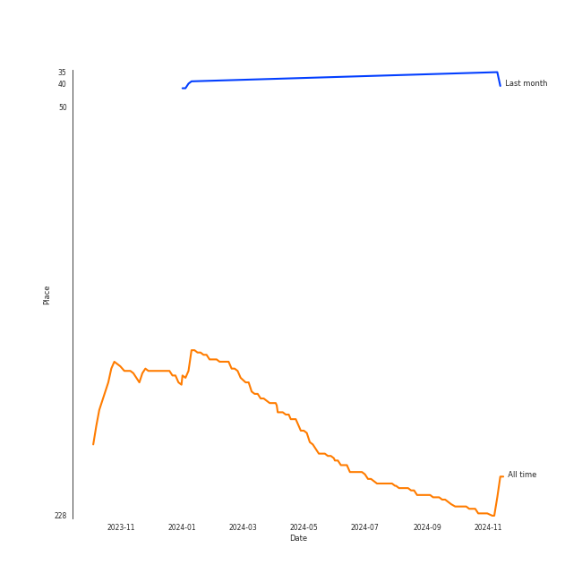
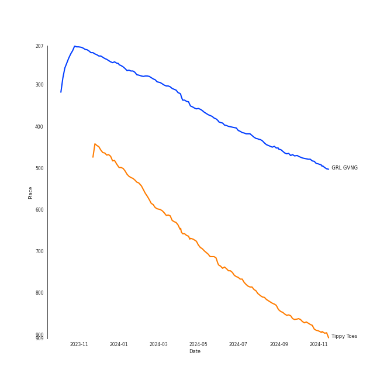
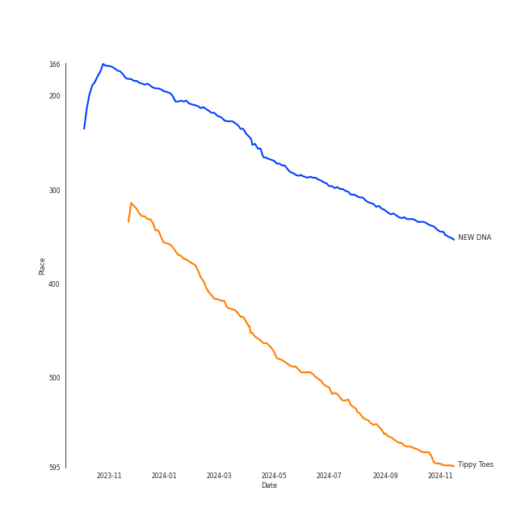

# XG

## Relationships

XG:
- has member 秋山心響 (Akiyama Cocona)
- has member あさやじゅりん (Asaya Jurin)
- has member Amy Jannet Harvey
- has member 河地マヤ (Kawachi Maya)
- has member こんどうちさ (Kondo Chisa)
- has member そうはらひなた (Sohara Hinata)
- has member うえだじゅりあ (Ueda Juria)

## Artist Rank
- The #226 artist of all time

## Top Tracks

### Top tracks of all time

## Top Albums

| Art | Rank | Tracks | 💚 | Album | Release Date | 🔗 |
|:---|---:|---:|---:|:---|:---|:---|
|  | 332 | 2 | 2 | NEW DNA | 2023-09-27 | [🔗](https://open.spotify.com/album/5ltOyfF29bg84gvBJPLOgj) |
|  | 644 | 2 | 1 | SHOOTING STAR | 2023-01-25 | [🔗](https://open.spotify.com/album/1Gi6ij4Jxc4qE35i3I0gqS) |
|  | 644 | 1 | 1 | WOKE UP | 2024-05-21 | [🔗](https://open.spotify.com/album/2e9eizo3Euh2aaBef2B2bw) |
|  | 574 | 1 | 1 | Tippy Toes | 2022-03-18 | [🔗](https://open.spotify.com/album/6P9erpHs7hgJlca7Tj3F0w) |

## Featured on Playlists
| Art | Tracks | Playlist |
|:---|---:|:---|
|  | 6 | [K-Pop](../../playlists/k-pop/overview.md) |
|  | 1 | [Recent Comebacks](../../playlists/recent_comebacks/overview.md) |

## Top Record Labels

| Tracks | 💚 | Label |
|---:|---:|:---|
| 6 | 5 | XGALX |

## Genres

- [k-pop girl group](../../genres/k-pop_girl_group/overview.md)

## Tracks

| Art | Track | Album | Artists | Label | Rank | 💚 | 🔗 |
|:---|:---|:---|:---|:---|---:|:---|:---|
|  | GRL GVNG | NEW DNA | [XG](overview.md) | XGALX | 473 | 💚 | [🔗](https://open.spotify.com/track/2YLwxR4HLqsBdQG2Uw3J5C) |
|  | Tippy Toes | Tippy Toes | [XG](overview.md) | XGALX | 866 | 💚 | [🔗](https://open.spotify.com/track/1MKmSbQfJpEVnC3XfGywyF) |
|  | LEFT RIGHT | SHOOTING STAR | [XG](overview.md) | XGALX | 976 | 💚 | [🔗](https://open.spotify.com/track/3v5o91PrUtf0nmO6j8J7dZ) |
|  | SHOOTING STAR | SHOOTING STAR | [XG](overview.md) | XGALX | 976 | | [🔗](https://open.spotify.com/track/3IelG5zYpWWCZIH4cqWlPV) |
|  | PUPPET SHOW | NEW DNA | [XG](overview.md) | XGALX | 976 | 💚 | [🔗](https://open.spotify.com/track/7sDkXyDikXhpRz715MdiEp) |
|  | WOKE UP | WOKE UP | [XG](overview.md) | XGALX | 976 | 💚 | [🔗](https://open.spotify.com/track/4keuUM29CtIWgsPRzRhXoW) |
