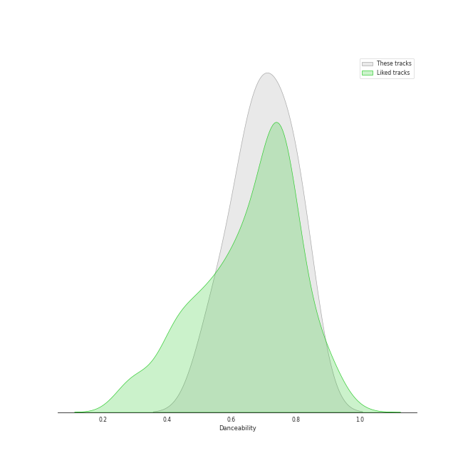
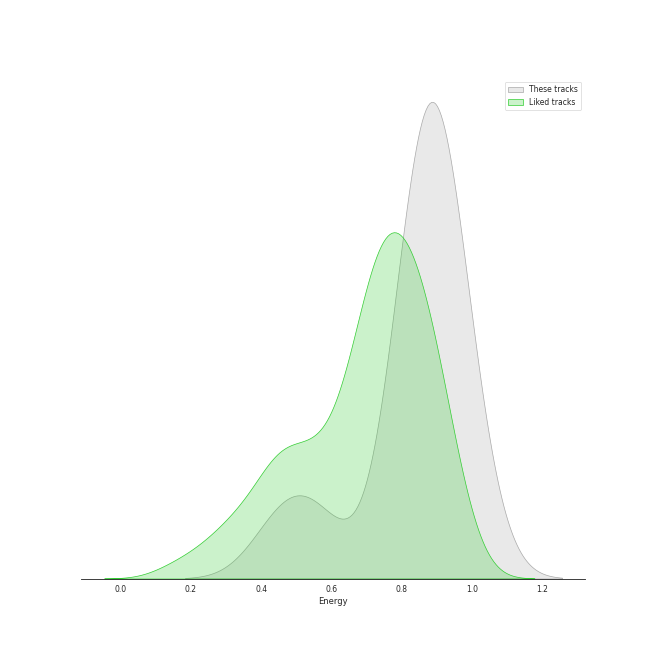
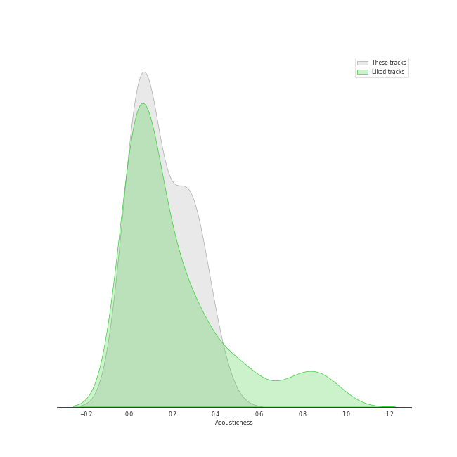
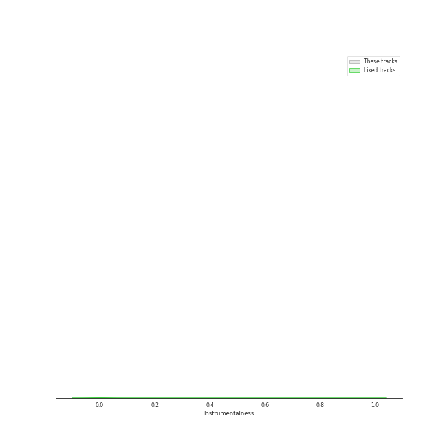
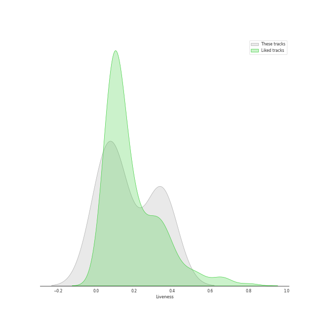
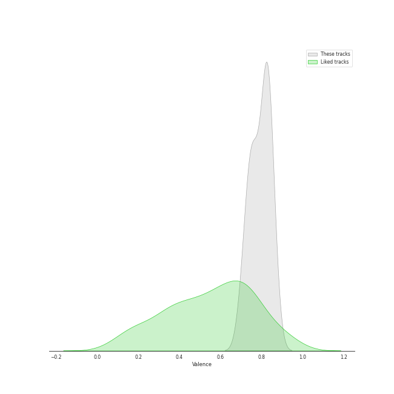
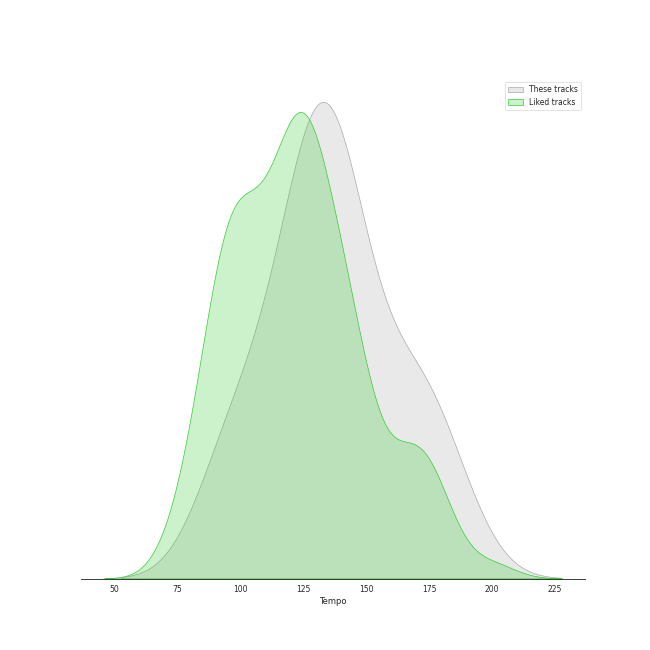

# Track Features for YOASOBI

## Danceability

| ​ | 10 most Danceable tracks | ​​ | 10 least Danceable tracks |
|:---|:---|:---|:---|
|  | manimani (0.838) |  | アイドル (0.574) |
|  | 海のまにまに (0.818) |  | 怪物 (0.627) |
|  | Loving You (0.785) |  | The Brave (0.651) |
|  | Adventure (0.776) |  | 夜に駆ける (0.663) |
|  | Mister (0.74) |  | Seventeen (0.679) |
|  | 群青 (0.725) |  | セブンティーン (0.71) |
|  | セブンティーン (0.71) |  | 群青 (0.725) |
|  | Seventeen (0.679) |  | Mister (0.74) |
|  | 夜に駆ける (0.663) |  | Adventure (0.776) |
|  | The Brave (0.651) |  | Loving You (0.785) |

## Energy

| ​ | 10 most Energetic tracks | ​​ | 10 least Energetic tracks |
|:---|:---|:---|:---|
|  | Mister (0.966) |  | 海のまにまに (0.456) |
|  | アイドル (0.935) |  | manimani (0.559) |
|  | Loving You (0.932) |  | 怪物 (0.824) |
|  | The Brave (0.924) |  | 群青 (0.853) |
|  | 夜に駆ける (0.871) |  | Adventure (0.857) |
|  | セブンティーン (0.871) |  | Seventeen (0.863) |
|  | Seventeen (0.863) |  | セブンティーン (0.871) |
|  | Adventure (0.857) |  | 夜に駆ける (0.871) |
|  | 群青 (0.853) |  | The Brave (0.924) |
|  | 怪物 (0.824) |  | Loving You (0.932) |

## Speechiness

| ​ | 10 most Speechy tracks | ​​ | 10 least Speechy tracks |
|:---|:---|:---|:---|
|  | 怪物 (0.118) |  | 夜に駆ける (0.03) |
|  | アイドル (0.0926) |  | Adventure (0.0354) |
|  | Seventeen (0.091) |  | Loving You (0.0354) |
|  | セブンティーン (0.0624) |  | 海のまにまに (0.0448) |
|  | manimani (0.0529) |  | Mister (0.0507) |
|  | 群青 (0.0516) |  | The Brave (0.0509) |
|  | The Brave (0.0509) |  | 群青 (0.0516) |
|  | Mister (0.0507) |  | manimani (0.0529) |
|  | 海のまにまに (0.0448) |  | セブンティーン (0.0624) |
|  | Loving You (0.0354) |  | Seventeen (0.091) |

## Acousticness

| ​ | 10 most Acoustic tracks | ​​ | 10 least Acoustic tracks |
|:---|:---|:---|:---|
|  | 海のまにまに (0.385) |  | 夜に駆ける (0.00299) |
|  | 群青 (0.305) |  | The Brave (0.0223) |
|  | manimani (0.281) |  | Mister (0.0446) |
|  | Adventure (0.239) |  | 怪物 (0.0699) |
|  | Loving You (0.132) |  | Seventeen (0.072) |
|  | アイドル (0.112) |  | セブンティーン (0.0776) |
|  | セブンティーン (0.0776) |  | アイドル (0.112) |
|  | Seventeen (0.072) |  | Loving You (0.132) |
|  | 怪物 (0.0699) |  | Adventure (0.239) |
|  | Mister (0.0446) |  | manimani (0.281) |

## Instrumentalness

| ​ | 10 most Instrumental tracks | ​​ | 10 least Instrumental tracks |
|:---|:---|:---|:---|
|  | 怪物 (6.57e-05) |  | Adventure (0.0) |
|  | 海のまにまに (3.49e-05) |  | 群青 (0.0) |
|  | セブンティーン (1.51e-05) |  | Seventeen (0.0) |
|  | Mister (1.12e-05) |  | Loving You (0.0) |
|  | manimani (7.62e-06) |  | アイドル (1.07e-06) |
|  | The Brave (2.04e-06) |  | 夜に駆ける (1.8e-06) |
|  | 夜に駆ける (1.8e-06) |  | The Brave (2.04e-06) |
|  | アイドル (1.07e-06) |  | manimani (7.62e-06) |
|  | Loving You (0.0) |  | Mister (1.12e-05) |
|  | Seventeen (0.0) |  | セブンティーン (1.51e-05) |

## Liveness

| ​ | 10 most Live tracks | ​​ | 10 least Live tracks |
|:---|:---|:---|:---|
|  | アイドル (0.367) |  | セブンティーン (0.0183) |
|  | Loving You (0.362) |  | Seventeen (0.0189) |
|  | 夜に駆ける (0.337) |  | 海のまにまに (0.0655) |
|  | 怪物 (0.31) |  | manimani (0.0694) |
|  | Mister (0.164) |  | 群青 (0.115) |
|  | Adventure (0.132) |  | The Brave (0.115) |
|  | The Brave (0.115) |  | Adventure (0.132) |
|  | 群青 (0.115) |  | Mister (0.164) |
|  | manimani (0.0694) |  | 怪物 (0.31) |
|  | 海のまにまに (0.0655) |  | 夜に駆ける (0.337) |

## Valence

| ​ | 10 most Happy tracks | ​​ | 10 least Happy tracks |
|:---|:---|:---|:---|
|  | manimani (0.861) |  | The Brave (0.513) |
|  | アイドル (0.836) |  | Mister (0.627) |
|  | Seventeen (0.834) |  | 群青 (0.707) |
|  | Adventure (0.834) |  | 海のまにまに (0.742) |
|  | 夜に駆ける (0.826) |  | 怪物 (0.774) |
|  | Loving You (0.815) |  | セブンティーン (0.78) |
|  | セブンティーン (0.78) |  | Loving You (0.815) |
|  | 怪物 (0.774) |  | 夜に駆ける (0.826) |
|  | 海のまにまに (0.742) |  | Adventure (0.834) |
|  | 群青 (0.707) |  | Seventeen (0.834) |

## Tempo

| ​ | 10 most Fast tracks | ​​ | 10 least Fast tracks |
|:---|:---|:---|:---|
|  | 怪物 (169.935) |  | 海のまにまに (97.947) |
|  | アイドル (166.008) |  | manimani (98.011) |
|  | セブンティーン (139.977) |  | The Brave (104.079) |
|  | Seventeen (139.941) |  | Loving You (120.014) |
|  | 群青 (134.991) |  | Mister (120.016) |
|  | 夜に駆ける (130.025) |  | Adventure (128.011) |
|  | Adventure (128.011) |  | 夜に駆ける (130.025) |
|  | Mister (120.016) |  | 群青 (134.991) |
|  | Loving You (120.014) |  | Seventeen (139.941) |
|  | The Brave (104.079) |  | セブンティーン (139.977) |
