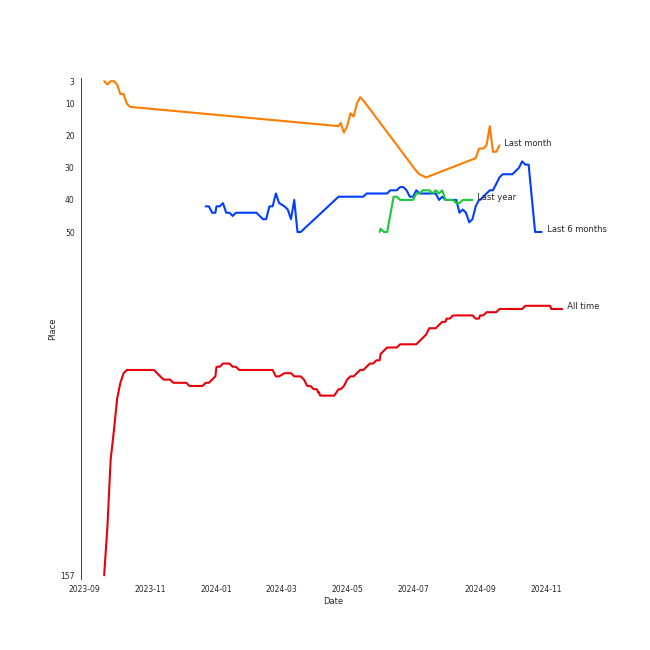
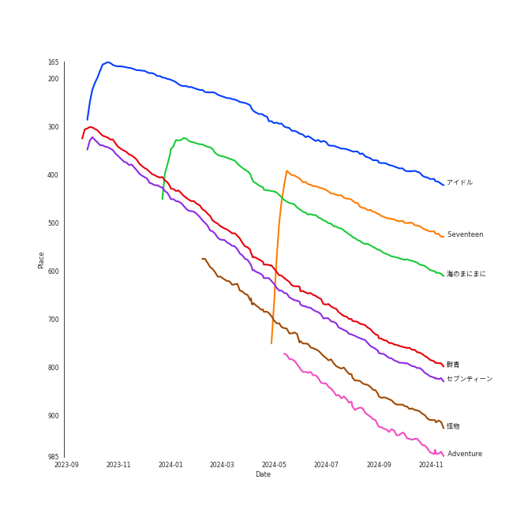

# YOASOBI

[See Track Features](audio_features.md)

[See Clusters](clusters/overview.md)

## Relationships

YOASOBI:
- has member AssH
- has member Ayase
- has member 幾田りら (Ikuta, Lilas)

## Artist Rank

## Top Tracks

### Top tracks, aggregated

## Featured on Playlists
| Art | Tracks | Playlist |
|:---|---:|:---|
|  | 6 | [Check Out Later](../../playlists/check_out_later/overview.md) |
|  | 6 | [International Pop](../../playlists/international_pop/overview.md) |

## Top Albums

| Art | Tracks | 💚 | Album | Release Date | 🔗 |
|:---|---:|---:|:---|:---|:---|
|  | 6 | 0 | E-SIDE 3 | 2024-04-12 | [🔗](https://open.spotify.com/album/2HBkR5qNDKoo1EDrCaSy0U) |
|  | 2 | 0 | THE BOOK | 2021-01-06 | [🔗](https://open.spotify.com/album/1xhO0GSoezdPJcSuNe1ySv) |
|  | 1 | 1 | 海のまにまに | 2022-11-18 | [🔗](https://open.spotify.com/album/6M4p4S5t8PuRZiq7zvMEPB) |
|  | 1 | 1 | 怪物 | 2021-01-06 | [🔗](https://open.spotify.com/album/41HUxKwnbrg8IdelmMibj9) |
|  | 1 | 1 | セブンティーン | 2023-03-27 | [🔗](https://open.spotify.com/album/2XGJwl5zpqPTmtLAPy2rr6) |
|  | 1 | 1 | アイドル | 2023-04-12 | [🔗](https://open.spotify.com/album/7yMkS4NCpG0FH6NoaH3F0a) |

## Top Record Labels

| Tracks | 💚 | Label |
|---:|---:|:---|
| 12 | 4 | [YOASOBI](../../labels/yoasobi/overview.md) |

## Genres

- [j-pop](../../genres/j-pop/overview.md)
- japanese teen pop

## Credits

### Member Credits

| | AssH | Ayase |
|:---|---:|---:|
| Instrument | 2 | 0 |
| Lyricist | 0 | 3 |
| Songwriter | 0 | 3 |
### Production Credits

| Art | Track | Members | Credit Types |
|:---|:---|:---|:---|
|  | 怪物 | Ayase | Lyricist, Songwriter |
|  | アイドル | Ayase | Lyricist, Songwriter |

## Top Producers

| Art | Producer | Tracks | Credit Types |
|:---|:---|---:|:---|
| | Ayase | 2 | Lyricist, Songwriter |
| | 斎藤孝之 (Saito, Takayuki) | 1 | Producer |
| | Konnie Aoki | 1 | Lyricist |
| | 福井昌彦 (Fukui, Masahiko) | 1 | Producer |

## Tracks

| Art | Track | Album | Artists | Label | Rank | 💚 | 🔗 |
|:---|:---|:---|:---|:---|---:|:---|:---|
|  | アイドル | アイドル | [YOASOBI](overview.md) | [YOASOBI](../../labels/yoasobi) | 277 | 💚 | [🔗](https://open.spotify.com/track/7ovUcF5uHTBRzUpB6ZOmvt) |
|  | 海のまにまに | 海のまにまに | [YOASOBI](overview.md) | [YOASOBI](../../labels/yoasobi) | 428 | 💚 | [🔗](https://open.spotify.com/track/0loZ1KfQSLJxYR0Y7dImKN) |
|  | 群青 | THE BOOK | [YOASOBI](overview.md) | [YOASOBI](../../labels/yoasobi) | 578 | | [🔗](https://open.spotify.com/track/1zd35Y44Blc1CwwVbW3Qnk) |
|  | セブンティーン | セブンティーン | [YOASOBI](overview.md) | [YOASOBI](../../labels/yoasobi) | 608 | 💚 | [🔗](https://open.spotify.com/track/1TXhBe3DnaOFc7onTbEoiB) |
|  | 怪物 | 怪物 | [YOASOBI](overview.md) | [YOASOBI](../../labels/yoasobi) | 682 | 💚 | [🔗](https://open.spotify.com/track/06XQvnJb53SUYmlWIhUXUi) |
|  | 夜に駆ける | THE BOOK | [YOASOBI](overview.md) | [YOASOBI](../../labels/yoasobi) | nan | | [🔗](https://open.spotify.com/track/6MCjmGYlw6mQVWRFVgBRvB) |
|  | Adventure | E-SIDE 3 | [YOASOBI](overview.md) | [YOASOBI](../../labels/yoasobi) | nan | | [🔗](https://open.spotify.com/track/1Gh9LJf99CIpcr0z8hMIOf) |
|  | Loving You | E-SIDE 3 | [YOASOBI](overview.md) | [YOASOBI](../../labels/yoasobi) | nan | | [🔗](https://open.spotify.com/track/7nN7TkxDGH8DeXs2Vy67nv) |
|  | Mister | E-SIDE 3 | [YOASOBI](overview.md) | [YOASOBI](../../labels/yoasobi) | nan | | [🔗](https://open.spotify.com/track/6sHinRfFGZcxeTTdCvxgCG) |
|  | Seventeen | E-SIDE 3 | [YOASOBI](overview.md) | [YOASOBI](../../labels/yoasobi) | nan | | [🔗](https://open.spotify.com/track/2yAB3u40MOFRNuUzdl0but) |

See all tracks

| Art | Track | Album | Artists | Label | Rank | 💚 | 🔗 |
|:---|:---|:---|:---|:---|---:|:---|:---|
|  | The Brave | E-SIDE 3 | [YOASOBI](overview.md) | [YOASOBI](../../labels/yoasobi) | nan | | [🔗](https://open.spotify.com/track/4idatWI87uECptpg5EYMPp) |
|  | manimani | E-SIDE 3 | [YOASOBI](overview.md) | [YOASOBI](../../labels/yoasobi) | nan | | [🔗](https://open.spotify.com/track/0JXxrmM7bHmpwHczGTjCUm) |

