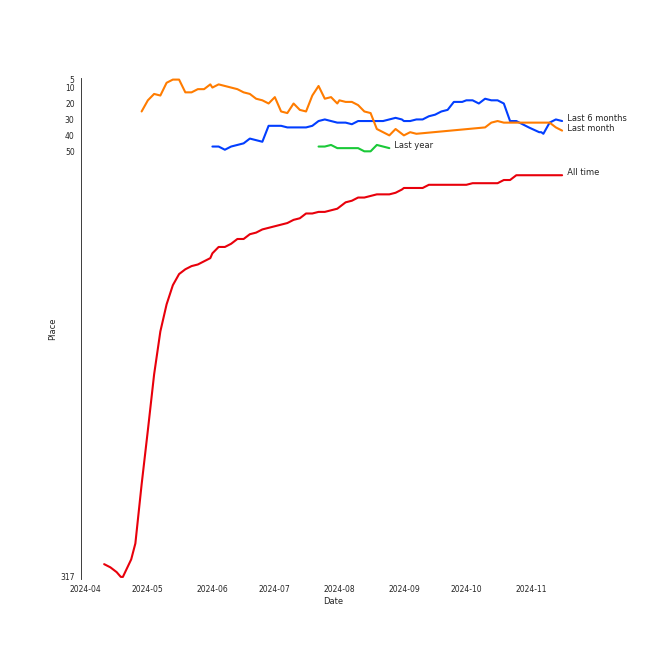
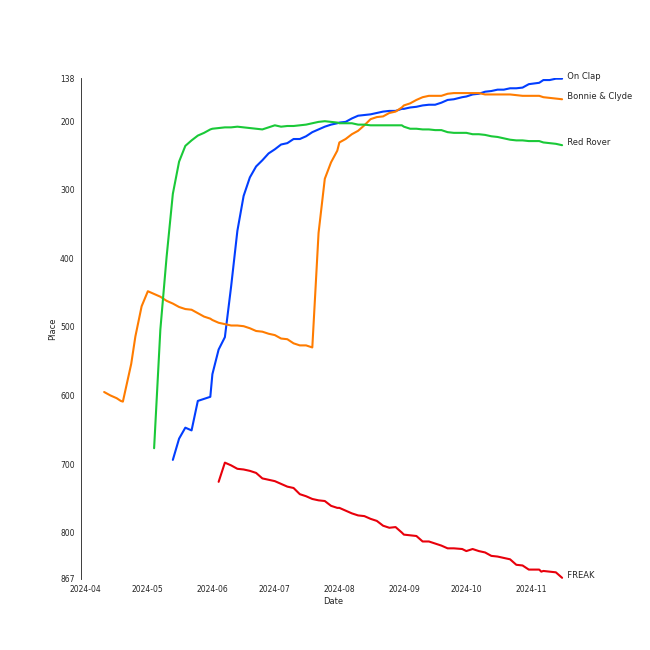
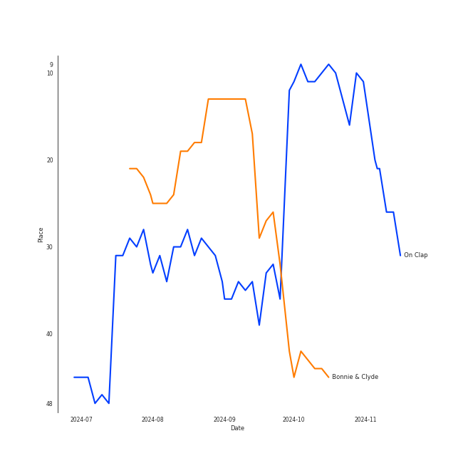
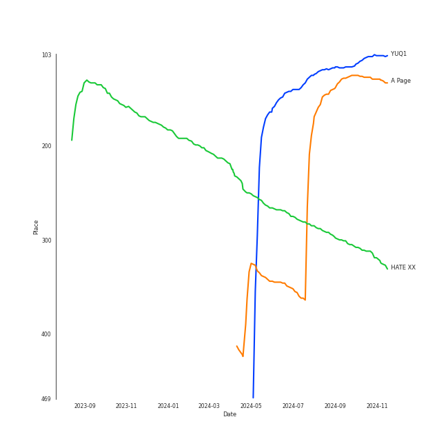

# YUQI

## Relationships

YUQI:
- is a member of [(G)I-DLE](../(g)i-dle/overview.md)

## Artist Rank
YUQI is currently:
- The #31 artist of the last 6 months
- The #68 artist of all time

## Top Tracks

### Top tracks of all time

Top tracks of the last 6 months over time

## Top Albums

| Art | Rank | Tracks | 💚 | Album | Release Date | 🔗 |
|:---|---:|---:|---:|:---|:---|:---|
|  | 105 | 3 | 3 | YUQ1 | 2024-04-23 | [🔗](https://open.spotify.com/album/7LYc8ngbhwha4aGJ5kVauc) |
|  | 127 | 2 | 2 | A Page | 2021-05-13 | [🔗](https://open.spotify.com/album/7jmRVFWYCVgx2OEC1ZQJH8) |
|  | 656 | 1 | 1 | Flowers (Cover) | 2023-03-20 | [🔗](https://open.spotify.com/album/0nTIxK2AR9QnY2nn5uxhYW) |
|  | 313 | 1 | 0 | HATE XX | 2023-06-27 | [🔗](https://open.spotify.com/album/3aYLtPSWEqmcLTCfM0ZYl7) |

## Featured on Playlists
| Art | Tracks | Playlist |
|:---|---:|:---|
|  | 6 | [K-Pop](../../playlists/k-pop/overview.md) |
|  | 3 | [K-Pop Favorites](../../playlists/k-pop_favorites/overview.md) |
|  | 1 | [K-Memes](../../playlists/k-memes/overview.md) |
|  | 1 | [Not K-Pop](../../playlists/not_k-pop/overview.md) |

## Top Record Labels

| Tracks | 💚 | Label |
|---:|---:|:---|
| 3 | 3 | [CUBE ENTERTAINMENT](../../labels/cube_entertainment/overview.md) |
| 2 | 2 | [Universal Music LLC](../../labels/universal_music_llc/overview.md) |
| 1 | 1 | YUQI |
| 1 | 0 | [Stone Music Entertainment](../../labels/stone_music_entertainment/overview.md) |
| 1 | 0 | [Genie Music Corporation](../../labels/genie_music_corporation/overview.md) |

## Genres

- [5th gen k-pop](../../genres/5th_gen_k-pop/overview.md)

## Credits

### Credits by Type

| Credit Type | Tracks |
|:---|---:|
| Lyricist | 2 |
| Songwriter | 3 |
| Vocal | 10 |

### Production Credits

| Art | Track | Credit Types |
|:---|:---|:---|
|  | DARK (X-file) | Songwriter |
|  | Doll | Lyricist, Songwriter |
|  | Rollie | Lyricist, Songwriter |

## Tracks

| Art | Track | Album | Artists | Label | Rank | 💚 | 🔗 |
|:---|:---|:---|:---|:---|---:|:---|:---|
|  | On Clap | YUQ1 | [YUQI](overview.md), Lexie Liu | [Cube Entertainment](../../labels/cube_entertainment) | 152 | 💚 | [🔗](https://open.spotify.com/track/2bRNKRk0sFlwEd7geduEpP) |
|  | Bonnie & Clyde | A Page | [YUQI](overview.md) | [Universal Music LLC](../../labels/universal_music_llc) | 161 | 💚 | [🔗](https://open.spotify.com/track/21aIsunB7PfZI0vlIoaJPh) |
|  | Red Rover | YUQ1 | [YUQI](overview.md) | [Cube Entertainment](../../labels/cube_entertainment) | 227 | 💚 | [🔗](https://open.spotify.com/track/4TQBHR8LcbBUv0LvLmn54H) |
|  | FREAK | YUQ1 | [YUQI](overview.md) | [Cube Entertainment](../../labels/cube_entertainment) | 847 | 💚 | [🔗](https://open.spotify.com/track/6ERs9uORCo1MfV0m9ixCuv) |
|  | Giant | A Page | [YUQI](overview.md) | [Universal Music LLC](../../labels/universal_music_llc) | 1000 | 💚 | [🔗](https://open.spotify.com/track/3p8low79RQzkixDlIngBTT) |
|  | Flowers - Cover | Flowers (Cover) | [YUQI](overview.md) | YUQI | 1000 | 💚 | [🔗](https://open.spotify.com/track/4KhOLC5IT1Rz8G4iHsoTAV) |
|  | Hate Rodrigo (Feat. YUQI) | HATE XX | [YENA](../yena/overview.md), [YUQI](overview.md) | [Genie Music Corporation](../../labels/genie_music_corporation), [Stone Music Entertainment](../../labels/stone_music_entertainment) | 1000 | | [🔗](https://open.spotify.com/track/5ms7rcVKjBFUtoVh8hE0Y9) |
