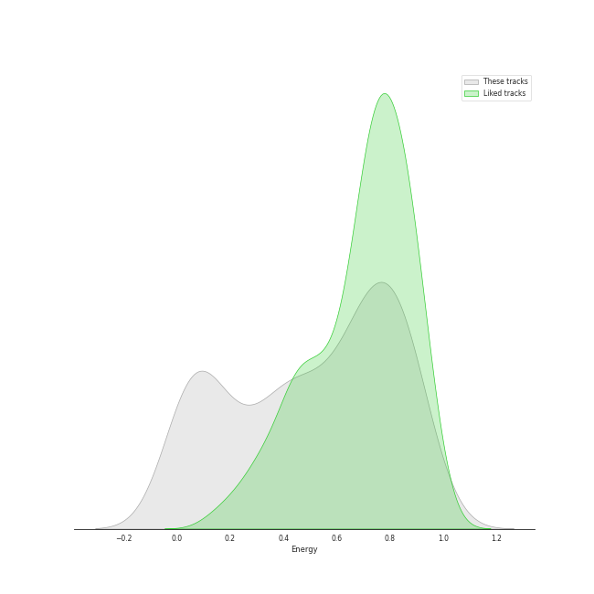
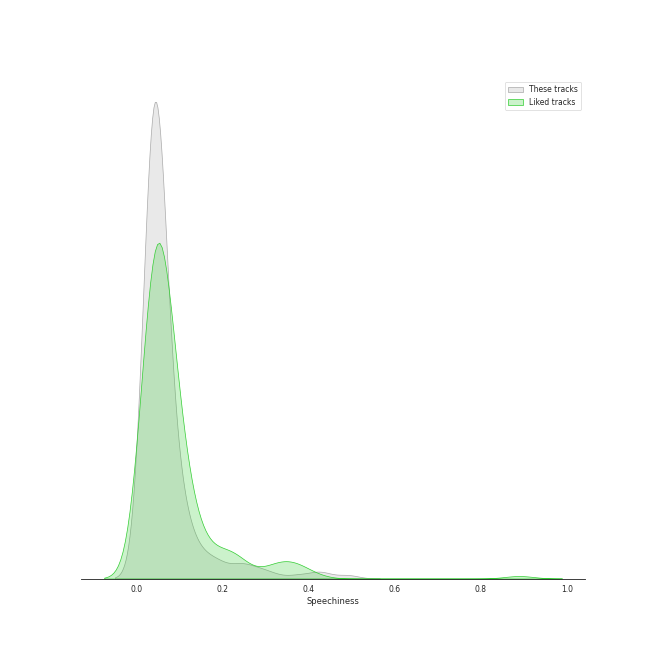
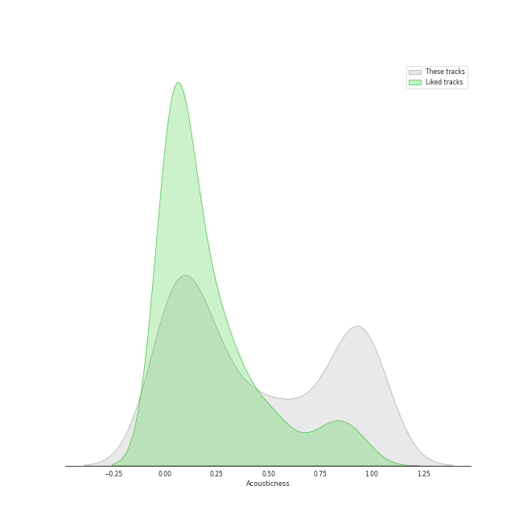
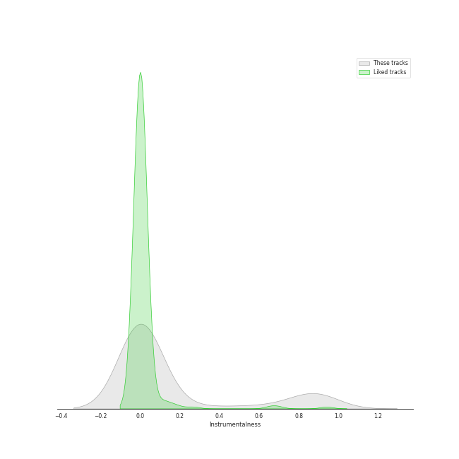
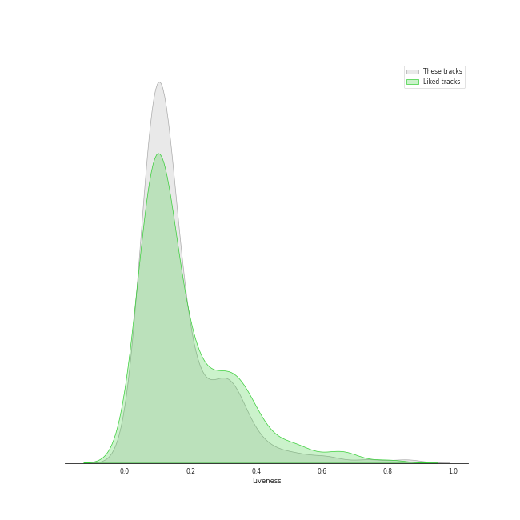
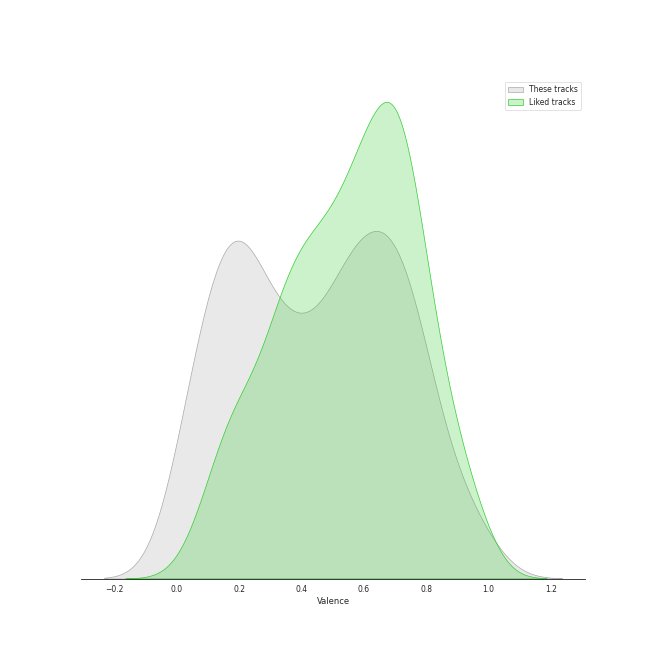
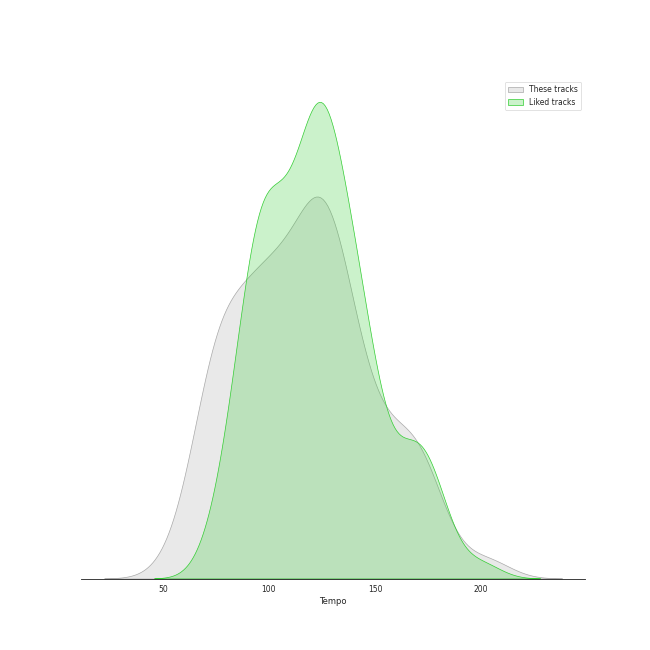

# Audio Features for All Tracks

## Danceability

| 10 most Danceable tracks | 10 least Danceable tracks |
|:---|:---|
| Bando (0.97) | String Quartet No. 8 in C Minor, Op. 110: V. Largo (0.0592) |
| SexyBack (feat. Timbaland) (0.967) | The Planets, Op. 32: 7. Neptune, the Mystic (0.0601) |
| Anaconda (0.964) | Ave Maria (Franz Biebl) (0.0611) |
| Fire (0.963) | Symphony No. 9 In D Minor, Op. 125 - "Choral": 3. Adagio molto e cantabile (0.062) |
| Cold Blooded (0.961) | String Quartet in G Minor, Op. 10: III. Andantino, doucement expressif (0.0623) |
| #Twenty (0.956) | La Mer, L.109: 1. From Dawn Till Noon On The Sea (De l'aube à midi sur la mer) (0.0633) |
| FACE (0.954) | Vespers, Op. 37: XII. "Slava v vyshnikh Bogu" (0.0636) |
| WAP (feat. Megan Thee Stallion) (0.935) | Die Zauberflöte, K.620 / Act 2: "O Isis und Osiris, welche Wonne!" (0.0663) |
| SNEAKERS (0.935) | Requiem in D Minor, Op. 48: II. Offertorium. Domine Jesu Christe (0.0668) |
| Idle song (0.933) | Horn Concerto No. 4 in E-Flat Major, K. 495: II. Romanza. Andante (0.0683) |

## Energy

| 10 most Energetic tracks | 10 least Energetic tracks |
|:---|:---|
| War of Hormone (0.993) | Le Sacre du Printemps - Revised version for Orchestra (published 1947) / Part 1: The Adoration of the Earth: The Sage (0.000239) |
| チョコレイト・ディスコ (0.99) | Préludes Book 1, L. 117: I. Des Pas sur La Neige (0.000594) |
| When Doves Cry (0.989) | Pictures at an Exhibition (Orch. Ravel): VIIIa. Catacombae (Sepulchrum Romanum) (0.000845) |
| American Idiot (0.988) | Images, Set 2, L. 111: et la Lune descend sur le Temple qui fut (0.00104) |
| Shanti Shanti Shanti (0.988) | The Firebird (L'oiseau De Feu) - Suite (1919): Introduction (0.00108) |
| Rondo of Nightmare (0.987) | Préludes Book 2, L. 123: II. Canope (0.00148) |
| RING X RING (0.987) | Piano Sonata No. 21 in C Major, Op. 53 "Waldstein": II. Introduzione (Adagio molto) (0.00157) |
| Headbangeeeeerrrrr!!!!! (0.985) | Piano Sonata No. 31 in A flat, Op. 110: 3. Adagio ma non troppo (0.00168) |
| Gimme Chocolate!! (0.985) | 24 Préludes, Op. 28: No. 7 in A Major (0.00168) |
| Boys & Girls (0.985) | 24 Préludes, Op. 28: No. 7 in A Major: Andantino (0.00174) |

## Speechiness

| 10 most Speechy tracks | 10 least Speechy tracks |
|:---|:---|
| 24 Préludes, Op. 28: No. 20 in C Minor: Largo (0.879) | With (0.0228) |
| Aaron Burr, Sir (0.818) | Satellite Call (0.0241) |
| Prologue (0.748) | 情非得已 (0.0241) |
| A Midsummer Night's Dream, Incidental Music, Op. 61: No. 2, L'istesso tempo (0.676) | Breakeven (0.0242) |
| Ten Duel Commandments (0.658) | All Too Well (0.0243) |
| The World Was Wide Enough (0.648) | The Scientist (0.0243) |
| 24 Préludes, Op. 28: No. 20 in C Minor: Largo (0.592) | Lemon Love (0.0244) |
| The Adams Administration (0.544) | We Found Love (0.0244) |
| Cabinet Battle #2 (0.537) | Fields Of Gold (0.0246) |
| A Midsummer Night's Dream, Incidental Music, Op. 61: "Ay Me! For Aught That I Could Ever Read" (0.524) | Old Fashioned (0.0246) |

## Acousticness

| 10 most Acoustic tracks | 10 least Acoustic tracks |
|:---|:---|
| Nocturne No. 11 In G Minor, Op. 37 No. 1 (0.996) | The Motherload (7.1e-06) |
| Piano Sonata No. 10 in C Major, K. 330: II. Andante cantabile (0.996) | The Phantom Of The Opera (7.33e-06) |
| Nocturne No. 12 In G, Op. 37 No. 2 (0.996) | abnormalize (7.51e-06) |
| Wiosna, B117 (arr. from Op. 74/2) (0.996) | Blood and Thunder (8.58e-06) |
| Feuille d'album in E, Op. posth. (0.995) | Learn to Fly (1.83e-05) |
| 24 Préludes, Op. 28: No. 13 in F-Sharp Major (0.995) | Smells Like Teen Spirit (2.55e-05) |
| Piano Sonata No. 25 in G, Op. 79: 2. Andante (0.995) | American Idiot (2.64e-05) |
| Vespers, Op. 37: VIII. "Kvalite imya Gospodne" (0.995) | Kagerou (3.1e-05) |
| Piano Sonata No. 16 in C Major, K. 545 "Sonata facile": II. Andante (0.995) | Paranoid - 2012 - Remaster (4.52e-05) |
| Waltz No.9 Op.69-1 A Flat Major (0.995) | Everlong (5.99e-05) |

## Instrumentalness

| 10 most Instrumental tracks | 10 least Instrumental tracks |
|:---|:---|
| Pictures at an Exhibition (Orch. Ravel): IV. Bydlo (0.983) | Mr. Brightside (0.0) |
| Vespers, Op. 37: XIV. "Voskrez iz groba" (0.98) | Sk8er Boi (0.0) |
| Vespers, Op. 37: VI. "Bogoroditse Devo" (0.979) | Say You're Sorry (0.0) |
| Tchaikovsky: Swan Lake, Op. 20, Act IV: No. 26, Scene. Allegro ma non troppo (0.978) | Leave The Door Open (0.0) |
| Prelude No.1 in C Major (0.977) | Gangnam Style (강남스타일) (0.0) |
| Le Sacre du Printemps - Revised version for Orchestra (published 1947) / Part 1: The Adoration of the Earth: Introduction (0.972) | Say Something (0.0) |
| Requiem in D Minor, Op. 48: VII. In Paradisum (0.971) | Miracle (0.0) |
| String Quartet No. 14 in C-Sharp Minor, Op. 131: VI. Adagio quasi un poco andante (0.97) | Traffic light (0.0) |
| Lux Aurumque (0.964) | No Hands (feat. Roscoe Dash & Wale) (0.0) |
| 24 Préludes, Op. 28: No. 10 in C-Sharp Minor (0.964) | When Will My Life Begin? - From "Tangled" / Soundtrack Version (0.0) |

## Liveness

| 10 most Live tracks | 10 least Live tracks |
|:---|:---|
| Brand New Jones (0.926) | Freedom At Midnight (0.0168) |
| Bel Air (0.901) | PING PONG (0.0202) |
| Folsom Prison Blues - Live at Folsom State Prison, Folsom, CA - January 1968 (0.893) | Call Me Mother (0.0205) |
| Thriller (0.89) | Ain't It Fun (0.021) |
| Heart Attack (0.887) | Finesse - Remix; feat. Cardi B (0.0215) |
| XS (0.869) | CASE 143 (0.0222) |
| Can't Tell Me Nothing (0.82) | SNEAKERS (0.0223) |
| I Saw Mommy Kissing Santa Claus (0.817) | Finesse (0.0232) |
| Piano Man (0.807) | SNEAKERS (English Ver.) (0.0242) |
| You Better Run (0.803) | Oh My God (0.0264) |

## Valence

| 10 most Happy tracks | 10 least Happy tracks |
|:---|:---|
| Sour candy (0.98) | Le Sacre du Printemps - Revised version for Orchestra (published 1947) / Part 1: The Adoration of the Earth: The Sage (0.0) |
| Material Girl (0.978) | The Firebird (L'oiseau De Feu) - Suite (1919): Dance Of The Firebird (0.0) |
| Here Comes Santa Claus (Right Down Santa Claus Lane) - 1947 Version (0.976) | 24 Préludes, Op. 28: No. 7 in A Major: Andantino (0.0) |
| Big Yellow Taxi (0.97) | Lux Aurumque (0.0241) |
| Like a Virgin (0.97) | String Quartet No. 9 in E-Flat Major, Op. 117: II. Adagio (0.0251) |
| There's Nothing Holdin' Me Back (0.969) | Three Songs Of Faith: Hope Faith Life Love (0.0285) |
| Crocodile Rock (0.968) | 24 Préludes, Op. 28: No. 9 in E Major: Largo (0.0292) |
| Twenty-three (0.968) | The Planets, Op. 32: 2. Venus, the Bringer of Peace (0.0301) |
| Devil (0.968) | The Planets, Op. 32: 7. Neptune, the Mystic (0.0305) |
| Sugar, Sugar (0.967) | String Quartet No.11 in F Minor, Op. 122: VI. Elégie (Adagio) (0.0307) |

## Tempo

| 10 most Fast tracks | 10 least Fast tracks |
|:---|:---|
| Signal (207.819) | 24 Préludes, Op. 28: No. 20 in C Minor: Largo (34.105) |
| That Man (207.029) | The Music Of The Night - From 'The Phantom Of The Opera' Motion Picture (46.168) |
| Last Christmas (205.945) | Carol of the Bells (46.718) |
| Lights (205.422) | Tchaikovsky: The Nutcracker, Op. 71, Act II: No. 13, Waltz of the Flowers (47.362) |
| Who's Afraid of the Big, Bad Wolf - From "Three Little Pigs" (204.996) | Dream (48.973) |
| Attention (204.19) | Coppélia / Tableau 2: No. 9 Scène (49.526) |
| Uncharted (203.962) | Gollum's Song (49.588) |
| M.W.A. (Musicians With Attitude) (203.958) | 24 Préludes, Op. 28: No. 8 in F-Sharp Minor: Molto agitato (53.925) |
| 24 Préludes, Op. 28: No. 6 in B Minor: Lento assai (203.905) | String Quartet in G Minor, Op. 10: III. Andantino, doucement expressif (54.651) |
| Piano Sonata No. 29 in B flat, Op. 106 -"Hammerklavier": 2. Scherzo (Assai vivace - Presto - Prestissimo - Tempo I) (203.867) | Piano Concerto No. 2 in C Minor, Op. 18: 1. Moderato (54.898) |
