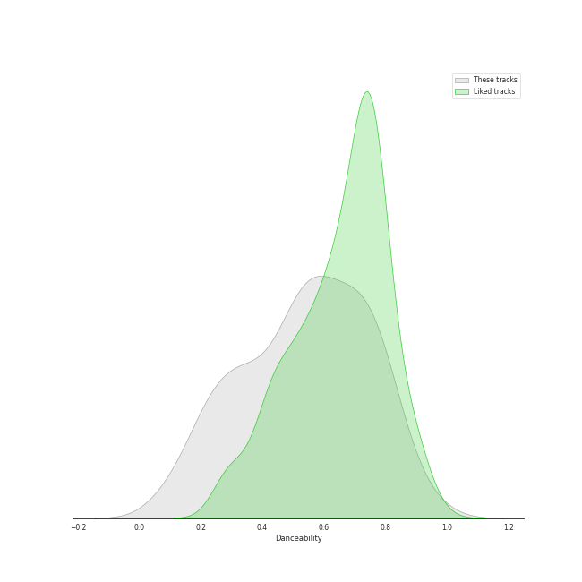

# Track Features for All Tracks

## Danceability

| ​ | 10 most Danceable tracks | ​​ | 10 least Danceable tracks |
|:---|:---|:---|:---|
|  | Bando (0.97) |  | String Quartet No. 8 in C Minor, Op. 110: V. Largo (0.0592) |
|  | SexyBack (feat. Timbaland) (0.967) |  | The Planets, Op. 32: 7. Neptune, the Mystic (0.0601) |
|  | Anaconda (0.964) |  | Ave Maria (Franz Biebl) (0.0611) |
|  | Cold Blooded (0.961) |  | Symphony No. 9 In D Minor, Op. 125 - "Choral": 3. Adagio molto e cantabile - Live At Philharmonie, Berlin / 1983 (0.062) |
|  | #Twenty (0.956) |  | String Quartet in G Minor, Op. 10: III. Andantino, doucement expressif (0.0623) |
|  | FACE (0.954) |  | La Mer, L.109: 1. From Dawn Till Noon On The Sea (De l'aube à midi sur la mer) (0.0633) |
|  | Ah puh (0.954) |  | Vespers, Op. 37: XII. "Slava v vyshnikh Bogu" (0.0636) |
|  | Villain (0.95) |  | Die Zauberflöte, K.620 / Act 2: "O Isis und Osiris, welche Wonne!" (0.0663) |
|  | WAP (feat. Megan Thee Stallion) (0.935) |  | Requiem in D Minor, Op. 48: II. Offertorium. Domine Jesu Christe (0.0668) |
|  | Billy Poco (0.935) |  | Horn Concerto No. 4 in E-Flat Major, K. 495: II. Romanza. Andante (0.0683) |

## Energy

| ​ | 10 most Energetic tracks | ​​ | 10 least Energetic tracks |
|:---|:---|:---|:---|
|  | War of Hormone (0.993) |  | Le Sacre du Printemps - Revised version for Orchestra (published 1947) / Part 1: The Adoration of the Earth: The Sage (0.000239) |
|  | チョコレイト・ディスコ (0.99) |  | Préludes Book 1, L. 117: I. Des Pas sur La Neige (0.000594) |
|  | When Doves Cry (0.989) |  | Pictures at an Exhibition (Orch. Ravel): VIIIa. Catacombae (Sepulchrum Romanum) (0.000845) |
|  | American Idiot (0.988) |  | Images, Set 2, L. 111: et la Lune descend sur le Temple qui fut (0.00104) |
|  | Shanti Shanti Shanti (0.988) |  | The Firebird (L'oiseau De Feu) - Suite (1919): Introduction (0.00108) |
|  | Rondo of Nightmare (0.987) |  | Préludes Book 2, L. 123: II. Canope (0.00148) |
|  | RING X RING (0.987) |  | Piano Sonata No. 21 in C Major, Op. 53 "Waldstein": II. Introduzione (Adagio molto) (0.00157) |
|  | Headbangeeeeerrrrr!!!!! (0.985) |  | Piano Sonata No. 31 in A flat, Op. 110: 3. Adagio ma non troppo (0.00168) |
|  | Gimme Chocolate!! (0.985) |  | 24 Préludes, Op. 28: No. 7 in A Major (0.00168) |
|  | Boys & Girls (0.985) |  | 24 Préludes, Op. 28: No. 7 in A Major: Andantino (0.00174) |

## Speechiness

| ​ | 10 most Speechy tracks | ​​ | 10 least Speechy tracks |
|:---|:---|:---|:---|
|  | 24 Préludes, Op. 28: No. 20 in C Minor: Largo (0.879) |  | With (0.0228) |
|  | Aaron Burr, Sir (0.818) |  | Satellite Call (0.0241) |
|  | Prologue (0.748) |  | 情非得已 (0.0241) |
|  | A Midsummer Night's Dream, Incidental Music, Op. 61: No. 2, L'istesso tempo (0.676) |  | Breakeven (0.0242) |
|  | 24 Préludes, Op. 28: No. 20 in C Minor: Largo (0.592) |  | All Too Well (0.0243) |
|  | A Midsummer Night's Dream, Incidental Music, Op. 61: "Ay Me! For Aught That I Could Ever Read" (0.524) |  | The Scientist (0.0243) |
|  | No More Dream (0.472) |  | Lemon Love (0.0244) |
|  | Youngblood (0.463) |  | We Found Love (0.0244) |
|  | The Election of 1800 (0.462) |  | Fields Of Gold (0.0246) |
|  | boyfriend (with Social House) (0.461) |  | Old Fashioned (0.0246) |

## Acousticness

| ​ | 10 most Acoustic tracks | ​​ | 10 least Acoustic tracks |
|:---|:---|:---|:---|
|  | Nocturne No. 11 In G Minor, Op. 37 No. 1 (0.996) |  | The Motherload (7.1e-06) |
|  | Piano Sonata No. 10 in C Major, K. 330: II. Andante cantabile (0.996) |  | The Phantom Of The Opera (7.33e-06) |
|  | Nocturne No. 12 In G, Op. 37 No. 2 (0.996) |  | abnormalize (7.51e-06) |
|  | Wiosna, B117 (arr. from Op. 74/2) (0.996) |  | Blood and Thunder (8.58e-06) |
|  | Feuille d'album in E, Op. posth. (0.995) |  | Learn to Fly (1.83e-05) |
|  | 24 Préludes, Op. 28: No. 13 in F-Sharp Major (0.995) |  | Smells Like Teen Spirit (2.55e-05) |
|  | Piano Sonata No. 25 in G, Op. 79: 2. Andante (0.995) |  | American Idiot (2.64e-05) |
|  | Vespers, Op. 37: VIII. "Kvalite imya Gospodne" (0.995) |  | Kagerou (3.1e-05) |
|  | Piano Sonata No. 16 in C Major, K. 545 "Sonata facile": II. Andante (0.995) |  | Paranoid - 2012 - Remaster (4.52e-05) |
|  | Waltz No.9 Op.69-1 A Flat Major (0.995) |  | Everlong (5.99e-05) |

## Instrumentalness

| ​ | 10 most Instrumental tracks | ​​ | 10 least Instrumental tracks |
|:---|:---|:---|:---|
|  | Pictures at an Exhibition (Orch. Ravel): IV. Bydlo (0.983) |  | Mr. Brightside (0.0) |
|  | Vespers, Op. 37: XIV. "Voskrez iz groba" (0.98) |  | Say You're Sorry (0.0) |
|  | Vespers, Op. 37: VI. "Bogoroditse Devo" (0.979) |  | Leave The Door Open (0.0) |
|  | Tchaikovsky: Swan Lake, Op. 20, Act 4: No. 26, Scene. Allegro ma non troppo (0.978) |  | Gangnam Style (강남스타일) (0.0) |
|  | Prelude No.1 in C Major (0.977) |  | Say Something (0.0) |
|  | Le Sacre du Printemps - Revised version for Orchestra (published 1947) / Part 1: The Adoration of the Earth: Introduction (0.972) |  | Miracle (0.0) |
|  | Requiem in D Minor, Op. 48: VII. In Paradisum (0.971) |  | Traffic light (0.0) |
|  | String Quartet No. 14 in C-Sharp Minor, Op. 131: VI. Adagio quasi un poco andante (0.97) |  | No Hands (feat. Roscoe Dash & Wale) (0.0) |
|  | Whitacre: Lux Aurumque (0.964) |  | When Will My Life Begin? - From "Tangled" / Soundtrack Version (0.0) |
|  | 24 Préludes, Op. 28: No. 10 in C-Sharp Minor (0.964) |  | Sweet As Whole (0.0) |

## Liveness

| ​ | 10 most Live tracks | ​​ | 10 least Live tracks |
|:---|:---|:---|:---|
|  | Brand New Jones (0.926) |  | Freedom At Midnight (0.0168) |
|  | Bel Air (0.901) |  | セブンティーン (0.0183) |
|  | Folsom Prison Blues - Live at Folsom State Prison, Folsom, CA - January 1968 (0.893) |  | PING PONG (0.0202) |
|  | Thriller (0.89) |  | Call Me Mother (0.0205) |
|  | Heart Attack (0.887) |  | Ain't It Fun (0.021) |
|  | XS (0.869) |  | Finesse - Remix; feat. Cardi B (0.0215) |
|  | Jopping (0.857) |  | Funky Glitter Christmas (0.0221) |
|  | Can't Tell Me Nothing (0.82) |  | CASE 143 (0.0222) |
|  | I Saw Mommy Kissing Santa Claus (0.817) |  | SNEAKERS (0.0223) |
|  | Piano Man (0.807) |  | Finesse (0.0232) |

## Valence

| ​ | 10 most Happy tracks | ​​ | 10 least Happy tracks |
|:---|:---|:---|:---|
|  | Sour candy (0.98) |  | Le Sacre du Printemps - Revised version for Orchestra (published 1947) / Part 1: The Adoration of the Earth: The Sage (0.0) |
|  | Material Girl (0.978) |  | The Firebird (L'oiseau De Feu) - Suite (1919): Dance Of The Firebird (0.0) |
|  | Here Comes Santa Claus (Right Down Santa Claus Lane) - 1947 Version (0.976) |  | 24 Préludes, Op. 28: No. 7 in A Major: Andantino (0.0) |
|  | Big Yellow Taxi (0.97) |  | Whitacre: Lux Aurumque (0.0241) |
|  | Like a Virgin (0.97) |  | String Quartet No. 9 in E-Flat Major, Op. 117: II. Adagio (0.0251) |
|  | There's Nothing Holdin' Me Back (0.969) |  | Whitacre: Three Songs Of Faith: Hope Faith Life Love (0.0285) |
|  | Surfin' U.S.A. (0.969) |  | 24 Préludes, Op. 28: No. 9 in E Major: Largo (0.0292) |
|  | Crocodile Rock (0.968) |  | The Planets, Op. 32: 2. Venus, the Bringer of Peace (0.0301) |
|  | Twenty-three (0.968) |  | The Planets, Op. 32: 7. Neptune, the Mystic (0.0305) |
|  | Devil (0.968) |  | String Quartet No.11 in F Minor, Op. 122: VI. Elégie (Adagio) (0.0307) |

## Tempo

| ​ | 10 most Fast tracks | ​​ | 10 least Fast tracks |
|:---|:---|:---|:---|
|  | Signal (207.819) |  | 24 Préludes, Op. 28: No. 20 in C Minor: Largo (34.105) |
|  | That Man (207.029) |  | The Music Of The Night - From 'The Phantom Of The Opera' Motion Picture (46.168) |
|  | Last Christmas (205.945) |  | Carol of the Bells (46.718) |
|  | Lights (205.422) |  | Tchaikovsky: The Nutcracker, Op. 71, Act II: No. 13, Waltz of the Flowers (47.362) |
|  | Who's Afraid of the Big, Bad Wolf - From "Three Little Pigs" (204.996) |  | Dream (48.973) |
|  | Attention (204.19) |  | Coppélia / Tableau 2: No. 9 Scène (49.526) |
|  | Uncharted (203.962) |  | Gollum's Song (49.588) |
|  | M.W.A. (Musicians With Attitude) (203.958) |  | 24 Préludes, Op. 28: No. 8 in F-Sharp Minor: Molto agitato (53.925) |
|  | 24 Préludes, Op. 28: No. 6 in B Minor: Lento assai (203.905) |  | String Quartet in G Minor, Op. 10: III. Andantino, doucement expressif (54.651) |
|  | Piano Sonata No. 29 in B flat, Op. 106 -"Hammerklavier": 2. Scherzo (Assai vivace - Presto - Prestissimo - Tempo I) (203.867) |  | Piano Concerto No. 2 in C Minor, Op. 18: 1. Moderato (54.898) |
