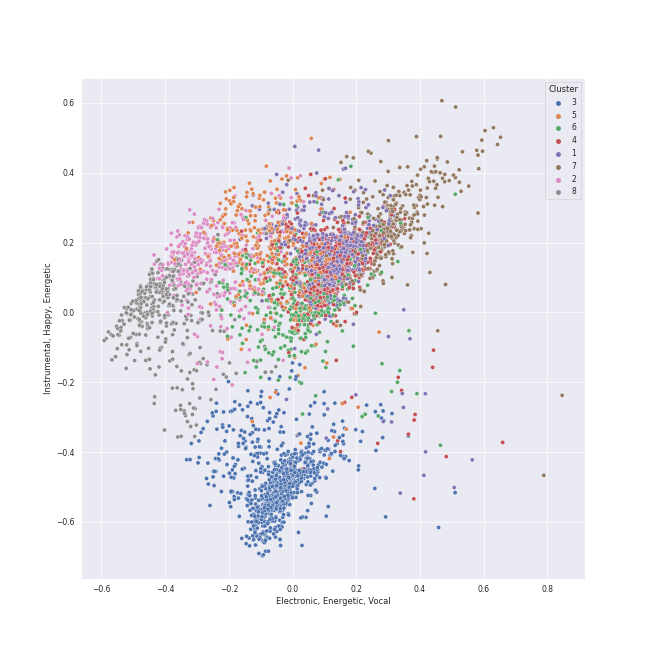

# Clusters in All tracks

## Cluster #1

720 tracks

| Art | Track | Album | Artists | Label | Rank | 💚 | 🔗 |
|:---|:---|:---|:---|:---|---:|:---|:---|
|  | Dance The Night Away | Summer Nights | [TWICE](../artists/twice/overview.md) | [Republic Records](../labels/republic_records) | 743 | 💚 | [🔗](https://open.spotify.com/track/4DYIDSMIB5y2UmZFv9fxeX) |
|  | Give Me Your TMI | MAXIDENT | [Stray Kids](../artists/stray_kids/overview.md) | [Republic Records](../labels/republic_records) | 354 | 💚 | [🔗](https://open.spotify.com/track/7CQhZA3qNDZBoTKWqjD7gR) |
|  | No.1 | No.1 - The 2nd Album | [BoA](../artists/boa/overview.md) | [SM Entertainment](../labels/sm_entertainment) | 925 | | [🔗](https://open.spotify.com/track/4RtHEggWfFWknuAsRdkyku) |
|  | WANNA BE MYSELF | WANNA BE MYSELF | [MAMAMOO](../artists/mamamoo/overview.md) | [RBW, Inc](../labels/rbw_inc_) | 925 | | [🔗](https://open.spotify.com/track/0VPBuXtEG16NtN5ZGYJ7lV) |
|  | Sweet Dreams | I AM...SASHA FIERCE | [Beyoncé](../artists/beyoncé/overview.md) | [Music World Music/Columbia](../labels/columbia) | 925 | | [🔗](https://open.spotify.com/track/1FKxKGONukVFXWVJxAKmlz) |
|  | flipp!ng a coin | the Billage of perception : chapter one | [Billlie](../artists/billlie/overview.md) | [MYSTIC STORY](../labels/mystic_story) | 925 | | [🔗](https://open.spotify.com/track/2UQLDRnG7IwlXrdmYTA6sv) |
|  | Blue Hour | minisode1 : Blue Hour | [TOMORROW X TOGETHER](../artists/tomorrow_x_together/overview.md) | [Republic Records](../labels/republic_records) | 925 | | [🔗](https://open.spotify.com/track/3ObPkJQAgjAhTwYvDhPrAW) |
|  | God of Music | SEVENTEEN 11th Mini Album 'SEVENTEENTH HEAVEN' | [SEVENTEEN](../artists/seventeen/overview.md) | [PLEDIS Entertainment](../labels/pledis_entertainment) | 925 | 💚 | [🔗](https://open.spotify.com/track/4MTNimMDRyFZv37Thcktwa) |
|  | Fuck You | The Lady Killer | CeeLo Green | Radiculture/Elektra | 925 | 💚 | [🔗](https://open.spotify.com/track/4ycLiPVzE5KamivXrAzGFG) |
|  | Movie Star | Movie Star | MIJOO | Antenna | 351 | 💚 | [🔗](https://open.spotify.com/track/4W8ixcvNvwWW5cdYSNlsiz) |
## Cluster #2

670 tracks

| Art | Track | Album | Artists | Label | Rank | 💚 | 🔗 |
|:---|:---|:---|:---|:---|---:|:---|:---|
|  | Piano Concerto No. 24 in C Minor, K. 491: II. Larghetto | Mozart Piano Pieces | [Wolfgang Amadeus Mozart](../artists/wolfgang_amadeus_mozart/overview.md), Carmen Piazzini, Mikhail Gantvarg, The St. Petersburg Soloists | [Warner Music Group - X5 Music Group](../labels/warner_music_group_-_x5_music_group) | 925 | | [🔗](https://open.spotify.com/track/1So9jHVpEqcbNX6rU9wUDC) |
|  | Divertimento in F Major, K. 247 (Orch. Perf.): II. Andante grazioso | Karajan - Mozart | [Wolfgang Amadeus Mozart](../artists/wolfgang_amadeus_mozart/overview.md), [Berliner Philharmoniker](../artists/berliner_philharmoniker/overview.md), [Herbert von Karajan](../artists/herbert_von_karajan/overview.md) | [UME - Global Clearing House](../labels/ume_-_global_clearing_house) | 925 | | [🔗](https://open.spotify.com/track/3iaBg32tC3kAL7lsYkr8Ff) |
|  | Divertimento in B-Flat Major, K. 287 (Orch. Perf.): VI. Andante – Allegro molto - Recorded 1965 | Karajan - Mozart | [Wolfgang Amadeus Mozart](../artists/wolfgang_amadeus_mozart/overview.md), [Berliner Philharmoniker](../artists/berliner_philharmoniker/overview.md), [Herbert von Karajan](../artists/herbert_von_karajan/overview.md) | [UME - Global Clearing House](../labels/ume_-_global_clearing_house) | 925 | | [🔗](https://open.spotify.com/track/7tjIU7PoARM3stmC4GB60u) |
|  | String Quartet No. 4 in C Major, K. 157: II. Andante | Mozart: String Quartets Nos. 4, 17 & 22 | [Wolfgang Amadeus Mozart](../artists/wolfgang_amadeus_mozart/overview.md), [Jerusalem Quartet](../artists/jerusalem_quartet/overview.md) | [harmonia mundi](../labels/harmonia_mundi) | 925 | | [🔗](https://open.spotify.com/track/4V6p7SY0ALq9I5iuOgkVNK) |
|  | Piano Sonata No. 29 in B flat, Op. 106 -"Hammerklavier": 2. Scherzo (Assai vivace - Presto - Prestissimo - Tempo I) | Beethoven: The Piano Sonatas | [Ludwig van Beethoven](../artists/ludwig_van_beethoven/overview.md), [Vladimir Ashkenazy](../artists/vladimir_ashkenazy/overview.md) | [Decca Music Group Ltd.](../labels/decca_music_group_ltd_) | 925 | | [🔗](https://open.spotify.com/track/0p7MucNl42X928zuT1iZCX) |
|  | Tchaikovsky: The Nutcracker, Op. 71, Act I, Scene 1: No. 5, Scene and Grandfather Dance | Tchaikovsky: The Nutcracker | [Pyotr Ilyich Tchaikovsky](../artists/pyotr_ilyich_tchaikovsky/overview.md), Sir Simon Rattle, [Berliner Philharmoniker](../artists/berliner_philharmoniker/overview.md) | [Warner Classics](../labels/warner_classics) | 925 | | [🔗](https://open.spotify.com/track/7JUbQkbvdPnNqS8RdcfCtO) |
|  | Swan Lake Suite, Op. 20a: II. Waltz | Mussorgsky: Pictures At An Exhibition | [Pyotr Ilyich Tchaikovsky](../artists/pyotr_ilyich_tchaikovsky/overview.md), Wiener Philharmoniker, Gustavo Dudamel | [Deutsche Grammophon (DG)](../labels/deutsche_grammophon_(dg)) | 925 | | [🔗](https://open.spotify.com/track/0NOiSayyUFYnLllkTdFa1k) |
|  | Tchaikovsky: Swan Lake, Op. 20, Act 1: No. 2, Waltz | Tchaikovsky: Swan Lake | [Pyotr Ilyich Tchaikovsky](../artists/pyotr_ilyich_tchaikovsky/overview.md), André Previn, [London Symphony Orchestra](../artists/london_symphony_orchestra/overview.md) | [Warner Classics](../labels/warner_classics) | 925 | | [🔗](https://open.spotify.com/track/7gwqbiFgNU1VddAK2XO5Wr) |
|  | 10 Preludes, Op. 23: No. 7 in C Minor: Allegro | Rachmaninov: Preludes for Piano (Complete) | Sergei Rachmaninoff, Eldar Nebolsin | [Naxos](../labels/naxos) | 925 | | [🔗](https://open.spotify.com/track/1BKKpyRblOv1OWjZ0CcAWo) |
|  | The Planets, Op. 32: III. Mercury, the Winged Messenger | Holst: The Planets | Gustav Holst, [Berliner Philharmoniker](../artists/berliner_philharmoniker/overview.md), [Herbert von Karajan](../artists/herbert_von_karajan/overview.md) | [Deutsche Grammophon (DG)](../labels/deutsche_grammophon_(dg)) | 925 | | [🔗](https://open.spotify.com/track/4rehJ6QJSNLQCK3Rav7pAe) |
## Cluster #3

449 tracks

| Art | Track | Album | Artists | Label | Rank | 💚 | 🔗 |
|:---|:---|:---|:---|:---|---:|:---|:---|
|  | Concerto for Violin and Strings in G Minor, Op. 8, No. 2, RV 315 "L'estate": I. Allegro non molto - Allegro | Vivaldi: Four Seasons | Antonio Vivaldi, Simon Standage, The English Concert, Trevor Pinnock | [Decca (UMO)](../labels/decca_(umo)) | 925 | | [🔗](https://open.spotify.com/track/2l4thc8hzFRHlFPZgvAXeF) |
|  | Vivaldi: The Four Seasons, Violin Concerto in F Minor, Op. 8 No. 4, RV 297 "Winter": III. Allegro | Vivaldi: The Four Seasons. | Antonio Vivaldi, Sarah Chang, Orpheus Chamber Orchestra | [Warner Classics](../labels/warner_classics) | 925 | | [🔗](https://open.spotify.com/track/3NssaIXNMQJHoCYXvxExET) |
|  | Because - Remastered 2009 | Abbey Road (Remastered) | [The Beatles](../artists/the_beatles/overview.md) | [EMI Catalogue](../labels/emi_catalogue) | 370 | 💚 | [🔗](https://open.spotify.com/track/1rxoyGj1QuPoVi8fOft1Kt) |
|  | Can't Help Falling In Love | PTX Vol. IV - Classics | [Pentatonix](../artists/pentatonix/overview.md) | [RCA Records Label](../labels/rca_records_label) | 925 | 💚 | [🔗](https://open.spotify.com/track/1xKScU3i8ho0OIhNoC5YW9) |
|  | The Mirror (Angel Of Music) - From 'The Phantom Of The Opera' Motion Picture | The Phantom Of The Opera (Original Motion Picture Soundtrack) | Andrew Lloyd Webber, Gerard Butler, Emmy Rossum | [UMC (Universal Music Catalogue)](../labels/umc_(universal_music_catalogue)) | 925 | | [🔗](https://open.spotify.com/track/5PRz8hvi9y6S36WIreol1U) |
|  | Timshel | GQ | GQ | Option C Records | 925 | | [🔗](https://open.spotify.com/track/5GtzG4nMm0DD4nlQp15uOn) |
|  | Beauty and the Beast | Beauty and the Beast | Angela Lansbury, Disney | [Walt Disney Records](../labels/walt_disney_records) | 925 | | [🔗](https://open.spotify.com/track/2rJFFUEl1LURkV0b0OARXx) |
|  | What A Wonderful World | What A Wonderful World | Louis Armstrong | [GRP](../labels/grp) | 925 | 💚 | [🔗](https://open.spotify.com/track/29U7stRjqHU6rMiS8BfaI9) |
|  | Unforgettable | Unforgettable | Nat King Cole | CAPITOL CATALOG MKT (C92) | 925 | | [🔗](https://open.spotify.com/track/648TTtYB0bH0P8Hfy0FmkL) |
|  | Poison & Wine | Barton Hollow | The Civil Wars | sensibility recordings | 538 | 💚 | [🔗](https://open.spotify.com/track/4BFudy2Zbryi9a1KFad66B) |
## Cluster #4

446 tracks

| Art | Track | Album | Artists | Label | Rank | 💚 | 🔗 |
|:---|:---|:---|:---|:---|---:|:---|:---|
|  | Up & Down | Why - The 2nd Mini Album | [TAEYEON](../artists/taeyeon/overview.md), HYOYEON | [SM Entertainment](../labels/sm_entertainment) | 925 | 💚 | [🔗](https://open.spotify.com/track/2T20Nb7QlVK8K6pRSiDl8N) |
|  | Spring Day | You Never Walk Alone | [BTS](../artists/bts/overview.md) | [BIGHIT MUSIC](../labels/bighit_music) | 925 | 💚 | [🔗](https://open.spotify.com/track/2j1fFjWHCI9KJSwcuYAOyF) |
|  | Too Close (feat. Roxorloops & Blady Kris) | The Party Upstairs | Ithacappella, Roxorloops & Blady Kris | [Ithacappella](../labels/ithacappella) | 925 | | [🔗](https://open.spotify.com/track/3mTJZn9RT8dd9cOXLq3Kgj) |
|  | Princess Going Digital | Fountain Baby | Amaarae | [Golden Angel/ Interscope Records](../labels/interscope_records) | 925 | | [🔗](https://open.spotify.com/track/6KS5iyM4uDuJ6oAacMSXha) |
|  | Chill Kill | Chill Kill - The 3rd Album | [Red Velvet](../artists/red_velvet/overview.md) | [SM Entertainment](../labels/sm_entertainment) | 48 | 💚 | [🔗](https://open.spotify.com/track/68gQG2HpRMxIRom4pCugMq) |
|  | Silent Night | Raid of Dream | [Dreamcatcher](../artists/dreamcatcher/overview.md) | [DREAMCATCHER COMPANY](../labels/dreamcatcher_company) | 305 | 💚 | [🔗](https://open.spotify.com/track/6OrYF7BHkbsfhxEMQfwBvV) |
|  | Pinball Wizard | Tommy | [The Who](../artists/the_who/overview.md) | [UMC (Universal Music Catalogue)](../labels/umc_(universal_music_catalogue)) | 925 | 💚 | [🔗](https://open.spotify.com/track/6LbbHFEajG9e4m0G3L47c4) |
|  | BOUNCY (K-HOT CHILLI PEPPERS) | THE WORLD EP.2 : OUTLAW | [ATEEZ](../artists/ateez/overview.md) | [KQ Entertainment](../labels/kq_entertainment) | 925 | | [🔗](https://open.spotify.com/track/5KyOUICJIvO0z71MBdPGiX) |
|  | Wings | Wings | PIXY | [Genie Music Corporation](../labels/genie_music_corporation), [Stone Music Entertainment](../labels/stone_music_entertainment) | 925 | 💚 | [🔗](https://open.spotify.com/track/12jfNawkTUb40C0iQ46u3W) |
|  | Wally | Lemon Love | Aslyn | [Capitol Records](../labels/capitol_records) | 925 | 💚 | [🔗](https://open.spotify.com/track/1JuNI0UJR2qDFlbZi1kO6p) |
## Cluster #5

369 tracks

| Art | Track | Album | Artists | Label | Rank | 💚 | 🔗 |
|:---|:---|:---|:---|:---|---:|:---|:---|
|  | Between the Lines | Little Voice | [Sara Bareilles](../artists/sara_bareilles/overview.md) | [Epic](../labels/epic) | 328 | 💚 | [🔗](https://open.spotify.com/track/2t3b5MZMzsArvQflOUo804) |
|  | Fireflies | Off the Hook | Ithacappella | [Ithacappella](../labels/ithacappella) | 925 | | [🔗](https://open.spotify.com/track/32Z70Jce3icBWnVZrZHt68) |
|  | Begin Again | Red | [Taylor Swift](../artists/taylor_swift/overview.md) | [Big Machine Records, LLC](../labels/big_machine_records) | 875 | 💚 | [🔗](https://open.spotify.com/track/0L4YCNRfXAoTvdpWeH2RGj) |
|  | Shh.. (Feat. HYEIN, WONSUN JOE & Special Narr. Patti Kim) | The Winning | [IU](../artists/iu/overview.md), HYEIN, Joe Won Sun, Patti Kim | [EDAM Entertainment](../labels/edam_entertainment) | 163 | | [🔗](https://open.spotify.com/track/20uUaRkfRJZG15mXfn7LaU) |
|  | Happy Ending | Keepin' it Low Key | Tar Heel Voices | [A Cappella Records](../labels/a_cappella_records) | 925 | | [🔗](https://open.spotify.com/track/72bpNdFjmdbiLFGV1w92RY) |
|  | T4ke | Cabin Fever | [PURPLE KISS](../artists/purple_kiss/overview.md) | [RBW Inc.](../labels/rbw_inc_) | 442 | 💚 | [🔗](https://open.spotify.com/track/3hDB8HsTgd3TePDsEulE97) |
|  | The Only Exception | Brand New Eyes | Paramore | [Fueled By Ramen](../labels/fueled_by_ramen) | 925 | | [🔗](https://open.spotify.com/track/7JIuqL4ZqkpfGKQhYlrirs) |
|  | Let Her Go | All The Little Lights | Passenger | [Nettwerk Music Group](../labels/nettwerk_music_group) | 925 | 💚 | [🔗](https://open.spotify.com/track/1KxwZYyzWNyZSRyErj2ojT) |
|  | NUMB | love you more, | YOUHA | [Universal Music Ltd.](../labels/universal_music_llc) | 925 | | [🔗](https://open.spotify.com/track/1yyyzZSKxNskVQqTCCE0pz) |
|  | Slide Away | Slide Away | Miley Cyrus | [RCA Records Label](../labels/rca_records_label) | 925 | | [🔗](https://open.spotify.com/track/44ADyYoY5liaRa3EOAl4uf) |
## Cluster #6

374 tracks

| Art | Track | Album | Artists | Label | Rank | 💚 | 🔗 |
|:---|:---|:---|:---|:---|---:|:---|:---|
|  | It's the Most Wonderful Time of the Year | That's Christmas To Me (Deluxe Edition) | [Pentatonix](../artists/pentatonix/overview.md) | [RCA Records Label](../labels/rca_records_label) | 925 | | [🔗](https://open.spotify.com/track/4DXJt41B9ZPh3UmxiPkBT0) |
|  | Santa Baby | The Taylor Swift Holiday Collection | [Taylor Swift](../artists/taylor_swift/overview.md) | [Big Machine Records, LLC](../labels/big_machine_records) | 366 | | [🔗](https://open.spotify.com/track/71IScwIe7bcIlpnlkbKVQw) |
|  | Luigi's Mansion Theme (From "Luigi's Mansion") | Choose Your Character! | [The 8-Bit Big Band](../artists/the_8-bit_big_band/overview.md) | The 8-Bit Big Band | 925 | 💚 | [🔗](https://open.spotify.com/track/49IoPNyh5U5rTvegOawXqr) |
|  | They | BOCA 2009: Best Of College A Cappella | The Harvard-Radcliffe Veritones | [Varsity Vocals](../labels/varsity_vocals) | 925 | | [🔗](https://open.spotify.com/track/12RoSrRwRi85EESftOp9fh) |
|  | Silver Lining | Under The Blacklight (Standard Version) | [Rilo Kiley](../artists/rilo_kiley/overview.md) | [Warner Records](../labels/warner_records) | 309 | 💚 | [🔗](https://open.spotify.com/track/0ieqq1wbtso2UjJWPqJ5Xc) |
|  | Say So | Hot Pink | [Doja Cat](../artists/doja_cat/overview.md) | [Kemosabe Records/RCA Records](../labels/rca_records_label) | 872 | 💚 | [🔗](https://open.spotify.com/track/3Dv1eDb0MEgF93GpLXlucZ) |
|  | Ya! (feat. Whee In) | Stay As You Are | Sandeul, Whee In | [WM Entertainment](../labels/wm_entertainment) | 925 | | [🔗](https://open.spotify.com/track/24HGlde2QMGAigs6bDdEhS) |
|  | LOVE. FEAT. ZACARI. | DAMN. | [Kendrick Lamar](../artists/kendrick_lamar/overview.md), Zacari | [Aftermath](../labels/aftermath) | 925 | 💚 | [🔗](https://open.spotify.com/track/6PGoSes0D9eUDeeAafB2As) |
|  | Wrap Me In Plastic | Wrap Me In Plastic | [MOMOLAND](../artists/momoland/overview.md), CHROMANCE | [Columbia/B1 Recordings](../labels/columbia) | 925 | 💚 | [🔗](https://open.spotify.com/track/5mpWGq83n0sIgGRopGk5QZ) |
|  | Low Key (feat. Tyga) | Low Key (feat. Tyga) | Ally Brooke, Tyga | [Latium/Atlantic](../labels/atlantic_records) | 925 | 💚 | [🔗](https://open.spotify.com/track/7xhvCzIguRfyfQyGrnWuVn) |
## Cluster #7

349 tracks

| Art | Track | Album | Artists | Label | Rank | 💚 | 🔗 |
|:---|:---|:---|:---|:---|---:|:---|:---|
|  | RACER | CHECKMATE | [ITZY](../artists/itzy/overview.md) | [Republic Records](../labels/republic_records) | 925 | 💚 | [🔗](https://open.spotify.com/track/5v15IF9D4nKZbto4US7Ar1) |
|  | Forgive Me | Forgive Me - The 3rd Mini Album | [BoA](../artists/boa/overview.md) | [SM Entertainment](../labels/sm_entertainment) | 172 | 💚 | [🔗](https://open.spotify.com/track/4TXo3KpvdwHSdrPJlWDfgn) |
|  | Save Your Tears | After Hours | The Weeknd | [Republic Records](../labels/republic_records) | 925 | 💚 | [🔗](https://open.spotify.com/track/5QO79kh1waicV47BqGRL3g) |
|  | 2 Rings | [VirtuouS] | [Dreamcatcher](../artists/dreamcatcher/overview.md) | [DREAMCATCHER COMPANY](../labels/dreamcatcher_company) | 925 | 💚 | [🔗](https://open.spotify.com/track/2jIkG2xRXVuXUNpPANMhVu) |
|  | Giddy | LOVESTRUCK! | Kep1er | [Genie Music Corporation](../labels/genie_music_corporation), [Stone Music Entertainment](../labels/stone_music_entertainment) | 925 | 💚 | [🔗](https://open.spotify.com/track/6blIAzkMKENKqAfMwj5cZQ) |
|  | Wow Thing | Wow Thing | [SEULGI](../artists/seulgi/overview.md), [CHUNG HA](../artists/chung_ha/overview.md), SinB, [JEON SOYEON](../artists/jeon_soyeon/overview.md) | [SM Entertainment](../labels/sm_entertainment) | 922 | 💚 | [🔗](https://open.spotify.com/track/5MwfxCtqMFGYp9Nc1BkTrS) |
|  | Flash Light | Funkentelechy Vs. The Placebo Syndrome | Parliament | Mercury Records | 925 | | [🔗](https://open.spotify.com/track/1v1PV2wERHiMPesMWX0qmO) |
|  | DESSERT | DESSERT | HYO, Loopy, [JEON SOYEON](../artists/jeon_soyeon/overview.md) | [SM Entertainment](../labels/sm_entertainment) | 24 | 💚 | [🔗](https://open.spotify.com/track/6u0pZe0Uv7GBR0iKptfWRf) |
|  | HELICOPTER - English Version | HELICOPTER | [CLC](../artists/clc/overview.md) | [Universal Music LLC](../labels/universal_music_llc) | 925 | | [🔗](https://open.spotify.com/track/3yHAVLtQy5ppBbuTUUhrlu) |
|  | Rebel | 20&2 - The 9th Album | [TVXQ!](../artists/tvxq!/overview.md) | [SM Entertainment](../labels/sm_entertainment) | 925 | 💚 | [🔗](https://open.spotify.com/track/4Vawz7UCdavhRW1OxovN4a) |
## Cluster #8

576 tracks

| Art | Track | Album | Artists | Label | Rank | 💚 | 🔗 |
|:---|:---|:---|:---|:---|---:|:---|:---|
|  | Black Swan | MAP OF THE SOUL : 7 | [BTS](../artists/bts/overview.md) | [BIGHIT MUSIC](../labels/bighit_music) | 925 | 💚 | [🔗](https://open.spotify.com/track/2EmcTFQ1rM11wp2ztsXTHa) |
|  | Look What You Made Me Do | reputation | [Taylor Swift](../artists/taylor_swift/overview.md) | [Big Machine Records, LLC](../labels/big_machine_records) | 925 | 💚 | [🔗](https://open.spotify.com/track/1P17dC1amhFzptugyAO7Il) |
|  | Sassy Me | RBB - The 5th Mini Album | [Red Velvet](../artists/red_velvet/overview.md) | [SM Entertainment](../labels/sm_entertainment) | 925 | 💚 | [🔗](https://open.spotify.com/track/1GpDAcUjhk3luk6ce8pOi1) |
|  | Only One | Only One - The 7th Album | [BoA](../artists/boa/overview.md) | [SM Entertainment](../labels/sm_entertainment) | 925 | | [🔗](https://open.spotify.com/track/3Hyl7YrOtBcnh1geON2kSO) |
|  | Shut Up & Groove | And July | [HEIZE](../artists/heize/overview.md), DEAN | [Genie Music Corporation](../labels/genie_music_corporation) | 925 | | [🔗](https://open.spotify.com/track/1WT5I6vlWjYW2cnhR1UkVA) |
|  | XOXO | XOXO | JEON SOMI | [THE BLACK LABEL/Interscope Records](../labels/interscope_records) | 925 | 💚 | [🔗](https://open.spotify.com/track/4r34Yi0eltsu1tp6z4lq3x) |
|  | AURA | <Queendom2> FINAL | [WJSN](../artists/wjsn/overview.md) | [Genie Music Corporation](../labels/genie_music_corporation) | 925 | 💚 | [🔗](https://open.spotify.com/track/4jP982FpZoDv729D0X8BiN) |
|  | It's Still Rock and Roll to Me | Glass Houses | [Billy Joel](../artists/billy_joel/overview.md) | [Columbia](../labels/columbia) | 925 | 💚 | [🔗](https://open.spotify.com/track/64UioB4Nmwgn2f4cbIpAkl) |
|  | 28 Reasons | 28 Reasons - The 1st Mini Album | [SEULGI](../artists/seulgi/overview.md) | [SM Entertainment](../labels/sm_entertainment) | 103 | 💚 | [🔗](https://open.spotify.com/track/1dfsPqH09vnzUWEOsN98Ex) |
|  | SHEESH | BABYMONS7ER | BABYMONSTER | [YG Entertainment](../labels/yg_entertainment) | 110 | 💚 | [🔗](https://open.spotify.com/track/1njlnn8ZKHI77Pe9szIONR) |
## Cluster #9

268 tracks

| Art | Track | Album | Artists | Label | Rank | 💚 | 🔗 |
|:---|:---|:---|:---|:---|---:|:---|:---|
|  | Horn Concerto No. 3 in E-Flat Major, K. 447: III. Rondo. Allegro | Karajan - Mozart | [Wolfgang Amadeus Mozart](../artists/wolfgang_amadeus_mozart/overview.md), Manfred Klier, Gerd Seifert, [Berliner Philharmoniker](../artists/berliner_philharmoniker/overview.md), [Herbert von Karajan](../artists/herbert_von_karajan/overview.md) | [UME - Global Clearing House](../labels/ume_-_global_clearing_house) | 925 | | [🔗](https://open.spotify.com/track/1UPNWzHNtv70waHBGDTQxq) |
|  | Horn Concerto No. 1 in D Major, K. 412/K. 514: II. Rondo. Allegro, K. 514 | Karajan - Mozart | [Wolfgang Amadeus Mozart](../artists/wolfgang_amadeus_mozart/overview.md), Gerd Seifert, [Berliner Philharmoniker](../artists/berliner_philharmoniker/overview.md), [Herbert von Karajan](../artists/herbert_von_karajan/overview.md) | [UME - Global Clearing House](../labels/ume_-_global_clearing_house) | 925 | | [🔗](https://open.spotify.com/track/4sHYPGjXXhFpJB1DMVc14A) |
|  | Symphony No. 38 in D Major, K. 504 "Prague": III. Finale. Presto | Karajan - Mozart | [Wolfgang Amadeus Mozart](../artists/wolfgang_amadeus_mozart/overview.md), [Berliner Philharmoniker](../artists/berliner_philharmoniker/overview.md), [Herbert von Karajan](../artists/herbert_von_karajan/overview.md) | [UME - Global Clearing House](../labels/ume_-_global_clearing_house) | 925 | | [🔗](https://open.spotify.com/track/5OlBFvqwbhQcoihA42rIdk) |
|  | Divertimento in D Major, K. 251 "Nannerl-Septett" (Orch. Perf.): I. Allegro molto | Karajan - Mozart | [Wolfgang Amadeus Mozart](../artists/wolfgang_amadeus_mozart/overview.md), [Berliner Philharmoniker](../artists/berliner_philharmoniker/overview.md), [Herbert von Karajan](../artists/herbert_von_karajan/overview.md) | [UME - Global Clearing House](../labels/ume_-_global_clearing_house) | 925 | | [🔗](https://open.spotify.com/track/7hxpr5ejSeH3RSdrtxk5P3) |
|  | String Quartet No. 22 in B-Flat Major, K. 589, "Prussian": IV. Allegro assai | Mozart: String Quartets Nos. 4, 17 & 22 | [Wolfgang Amadeus Mozart](../artists/wolfgang_amadeus_mozart/overview.md), [Jerusalem Quartet](../artists/jerusalem_quartet/overview.md) | [harmonia mundi](../labels/harmonia_mundi) | 925 | | [🔗](https://open.spotify.com/track/6Y8SmRRP56DkQoDt8op0xN) |
|  | Symphony No. 40 in G Minor, K. 550: IV. Allegro assai | Mozart: Symphony No. 40 in G Minor, Bassoon Concerto & Flute Serenades Nos. 1 & 3 | [Wolfgang Amadeus Mozart](../artists/wolfgang_amadeus_mozart/overview.md), Cologne New Philharmonic Orchestra, Volker Hartung | JPK Musik | 925 | | [🔗](https://open.spotify.com/track/7hV999Y5iTFvBJhI48ZAuo) |
|  | 24 Préludes, Op. 28: No. 12 in G-Sharp Minor: Presto | Chopin: Waltzes; 4 Scherzos; 26 Preludes | [Frédéric Chopin](../artists/frédéric_chopin/overview.md), [Vladimir Ashkenazy](../artists/vladimir_ashkenazy/overview.md) | [Decca Music Group Ltd.](../labels/decca_music_group_ltd_) | 925 | | [🔗](https://open.spotify.com/track/1ChXCn8eqUoqMsGxeYEIEH) |
|  | 24 Préludes, Op. 28: No. 16 in B-Flat Minor: Presto con fuoco | Chopin: Waltzes; 4 Scherzos; 26 Preludes | [Frédéric Chopin](../artists/frédéric_chopin/overview.md), [Vladimir Ashkenazy](../artists/vladimir_ashkenazy/overview.md) | [Decca Music Group Ltd.](../labels/decca_music_group_ltd_) | 925 | | [🔗](https://open.spotify.com/track/1KZYPGDt5PQGVekS9jpLG6) |
|  | 2 Bourrees, B160b | Chopin: Polonaises | [Frédéric Chopin](../artists/frédéric_chopin/overview.md), [Vladimir Ashkenazy](../artists/vladimir_ashkenazy/overview.md) | [Decca Music Group Ltd.](../labels/decca_music_group_ltd_) | 925 | | [🔗](https://open.spotify.com/track/0NQBcvME4NKAruNFixVDa8) |
|  | Coppélia / Tableau 3: No. 20 Fête de la cloche: IX. Galop final | Coppélia | Léo Delibes, Orchestra Victoria, Barry Wordsworth | [Australian Broadcasting Corp (ABC)](../labels/australian_broadcasting_corp_(abc)) | 925 | | [🔗](https://open.spotify.com/track/20UXWmEsvrpI1z0lwcZBcB) |
## Cluster #10

375 tracks

| Art | Track | Album | Artists | Label | Rank | 💚 | 🔗 |
|:---|:---|:---|:---|:---|---:|:---|:---|
|  | The Magic of Christmas Time | This Christmas – Winter is Coming | [TAEYEON](../artists/taeyeon/overview.md) | [SM Entertainment](../labels/sm_entertainment) | 925 | | [🔗](https://open.spotify.com/track/35OjjtMHKnPdOAsEZ6M9OA) |
|  | We Found Love | The Party Upstairs | Ithacappella | [Ithacappella](../labels/ithacappella) | 925 | | [🔗](https://open.spotify.com/track/4p2CmpzQB1PzgCssyQepPg) |
|  | Cinnamon Crush (feat. Lindsey Lomis) | Djesse Vol. 4 | [Jacob Collier](../artists/jacob_collier/overview.md), Lindsey Lomis | [Decca (UMO)](../labels/decca_(umo)) | 925 | 💚 | [🔗](https://open.spotify.com/track/6XJvYWE3tx9tRVavh6GysW) |
|  | Travelin' Soldier | Home | The Chicks | [Open Wide/Monument/Columbia](../labels/columbia) | 925 | 💚 | [🔗](https://open.spotify.com/track/0AkZjWYCMJ8wWiNex7LmkY) |
|  | Belle | Beauty and the Beast | Richard White, Paige O'Hara, Chorus - Beauty And the Beast, Disney | [Walt Disney Records](../labels/walt_disney_records) | 925 | | [🔗](https://open.spotify.com/track/0Q4a3PdGEME9w8Jgqa0Gf3) |
|  | What Is This Feeling? - From "Wicked" Original Broadway Cast Recording/2003 | Wicked (Original Broadway Cast Recording / Deluxe Edition) | Stephen Schwartz, Kristin Chenoweth, Idina Menzel, Stephen Oremus, Alex Lacamoire | [Verve (Adult Contemporary) MC](../labels/verve_(adult_contemporary)_mc) | 925 | | [🔗](https://open.spotify.com/track/2lNRPajwEfma5EEmsgAe1w) |
|  | Come Fly With Me - Remastered 1998 | Come Fly With Me (Expanded Edition) | [Frank Sinatra](../artists/frank_sinatra/overview.md) | [Capitol Records](../labels/capitol_records) | 925 | | [🔗](https://open.spotify.com/track/4hHbeIIKO5Y5uLyIEbY9Gn) |
|  | Good Old Fashioned Lover Boy | A Day At The Races | [Queen](../artists/queen/overview.md) | [Hollywood Records](../labels/hollywood_records) | 925 | | [🔗](https://open.spotify.com/track/3e9w80AUq0mT9Nrq471kLx) |
|  | Best Part (feat. H.E.R.) | Freudian | Daniel Caesar, H.E.R. | Golden Child Recordings | 925 | 💚 | [🔗](https://open.spotify.com/track/1RMJOxR6GRPsBHL8qeC2ux) |
|  | Heaven | Heaven | Isyana Sarasvati, Afgan, Rendy Pandugo | Sony Music Entertainment Indonesia/Trinity Optima Production | 925 | | [🔗](https://open.spotify.com/track/3gBFAvpAVSNohs3ESRMYHi) |