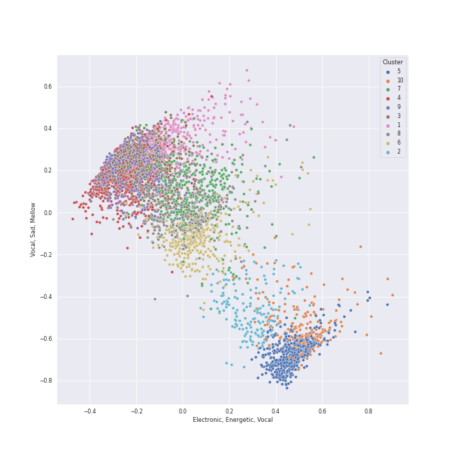

# Clusters in All tracks

## Cluster #1

349 tracks

| Art | Track | Album | Artists | Label | Rank | 💚 | 🔗 |
|:---|:---|:---|:---|:---|---:|:---|:---|
|  | Forgive Me | Forgive Me - The 3rd Mini Album | [BoA](../artists/boa/overview.md) | [SM Entertainment](../labels/sm_entertainment) | 187 | 💚 | [🔗](https://open.spotify.com/track/4TXo3KpvdwHSdrPJlWDfgn) |
|  | Badster | Badster | HYO | [SM Entertainment](../labels/sm_entertainment) | 1031 | | [🔗](https://open.spotify.com/track/7sjzOysoro4EunDYC9M6Vx) |
|  | Save Your Tears | After Hours | The Weeknd | [Republic Records](../labels/republic_records) | 1031 | 💚 | [🔗](https://open.spotify.com/track/5QO79kh1waicV47BqGRL3g) |
|  | Kiss and Make Up | Dua Lipa (Complete Edition) | [Dua Lipa](../artists/dua_lipa/overview.md), [BLACKPINK](../artists/blackpink/overview.md) | [Warner Records](../labels/warner_records) | 1031 | 💚 | [🔗](https://open.spotify.com/track/7jr3iPu4O4bTCVwLMbdU2i) |
|  | Comme Des Garçons (Like The Boys) | SAWAYAMA | Rina Sawayama | Dirty Hit | 1031 | 💚 | [🔗](https://open.spotify.com/track/43bYs8QkPdCdy5esfnmU1T) |
|  | Three Dopeboyz (Feat. Zion.T) | LUCKYNUMBERS | Dynamicduo, Zion.T | [Stone Music Entertainment](../labels/stone_music_entertainment) | 1031 | | [🔗](https://open.spotify.com/track/74Q5gW006ZD5iIaVYB1EhO) |
|  | Rush Hour (Feat. j-hope of BTS) | Rush Hour | [Crush](../artists/crush/overview.md), [j-hope](../artists/j-hope/overview.md) | 피네이션 | 1031 | 💚 | [🔗](https://open.spotify.com/track/5aucVLKiumD89mxVCB4zvS) |
|  | Real world | Loossemble | Loossemble | [WM Korea](../labels/wm_korea) | 474 | | [🔗](https://open.spotify.com/track/2gW0fZQNsjs3XKPNzHYC8Q) |
|  | HELICOPTER - English Version | HELICOPTER | [CLC](../artists/clc/overview.md) | [Universal Music LLC](../labels/universal_music_llc) | 1031 | | [🔗](https://open.spotify.com/track/3yHAVLtQy5ppBbuTUUhrlu) |
|  | DARK ROMANCE | Starlit of Muse | Moon Byul | [RBW Inc.](../labels/rbw_inc_) | 1031 | | [🔗](https://open.spotify.com/track/3tXCpt80T5wTq9QUOBFmOV) |
## Cluster #2

174 tracks

| Art | Track | Album | Artists | Label | Rank | 💚 | 🔗 |
|:---|:---|:---|:---|:---|---:|:---|:---|
|  | String Quartet No. 4 in D Major, Op. 83: IV. Allegretto | Shostakovich: String Quartets Nos. 1, 4, 6, 8, 9 & 11 | Dmitri Shostakovich, [Jerusalem Quartet](../artists/jerusalem_quartet/overview.md) | [harmonia mundi](../labels/harmonia_mundi) | 1031 | | [🔗](https://open.spotify.com/track/4qM31gOqZIt7skvz2kgaOC) |
|  | Coppélia / Tableau 2: No. 15 Scène | Coppélia | Léo Delibes, Orchestra Victoria, Barry Wordsworth | [Australian Broadcasting Corp (ABC)](../labels/australian_broadcasting_corp_(abc)) | 1031 | | [🔗](https://open.spotify.com/track/0LArcL3gk60nP3cxr6LWGx) |
|  | Coppélia / Tableau 1: No. 8 Final | Coppélia | Léo Delibes, Orchestra Victoria, Barry Wordsworth | [Australian Broadcasting Corp (ABC)](../labels/australian_broadcasting_corp_(abc)) | 1031 | | [🔗](https://open.spotify.com/track/1q6d29hcZizG37UPMVIS1U) |
|  | Brandenburg Concerto No. 4 in G, BWV 1049: 2. Andante | Bach, J.S.: Brandenburg Concertos etc. | [Johann Sebastian Bach](../artists/johann_sebastian_bach/overview.md), English Chamber Orchestra, Benjamin Britten | [Decca Music Group Ltd.](../labels/decca_music_group_ltd_) | 1031 | | [🔗](https://open.spotify.com/track/3ycalZsD0op1GjZ6eDrpbU) |
|  | Leonore Overture No. 3, Op. 72b | Beethoven: 9 Symphonies; Overtures | [Ludwig van Beethoven](../artists/ludwig_van_beethoven/overview.md), [Berliner Philharmoniker](../artists/berliner_philharmoniker/overview.md), [Herbert von Karajan](../artists/herbert_von_karajan/overview.md) | [Deutsche Grammophon (DG)](../labels/deutsche_grammophon_(dg)) | 1031 | | [🔗](https://open.spotify.com/track/1qP4L90ZORZad6pqdLMyci) |
|  | String Quartet No. 15 in A minor, Op. 132: II. Allegro ma non tanto | Beethoven: Complete String Quartets | [Ludwig van Beethoven](../artists/ludwig_van_beethoven/overview.md), [Tokyo String Quartet](../artists/tokyo_string_quartet/overview.md) | [harmonia mundi](../labels/harmonia_mundi) | 1031 | | [🔗](https://open.spotify.com/track/52afsywDcOS3ApCQET7k5J) |
|  | String Quartet No. 9 in C Major, Op. 59 No. 3: I. Introduzione (Andante con moto - Allegro vivace) | Beethoven: Complete String Quartets | [Ludwig van Beethoven](../artists/ludwig_van_beethoven/overview.md), [Tokyo String Quartet](../artists/tokyo_string_quartet/overview.md) | [harmonia mundi](../labels/harmonia_mundi) | 1031 | | [🔗](https://open.spotify.com/track/5bUQPchwRlyhMMNP7OYrcW) |
|  | Vespers, Op. 37: X. "Voskreseniye Khristovo videvshe" | Rachmaninov: Vespers - All Night Vigil | Sergei Rachmaninoff, St.Petersburg Chamber Choir, Nikolai Korniev | [Decca Music Group Ltd.](../labels/decca_music_group_ltd_) | 1031 | | [🔗](https://open.spotify.com/track/2rzp6tSZjlPxIjkcnKoV7a) |
|  | 4 Motets pour le temps de Noël, FP 152: No. 1, Magnum mysterium | Poulenc: Motets and Mass | Francis Poulenc, Vlasta Mlejnková, Kühn Mixed Choir, Pavel Kühn | SUPRAPHON a.s. | 1031 | | [🔗](https://open.spotify.com/track/1lb2BKEeXA8cx2jLxfqJel) |
|  | 4 Motets pour un temps de pénitence, FP 97: No. 2, Vinea mea electa | Poulenc: Motets and Mass | Francis Poulenc, Vlasta Mlejnková, Kühn Mixed Choir, Pavel Kühn | SUPRAPHON a.s. | 1031 | | [🔗](https://open.spotify.com/track/63jRApT2GmzdVMePv7KFXi) |
## Cluster #3

866 tracks

| Art | Track | Album | Artists | Label | Rank | 💚 | 🔗 |
|:---|:---|:---|:---|:---|---:|:---|:---|
|  | First Time | Taste of Love | [TWICE](../artists/twice/overview.md) | [Republic Records](../labels/republic_records) | 480 | 💚 | [🔗](https://open.spotify.com/track/3YdqewCLgGsFhruA3EhILy) |
|  | Imaginary Friend | GOLD | [ITZY](../artists/itzy/overview.md) | [Republic Records](../labels/republic_records) | 582 | 💚 | [🔗](https://open.spotify.com/track/06BeeZaS4YArThfTMu80QS) |
|  | Kill Shot | KILL MY DOUBT | [ITZY](../artists/itzy/overview.md) | [Republic Records](../labels/republic_records) | 186 | 💚 | [🔗](https://open.spotify.com/track/3i7Z0CI7QIwnU4MVL0XJB9) |
|  | Look | Perfect Velvet - The 2nd Album | [Red Velvet](../artists/red_velvet/overview.md) | [SM Entertainment](../labels/sm_entertainment) | 1031 | 💚 | [🔗](https://open.spotify.com/track/48Nd8rdc0WVG4rHTd76Mh6) |
|  | Shhh | KISS OF LIFE | [KISS OF LIFE](../artists/kiss_of_life/overview.md) | [S2 ENTERTAINMENT INC.](../labels/s2_entertainment_inc_) | 978 | 💚 | [🔗](https://open.spotify.com/track/76qqDJijAjFph7sjUxNVG8) |
|  | WANNA BE MYSELF | WANNA BE MYSELF | [MAMAMOO](../artists/mamamoo/overview.md) | [RBW, Inc](../labels/rbw_inc_) | 1031 | | [🔗](https://open.spotify.com/track/0VPBuXtEG16NtN5ZGYJ7lV) |
|  | HIP | reality in BLACK | [MAMAMOO](../artists/mamamoo/overview.md) | [RBW, Inc](../labels/rbw_inc_) | 6 | 💚 | [🔗](https://open.spotify.com/track/24nK8tW7Pt3Inh2utttuoG) |
|  | Higher Ground | Innervisions | Stevie Wonder | [Motown](../labels/motown) | 1031 | 💚 | [🔗](https://open.spotify.com/track/0dMd4rilfd6gPbXaLpNYhu) |
|  | BEAT BEAT | Fe3O4: STICK OUT | [NMIXX](../artists/nmixx/overview.md) | [Republic Records](../labels/republic_records) | 256 | 💚 | [🔗](https://open.spotify.com/track/3P8l7sbL5dxKlS4gcJ1qJI) |
|  | Waka Waka (This Time for Africa) | Voices Only 2013 College A Cappella, Vol. 1 | University of Rochester YellowJackets | Voices Only A Cappella | 1031 | | [🔗](https://open.spotify.com/track/37x7PLzv5rAxTZAgfCInUx) |
## Cluster #4

543 tracks

| Art | Track | Album | Artists | Label | Rank | 💚 | 🔗 |
|:---|:---|:---|:---|:---|---:|:---|:---|
|  | Cold As Hell | INVU - The 3rd Album | [TAEYEON](../artists/taeyeon/overview.md) | [SM Entertainment](../labels/sm_entertainment) | 396 | 💚 | [🔗](https://open.spotify.com/track/7gosH4fL73GpiJBd5GK2rC) |
|  | Nightmare | Chill Kill - The 3rd Album | [Red Velvet](../artists/red_velvet/overview.md) | [SM Entertainment](../labels/sm_entertainment) | 89 | 💚 | [🔗](https://open.spotify.com/track/0jUDrSASok8h2xUIWe4KOG) |
|  | Best Thing I Never Had | 4 | [Beyoncé](../artists/beyoncé/overview.md) | [Columbia](../labels/columbia), [Parkwood Entertainment](../labels/parkwood_entertainment) | 1031 | | [🔗](https://open.spotify.com/track/3lBRNqXjPp2j3JMTCXDTNO) |
|  | Closing In | Speak for Yourself | [Imogen Heap](../artists/imogen_heap/overview.md) | Sony BMG Music UK | 1031 | 💚 | [🔗](https://open.spotify.com/track/3wKRHAG6IvErggsniF1a3j) |
|  | Gone | Pandora : Beneath the Paradise, Pt. 3 (Original Television Soundtrack) | AILEE | [Genie Music Corporation](../labels/genie_music_corporation) | 1031 | | [🔗](https://open.spotify.com/track/4Xfix99TcepR0aGFVW8kYN) |
|  | Dead Man Runnin’ | 28 Reasons - The 1st Mini Album | [SEULGI](../artists/seulgi/overview.md) | [SM Entertainment](../labels/sm_entertainment) | 199 | 💚 | [🔗](https://open.spotify.com/track/5eFGkCXi83auDi0bcDBEKD) |
|  | Breezeblocks | An Awesome Wave | alt-J | Canvasback/ATL | 428 | 💚 | [🔗](https://open.spotify.com/track/3n69hLUdIsSa1WlRmjMZlW) |
|  | Fitzpleasure | An Awesome Wave | alt-J | Canvasback/ATL | 1031 | 💚 | [🔗](https://open.spotify.com/track/7DdXf9x75iEVCHWfoRwRuR) |
|  | Automatonic Electronic Harmonics | The 2¢ Show | Steam Powered Giraffe | Steam Powered Giraffe | 813 | 💚 | [🔗](https://open.spotify.com/track/1vRnOlS6Hei11RiUkKCXkO) |
|  | SMOKY | MIXTAPE [ PSYCHE ] | JOOHONEY | [Starship Entertainment](../labels/starship_entertainment) | 1031 | | [🔗](https://open.spotify.com/track/2RdsTI9mfgdrNBIoShmI99) |
## Cluster #5

560 tracks

| Art | Track | Album | Artists | Label | Rank | 💚 | 🔗 |
|:---|:---|:---|:---|:---|---:|:---|:---|
|  | Symphony No. 32 in G Major, K. 318: I. Allegro – II. Andante – III. Tempo I | Karajan - Mozart | [Wolfgang Amadeus Mozart](../artists/wolfgang_amadeus_mozart/overview.md), [Berliner Philharmoniker](../artists/berliner_philharmoniker/overview.md), [Herbert von Karajan](../artists/herbert_von_karajan/overview.md) | [UME - Global Clearing House](../labels/ume_-_global_clearing_house) | 1031 | | [🔗](https://open.spotify.com/track/21cATdRkPAVU27StFK9Zfo) |
|  | Brahms: Symphony No. 2 in D Major, Op. 73: III. Allegretto grazioso. Quasi andantino | Brahms: The Symphonies | Johannes Brahms, Sir Simon Rattle, [Berliner Philharmoniker](../artists/berliner_philharmoniker/overview.md) | [Warner Classics UK](../labels/warner_classics_uk) | 1031 | | [🔗](https://open.spotify.com/track/3hrBvTIOU6Jmz9G6tLPNjT) |
|  | 24 Préludes, Op. 28: No. 21 in B-Flat Major: Cantabile | Chopin: Waltzes; 4 Scherzos; 26 Preludes | [Frédéric Chopin](../artists/frédéric_chopin/overview.md), [Vladimir Ashkenazy](../artists/vladimir_ashkenazy/overview.md) | [Decca Music Group Ltd.](../labels/decca_music_group_ltd_) | 1031 | | [🔗](https://open.spotify.com/track/3WCamrmSMc9lwnY7GygErR) |
|  | Piano Sonata No. 29 in B flat, Op. 106 -"Hammerklavier": 2. Scherzo (Assai vivace - Presto - Prestissimo - Tempo I) | Beethoven: The Piano Sonatas | [Ludwig van Beethoven](../artists/ludwig_van_beethoven/overview.md), [Vladimir Ashkenazy](../artists/vladimir_ashkenazy/overview.md) | [Decca Music Group Ltd.](../labels/decca_music_group_ltd_) | 1031 | | [🔗](https://open.spotify.com/track/0p7MucNl42X928zuT1iZCX) |
|  | Piano Sonata No. 16 in G, Op. 31 No. 1: 3. Rondo (Allegretto) | Beethoven: The Piano Sonatas | [Ludwig van Beethoven](../artists/ludwig_van_beethoven/overview.md), [Vladimir Ashkenazy](../artists/vladimir_ashkenazy/overview.md) | [Decca Music Group Ltd.](../labels/decca_music_group_ltd_) | 1031 | | [🔗](https://open.spotify.com/track/4QpCaoTElARQj31WH2lPAx) |
|  | Piano Sonata No. 26 in E-Flat Major, Op. 81a "Les Adieux": I. Das Lebewohl (Adagio - Allegro) | Beethoven: The Piano Sonatas | [Ludwig van Beethoven](../artists/ludwig_van_beethoven/overview.md), [Vladimir Ashkenazy](../artists/vladimir_ashkenazy/overview.md) | [Decca Music Group Ltd.](../labels/decca_music_group_ltd_) | 1031 | | [🔗](https://open.spotify.com/track/76915vyJFSFWrz8AYVMN2p) |
|  | Symphony No. 6 in F Major, Op. 68 "Pastoral": V. Hirtengesang. Frohe und dankbare Gefühle nach dem Sturm. Allegretto | Beethoven: 9 Symphonies; Overtures | [Ludwig van Beethoven](../artists/ludwig_van_beethoven/overview.md), [Berliner Philharmoniker](../artists/berliner_philharmoniker/overview.md), [Herbert von Karajan](../artists/herbert_von_karajan/overview.md) | [Deutsche Grammophon (DG)](../labels/deutsche_grammophon_(dg)) | 1031 | | [🔗](https://open.spotify.com/track/70E993QEzhQSWILEzDliaV) |
|  | Tchaikovsky: The Nutcracker, Op. 71, Act I, Scene 1: No. 1, Decoration of the Christmas Tree | Tchaikovsky: The Nutcracker | [Pyotr Ilyich Tchaikovsky](../artists/pyotr_ilyich_tchaikovsky/overview.md), Sir Simon Rattle, [Berliner Philharmoniker](../artists/berliner_philharmoniker/overview.md) | [Warner Classics](../labels/warner_classics) | 1031 | | [🔗](https://open.spotify.com/track/7hVsNjrvtfXZlzxW5vxsAi) |
|  | Tchaikovsky: Swan Lake, Op. 20, Act 1: No. 2, Waltz | Tchaikovsky: Swan Lake | [Pyotr Ilyich Tchaikovsky](../artists/pyotr_ilyich_tchaikovsky/overview.md), André Previn, [London Symphony Orchestra](../artists/london_symphony_orchestra/overview.md) | [Warner Classics](../labels/warner_classics) | 1031 | | [🔗](https://open.spotify.com/track/7gwqbiFgNU1VddAK2XO5Wr) |
|  | 10 Preludes, Op. 23: No. 7 in C Minor: Allegro | Rachmaninov: Preludes for Piano (Complete) | Sergei Rachmaninoff, Eldar Nebolsin | [Naxos](../labels/naxos) | 1031 | | [🔗](https://open.spotify.com/track/1BKKpyRblOv1OWjZ0CcAWo) |
## Cluster #6

381 tracks

| Art | Track | Album | Artists | Label | Rank | 💚 | 🔗 |
|:---|:---|:---|:---|:---|---:|:---|:---|
|  | Vivaldi: The Four Seasons, Violin Concerto in F Minor, Op. 8 No. 4, RV 297 "Winter": III. Allegro | Vivaldi: The Four Seasons. | Antonio Vivaldi, Sarah Chang, Orpheus Chamber Orchestra | [Warner Classics](../labels/warner_classics) | 1031 | | [🔗](https://open.spotify.com/track/3NssaIXNMQJHoCYXvxExET) |
|  | Bluebird | Kaleidoscope Heart | [Sara Bareilles](../artists/sara_bareilles/overview.md) | [Epic](../labels/epic) | 1031 | 💚 | [🔗](https://open.spotify.com/track/4LIFyLAf6BCfgLi5Xq62mh) |
|  | You And I | In My Room | [Jacob Collier](../artists/jacob_collier/overview.md) | Hajanga Records | 1031 | 💚 | [🔗](https://open.spotify.com/track/0yZ1VBdUdX2dEBXv4LXzn8) |
|  | Angel Of Music | The Phantom Of The Opera | Andrew Lloyd Webber, Phantom Of The Opera Original London Cast, Janet Devenish, Sarah Brightman | [Polydor Records](../labels/polydor_records) | 1031 | | [🔗](https://open.spotify.com/track/48eRbUfNOF4xnNHwSSYubb) |
|  | In My Life | Les Misérables: The Motion Picture Soundtrack Deluxe (Deluxe Edition) | Amanda Seyfried, Eddie Redmayne, Samantha Barks, Hugh Jackman | [Polydor Records](../labels/polydor_records) | 1031 | | [🔗](https://open.spotify.com/track/36vPj8etuV0nTqjpvpp2CA) |
|  | On My Own | Les Misérables: The Motion Picture Soundtrack Deluxe (Deluxe Edition) | Samantha Barks | [Polydor Records](../labels/polydor_records) | 1031 | | [🔗](https://open.spotify.com/track/3Mr6ofzF6ZuYiqHh8qNud3) |
|  | when the party's over | WHEN WE ALL FALL ASLEEP, WHERE DO WE GO? | [Billie Eilish](../artists/billie_eilish/overview.md) | [Darkroom](../labels/darkroom), [Interscope Records](../labels/interscope_records) | 1031 | 💚 | [🔗](https://open.spotify.com/track/43zdsphuZLzwA9k4DJhU0I) |
|  | The Christmas Song (Merry Christmas To You) | The Christmas Song (Expanded Edition) | Nat King Cole | CAPITOL CATALOG MKT (C92) | 462 | | [🔗](https://open.spotify.com/track/4PS1e8f2LvuTFgUs1Cn3ON) |
|  | Unforgettable | Unforgettable | Nat King Cole | CAPITOL CATALOG MKT (C92) | 1031 | | [🔗](https://open.spotify.com/track/648TTtYB0bH0P8Hfy0FmkL) |
|  | A Dream Is a Wish Your Heart Makes | Cinderella Special Edition (Original Motion Picture Soundtrack/Japanese Version) | Ilene Woods, Mice Chorus | [Walt Disney Records](../labels/walt_disney_records) | 1031 | | [🔗](https://open.spotify.com/track/6PiTsEEiNYU9a9xXowi9i5) |
## Cluster #7

425 tracks

| Art | Track | Album | Artists | Label | Rank | 💚 | 🔗 |
|:---|:---|:---|:---|:---|---:|:---|:---|
|  | Lucifer | DARK MOON SPECIAL ALBUM <MEMORABILIA> | [ENHYPEN](../artists/enhypen/overview.md) | [BELIFT LAB](../labels/belift_lab) | 518 | 💚 | [🔗](https://open.spotify.com/track/7Fq4xDlMtpqca0IyTYXldY) |
|  | White Winter Hymnal | Fleet Foxes | Fleet Foxes | Sub Pop Records | 544 | 💚 | [🔗](https://open.spotify.com/track/0GegHVxeozw3rdjte45Bfx) |
|  | I'm Yours | We Sing. We Dance. We Steal Things. | Jason Mraz | [Atlantic Records/ATG](../labels/atlantic_records) | 1031 | 💚 | [🔗](https://open.spotify.com/track/1EzrEOXmMH3G43AXT1y7pA) |
|  | Delfino Plaza (From "Super Mario Sunshine") | Choose Your Character! | [The 8-Bit Big Band](../artists/the_8-bit_big_band/overview.md) | The 8-Bit Big Band | 1031 | 💚 | [🔗](https://open.spotify.com/track/2gnqOaI0TpTOg8FufLil3Y) |
|  | Counting Stars | 1988 | Tar Heel Voices | Tar Heel Voices | 1031 | | [🔗](https://open.spotify.com/track/497vByhCSwcQHKrLOqsXgA) |
|  | Hero | LOVE EPISODE | [AKMU](../artists/akmu/overview.md) | [YG Entertainment](../labels/yg_entertainment) | 594 | 💚 | [🔗](https://open.spotify.com/track/1hXs7BduDW3yGSSwolP8eh) |
|  | Aha! | Ellipse | [Imogen Heap](../artists/imogen_heap/overview.md) | [RCA Records Label](../labels/rca_records_label) | 790 | 💚 | [🔗](https://open.spotify.com/track/42itRd5WoYb42RSYOloJvD) |
|  | Make Up (Feat. Crush) | Sun And Moon | Sam Kim, [Crush](../artists/crush/overview.md) | Antenna | 1031 | 💚 | [🔗](https://open.spotify.com/track/19zsSUEuJNzNA6eqInqyF9) |
|  | Them Changes | Drunk | Thundercat | Brainfeeder | 1031 | | [🔗](https://open.spotify.com/track/7CH99b2i1TXS5P8UUyWtnM) |
|  | Baby, It's Cold Outside (feat. Meghan Trainor) | Glow | Brett Eldredge, Meghan Trainor | Atlantic Nashville | 1031 | | [🔗](https://open.spotify.com/track/5Q2P43CJra0uRAogjHyJDK) |
## Cluster #8

411 tracks

| Art | Track | Album | Artists | Label | Rank | 💚 | 🔗 |
|:---|:---|:---|:---|:---|---:|:---|:---|
|  | Very, Slowly | Twenty-Five Twenty-One OST | [BIBI](../artists/bibi/overview.md) | Studio MaumC, Hwa&Dam pictures | 1031 | 💚 | [🔗](https://open.spotify.com/track/1dpLjawAb5PhlDr1w1diEe) |
|  | I Get It Now | I Get It Now | [Sammy Rae & The Friends](../artists/sammy_rae___the_friends/overview.md) | [Nettwerk Music Group](../labels/nettwerk_music_group) | 926 | 💚 | [🔗](https://open.spotify.com/track/03ECDyILFfQ98k106zwcIt) |
|  | NO WAY | 24℃ | [LeeHi](../artists/leehi/overview.md), G.Soul | [YG Entertainment](../labels/yg_entertainment) | 1031 | | [🔗](https://open.spotify.com/track/0jA0TihvVbPHgrIcHbW1Og) |
|  | Secret Garden | A flower bookmark | [IU](../artists/iu/overview.md) | Fave Entertainment | 1031 | 💚 | [🔗](https://open.spotify.com/track/5F6nAnNIsRk9QbPOx9t11B) |
|  | HANN (Alone in winter) | I burn | [(G)I-DLE](../artists/(g)i-dle/overview.md) | [Universal Music LLC](../labels/universal_music_llc) | 107 | 💚 | [🔗](https://open.spotify.com/track/2qYdsdgdeMLFzpLcMQWG2W) |
|  | Dancing Through Life - From "Wicked" Original Broadway Cast Recording/2003 | Wicked (Original Broadway Cast Recording / Deluxe Edition) | Stephen Schwartz, Stephen Oremus, Greg Wells, Jack Dolman, Dominick Amendum, Norbert Leo Butz, Kristin Chenoweth, Christopher Fitzgerald, Michelle Federer, Idina Menzel, Alex Lacamoire | [Verve (Adult Contemporary) MC](../labels/verve_(adult_contemporary)_mc) | 1031 | | [🔗](https://open.spotify.com/track/45Yr7rD2vH3OsTRseT6gfA) |
|  | Breakfast on the Morning Tram | Breakfast on the Morning Tram | Stacey Kent | Parlophone (France) | 1031 | 💚 | [🔗](https://open.spotify.com/track/0mcs5XA4bwgCVYLUxvJ9sg) |
|  | Wait It Out | Ellipse | [Imogen Heap](../artists/imogen_heap/overview.md) | [RCA Records Label](../labels/rca_records_label) | 1031 | 💚 | [🔗](https://open.spotify.com/track/4xszw2YraekWIpj0SZ6Lp6) |
|  | Work Song | Hozier (Expanded Edition) | Hozier | [Columbia](../labels/columbia) | 1031 | 💚 | [🔗](https://open.spotify.com/track/5TgEJ62DOzBpGxZ7WRsrqb) |
|  | עושה לי צרות | עושה לי צרות | Eden Hason | Mobile1 Music | 1031 | | [🔗](https://open.spotify.com/track/4I9NVCnjIRVriXfNE7VhE0) |
## Cluster #9

814 tracks

| Art | Track | Album | Artists | Label | Rank | 💚 | 🔗 |
|:---|:---|:---|:---|:---|---:|:---|:---|
|  | Black Swan | MAP OF THE SOUL : 7 | [BTS](../artists/bts/overview.md) | [BIGHIT MUSIC](../labels/bighit_music) | 553 | 💚 | [🔗](https://open.spotify.com/track/2EmcTFQ1rM11wp2ztsXTHa) |
|  | Right Now | Supernatural | [NewJeans](../artists/newjeans/overview.md) | [ADOR](../labels/ador) | 639 | 💚 | [🔗](https://open.spotify.com/track/58Q3FZFs1YXPpliWQB5kXB) |
|  | Armageddon | Armageddon - The 1st Album | [aespa](../artists/aespa/overview.md) | [SM Entertainment](../labels/sm_entertainment) | 534 | | [🔗](https://open.spotify.com/track/6i8MbzVn4nzyjUcSoVcz7B) |
|  | Winter Falls | Christmas EveL | [Stray Kids](../artists/stray_kids/overview.md) | [Republic Records](../labels/republic_records) | 395 | | [🔗](https://open.spotify.com/track/0BeqHPNJSLzfH8TZ7Adpb3) |
|  | Closer | FOREVER 1 - The 7th Album | [Girls' Generation](../artists/girls__generation/overview.md) | [SM Entertainment](../labels/sm_entertainment) | 1031 | | [🔗](https://open.spotify.com/track/7JWXQE9QBQ8BAPFKAwnUWP) |
|  | Last Drop | Cosmic | [Red Velvet](../artists/red_velvet/overview.md) | [SM Entertainment](../labels/sm_entertainment) | 343 | 💚 | [🔗](https://open.spotify.com/track/5mSsvlMqeX21U9WovVAJA4) |
|  | React | React | The Pussycat Dolls | Access Records | 1031 | 💚 | [🔗](https://open.spotify.com/track/0qMAJBLMTshMx03CJkJl6O) |
|  | Cheers to youth | SEVENTEEN BEST ALBUM '17 IS RIGHT HERE' | [SEVENTEEN](../artists/seventeen/overview.md) | [PLEDIS Entertainment](../labels/pledis_entertainment) | 191 | 💚 | [🔗](https://open.spotify.com/track/1XvOEvWtfa879Wk1wKHZ1M) |
|  | Nada | Metamorphic | [STAYC](../artists/stayc/overview.md) | [High Up Entertainment](../labels/high_up_entertainment) | 535 | | [🔗](https://open.spotify.com/track/2nZFLtfsBxQWHkFCHkepTH) |
|  | It's Still Rock and Roll to Me | Glass Houses | [Billy Joel](../artists/billy_joel/overview.md) | [Columbia](../labels/columbia) | 1031 | 💚 | [🔗](https://open.spotify.com/track/64UioB4Nmwgn2f4cbIpAkl) |
## Cluster #10

253 tracks

| Art | Track | Album | Artists | Label | Rank | 💚 | 🔗 |
|:---|:---|:---|:---|:---|---:|:---|:---|
|  | Horn Concerto No. 3 in E-Flat Major, K. 447: III. Rondo. Allegro | Karajan - Mozart | [Wolfgang Amadeus Mozart](../artists/wolfgang_amadeus_mozart/overview.md), Manfred Klier, Gerd Seifert, [Berliner Philharmoniker](../artists/berliner_philharmoniker/overview.md), [Herbert von Karajan](../artists/herbert_von_karajan/overview.md) | [UME - Global Clearing House](../labels/ume_-_global_clearing_house) | 1031 | | [🔗](https://open.spotify.com/track/1UPNWzHNtv70waHBGDTQxq) |
|  | Horn Concerto No. 1 in D Major, K. 412/K. 514: II. Rondo. Allegro, K. 514 | Karajan - Mozart | [Wolfgang Amadeus Mozart](../artists/wolfgang_amadeus_mozart/overview.md), Gerd Seifert, [Berliner Philharmoniker](../artists/berliner_philharmoniker/overview.md), [Herbert von Karajan](../artists/herbert_von_karajan/overview.md) | [UME - Global Clearing House](../labels/ume_-_global_clearing_house) | 1031 | | [🔗](https://open.spotify.com/track/4sHYPGjXXhFpJB1DMVc14A) |
|  | Symphony No. 38 in D Major, K. 504 "Prague": III. Finale. Presto | Karajan - Mozart | [Wolfgang Amadeus Mozart](../artists/wolfgang_amadeus_mozart/overview.md), [Berliner Philharmoniker](../artists/berliner_philharmoniker/overview.md), [Herbert von Karajan](../artists/herbert_von_karajan/overview.md) | [UME - Global Clearing House](../labels/ume_-_global_clearing_house) | 1031 | | [🔗](https://open.spotify.com/track/5OlBFvqwbhQcoihA42rIdk) |
|  | Symphony No. 35 in D Major, K. 385 "Haffner": IV. Finale. Presto | Karajan - Mozart | [Wolfgang Amadeus Mozart](../artists/wolfgang_amadeus_mozart/overview.md), [Berliner Philharmoniker](../artists/berliner_philharmoniker/overview.md), [Herbert von Karajan](../artists/herbert_von_karajan/overview.md) | [UME - Global Clearing House](../labels/ume_-_global_clearing_house) | 1031 | | [🔗](https://open.spotify.com/track/6AG3DgiQijfQStdoPQxyKO) |
|  | Eine kleine Nachtmusik, K. 525: I. Allegro | Karajan - Mozart | [Wolfgang Amadeus Mozart](../artists/wolfgang_amadeus_mozart/overview.md), [Berliner Philharmoniker](../artists/berliner_philharmoniker/overview.md), [Herbert von Karajan](../artists/herbert_von_karajan/overview.md) | [UME - Global Clearing House](../labels/ume_-_global_clearing_house) | 1031 | | [🔗](https://open.spotify.com/track/6jxiu7gRixrqC4vcXqzmWy) |
|  | String Quartet No. 17 in B-Flat Major, K. 458 "The Hunt": IV. Allegro assai | Mozart: String Quartets Nos. 4, 17 & 22 | [Wolfgang Amadeus Mozart](../artists/wolfgang_amadeus_mozart/overview.md), [Jerusalem Quartet](../artists/jerusalem_quartet/overview.md) | [harmonia mundi](../labels/harmonia_mundi) | 1031 | | [🔗](https://open.spotify.com/track/6AgF5rgvW3hRwe6A8KCcwl) |
|  | String Quartet No. 22 in B-Flat Major, K. 589, "Prussian": IV. Allegro assai | Mozart: String Quartets Nos. 4, 17 & 22 | [Wolfgang Amadeus Mozart](../artists/wolfgang_amadeus_mozart/overview.md), [Jerusalem Quartet](../artists/jerusalem_quartet/overview.md) | [harmonia mundi](../labels/harmonia_mundi) | 1031 | | [🔗](https://open.spotify.com/track/6Y8SmRRP56DkQoDt8op0xN) |
|  | Symphony No. 40 in G Minor, K. 550: IV. Allegro assai | Mozart: Symphony No. 40 in G Minor, Bassoon Concerto & Flute Serenades Nos. 1 & 3 | [Wolfgang Amadeus Mozart](../artists/wolfgang_amadeus_mozart/overview.md), Cologne New Philharmonic Orchestra, Volker Hartung | JPK Musik | 1031 | | [🔗](https://open.spotify.com/track/7hV999Y5iTFvBJhI48ZAuo) |
|  | 2 Bourrees, B160b | Chopin: Polonaises | [Frédéric Chopin](../artists/frédéric_chopin/overview.md), [Vladimir Ashkenazy](../artists/vladimir_ashkenazy/overview.md) | [Decca Music Group Ltd.](../labels/decca_music_group_ltd_) | 1031 | | [🔗](https://open.spotify.com/track/0NQBcvME4NKAruNFixVDa8) |
|  | Coppélia / Tableau 1: No. 3 Mazurka | Coppélia | Léo Delibes, Orchestra Victoria, Barry Wordsworth | [Australian Broadcasting Corp (ABC)](../labels/australian_broadcasting_corp_(abc)) | 1031 | | [🔗](https://open.spotify.com/track/4Vh9c9ZVc6nPuSMbvJADyi) |