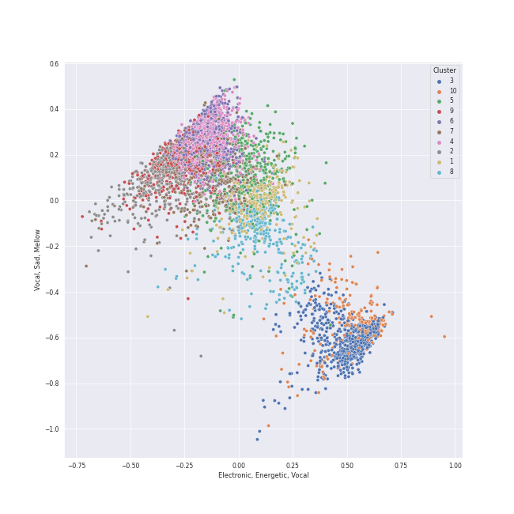

# Clusters in All tracks

## Cluster #1

386 tracks

| Art | Track | Album | Artists | Label | 💚 | 🔗 |
|:---|:---|:---|:---|:---|:---|:---|
|  | Princess Going Digital | Fountain Baby | Amaarae | [Golden Angel/ Interscope Records](../labels/interscope_records) | | [🔗](https://open.spotify.com/track/6KS5iyM4uDuJ6oAacMSXha) |
|  | Wally | Lemon Love | Aslyn | [Capitol Records](../labels/capitol_records) | 💚 | [🔗](https://open.spotify.com/track/1JuNI0UJR2qDFlbZi1kO6p) |
|  | VISION | [Apocalypse : Follow us] | [Dreamcatcher](../artists/dreamcatcher/overview.md) | [DREAMCATCHER COMPANY](../labels/dreamcatcher_company) | 💚 | [🔗](https://open.spotify.com/track/1nmc8ngLcvccw7Lay5v5SP) |
|  | It's Not That Easy | Love, Save The Empty | Erin McCarley | Universal (MT) | 💚 | [🔗](https://open.spotify.com/track/52XDPMr17ILKppuZRBFwqy) |
|  | Dog Days Are Over | Lungs | [Florence + The Machine](../artists/florence_+_the_machine/overview.md) | [Universal-Island Records Ltd.](../labels/universal-island_records_ltd_) | 💚 | [🔗](https://open.spotify.com/track/416zj01H28D6uQP43LL6x3) |
|  | The Great Unknown | Jukebox The Ghost | Jukebox The Ghost | Cherrytree Records/Kierszenbaum | | [🔗](https://open.spotify.com/track/6xBUdFmhryjXoxn8KkTNr4) |
|  | POP/STARS | POP/STARS | K/DA, Madison Beer, [(G)I-DLE](../artists/(g)i-dle/overview.md), Jaira Burns, League of Legends | Riot Games | 💚 | [🔗](https://open.spotify.com/track/5sbooPcNgIE22DwO0VNGUJ) |
|  | Excalibur | History Of Kingdom: Pt. I. Arthur | KINGDOM | [WM Korea](../labels/wm_korea) | | [🔗](https://open.spotify.com/track/5uNEmROkf5izWfrQ9oLvAQ) |
|  | Wherever I May Roam (Remastered) | Metallica (Remastered) | Metallica | Blackened Recordings | 💚 | [🔗](https://open.spotify.com/track/745sNpjWbAxo2MA2zSYbyD) |
|  | Say (All I Need) | Dreaming Out Loud | OneRepublic | [Mosley / Interscope](../labels/interscope_records) | 💚 | [🔗](https://open.spotify.com/track/6H4vq5gz0rlNjH0LBzu4An) |
## Cluster #2

313 tracks

| Art | Track | Album | Artists | Label | 💚 | 🔗 |
|:---|:---|:---|:---|:---|:---|:---|
|  | White Winter Hymnal | Fleet Foxes | Fleet Foxes | Sub Pop Records | | [🔗](https://open.spotify.com/track/3QVtICc8ViNOy4I5K14d8Z) |
|  | Heartbreak Anniversary | Heartbreak Anniversary | Giveon | [Epic/Not So Fast](../labels/epic) | 💚 | [🔗](https://open.spotify.com/track/2QfznFotJNZmnIEYFdzE5T) |
|  | All Night Long (feat. Take 6) | Djesse Vol. 1 | [Jacob Collier](../artists/jacob_collier/overview.md), Metropole Orkest, Jules Buckley, Take 6 | [Decca (UMO)](../labels/decca_(umo)) | 💚 | [🔗](https://open.spotify.com/track/6TN4FrJvMdYrLDF2Lz7ArI) |
|  | Trumpets | Talk Dirty | [Jason Derulo](../artists/jason_derulo/overview.md) | [Beluga Heights/Warner Records](../labels/warner_records) | 💚 | [🔗](https://open.spotify.com/track/5KONnBIQ9LqCxyeSPin26k) |
|  | Lucky | We Sing. We Dance. We Steal Things. | Jason Mraz, Colbie Caillat | [Atlantic Records/ATG](../labels/atlantic_records) | 💚 | [🔗](https://open.spotify.com/track/0IktbUcnAGrvD03AWnz3Q8) |
|  | Milestones (feat. John Coltrane, Cannonball Adderley, Red Garland, Paul Chambers & Philly Joe Jones) | Milestones | Miles Davis, John Coltrane, Cannonball Adderley, Red Garland, Paul Chambers, Philly Joe Jones | [Columbia](../labels/columbia), [Legacy](../labels/legacy) | | [🔗](https://open.spotify.com/track/1xicvSO4CJ2ymqYgpk7DFh) |
|  | Make Up (Feat. Crush) | Sun And Moon | Sam Kim, [Crush](../artists/crush/overview.md) | Antenna | 💚 | [🔗](https://open.spotify.com/track/19zsSUEuJNzNA6eqInqyF9) |
|  | Running Through The Night | ?depacse ohw | Seori | [WM Korea](../labels/wm_korea) | | [🔗](https://open.spotify.com/track/3UZ46DvXvB2R7sBUZornlv) |
|  | Counting Stars | 1988 | Tar Heel Voices | Tar Heel Voices | | [🔗](https://open.spotify.com/track/497vByhCSwcQHKrLOqsXgA) |
|  | Written In The Stars | Written In The Stars | [WENDY](../artists/wendy/overview.md), John Legend | [SM Entertainment](../labels/sm_entertainment) | 💚 | [🔗](https://open.spotify.com/track/6SLMyJPRTh2zCX9SJJHTZQ) |
## Cluster #3

269 tracks

| Art | Track | Album | Artists | Label | 💚 | 🔗 |
|:---|:---|:---|:---|:---|:---|:---|
|  | 2 Bourrees, B160b | Chopin: Polonaises | [Frédéric Chopin](../artists/frédéric_chopin/overview.md), [Vladimir Ashkenazy](../artists/vladimir_ashkenazy/overview.md) | [Decca Music Group Ltd.](../labels/decca_music_group_ltd_) | | [🔗](https://open.spotify.com/track/0NQBcvME4NKAruNFixVDa8) |
|  | 24 Préludes, Op. 28: No. 12 in G-Sharp Minor: Presto | Chopin: Waltzes; 4 Scherzos; 26 Preludes | [Frédéric Chopin](../artists/frédéric_chopin/overview.md), [Vladimir Ashkenazy](../artists/vladimir_ashkenazy/overview.md) | [Decca Music Group Ltd.](../labels/decca_music_group_ltd_) | | [🔗](https://open.spotify.com/track/1ChXCn8eqUoqMsGxeYEIEH) |
|  | 24 Préludes, Op. 28: No. 16 in B-Flat Minor: Presto con fuoco | Chopin: Waltzes; 4 Scherzos; 26 Preludes | [Frédéric Chopin](../artists/frédéric_chopin/overview.md), [Vladimir Ashkenazy](../artists/vladimir_ashkenazy/overview.md) | [Decca Music Group Ltd.](../labels/decca_music_group_ltd_) | | [🔗](https://open.spotify.com/track/1KZYPGDt5PQGVekS9jpLG6) |
|  | String Quartet No. 22 in B-Flat Major, K. 589, "Prussian": IV. Allegro assai | Mozart: String Quartets Nos. 4, 17 & 22 | [Wolfgang Amadeus Mozart](../artists/wolfgang_amadeus_mozart/overview.md), [Jerusalem Quartet](../artists/jerusalem_quartet/overview.md) | [harmonia mundi](../labels/harmonia_mundi) | | [🔗](https://open.spotify.com/track/6Y8SmRRP56DkQoDt8op0xN) |
|  | Symphony No. 40 in G Minor, K. 550: IV. Allegro assai | Mozart: Symphony No. 40 in G Minor, Bassoon Concerto & Flute Serenades Nos. 1 & 3 | [Wolfgang Amadeus Mozart](../artists/wolfgang_amadeus_mozart/overview.md), Cologne New Philharmonic Orchestra, Volker Hartung | JPK Musik | | [🔗](https://open.spotify.com/track/7hV999Y5iTFvBJhI48ZAuo) |
|  | Divertimento No. 11 in D, K.251 "Nannerl-Septett": Allegro molto | Karajan - Mozart | [Wolfgang Amadeus Mozart](../artists/wolfgang_amadeus_mozart/overview.md), [Berliner Philharmoniker](../artists/berliner_philharmoniker/overview.md), [Herbert von Karajan](../artists/herbert_von_karajan/overview.md) | [UME - Global Clearing House](../labels/ume_-_global_clearing_house) | | [🔗](https://open.spotify.com/track/7hxpr5ejSeH3RSdrtxk5P3) |
|  | Divertimento No. 11 in D, K.251 "Nannerl-Septett": Rondeau (Allegro assai) | Karajan - Mozart | [Wolfgang Amadeus Mozart](../artists/wolfgang_amadeus_mozart/overview.md), [Berliner Philharmoniker](../artists/berliner_philharmoniker/overview.md), [Herbert von Karajan](../artists/herbert_von_karajan/overview.md) | [UME - Global Clearing House](../labels/ume_-_global_clearing_house) | | [🔗](https://open.spotify.com/track/3R87ynLy67Mp04evQmfEM2) |
|  | Horn Concerto No. 3 in E-Flat Major, K. 447: III. Allegro | Karajan - Mozart | [Wolfgang Amadeus Mozart](../artists/wolfgang_amadeus_mozart/overview.md), Manfred Klier, Gerd Seifert, [Berliner Philharmoniker](../artists/berliner_philharmoniker/overview.md), [Herbert von Karajan](../artists/herbert_von_karajan/overview.md) | [UME - Global Clearing House](../labels/ume_-_global_clearing_house) | | [🔗](https://open.spotify.com/track/1UPNWzHNtv70waHBGDTQxq) |
|  | Symphony No. 35 in D Major, K. 385 "Haffner": 4. Finale (Presto) | Karajan - Mozart | [Wolfgang Amadeus Mozart](../artists/wolfgang_amadeus_mozart/overview.md), [Berliner Philharmoniker](../artists/berliner_philharmoniker/overview.md), [Herbert von Karajan](../artists/herbert_von_karajan/overview.md) | [UME - Global Clearing House](../labels/ume_-_global_clearing_house) | | [🔗](https://open.spotify.com/track/6AG3DgiQijfQStdoPQxyKO) |
|  | Symphony No. 38 In D, K.504 "Prague": 3. Finale (Presto) | Karajan - Mozart | [Wolfgang Amadeus Mozart](../artists/wolfgang_amadeus_mozart/overview.md), [Berliner Philharmoniker](../artists/berliner_philharmoniker/overview.md), [Herbert von Karajan](../artists/herbert_von_karajan/overview.md) | [UME - Global Clearing House](../labels/ume_-_global_clearing_house) | | [🔗](https://open.spotify.com/track/5OlBFvqwbhQcoihA42rIdk) |
## Cluster #4

740 tracks

| Art | Track | Album | Artists | Label | 💚 | 🔗 |
|:---|:---|:---|:---|:---|:---|:---|
|  | Sweet Dreams | I AM...SASHA FIERCE | [Beyoncé](../artists/beyoncé/overview.md) | [Music World Music/Columbia](../labels/columbia) | | [🔗](https://open.spotify.com/track/1FKxKGONukVFXWVJxAKmlz) |
|  | No.1 | No.1 - The 2nd Album | [BoA](../artists/boa/overview.md) | [SM Entertainment](../labels/sm_entertainment) | | [🔗](https://open.spotify.com/track/4RtHEggWfFWknuAsRdkyku) |
|  | Chasing Tomorrow | Chasing Tomorrow | CARSTN, GoldFish, Anna Graceman | Kontor Records | 💚 | [🔗](https://open.spotify.com/track/3vBMircA5qKK86CGshh4Ir) |
|  | Kill Shot | KILL MY DOUBT | [ITZY](../artists/itzy/overview.md) | [Republic Records](../labels/republic_records) | 💚 | [🔗](https://open.spotify.com/track/3i7Z0CI7QIwnU4MVL0XJB9) |
|  | Look | Perfect Velvet - The 2nd Album | [Red Velvet](../artists/red_velvet/overview.md) | [SM Entertainment](../labels/sm_entertainment) | | [🔗](https://open.spotify.com/track/48Nd8rdc0WVG4rHTd76Mh6) |
|  | Be Mine | TEENFRESH | [STAYC](../artists/stayc/overview.md) | [High Up Entertainment](../labels/high_up_entertainment) | 💚 | [🔗](https://open.spotify.com/track/3g4jq4wctEo0fVaTDKjk3Q) |
|  | La Tortura (feat. Alejandro Sanz) | Fijación Oral, Vol. 1 | Shakira, Alejandro Sanz | [Epic](../labels/epic) | | [🔗](https://open.spotify.com/track/5BSclXJTa9B0iURhUjZo50) |
|  | Give Me Your TMI | MAXIDENT | [Stray Kids](../artists/stray_kids/overview.md) | [Republic Records](../labels/republic_records) | 💚 | [🔗](https://open.spotify.com/track/7CQhZA3qNDZBoTKWqjD7gR) |
|  | Night Away | Guilty - The 4th Mini Album | TAEMIN | [SM Entertainment](../labels/sm_entertainment) | | [🔗](https://open.spotify.com/track/0zjkBOwL8upqIOmufTO6tT) |
|  | Dance The Night Away | Summer Nights | [TWICE](../artists/twice/overview.md) | [Republic Records](../labels/republic_records) | 💚 | [🔗](https://open.spotify.com/track/4DYIDSMIB5y2UmZFv9fxeX) |
## Cluster #5

271 tracks

| Art | Track | Album | Artists | Label | 💚 | 🔗 |
|:---|:---|:---|:---|:---|:---|:---|
|  | Violin Concerto in F Minor, Op. 8, No. 4, RV 297 "L'inverno": III. Allegro | Vivaldi: Four Seasons | Antonio Vivaldi, Simon Standage, The English Concert, Trevor Pinnock | [Decca (UMO)](../labels/decca_(umo)) | | [🔗](https://open.spotify.com/track/1s6z69thm3lJw9DHmTGmjc) |
|  | My Everything | My Everything (Deluxe) | [Ariana Grande](../artists/ariana_grande/overview.md) | [Universal Records](../labels/universal_music_llc) | 💚 | [🔗](https://open.spotify.com/track/4eumFsTnduH3zRfaASoAPs) |
|  | Confrontation | Les Misérables (Original Broadway Cast Recording) | Colm Wilkinson, Terrence Mann | [Verve (Adult Contemporary) MC](../labels/verve_(adult_contemporary)_mc) | | [🔗](https://open.spotify.com/track/2eqCnMN561yzr6wag6VeiB) |
|  | Your Song | Elton John | Elton John | [UMC (Universal Music Catalogue)](../labels/umc_(universal_music_catalogue)) | 💚 | [🔗](https://open.spotify.com/track/38zsOOcu31XbbYj9BIPUF1) |
|  | Heaven | Heaven | Isyana Sarasvati, Afgan, Rendy Pandugo | Sony Music Entertainment Indonesia/Trinity Optima Production | | [🔗](https://open.spotify.com/track/3gBFAvpAVSNohs3ESRMYHi) |
|  | La vie en rose (feat. Cécile McLorin Salvant) | love (Deluxe Edition) | [Michael Bublé](../artists/michael_bublé/overview.md), Cécile McLorin Salvant | [Reprise](../labels/reprise) | | [🔗](https://open.spotify.com/track/1QELw50Dl95LusF6uOkDqk) |
|  | When You Come Back Down | Nickel Creek | Nickel Creek | Sugar Hill Records | | [🔗](https://open.spotify.com/track/1xVBmHH65VMaJP61SmOSUk) |
|  | The Sound of Silence - Acoustic Version | Wednesday Morning, 3 A.M. | [Simon & Garfunkel](../artists/simon___garfunkel/overview.md) | [Columbia](../labels/columbia) | 💚 | [🔗](https://open.spotify.com/track/5y788ya4NvwhBznoDIcXwK) |
|  | Breakfast on the Morning Tram | Breakfast on the Morning Tram | Stacey Kent | Parlophone (France) | 💚 | [🔗](https://open.spotify.com/track/0mcs5XA4bwgCVYLUxvJ9sg) |
|  | Colder Weather | M | Vanderbilt Melodores | Vanderbilt Melodores | | [🔗](https://open.spotify.com/track/6ZlO7zjdkGguzlzqETjQWX) |
## Cluster #6

617 tracks

| Art | Track | Album | Artists | Label | 💚 | 🔗 |
|:---|:---|:---|:---|:---|:---|:---|
|  | Piano Sonata No. 2 in B-Flat Minor, Op. 35: II. Scherzo - Più lento - Tempo I | Chopin: Preludes; Sonata No.2 | [Frédéric Chopin](../artists/frédéric_chopin/overview.md), Martha Argerich | [Deutsche Grammophon (DG)](../labels/deutsche_grammophon_(dg)) | | [🔗](https://open.spotify.com/track/71gcI9CPfuKg5MCKqw06Zi) |
|  | Nocturne No. 16 In E Flat, Op. 55 No. 2 | Chopin: Nocturnes | [Frédéric Chopin](../artists/frédéric_chopin/overview.md), Maurizio Pollini | [Deutsche Grammophon (DG)](../labels/deutsche_grammophon_(dg)) | | [🔗](https://open.spotify.com/track/7r9DH7AvvijvMXFMGMsdqK) |
|  | The Planets, Op. 32: 3. Mercury, the Winged Messenger | Holst: The Planets | Gustav Holst, [Berliner Philharmoniker](../artists/berliner_philharmoniker/overview.md), [Herbert von Karajan](../artists/herbert_von_karajan/overview.md) | [Deutsche Grammophon (DG)](../labels/deutsche_grammophon_(dg)) | | [🔗](https://open.spotify.com/track/4rehJ6QJSNLQCK3Rav7pAe) |
|  | Piano Sonata No. 29 in B flat, Op. 106 -"Hammerklavier": 2. Scherzo (Assai vivace - Presto - Prestissimo - Tempo I) | Beethoven: The Piano Sonatas | [Ludwig van Beethoven](../artists/ludwig_van_beethoven/overview.md), [Vladimir Ashkenazy](../artists/vladimir_ashkenazy/overview.md) | [Decca Music Group Ltd.](../labels/decca_music_group_ltd_) | | [🔗](https://open.spotify.com/track/0p7MucNl42X928zuT1iZCX) |
|  | Tchaikovsky: Swan Lake, Op. 20, Act 1: No. 2, Waltz | Tchaikovsky: Swan Lake | [Pyotr Ilyich Tchaikovsky](../artists/pyotr_ilyich_tchaikovsky/overview.md), André Previn, London Symphony Orchestra | [Warner Classics](../labels/warner_classics) | | [🔗](https://open.spotify.com/track/7gwqbiFgNU1VddAK2XO5Wr) |
|  | 10 Preludes, Op. 23: No. 7 in C Minor: Allegro | Rachmaninov: Preludes for Piano (Complete) | Sergei Rachmaninoff, Eldar Nebolsin | [Naxos](../labels/naxos) | | [🔗](https://open.spotify.com/track/1BKKpyRblOv1OWjZ0CcAWo) |
|  | String Quartet No. 4 in C Major, K. 157: II. Andante | Mozart: String Quartets Nos. 4, 17 & 22 | [Wolfgang Amadeus Mozart](../artists/wolfgang_amadeus_mozart/overview.md), [Jerusalem Quartet](../artists/jerusalem_quartet/overview.md) | [harmonia mundi](../labels/harmonia_mundi) | | [🔗](https://open.spotify.com/track/4V6p7SY0ALq9I5iuOgkVNK) |
|  | Divertimento In F, K.247: Andante grazioso | Karajan - Mozart | [Wolfgang Amadeus Mozart](../artists/wolfgang_amadeus_mozart/overview.md), [Berliner Philharmoniker](../artists/berliner_philharmoniker/overview.md), [Herbert von Karajan](../artists/herbert_von_karajan/overview.md) | [UME - Global Clearing House](../labels/ume_-_global_clearing_house) | | [🔗](https://open.spotify.com/track/3iaBg32tC3kAL7lsYkr8Ff) |
|  | Divertimento No. 15 in B Flat Major, K. 287: VI. Andante - Allegro molto | Karajan - Mozart | [Wolfgang Amadeus Mozart](../artists/wolfgang_amadeus_mozart/overview.md), [Berliner Philharmoniker](../artists/berliner_philharmoniker/overview.md), [Herbert von Karajan](../artists/herbert_von_karajan/overview.md) | [UME - Global Clearing House](../labels/ume_-_global_clearing_house) | | [🔗](https://open.spotify.com/track/7tjIU7PoARM3stmC4GB60u) |
|  | Piano Concerto No. 24 in C Minor, K. 491: II. Larghetto | Mozart Piano Pieces | [Wolfgang Amadeus Mozart](../artists/wolfgang_amadeus_mozart/overview.md), Carmen Piazzini, Mikhail Gantvarg, The St. Petersburg Soloists | [Warner Music Group - X5 Music Group](../labels/warner_music_group_-_x5_music_group) | | [🔗](https://open.spotify.com/track/1So9jHVpEqcbNX6rU9wUDC) |
## Cluster #7

557 tracks

| Art | Track | Album | Artists | Label | 💚 | 🔗 |
|:---|:---|:---|:---|:---|:---|:---|
|  | Black Swan | MAP OF THE SOUL : 7 | [BTS](../artists/bts/overview.md) | [BIGHIT MUSIC](../labels/bighit_music) | 💚 | [🔗](https://open.spotify.com/track/2EmcTFQ1rM11wp2ztsXTHa) |
|  | Born Without a Heart | Born Without a Heart | Faouzia | Faouzia 2019 | 💚 | [🔗](https://open.spotify.com/track/6i5jBmnB22alUpJ7hpznuj) |
|  | Shut Up & Groove | And July | [HEIZE](../artists/heize/overview.md), DEAN | [Genie Music Corporation](../labels/genie_music_corporation) | | [🔗](https://open.spotify.com/track/1WT5I6vlWjYW2cnhR1UkVA) |
|  | She Will Be Loved | Songs About Jane | [Maroon 5](../artists/maroon_5/overview.md) | [Interscope Records*](../labels/interscope_records) | 💚 | [🔗](https://open.spotify.com/track/7sapKrjDij2fpDVj0GxP66) |
|  | Marionette | Bloom | [Red Velvet](../artists/red_velvet/overview.md) | [avex trax](../labels/avex_trax) | 💚 | [🔗](https://open.spotify.com/track/3KvMgB5V1FvQTCvvHz5aiO) |
|  | Winter Falls | Christmas EveL | [Stray Kids](../artists/stray_kids/overview.md) | [Republic Records](../labels/republic_records) | | [🔗](https://open.spotify.com/track/0BeqHPNJSLzfH8TZ7Adpb3) |
|  | Look What You Made Me Do | reputation | [Taylor Swift](../artists/taylor_swift/overview.md) | [Big Machine Records, LLC](../labels/big_machine_records) | 💚 | [🔗](https://open.spotify.com/track/1P17dC1amhFzptugyAO7Il) |
|  | London Boy | Lover | [Taylor Swift](../artists/taylor_swift/overview.md) | [Taylor Swift](../labels/taylor_swift) | 💚 | [🔗](https://open.spotify.com/track/1LLXZFeAHK9R4xUramtUKw) |
|  | React | React | The Pussycat Dolls | Access Records | 💚 | [🔗](https://open.spotify.com/track/0GWYApQBwErVPkyXYCTJjI) |
|  | AURA | <Queendom2> FINAL | [WJSN](../artists/wjsn/overview.md) | [Genie Music Corporation](../labels/genie_music_corporation) | 💚 | [🔗](https://open.spotify.com/track/4jP982FpZoDv729D0X8BiN) |
## Cluster #8

333 tracks

| Art | Track | Album | Artists | Label | 💚 | 🔗 |
|:---|:---|:---|:---|:---|:---|:---|
|  | Forgive Me | Forgive Me - The 3rd Mini Album | [BoA](../artists/boa/overview.md) | [SM Entertainment](../labels/sm_entertainment) | 💚 | [🔗](https://open.spotify.com/track/4TXo3KpvdwHSdrPJlWDfgn) |
|  | HELICOPTER - English Version | HELICOPTER | [CLC](../artists/clc/overview.md) | [Universal Music LLC](../labels/universal_music_llc) | | [🔗](https://open.spotify.com/track/3yHAVLtQy5ppBbuTUUhrlu) |
|  | That's My Girl | 7/27 (Deluxe) | Fifth Harmony | [Epic](../labels/epic), [Syco Music](../labels/syco_music) | | [🔗](https://open.spotify.com/track/2ACOWPLUe4A4KuQ5ioD2od) |
|  | RACER | CHECKMATE | [ITZY](../artists/itzy/overview.md) | [Republic Records](../labels/republic_records) | 💚 | [🔗](https://open.spotify.com/track/5v15IF9D4nKZbto4US7Ar1) |
|  | E.T. | Teenage Dream | Katy Perry | [Capitol Records](../labels/capitol_records) | 💚 | [🔗](https://open.spotify.com/track/6dmv1m6sHSvPkEQdz67c12) |
|  | Giddy | LOVESTRUCK! | Kep1er | [Genie Music Corporation](../labels/genie_music_corporation), [Stone Music Entertainment](../labels/stone_music_entertainment) | 💚 | [🔗](https://open.spotify.com/track/6blIAzkMKENKqAfMwj5cZQ) |
|  | Grace Kelly | Life in Cartoon Motion | MIKA | Casablanca Records/Island UK | 💚 | [🔗](https://open.spotify.com/track/7dzUZec5MnWMyQnk5klnKR) |
|  | Wow Thing | Wow Thing | [SEULGI](../artists/seulgi/overview.md), [CHUNG HA](../artists/chung_ha/overview.md), SinB, [JEON SOYEON](../artists/jeon_soyeon/overview.md) | [SM Entertainment](../labels/sm_entertainment) | 💚 | [🔗](https://open.spotify.com/track/5MwfxCtqMFGYp9Nc1BkTrS) |
|  | Rebel | 20&2 - The 9th Album | [TVXQ!](../artists/tvxq!/overview.md) | [SM Entertainment](../labels/sm_entertainment) | 💚 | [🔗](https://open.spotify.com/track/4Vawz7UCdavhRW1OxovN4a) |
|  | I CAN'T STOP ME (English Version) | I CAN'T STOP ME (English Version) | [TWICE](../artists/twice/overview.md) | [Republic Records](../labels/republic_records) | | [🔗](https://open.spotify.com/track/4viLaKGdHwhW8LkZB3mRFC) |
## Cluster #9

333 tracks

| Art | Track | Album | Artists | Label | 💚 | 🔗 |
|:---|:---|:---|:---|:---|:---|:---|
|  | All I Ask Of You | The Phantom Of The Opera | Andrew Lloyd Webber, Phantom Of The Opera Original London Cast, Steve Barton, Sarah Brightman | [Polydor Records](../labels/polydor_records) | | [🔗](https://open.spotify.com/track/52KiYg6Kn2NB9riY2IwUgi) |
|  | The Music Of The Night | The Phantom Of The Opera | Andrew Lloyd Webber, Phantom Of The Opera Original London Cast, Michael Crawford | [Polydor Records](../labels/polydor_records) | | [🔗](https://open.spotify.com/track/2jF3AQzvTj9L1Ax9Di5BYu) |
|  | Learn To Be Lonely - From 'The Phantom Of The Opera' Motion Picture | The Phantom Of The Opera (Original Motion Picture Soundtrack) | Andrew Lloyd Webber, Minnie Driver | [UMC (Universal Music Catalogue)](../labels/umc_(universal_music_catalogue)) | | [🔗](https://open.spotify.com/track/3LpvO6PZRuQ0OeFL1LQwtB) |
|  | The Mirror (Angel Of Music) - From 'The Phantom Of The Opera' Motion Picture | The Phantom Of The Opera (Original Motion Picture Soundtrack) | Andrew Lloyd Webber, Gerard Butler, Emmy Rossum | [UMC (Universal Music Catalogue)](../labels/umc_(universal_music_catalogue)) | | [🔗](https://open.spotify.com/track/5PRz8hvi9y6S36WIreol1U) |
|  | Beauty and the Beast | Beauty and the Beast | Angela Lansbury, Disney | [Walt Disney Records](../labels/walt_disney_records) | | [🔗](https://open.spotify.com/track/2rJFFUEl1LURkV0b0OARXx) |
|  | Vivaldi: The Four Seasons, Violin Concerto in F Minor, Op. 8 No. 4, RV 297 "Winter": III. Allegro | Vivaldi: The Four Seasons. | Antonio Vivaldi, Sarah Chang, Orpheus Chamber Orchestra | [Warner Classics](../labels/warner_classics) | | [🔗](https://open.spotify.com/track/3NssaIXNMQJHoCYXvxExET) |
|  | A Whole New World | Aladdin Special Edition | Lea Salonga, Brad Kane, Disney | [Walt Disney Records](../labels/walt_disney_records) | | [🔗](https://open.spotify.com/track/1hwdPQtFHISvZ9SXMkNrIK) |
|  | What A Wonderful World | What A Wonderful World | Louis Armstrong | [GRP](../labels/grp) | 💚 | [🔗](https://open.spotify.com/track/29U7stRjqHU6rMiS8BfaI9) |
|  | I See the Light - From "Tangled" / Soundtrack Version | Tangled | Mandy Moore, Zachary Levi | [Walt Disney Records](../labels/walt_disney_records) | | [🔗](https://open.spotify.com/track/6klpXs2uAjagnZMFkt4qkl) |
|  | Can't Help Falling In Love | PTX Vol. IV - Classics | [Pentatonix](../artists/pentatonix/overview.md) | [RCA Records Label](../labels/rca_records_label) | 💚 | [🔗](https://open.spotify.com/track/1xKScU3i8ho0OIhNoC5YW9) |
## Cluster #10

335 tracks

| Art | Track | Album | Artists | Label | 💚 | 🔗 |
|:---|:---|:---|:---|:---|:---|:---|
|  | pov | Positions | [Ariana Grande](../artists/ariana_grande/overview.md) | [Republic Records](../labels/republic_records) | | [🔗](https://open.spotify.com/track/3UoULw70kMsiVXxW0L3A33) |
|  | Merry-Chri | Merry-Chri | [BoA](../artists/boa/overview.md) | [SM Entertainment](../labels/sm_entertainment) | | [🔗](https://open.spotify.com/track/3yVUAgXBPozhKKeXphiTY3) |
|  | Stay With Me | Guardian (Original Television Soundtrack), Pt. 1 | CHANYEOL, Punch | [Genie Music Corporation](../labels/genie_music_corporation), [Stone Music Entertainment](../labels/stone_music_entertainment) | 💚 | [🔗](https://open.spotify.com/track/1HYzRuWjmS9LXCkdVHi25K) |
|  | Tiny Dancer | Madman Across The Water | Elton John | EMI | | [🔗](https://open.spotify.com/track/2TVxnKdb3tqe1nhQWwwZCO) |
|  | Pitter-Pat | Love, Save The Empty | Erin McCarley | Universal (MT) | | [🔗](https://open.spotify.com/track/4M42eBvwzyntEiqcq1nfp5) |
|  | Fireflies | Off the Hook | Ithacappella | [Ithacappella](../labels/ithacappella) | | [🔗](https://open.spotify.com/track/32Z70Jce3icBWnVZrZHt68) |
|  | Save Me - Remastered 2011 | The Game (Deluxe Remastered Version) | [Queen](../artists/queen/overview.md) | [Hollywood Records](../labels/hollywood_records) | 💚 | [🔗](https://open.spotify.com/track/2mGEqJahn3CSyCG1BTEqMs) |
|  | Happy Ending | Keepin' it Low Key | Tar Heel Voices | [A Cappella Records](../labels/a_cappella_records) | | [🔗](https://open.spotify.com/track/72bpNdFjmdbiLFGV1w92RY) |
|  | Speechless | Quarter Past | Tar Heel Voices | [A Cappella Records](../labels/a_cappella_records) | | [🔗](https://open.spotify.com/track/3ibXraWcKcHr3ga4PKRY05) |
|  | There Goes My Baby | BOCA 2012: Best Of College A Cappella | The MIT Logarhythms | [Varsity Vocals](../labels/varsity_vocals) | | [🔗](https://open.spotify.com/track/45TOM8ILavStTJ1G2aOo9g) |