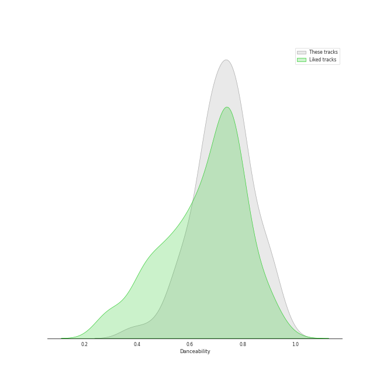
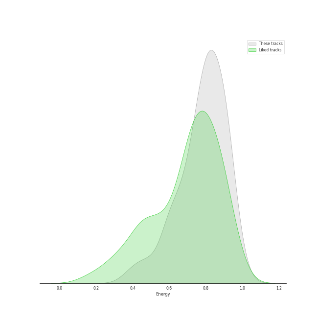
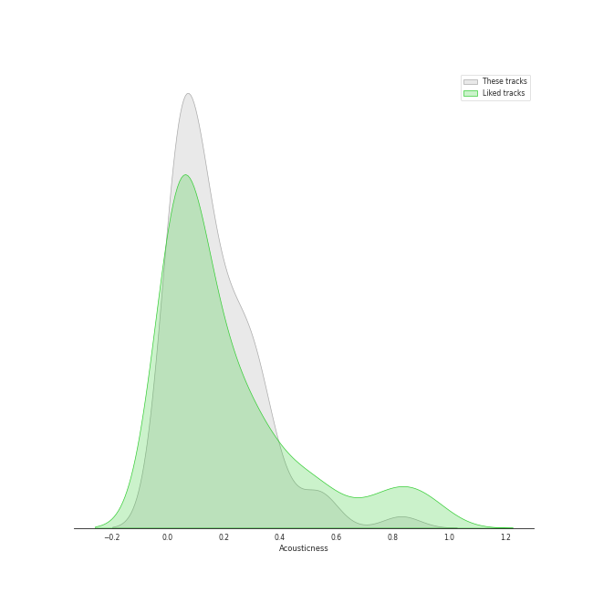
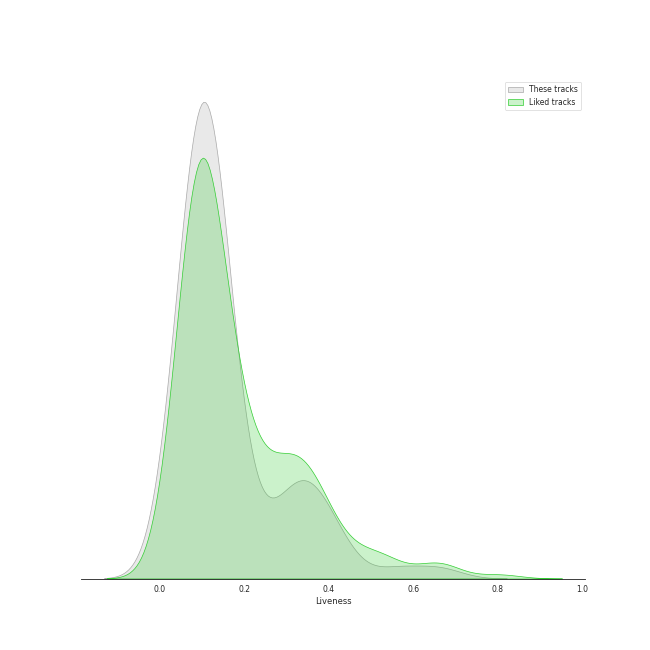
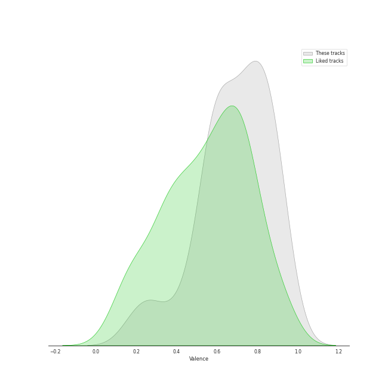
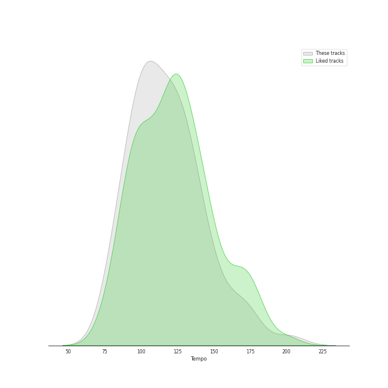

# Track Features for 5th gen k-pop

## Danceability

| ​ | 10 most Danceable tracks | ​​ | 10 least Danceable tracks |
|:---|:---|:---|:---|
|  | On Clap (0.949) |  | Done (0.378) |
|  | Sensitive (0.918) |  | Curious (0.458) |
|  | Red Rover (0.909) |  | Plastic Candy (0.534) |
|  | BATTER UP (0.903) |  | In Bloom (0.551) |
|  | Get A Guitar (0.9) |  | RING X RING (0.565) |
|  | GingaMingaYo (the strange world) (0.888) |  | Virtual Angel (0.568) |
|  | Selfish (0.88) |  | lionheart (the real me) (0.576) |
|  | LIKE THAT (0.871) |  | Bad News (0.581) |
|  | Boomerang (0.865) |  | the eleventh day (0.606) |
|  | Rooftop (0.852) |  | Giant (0.614) |

## Energy

| ​ | 10 most Energetic tracks | ​​ | 10 least Energetic tracks |
|:---|:---|:---|:---|
|  | RING X RING (0.987) |  | OLeander (0.382) |
|  | RING ma Bell (what a wonderful world) (0.947) |  | perfect blues (0.432) |
|  | Curious (0.946) |  | Done (0.471) |
|  | Gentleman (0.941) |  | LIKE THAT (0.5) |
|  | TIC TAC (0.937) |  | Underwater (0.566) |
|  | Virtual Angel (0.931) |  | Talk Saxy (0.585) |
|  | Mcguffins ~ who’s the Joker? (0.929) |  | My World (0.592) |
|  | Rooftop (0.922) |  | Red Rover (0.598) |
|  | Touch (0.904) |  | Love Me A Little (0.609) |
|  | TROUBLE (0.903) |  | enchanted night ~ white night (0.621) |

## Speechiness

| ​ | 10 most Speechy tracks | ​​ | 10 least Speechy tracks |
|:---|:---|:---|:---|
|  | Countdown (BELLE Solo) (0.417) |  | AGASSY (0.032) |
|  | Curious (0.306) |  | Midnight Fiction (0.0344) |
|  | Bad News (0.233) |  | Sugarcoat (NATTY Solo) (0.0362) |
|  | On Clap (0.194) |  | snowy night (0.0367) |
|  | Kitty Cat (JULIE Solo) (0.192) |  | Perfume (0.0377) |
|  | Real world (0.188) |  | Bonnie & Clyde (0.038) |
|  | Rooftop (0.179) |  | Talk Saxy (0.0385) |
|  | Selfish (0.178) |  | Touch (0.0442) |
|  | flipp!ng a coin (0.176) |  | MEOW (0.0446) |
|  | SHEESH (0.169) |  | overlap (1/1) (0.0453) |

## Acousticness

| ​ | 10 most Acoustic tracks | ​​ | 10 least Acoustic tracks |
|:---|:---|:---|:---|
|  | OLeander (0.831) |  | Siren (0.00103) |
|  | Touch (0.549) |  | Impossible (0.00528) |
|  | Underwater (0.535) |  | lionheart (the real me) (0.00543) |
|  | perfect blues (0.533) |  | MEOW (0.0084) |
|  | Selfish (0.403) |  | On Clap (0.019) |
|  | Sticky (0.391) |  | Boom Boom Bass (0.0194) |
|  | Virtual Angel (0.353) |  | TROUBLE (0.0194) |
|  | Done (0.342) |  | RING ma Bell (what a wonderful world) (0.026) |
|  | LIKE THAT (0.32) |  | flipp!ng a coin (0.0297) |
|  | Rooftop (0.314) |  | My 808 (0.0322) |

## Instrumentalness

| ​ | 10 most Instrumental tracks | ​​ | 10 least Instrumental tracks |
|:---|:---|:---|:---|
|  | GingaMingaYo (the strange world) (0.00955) |  | Sugarcoat (NATTY Solo) (0.0) |
|  | AGASSY (0.000243) |  | Curious (0.0) |
|  | flipp!ng a coin (0.000111) |  | Perfume (0.0) |
|  | Done (7.57e-05) |  | enchanted night ~ white night (0.0) |
|  | Plastic Candy (4.35e-05) |  | Midas Touch (0.0) |
|  | Bon voyage (3.84e-05) |  | Magnetic (0.0) |
|  | Gentleman (3.27e-05) |  | Virtual Angel (0.0) |
|  | My 808 (3.24e-05) |  | SHEESH (0.0) |
|  | BATTER UP (1.12e-05) |  | lionheart (the real me) (0.0) |
|  | TIC TAC (1.06e-05) |  | Bonnie & Clyde (0.0) |

## Liveness

| ​ | 10 most Live tracks | ​​ | 10 least Live tracks |
|:---|:---|:---|:---|
|  | lionheart (the real me) (0.661) |  | Red Rover (0.0282) |
|  | Rooftop (0.561) |  | Mcguffins ~ who’s the Joker? (0.0354) |
|  | Selfish (0.426) |  | Scent of you (0.0374) |
|  | RING X RING (0.418) |  | SHEESH (0.0473) |
|  | MEOW (0.391) |  | Movie Star (0.0598) |
|  | Countdown (BELLE Solo) (0.376) |  | Shhh (0.0622) |
|  | GingaMingaYo (the strange world) (0.357) |  | Boomerang (0.0627) |
|  | the eleventh day (0.349) |  | Sensitive (0.0649) |
|  | Real world (0.328) |  | LIKE THAT (0.0672) |
|  | Virtual Angel (0.319) |  | Kitty Cat (JULIE Solo) (0.0685) |

## Valence

| ​ | 10 most Happy tracks | ​​ | 10 least Happy tracks |
|:---|:---|:---|:---|
|  | Selfish (0.955) |  | Underwater (0.188) |
|  | Gentleman (0.939) |  | OLeander (0.189) |
|  | Nobody Knows (0.927) |  | Bon voyage (0.273) |
|  | Red Rover (0.895) |  | CRUSH (0.274) |
|  | Get A Guitar (0.895) |  | Done (0.283) |
|  | Virtual Angel (0.894) |  | In Bloom (0.383) |
|  | Bad News (0.879) |  | Te Quiero (0.44) |
|  | BATTER UP (0.873) |  | perfect blues (0.454) |
|  | Jelly Pop (0.871) |  | SHEESH (0.461) |
|  | overlap (1/1) (0.861) |  | lionheart (the real me) (0.545) |

## Tempo

| ​ | 10 most Fast tracks | ​​ | 10 least Fast tracks |
|:---|:---|:---|:---|
|  | Real world (175.059) |  | Plastic Candy (79.231) |
|  | RING X RING (171.968) |  | Countdown (BELLE Solo) (79.983) |
|  | the eleventh day (170.123) |  | In Bloom (82.034) |
|  | Touch (167.033) |  | Kitty Cat (JULIE Solo) (82.577) |
|  | Gentleman (155.104) |  | Virtual Angel (82.937) |
|  | CRUSH (153.941) |  | Bad News (83.687) |
|  | Giant (148.035) |  | Talk Saxy (89.007) |
|  | Done (146.783) |  | TIC TAC (89.043) |
|  | Mcguffins ~ who’s the Joker? (145.942) |  | Love Me A Little (90.04) |
|  | SHEESH (140.041) |  | Nobody Knows (90.055) |
