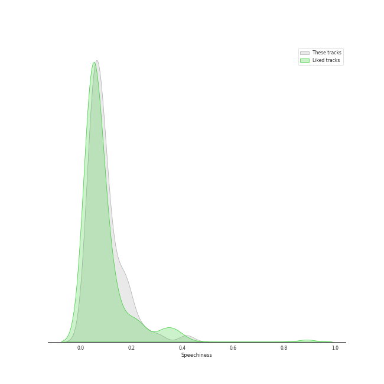
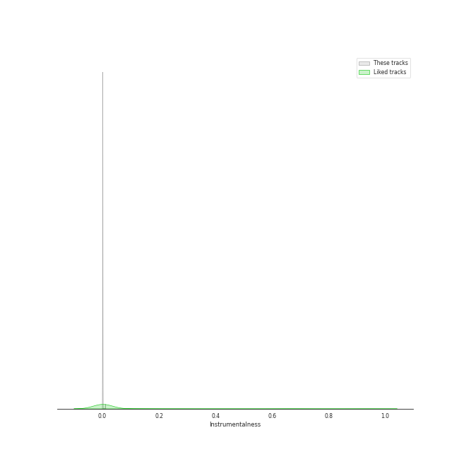

# Track Features for 5th gen k-pop

## Danceability

| ​ | 10 most Danceable tracks | ​​ | 10 least Danceable tracks |
|:---|:---|:---|:---|
|  | Sensitive (0.918) |  | Plastic Candy (0.534) |
|  | BATTER UP (0.903) |  | In Bloom (0.551) |
|  | Get A Guitar (0.9) |  | Bad News (0.581) |
|  | Selfish (0.88) |  | Nothing (0.615) |
|  | Boomerang (0.865) |  | Nobody Knows (0.655) |
|  | Rooftop (0.852) |  | CRUSH (0.662) |
|  | Siren (0.802) |  | Gentleman (0.662) |
|  | perfect blues (0.802) |  | Sugarcoat (NATTY Solo) (0.663) |
|  | Magnetic (0.797) |  | My 808 (0.667) |
|  | Shhh (0.796) |  | Midnight Fiction (0.687) |

## Energy

| ​ | 10 most Energetic tracks | ​​ | 10 least Energetic tracks |
|:---|:---|:---|:---|
|  | Gentleman (0.941) |  | OLeander (0.382) |
|  | TIC TAC (0.937) |  | perfect blues (0.432) |
|  | Rooftop (0.922) |  | Underwater (0.566) |
|  | TROUBLE (0.903) |  | Talk Saxy (0.585) |
|  | Selfish (0.903) |  | My World (0.592) |
|  | Midas Touch (0.9) |  | Love Me A Little (0.609) |
|  | Movie Star (0.894) |  | Get A Guitar (0.621) |
|  | SWEAT (0.894) |  | Nobody Knows (0.646) |
|  | Bon voyage (0.889) |  | Magnetic (0.668) |
|  | In Bloom (0.886) |  | BATTER UP (0.685) |

## Speechiness

| ​ | 10 most Speechy tracks | ​​ | 10 least Speechy tracks |
|:---|:---|:---|:---|
|  | Countdown (BELLE Solo) (0.417) |  | AGASSY (0.032) |
|  | Bad News (0.233) |  | Midnight Fiction (0.0344) |
|  | Kitty Cat (JULIE Solo) (0.192) |  | Sugarcoat (NATTY Solo) (0.0362) |
|  | Real world (0.188) |  | Perfume (0.0377) |
|  | Rooftop (0.179) |  | Talk Saxy (0.0385) |
|  | Selfish (0.178) |  | perfect blues (0.0485) |
|  | SHEESH (0.169) |  | Boomerang (0.0496) |
|  | Underwater (0.165) |  | Scent of you (0.05) |
|  | My World (0.155) |  | OLeander (0.0507) |
|  | Movie Star (0.135) |  | Bon voyage (0.0509) |

## Acousticness

| ​ | 10 most Acoustic tracks | ​​ | 10 least Acoustic tracks |
|:---|:---|:---|:---|
|  | OLeander (0.831) |  | Siren (0.00103) |
|  | Underwater (0.535) |  | Impossible (0.00528) |
|  | perfect blues (0.533) |  | TROUBLE (0.0194) |
|  | Selfish (0.403) |  | My 808 (0.0322) |
|  | Rooftop (0.314) |  | Sugarcoat (NATTY Solo) (0.0339) |
|  | Bon voyage (0.307) |  | UhUh (0.0379) |
|  | Nobody Knows (0.278) |  | Boomerang (0.0408) |
|  | Magnetic (0.257) |  | TIC TAC (0.0477) |
|  | Bad News (0.249) |  | Midas Touch (0.0513) |
|  | Countdown (BELLE Solo) (0.249) |  | Kitty Cat (JULIE Solo) (0.0545) |

## Instrumentalness

| ​ | 10 most Instrumental tracks | ​​ | 10 least Instrumental tracks |
|:---|:---|:---|:---|
|  | AGASSY (0.000243) |  | Sugarcoat (NATTY Solo) (0.0) |
|  | Plastic Candy (4.35e-05) |  | Perfume (0.0) |
|  | Bon voyage (3.84e-05) |  | Midas Touch (0.0) |
|  | Gentleman (3.27e-05) |  | Magnetic (0.0) |
|  | My 808 (3.24e-05) |  | SHEESH (0.0) |
|  | BATTER UP (1.12e-05) |  | My World (0.0) |
|  | TIC TAC (1.06e-05) |  | Talk Saxy (0.0) |
|  | Sensitive (9.62e-06) |  | Real world (0.0) |
|  | Get A Guitar (9.44e-06) |  | CRUSH (0.0) |
|  | Siren (7.63e-06) |  | Rooftop (0.0) |

## Liveness

| ​ | 10 most Live tracks | ​​ | 10 least Live tracks |
|:---|:---|:---|:---|
|  | Rooftop (0.561) |  | Scent of you (0.0374) |
|  | Selfish (0.426) |  | SWEAT (0.0431) |
|  | Countdown (BELLE Solo) (0.376) |  | SHEESH (0.0473) |
|  | Real world (0.328) |  | Movie Star (0.0598) |
|  | Jelly Pop (0.318) |  | Shhh (0.0622) |
|  | My World (0.289) |  | Boomerang (0.0627) |
|  | Midnight Fiction (0.231) |  | Sensitive (0.0649) |
|  | Bad News (0.171) |  | Kitty Cat (JULIE Solo) (0.0685) |
|  | TIC TAC (0.17) |  | My 808 (0.0724) |
|  | Nobody Knows (0.156) |  | Impossible (0.0739) |

## Valence

| ​ | 10 most Happy tracks | ​​ | 10 least Happy tracks |
|:---|:---|:---|:---|
|  | Selfish (0.955) |  | Underwater (0.188) |
|  | Gentleman (0.939) |  | OLeander (0.189) |
|  | Nobody Knows (0.927) |  | Bon voyage (0.273) |
|  | Get A Guitar (0.895) |  | CRUSH (0.274) |
|  | Bad News (0.879) |  | In Bloom (0.383) |
|  | BATTER UP (0.873) |  | perfect blues (0.454) |
|  | Jelly Pop (0.871) |  | SHEESH (0.461) |
|  | Sensitive (0.86) |  | Real world (0.551) |
|  | Midas Touch (0.854) |  | Rooftop (0.555) |
|  | Shhh (0.829) |  | Boomerang (0.559) |

## Tempo

| ​ | 10 most Fast tracks | ​​ | 10 least Fast tracks |
|:---|:---|:---|:---|
|  | Real world (175.059) |  | Plastic Candy (79.231) |
|  | Gentleman (155.104) |  | Countdown (BELLE Solo) (79.983) |
|  | CRUSH (153.941) |  | In Bloom (82.034) |
|  | SHEESH (140.041) |  | Kitty Cat (JULIE Solo) (82.577) |
|  | TROUBLE (134.963) |  | Bad News (83.687) |
|  | Magnetic (131.067) |  | Nothing (83.953) |
|  | OLeander (130.087) |  | Talk Saxy (89.007) |
|  | BATTER UP (130.01) |  | TIC TAC (89.043) |
|  | Midnight Fiction (129.942) |  | Love Me A Little (90.04) |
|  | Impossible (127.992) |  | Nobody Knows (90.055) |
