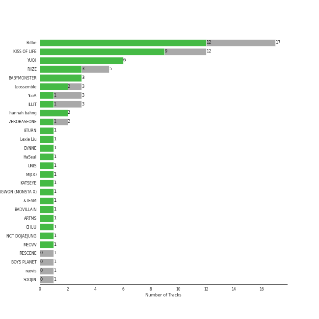
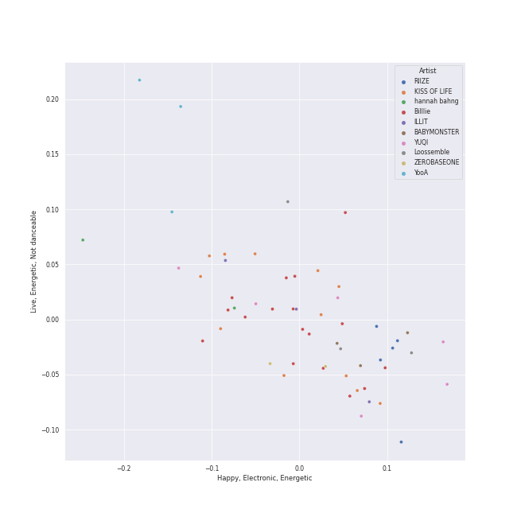
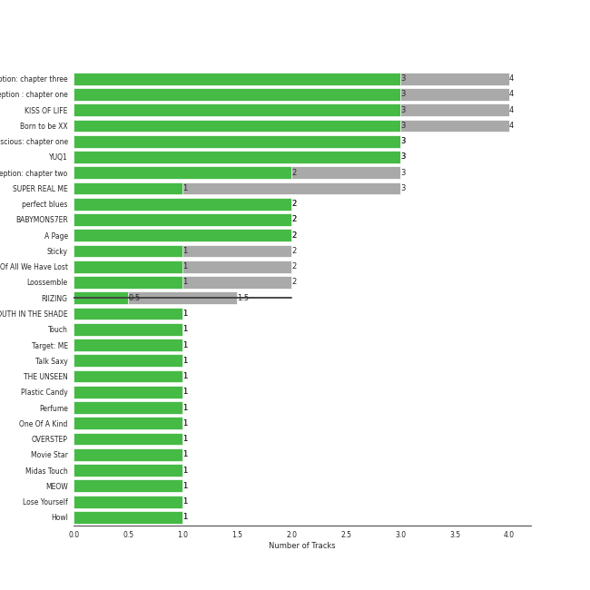
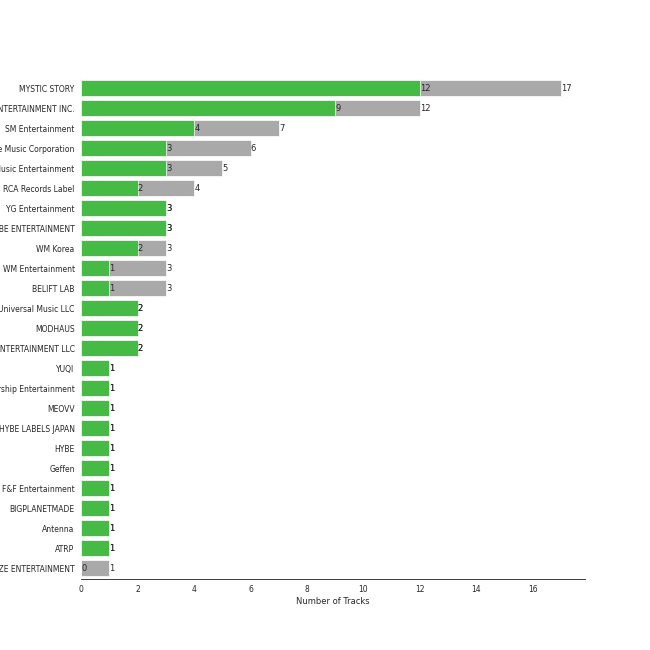
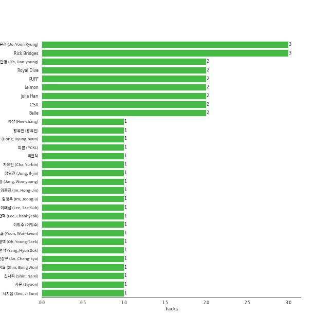
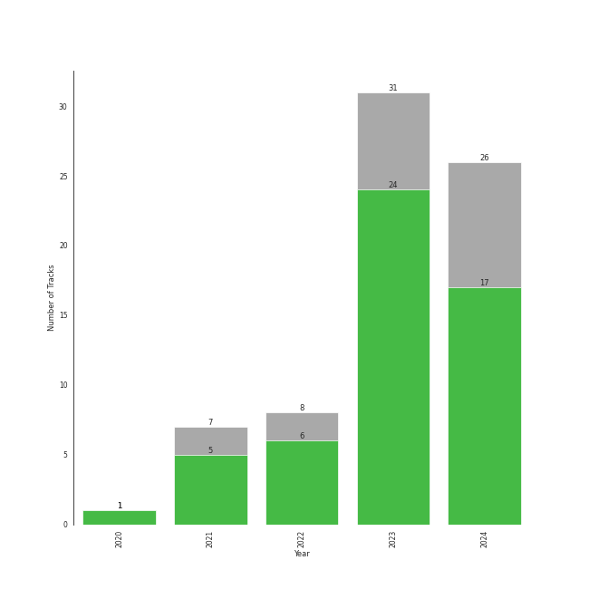

# 5th gen k-pop

44 songs

[See Track Features](audio_features.md)

[See Clusters](clusters/overview.md)

## Top Artists

| Art | Tracks | 💚 | Artist | 🔗 |
|:---|---:|---:|:---|:---|
|  | 9 | 7 | [KISS OF LIFE](../../artists/kiss_of_life/overview.md) | [🔗](https://open.spotify.com/artist/4TEK9tIkcoxib4GxT3O4ky) |
|  | 5 | 4 | RIIZE | [🔗](https://open.spotify.com/artist/2jOm3cYujQx6o1dxuiuqaX) |
|  | 3 | 3 | BABYMONSTER | [🔗](https://open.spotify.com/artist/1SIocsqdEefUTE6XKGUiVS) |
|  | 3 | 2 | Loossemble | [🔗](https://open.spotify.com/artist/1kbVoxpFh1eDOXumLmVdKY) |
|  | 2 | 2 | hannah bahng | [🔗](https://open.spotify.com/artist/2oTW5kYNj4eIgp68Z5W4D9) |
|  | 3 | 1 | ZEROBASEONE | [🔗](https://open.spotify.com/artist/7cjg7EkeZy3OI5o9Qthc6n) |
|  | 3 | 1 | YooA | [🔗](https://open.spotify.com/artist/4ur1jCwyNlhgd0viJkOtcQ) |
|  | 3 | 1 | ILLIT | [🔗](https://open.spotify.com/artist/36cgvBn0aadzOijnjjwqMN) |
|  | 1 | 1 | 8TURN | [🔗](https://open.spotify.com/artist/7tCg9aiVKZ5Cmhbfb7UoqM) |
|  | 1 | 1 | EVNNE | [🔗](https://open.spotify.com/artist/6SYJFHPxXkr4SZJR8aLEml) |

See all 21 artists

| Art | Tracks | 💚 | Artist | 🔗 |
|:---|---:|---:|:---|:---|
|  | 1 | 1 | HaSeul | [🔗](https://open.spotify.com/artist/5clV5I50OxxG9JGGxeW0C9) |
|  | 1 | 1 | MIJOO | [🔗](https://open.spotify.com/artist/3kDLzk5AtS3cQaVXkISAzO) |
|  | 1 | 1 | SHOWNU X HYUNGWON (MONSTA X) | [🔗](https://open.spotify.com/artist/3AFqxSVdKDJD9qPx3K8tKg) |
|  | 1 | 1 | &TEAM | [🔗](https://open.spotify.com/artist/2xfxRiKxoHl5tI0MKyvqV7) |
|  | 1 | 1 | BADVILLAIN | [🔗](https://open.spotify.com/artist/2Y7fY3aflbCTxp6h5hw0CV) |
|  | 1 | 1 | ARTMS | [🔗](https://open.spotify.com/artist/213zHiFZwtDVEqyxeCbk07) |
|  | 1 | 1 | CHUU | [🔗](https://open.spotify.com/artist/1q86WVZhETqii5kKjEwYuB) |
|  | 1 | 1 | NCT DOJAEJUNG | [🔗](https://open.spotify.com/artist/0W0w607z3JEA1vXLz9FVGw) |
|  | 1 | 0 | RESCENE | [🔗](https://open.spotify.com/artist/5deOsjuFTKrNMJW3rKuL8S) |
|  | 1 | 0 | BOYS PLANET | [🔗](https://open.spotify.com/artist/49pGKUCSjzaCfv8gdTWG98) |
|  | 1 | 0 | SOOJIN | [🔗](https://open.spotify.com/artist/0kB3Vlf3xDNZQz6NjAPJV8) |

## Most and least listened tracks
| ​ | Most listened tracks | Rank | ​​ | Least listened tracks | Rank |
|:---|:---|---:|:---|:---|---:|
|  | [Nobody Knows](../../artists/kiss_of_life/overview.md) | 84 |  | LIKE THAT | 861 |
|  | Get A Guitar | 126 |  | UhUh | 861 |
|  | SHEESH | 128 |  | [Shhh](../../artists/kiss_of_life/overview.md) | 861 |
|  | Scent of you | 141 |  | Jelly Pop | 861 |
|  | Sensitive | 164 |  | [Kitty Cat (JULIE Solo)](../../artists/kiss_of_life/overview.md) | 861 |
|  | [Midas Touch](../../artists/kiss_of_life/overview.md) | 187 |  | TROUBLE | 861 |
|  | BATTER UP | 189 |  | Love Me A Little | 861 |
|  | Perfume | 230 |  | TIC TAC | 861 |
|  | SWEAT | 291 |  | Boomerang | 861 |
|  | My World | 294 |  | [Gentleman](../../artists/kiss_of_life/overview.md) | 861 |

## Top Albums

| Art | Tracks | 💚 | Album | Release Date | 🔗 |
|:---|---:|---:|:---|:---|:---|
|  | 4 | 3 | KISS OF LIFE | 2023-07-05 | [🔗](https://open.spotify.com/album/5k34rAvlw3WV7Kh6dAZnxG) |
|  | 4 | 3 | Born to be XX | 2023-11-08 | [🔗](https://open.spotify.com/album/6yDtQxvq1XRC7Y5qtS03Xx) |
|  | 3 | 1 | SUPER REAL ME | 2024-03-25 | [🔗](https://open.spotify.com/album/6irebIc6UO8fN0jl4UlzBS) |
|  | 2 | 2 | perfect blues | 2023-07-14 | [🔗](https://open.spotify.com/album/09JlCYQ9z7cCoFoBQMqUN7) |
|  | 2 | 2 | BABYMONS7ER | 2024-04-01 | [🔗](https://open.spotify.com/album/0eSbsl3j8jz96LC2NCLPc4) |
|  | 2 | 1 | RIIZING | 2024-04-28 | [🔗](https://open.spotify.com/album/4DdDtcluroMFPVLWFKykqk) |
|  | 2 | 1 | Loossemble | 2023-09-15 | [🔗](https://open.spotify.com/album/51TyZNm7E9EF1gSJGLGsxh) |
|  | 1 | 1 | YOUTH IN THE SHADE | 2023-07-10 | [🔗](https://open.spotify.com/album/7fV7RChHagCcKRnAaDRXuX) |
|  | 1 | 1 | Target: ME | 2023-09-19 | [🔗](https://open.spotify.com/album/3zgfK7IBAPDcroAqxzzMOy) |
|  | 1 | 1 | Talk Saxy | 2023-10-27 | [🔗](https://open.spotify.com/album/0XDt5xgg2nI1Gqmf6isfm0) |

See all 32 albums

| Art | Tracks | 💚 | Album | Release Date | 🔗 |
|:---|---:|---:|:---|:---|:---|
|  | 1 | 1 | THE UNSEEN | 2023-07-25 | [🔗](https://open.spotify.com/album/4gV0rLK0np1Nyde3N38RBh) |
|  | 1 | 1 | RIIZING - The 1st Mini Album | 2024-06-17 | [🔗](https://open.spotify.com/album/23TA2tnqYnphv1MKkiS6x2) |
|  | 1 | 1 | Plastic Candy | 2023-10-26 | [🔗](https://open.spotify.com/album/2mwOcK4A3O3x9fxpjyFGxW) |
|  | 1 | 1 | Perfume - The 1st Mini Album | 2023-04-17 | [🔗](https://open.spotify.com/album/3sVBVr420an61GAwib9AYk) |
|  | 1 | 1 | One Of A Kind | 2024-04-15 | [🔗](https://open.spotify.com/album/2sN27KkVSnHvqi0MA2YxcZ) |
|  | 1 | 1 | OVERSTEP | 2024-06-03 | [🔗](https://open.spotify.com/album/15rdrWfjFtnMnzdZIemvoQ) |
|  | 1 | 1 | Movie Star | 2023-05-17 | [🔗](https://open.spotify.com/album/5JaoZz8TeXaVHXamr7H2GB) |
|  | 1 | 1 | Midas Touch | 2024-04-03 | [🔗](https://open.spotify.com/album/1HfTA0xDoZ0mswFO3GB3ef) |
|  | 1 | 1 | Howl | 2023-10-18 | [🔗](https://open.spotify.com/album/4Dmzff19nSvZgWpgExga4d) |
|  | 1 | 1 | Get A Guitar | 2023-09-04 | [🔗](https://open.spotify.com/album/3E5VbhGdSMotB0oQ3LwT9k) |
|  | 1 | 1 | First Howling : ME | 2022-12-06 | [🔗](https://open.spotify.com/album/3jqV1FFra3A2179rdtiNdo) |
|  | 1 | 1 | Bon Voyage | 2020-09-07 | [🔗](https://open.spotify.com/album/2dFsfVOAwvmRV8hOBdssiI) |
|  | 1 | 1 | BATTER UP | 2023-11-27 | [🔗](https://open.spotify.com/album/2CSQuvvt3XHLDX36O3nRv7) |
|  | 1 | 1 | <Dall> | 2024-05-31 | [🔗](https://open.spotify.com/album/0hJloArA2Kb9xNBIv34osS) |
|  | 1 | 1 | 8TURNRISE | 2023-01-30 | [🔗](https://open.spotify.com/album/6fvrG4RkX06QBmmc9gA1OQ) |
|  | 1 | 0 | SWEAT | 2024-04-24 | [🔗](https://open.spotify.com/album/0s6DjhEFFZOUSfnFmPMVIG) |
|  | 1 | 0 | SELFISH | 2022-11-14 | [🔗](https://open.spotify.com/album/3vjPlBK3ASSMLfQwuiHspd) |
|  | 1 | 0 | Re:Scene | 2024-03-26 | [🔗](https://open.spotify.com/album/1C78MdRvc88435lTnGxGUF) |
|  | 1 | 0 | MELTING POINT | 2023-11-06 | [🔗](https://open.spotify.com/album/5XHHcWUt6zy1nkbzt707ys) |
|  | 1 | 0 | Borderline | 2024-03-14 | [🔗](https://open.spotify.com/album/3oKhPahFFjuFVbZfWprIkB) |
|  | 1 | 0 | BOYS PLANET - FINAL TOP9 BATTLE | 2023-04-21 | [🔗](https://open.spotify.com/album/5F3uLyGvCV3QINuGZkdOfS) |
|  | 1 | 0 | AGASSY | 2023-11-08 | [🔗](https://open.spotify.com/album/5FzkGrCoC8PIz1yz6oy8RK) |

## Top Record Labels

| Tracks | 💚 | Label |
|---:|---:|:---|
| 9 | 7 | [S2 ENTERTAINMENT INC.](../../labels/s2_entertainment_inc_/overview.md) |
| 6 | 5 | [SM Entertainment](../../labels/sm_entertainment/overview.md) |
| 7 | 3 | [Genie Music Corporation](../../labels/genie_music_corporation/overview.md) |
| 6 | 3 | [Stone Music Entertainment](../../labels/stone_music_entertainment/overview.md) |
| 4 | 3 | [RCA Records Label](../../labels/rca_records_label/overview.md) |
| 3 | 3 | [YG Entertainment](../../labels/yg_entertainment/overview.md) |
| 3 | 2 | [WM Korea](../../labels/wm_korea/overview.md) |
| 2 | 2 | MODHAUS |
| 2 | 2 | BAHNG ENTERTAINMENT LLC |
| 3 | 1 | [WM Entertainment](../../labels/wm_entertainment/overview.md) |

See all 17 labels

| Tracks | 💚 | Label |
|---:|---:|:---|
| 3 | 1 | [BELIFT LAB](../../labels/belift_lab/overview.md) |
| 1 | 1 | [Starship Entertainment](../../labels/starship_entertainment/overview.md) |
| 1 | 1 | HYBE LABELS JAPAN |
| 1 | 1 | BIGPLANETMADE |
| 1 | 1 | Antenna |
| 1 | 1 | ATRP CO. |
| 1 | 0 | THE MUZE ENTERTAINMENT |

## Top Producers

| Art | Producer | Tracks | Credit Types |
|:---|:---|---:|:---|
| | Rick Bridges | 3 | Lyricist, Songwriter |
| | [조윤경 (Jo, Yoon Kyung)](../../producers/조윤경_(jo,_yoon_kyung)/overview.md) | 3 | Lyricist |
| | PUFF | 2 | Arranger, Songwriter |
| | Julie Han | 2 | Lyricist |
| | Belle | 2 | Lyricist, Songwriter |
| | Sungwoo Kim | 1 | Lyricist |
| | Daniel Davidsen | 1 | Songwriter |
| | Thomas Troelsen | 1 | Arranger, Songwriter |
| | Yuth | 1 | Arranger, Songwriter |
| | 김지현 (Kim, Ji Hyun) | 1 | Producer |

View all

| Art | Producer | Tracks | Credit Types |
|:---|:---|---:|:---|
| | Chaz Mishan | 1 | Arranger, Songwriter |
| | 방혜현 (Bang, Hye Hyun) | 1 | Lyricist |
| | AFSHEEN | 1 | Arranger, Songwriter |
| | Choi HEART | 1 | Lyricist |
| | Ben Samama | 1 | Songwriter |
| | Gabe Saporta | 1 | Songwriter |
| | Jared Lee | 1 | Lyricist, Songwriter |
| | PhD | 1 | Arranger |
| | [이태섭 (Lee, Tae-Sub)](../../producers/이태섭_(lee,_tae-sub)/overview.md) | 1 | Producer |
| | ZENUR | 1 | Arranger, Songwriter |
| | 이찬혁 (Lee, Chanhyeok) | 1 | Lyricist |
| | THE HUB 88 | 1 | Songwriter |
| | 권덕근 (Kwon, Duk-geun) | 1 | Arranger, Songwriter |
| | Peter Wallevik | 1 | Songwriter |
| | Adam von Mentzer | 1 | Songwriter |
| | 최현석 | 1 | Lyricist |
| | 희창 (Hee-chang) | 1 | Arranger, Songwriter |
| | BADD | 1 | Arranger |
| | Jang Yi-jeong | 1 | Arranger, Songwriter |
| | ddodde | 1 | Arranger, Songwriter |
| | PAPRIKAA | 1 | Arranger, Songwriter |
| | Jaden Jeong | 1 | Lyricist |
| | BIGTONE | 1 | Lyricist |
| | アサ (Asa) | 1 | Lyricist, Songwriter |
| | 피클 (PCKL) | 1 | Lyricist, Songwriter |
| | WHERE THE NOISE | 1 | Lyricist |
| | 신나리 (Shin, Na Ri) | 1 | Lyricist |
| | 안창규 (An, Chang-kyu) | 1 | Producer |
| | Royal Dive | 1 | Arranger, Songwriter |
| | 황유빈 (황유빈) | 1 | Lyricist |
| | [서지음 (Seo, Ji Eum)](../../producers/서지음_(seo,_ji_eum)/overview.md) | 1 | Lyricist |
| | 차유빈 (Cha, Yu-bin) | 1 | Lyricist |
| | Clovd | 1 | Arranger, Songwriter |
| | 목지민 (Mok, Ji-min) | 1 | Lyricist |
| | 장우영 (Jang, Woo-young) | 1 | Producer |
| | 양현석 (Yang, Hyun Suk) | 1 | Arranger, Lyricist, Songwriter |
| | 김종수 (Kim, Jong-soo) | 1 | Songwriter |
| | Maria Marcus | 1 | Songwriter |
| | Andrew Choi | 1 | Songwriter |
| | Dr.JO | 1 | Lyricist |
| | Lindy Robbins | 1 | Songwriter |
| | 강선영 (강선영) | 1 | Producer |
| | 박남준 (Park, Nam-jun) | 1 | Producer |
| | MNEK | 1 | Songwriter |
| | 강은정 (Gang, Eun-jeong) | 1 | Lyricist |
| | 민성환 (Min, Seong-whan) | 1 | Producer |
| | sweetch | 1 | Arranger, Songwriter |
| | Nano | 1 | Arranger, Songwriter |
| | Josephina Carr | 1 | Songwriter |
| | Chloe Martini | 1 | Arranger, Songwriter |
| | Dee.P | 1 | Arranger, Songwriter |
| | David Arkwright | 1 | Songwriter |
| | Arte | 1 | Arranger, Songwriter |
| | 임홍진 (Im, Hong-Jin) | 1 | Producer |
| | [Ryan S. Jhun](../../producers/ryan_s__jhun/overview.md) | 1 | Arranger, Songwriter |
| | Shari Short | 1 | Songwriter |
| | hongsamman | 1 | Arranger, Songwriter |
| | Natty | 1 | Songwriter |
|  | ADORA | 1 | Songwriter |
| | 권유진 (Kwon, Eu-gene) | 1 | Producer |
| | Josh Cumbee | 1 | Arranger, Songwriter |
| | GEMma | 1 | Lyricist |
| | C'SA | 1 | Songwriter |
| | SongK | 1 | Arranger |
| | Noerio | 1 | Songwriter |
| | Jacob Aaron | 1 | Songwriter |
| | 임정우 (Im, Jeong-u) | 1 | Songwriter |
| | 김보성 (Kim, Bo-Seong) | 1 | Producer |
| | Shy Carter | 1 | Songwriter |
| | 신봉원 (Shin, Bong Won) | 1 | Producer |
| | Strawberrybananaclub | 1 | Arranger, Lyricist, Songwriter |

## Years

| ​ | 10 newest albums | ​​ | 10 oldest albums |
|:---|:---|:---|:---|
|  | RIIZING - The 1st Mini Album (2024-06-17) |  | Bon Voyage (2020-09-07) |
|  | OVERSTEP (2024-06-03) |  | SELFISH (2022-11-14) |
|  | <Dall> (2024-05-31) |  | First Howling : ME (2022-12-06) |
|  | RIIZING (2024-04-28) |  | 8TURNRISE (2023-01-30) |
|  | SWEAT (2024-04-24) |  | Perfume - The 1st Mini Album (2023-04-17) |
|  | One Of A Kind (2024-04-15) |  | BOYS PLANET - FINAL TOP9 BATTLE (2023-04-21) |
|  | Midas Touch (2024-04-03) |  | Movie Star (2023-05-17) |
|  | BABYMONS7ER (2024-04-01) |  | KISS OF LIFE (2023-07-05) |
|  | Re:Scene (2024-03-26) |  | YOUTH IN THE SHADE (2023-07-10) |
|  | SUPER REAL ME (2024-03-25) |  | perfect blues (2023-07-14) |

