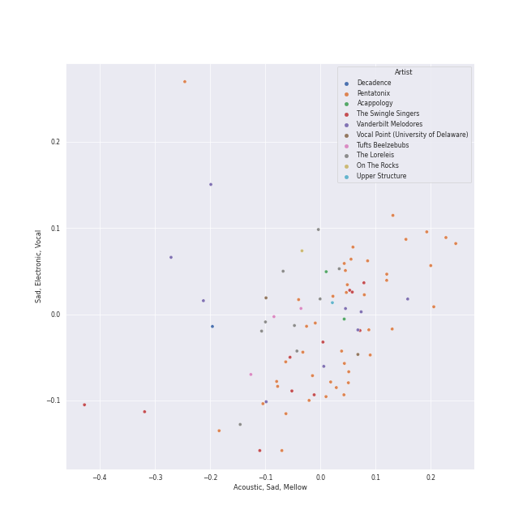
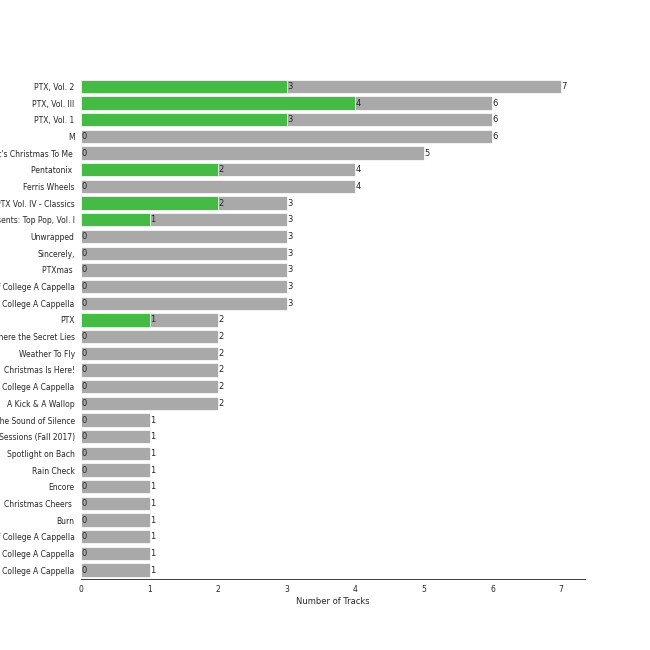
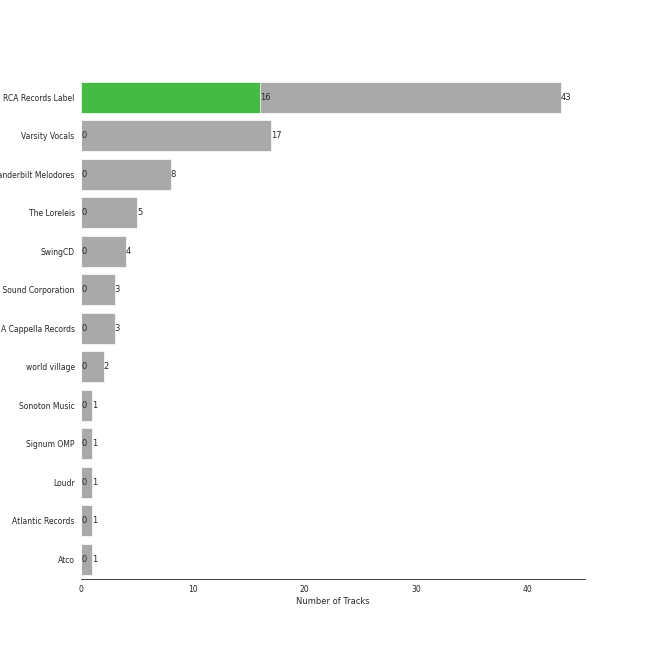

# a cappella

[196 songs](a_cappella_tracks.md)

## Top Artists

See all 58 artists

| Number of Tracks | Art | Artist | 🔗 |
|---:|:---|:---|:---|
| 36 |  | [Pentatonix](../artists/pentatonix.md) | [🔗](https://open.spotify.com/artist/26AHtbjWKiwYzsoGoUZq53) |
| 20 |  | [Tar Heel Voices](../artists/tar_heel_voices.md) | [🔗](https://open.spotify.com/artist/1apO6pJsV1nwuF2K8sEsDo) |
| 16 |  | [Ithacappella](../artists/ithacappella.md) | [🔗](https://open.spotify.com/artist/5bPTIGQvxRNjr6wl9yyAct) |
| 11 |  | [The Swingle Singers](../artists/the_swingle_singers.md) | [🔗](https://open.spotify.com/artist/1ZlFYysRdc6YaUH5FkxPl8) |
| 9 |  | Vanderbilt Melodores | [🔗](https://open.spotify.com/artist/7HkF8fT7TZlrQsjSgWUEXN) |
| 9 |  | The Loreleis | [🔗](https://open.spotify.com/artist/1fqMjreaczGwFmdmG6AvJs) |
| 9 |  | The Nor'easters | [🔗](https://open.spotify.com/artist/1aLfVgwt8eBrpvHcutWmqe) |
| 9 |  | UNC Achordants | [🔗](https://open.spotify.com/artist/1TzZMeOCs4TMYtzgohPMAr) |
| 7 |  | [The King's Singers](../artists/the_king_s_singers.md) | [🔗](https://open.spotify.com/artist/5lR7yDVN4z9kahOiUSlMhe) |
| 7 |  | SoCal VoCals | [🔗](https://open.spotify.com/artist/5L30XpwHG77eWCZtelTns9) |
| 6 |  | Pitch Slapped | [🔗](https://open.spotify.com/artist/7EH7jldX62OIsU1yU1SWE7) |
| 6 |  | Voices in Your Head | [🔗](https://open.spotify.com/artist/44v8JgDySt9tkgfV3AWxBJ) |
| 6 |  | Vocal Spectrum | [🔗](https://open.spotify.com/artist/20nWuvMfCct9xv73hRYO7O) |
| 5 |  | University of Rochester Midnight Ramblers | [🔗](https://open.spotify.com/artist/2Tv49uvEsNJXUpuFL7HuKu) |
| 4 |  | The Clef Hangers | [🔗](https://open.spotify.com/artist/5wUTXZIMX0mn6MzFA13qfO) |
| 3 |  | Tufts Beelzebubs | [🔗](https://open.spotify.com/artist/4VsNVAxuPxZrJMWE2Tprtq) |
| 2 |  | The Dartmouth Aires | [🔗](https://open.spotify.com/artist/71Cez1b1NqsxIn5u8XNiQD) |
| 2 |  | Deke Sharon | [🔗](https://open.spotify.com/artist/6eWNb9yuroBpPcQ4sOkL1e) |
| 2 |  | Don Gooding | [🔗](https://open.spotify.com/artist/66iv9KzffeiANddjYouG6U) |
| 2 |  | University of Rochester YellowJackets | [🔗](https://open.spotify.com/artist/5PdBpsZXvnEbbTe1589fMO) |
| 2 |  | The Pitchforks | [🔗](https://open.spotify.com/artist/5IPABE7EhPLvUVsgM3dlZ8) |
| 2 |  | University Of Delaware Vocal Point | [🔗](https://open.spotify.com/artist/4nrhXBXu7FnxWeSbB21bfk) |
| 2 |  | Lindsey Stirling | [🔗](https://open.spotify.com/artist/378dH6EszOLFShpRzAQkVM) |
| 2 |  | [Sara Bareilles](../artists/sara_bareilles.md) | [🔗](https://open.spotify.com/artist/2Sqr0DXoaYABbjBo9HaMkM) |
| 2 |  | Acappology | [🔗](https://open.spotify.com/artist/21v1APtcWJHRmeKdBRVbYs) |
| 2 |  | Tufts sQ! | [🔗](https://open.spotify.com/artist/21QIHECpmN2KwhpVhIWHpT) |
| 2 |  | The MIT Logarhythms | [🔗](https://open.spotify.com/artist/1jz5HCLwsDkpBYz80n9wbR) |
| 2 |  | Bill Hare | [🔗](https://open.spotify.com/artist/10WhKnqdsfpYWDgZhjrday) |
| 2 |  | The Virginia Sil'hooettes | [🔗](https://open.spotify.com/artist/0LKgClZwZKGhM5BkCzjfMX) |
| 1 |  | Awaken A Cappella | [🔗](https://open.spotify.com/artist/7zjm9GiXJPq0z3bKETWl1N) |
| 1 |  | Shams Ahmed | [🔗](https://open.spotify.com/artist/7rIkgg1ozqQIezA7c8Khf4) |
| 1 |  | Delia Darney | [🔗](https://open.spotify.com/artist/7ikvHdyyUnB92bHTgFcctU) |
| 1 |  | Off The Beat | [🔗](https://open.spotify.com/artist/7aCUqnLkFEQd2FPL6RK1tW) |
| 1 |  | UGA Noteworthy | [🔗](https://open.spotify.com/artist/6MyHz1OaVtj1w2y6JTu2u5) |
| 1 |  | Roxorloops & Blady Kris | [🔗](https://open.spotify.com/artist/6HRJOlHBoo07WcZdXZAADI) |
| 1 |  | BYU Vocal Point | [🔗](https://open.spotify.com/artist/5zhxxb24WP6q6rbLHAn2UQ) |
| 1 |  | The Harmonics | [🔗](https://open.spotify.com/artist/528Rcthd9JqtIrlbrGKNsG) |
| 1 |  | Kat Dunbar Linker | [🔗](https://open.spotify.com/artist/512QZ1TM6L4uXmWCVOKHtV) |
| 1 |  | Tink | [🔗](https://open.spotify.com/artist/4v6XOdonnfpdTKTRJArG7v) |
| 1 |  | Da Vinci's Notebook | [🔗](https://open.spotify.com/artist/4rIDY3ojaWd7Z9ky9SFc1g) |
| 1 |  | Varsity Vocals | [🔗](https://open.spotify.com/artist/4bQp9Lm7LgRMLtqEsH3Bqf) |
| 1 |  | Emily Shanny | [🔗](https://open.spotify.com/artist/3oWiUIUDPWJmvB8wElpaO5) |
| 1 |  | Gabe Hendifar | [🔗](https://open.spotify.com/artist/3YIBM4yvZHT4lRQa14eHQh) |
| 1 |  | Hullabahoos | [🔗](https://open.spotify.com/artist/3S1DEHnGNfWmamdZEyLs8I) |
| 1 |  | Eight Beat Measure | [🔗](https://open.spotify.com/artist/3My1YRLewqqDXME2OkBpdZ) |
| 1 |  | Elizabeth Wright | [🔗](https://open.spotify.com/artist/2tQ7EzEpu1KFpseMdHGSzL) |
| 1 |  | Penn Masala | [🔗](https://open.spotify.com/artist/2MhJb1ljKttJewuYZTpXxr) |
| 1 |  | Beejul Khatri | [🔗](https://open.spotify.com/artist/24SlCPf92d5VTzhI0ztENn) |
| 1 |  | Straight No Chaser | [🔗](https://open.spotify.com/artist/1yQ8S4xdGOGbUcpaPR6hCM) |
| 1 |  | Upper Structure | [🔗](https://open.spotify.com/artist/1tlKq97YGAGBavozMVeddE) |
| 1 |  | Tufts Jackson Jills | [🔗](https://open.spotify.com/artist/1dUJZ0lbobmanl4W14h0a2) |
| 1 |  | Academical Village People | [🔗](https://open.spotify.com/artist/1Vjug1h4HXCeplbouQEbV3) |
| 1 |  | Erika Petty | [🔗](https://open.spotify.com/artist/15YH0MYEIRY7AmrrwfVO4W) |
| 1 |  | The Virginia Gentlemen | [🔗](https://open.spotify.com/artist/0steWfkS4hwaErh84SlHMW) |
| 1 |  | The Bostonians | [🔗](https://open.spotify.com/artist/0gW6hG0g7pVNbHgvmYwHDl) |
| 1 |  | Jason Derulo | [🔗](https://open.spotify.com/artist/07YZf4WDAMNwqr4jfgOZ8y) |
| 1 |  | N'Harmonics | [🔗](https://open.spotify.com/artist/02WQpZmto5LiTgoorLhpLK) |
| 1 |  | On The Rocks | [🔗](https://open.spotify.com/artist/00IjdWQ46sSBP4gZYObAMx) |

## Top Albums

See all 79 albums

| Number of Tracks | Art | Album | Release Date | 🔗 |
|---:|:---|:---|:---|:---|
| 8 |  | Quarter Past | 2014-11-18 | [🔗](https://open.spotify.com/album/1pScBPjmT5w3s0BTgkdgJy) |
| 8 |  | BOCA 2015: Best Of College A Cappella | 2014-12-19 | [🔗](https://open.spotify.com/album/0gyhBvJs1GiI31cMMmKLnK) |
| 7 |  | PTX, Vol. 2 | 2013-11-05 | [🔗](https://open.spotify.com/album/12dPqNFIdjiVFSHvtsDmzJ) |
| 6 |  | PTX, Vol. III | 2014-09-23 | [🔗](https://open.spotify.com/album/32y54TelUHSUDWVOx4h1B4) |
| 6 |  | PTX, Vol. 1 | 2012-06-26 | [🔗](https://open.spotify.com/album/5wGlP6EqF7akh6N3UGfKVZ) |
| 6 |  | M | 2015-03-30 | [🔗](https://open.spotify.com/album/1B0XzLFo4XYh8QIwPRTdpR) |
| 6 |  | Keepin' it Low Key | 2013-01-18 | [🔗](https://open.spotify.com/album/4EmdqB8w7gEONRX5QLypQZ) |
| 5 |  | The Party Upstairs | 2013-12-13 | [🔗](https://open.spotify.com/album/2AIAKP2FxbYNjmwQgAkqZz) |
| 5 |  | Pitch Slapped - EP | 2011-04-08 | [🔗](https://open.spotify.com/album/5I08qbUSg8f48kenQs7Tg6) |
| 5 |  | BOCA 2010: Best Of College A Cappella | 2011-02-15 | [🔗](https://open.spotify.com/album/3HSd3voAxPxS50UrfInBVJ) |
| 5 |  | BOCA 2008: Best Of College A Cappella | 2011-02-15 | [🔗](https://open.spotify.com/album/4Z0ju0i47UZ2Y4icq2f3wZ) |
| 4 |  | Pentatonix (Deluxe Version) | 2015-10-16 | [🔗](https://open.spotify.com/album/6qf9tE8pNRW0kX1Cucrixr) |
| 4 |  | Off the Hook | 2011-12-10 | [🔗](https://open.spotify.com/album/1wfYTTpHsGxvIjDwsPLAAC) |
| 4 |  | Greene St. | 2016 | [🔗](https://open.spotify.com/album/3qJMqi0VzTFGSDTTMUI5n7) |
| 4 |  | Folk Songs Of The British Isles | 1993-07-24 | [🔗](https://open.spotify.com/album/7eFKaVzp6K60oBnB2kTjwV) |
| 4 |  | Ferris Wheels | 2010-01-01 | [🔗](https://open.spotify.com/album/5ASqFPQZT7iJ3Txsly4JIC) |
| 4 |  | Breakdown! | 2009-12-05 | [🔗](https://open.spotify.com/album/7u7dNsbxjcxVoffJELqtCV) |
| 4 |  | BOCA 2014: Best Of College A Cappella | 2014-01-31 | [🔗](https://open.spotify.com/album/7rZoAMtoZ8s5mLIlUTWgVT) |
| 4 |  | BOCA 2009: Best Of College A Cappella | 2011-02-15 | [🔗](https://open.spotify.com/album/50WaSkL4pVvz9Crsca7oNV) |
| 4 |  | 1988 | 2015-05-19 | [🔗](https://open.spotify.com/album/6nktHqHKPt8kT4ozUJvwrs) |
| 3 |  | Unwrapped | 2006-09-12 | [🔗](https://open.spotify.com/album/6ua3tHyrfZNh6CpZLzCAuT) |
| 3 |  | Songs for Padded Rooms | 2011-05-21 | [🔗](https://open.spotify.com/album/0h3bmbpSuD01ha1k52E1uz) |
| 3 |  | Sincerely, | 2016-03-22 | [🔗](https://open.spotify.com/album/4szRoyYFWqLMea8NLx2TpL) |
| 3 |  | RISE | 2016-02-09 | [🔗](https://open.spotify.com/album/6V8819n4bdv7dA5mFdCIAo) |
| 3 |  | PTX Vol. IV - Classics | 2017-04-07 | [🔗](https://open.spotify.com/album/00JpoY0ZaQRXTNJUruibfX) |
| 3 |  | PTX Presents: Top Pop, Vol. I | 2018-04-13 | [🔗](https://open.spotify.com/album/2viOlnLfhPLDgx7hvBqLwW) |
| 3 |  | BOCA 2013: Best of College A Cappella | 2016 | [🔗](https://open.spotify.com/album/6Pqey2mc4EWSfYNH3bifbO) |
| 3 |  | BOCA 2012: Best Of College A Cappella | 2012-01-01 | [🔗](https://open.spotify.com/album/26eCHp86K2xLQj0B7Cr8he) |
| 3 |  | BOCA 2011: Best Of College A Cappella | 2011-01-11 | [🔗](https://open.spotify.com/album/27d96rqnXRtmrGBGHJzPBh) |
| 2 |  | Where the Secret Lies | 2018 | [🔗](https://open.spotify.com/album/6kKcn38yjU8iFvlWCbcQsL) |
| 2 |  | Weather To Fly | 2013-09-16 | [🔗](https://open.spotify.com/album/2AW4oP7GeAcKOWRY5x7O0o) |
| 2 |  | Vocal Spectrum III | 2011-11-07 | [🔗](https://open.spotify.com/album/4F5N06bwpwxllsHAJh8Xn6) |
| 2 |  | Vocal Spectrum II | 2008-07-15 | [🔗](https://open.spotify.com/album/1RDzZXCmf9q1SQbyz48HFq) |
| 2 |  | V | 2018 | [🔗](https://open.spotify.com/album/7wPsYBhUlqtAgPr2hbbmP3) |
| 2 |  | That's Christmas To Me (Deluxe Edition) | 2015-10-30 | [🔗](https://open.spotify.com/album/082VlX7cBth0o8xqDGclNn) |
| 2 |  | Stages | 2014-09-21 | [🔗](https://open.spotify.com/album/3mnYoDcAHKx6uA91f7rtAa) |
| 2 |  | Permit to Harmonize | 2013-03-01 | [🔗](https://open.spotify.com/album/4aHUBNFRDR1DzCO8GULLTD) |
| 2 |  | PTX | 2014-09-19 | [🔗](https://open.spotify.com/album/77RBn8pRsfXlZdfTQh221D) |
| 2 |  | III | 2012-04-12 | [🔗](https://open.spotify.com/album/3iFvXj07Frbs54rK9CzCIo) |
| 2 |  | I Used to Live Alone | 2011-05-21 | [🔗](https://open.spotify.com/album/0AmRRsaQVm5noeAB6LF8yA) |
| 2 |  | Déjà Blue | 2015-04-11 | [🔗](https://open.spotify.com/album/1mZNLR8qY6GhhrnCmtEAv3) |
| 2 |  | BOCA 2018: Best of College A Cappella | 2018 | [🔗](https://open.spotify.com/album/4F7k4viXqEAIlrB5rbAPbF) |
| 2 |  | BOCA 2016: Best Of College A Cappella | 2015-12-15 | [🔗](https://open.spotify.com/album/2AOr4esohQurJGXklhRH1a) |
| 2 |  | Almost 8:08 | 2017-09-06 | [🔗](https://open.spotify.com/album/1gbG9XfNmlfNGEnOTH0f6N) |
| 2 |  | A Kick & A Wallop | 2012-03-24 | [🔗](https://open.spotify.com/album/5wnXtRvlemaPLxZFTpWtix) |
| 1 |  | Voices Only 2013 College A Cappella, Vol. 1 | 2013-08-01 | [🔗](https://open.spotify.com/album/6zr4GyBIMy2GRvIGPflYaK) |
| 1 |  | Voices Only 2009 College A Cappella (Disc 1) | 2009-09-23 | [🔗](https://open.spotify.com/album/20PLlTE6r1hsQrmyhUW7oB) |
| 1 |  | Vocal Spectrum V | 2017-07-14 | [🔗](https://open.spotify.com/album/3thUTTJbMtypYYmvsU6ucZ) |
| 1 |  | Vocal Spectrum | 2008-07-15 | [🔗](https://open.spotify.com/album/1rwY1OIG97HcTydwEVtqOP) |
| 1 |  | VoCabulary | 2016-05-03 | [🔗](https://open.spotify.com/album/6QTtvpKN8GebVCKsx8YRmJ) |
| 1 |  | Under the Influence (Ultimate Edition) | 2013-05-07 | [🔗](https://open.spotify.com/album/2jeIoe6RbirPCprvXQnqqn) |
| 1 |  | Unbound | 2017-07-13 | [🔗](https://open.spotify.com/album/5KqLmDu7Lui1qqdnItWDUs) |
| 1 |  | The Sound of Silence | 2019-02-15 | [🔗](https://open.spotify.com/album/2d5CHsmyOYGqfjDaPrdEzc) |
| 1 |  | The Reading Room Sessions (Fall 2017) | 2017 | [🔗](https://open.spotify.com/album/4xbXu4kEwTS8NOTX6aRwkg) |
| 1 |  | The Mallard | 2013-04-13 | [🔗](https://open.spotify.com/album/2IV5LQ4DzCjAIVwYZMHYgo) |
| 1 |  | The Life and Times of Mike Fanning | 2000 | [🔗](https://open.spotify.com/album/7FNdaE5nvtVmhPlc9wjQrx) |
| 1 |  | The King's Singers Collection | 2008-03-31 | [🔗](https://open.spotify.com/album/2dvmTkGLdYcm6jnrsdQZlj) |
| 1 |  | Storming The Castle | 2021-06-09 | [🔗](https://open.spotify.com/album/1wjibXmmViZMNA1HsMo7f6) |
| 1 |  | Spotlight on Bach | 2010-02-22 | [🔗](https://open.spotify.com/album/3qHHoQNFqZptsQE9Y3esLh) |
| 1 |  | Rain Check | 2010-11-09 | [🔗](https://open.spotify.com/album/6xuVrseH6zVGlcMojwowxn) |
| 1 |  | Ignite | 2021-06-28 | [🔗](https://open.spotify.com/album/5O7GFH7FfXuuDlOfNH76Qq) |
| 1 |  | House Rules | 2011-04-26 | [🔗](https://open.spotify.com/album/1fHxE6WZL6ouusBW4h9nE4) |
| 1 |  | High Stakes Old Maid | 2016 | [🔗](https://open.spotify.com/album/6sg9WsK06H588Y5VOmwj37) |
| 1 |  | Gold | 2017-11-03 | [🔗](https://open.spotify.com/album/3OF5H5176VONmVik8EvJC6) |
| 1 |  | Fixate | 2017-04-08 | [🔗](https://open.spotify.com/album/2wDs6jkrCEPBJLnLLFWt7J) |
| 1 |  | Equilibrium | 2013-11-17 | [🔗](https://open.spotify.com/album/6BeTGjWVDQLQhdSM5MBziy) |
| 1 |  | Encore | 2013-05-03 | [🔗](https://open.spotify.com/album/1AN2Vv5PecNjJEmzys8Gru) |
| 1 |  | Disturbia | 2010-11-22 | [🔗](https://open.spotify.com/album/3ypmasyBX16BmWt52owYaN) |
| 1 |  | Circle Of Life | 1996-11-08 | [🔗](https://open.spotify.com/album/3W9Uo4nvI281sjlEIrR6z6) |
| 1 |  | Christmas Is Here! | 2018-10-19 | [🔗](https://open.spotify.com/album/6thZNGX8hUVSjUrqJgPB9b) |
| 1 |  | Burn | 2014-03-29 | [🔗](https://open.spotify.com/album/1fcocQi9SDelG4xiE3d7yQ) |
| 1 |  | Best of BOCA: The First 20 Years | 2014-04-15 | [🔗](https://open.spotify.com/album/5bcLIouxn2oBiGvf4vvO6u) |
| 1 |  | Before You Go | 2008-12-12 | [🔗](https://open.spotify.com/album/00x5MddnbpBoWJWtubLhHH) |
| 1 |  | BOCA 2021: Best of College A Cappella | 2021-02-06 | [🔗](https://open.spotify.com/album/1eKkeTIlePsRpKkQre78tT) |
| 1 |  | BOCA 2006: Best Of College A Cappella | 2006-01-01 | [🔗](https://open.spotify.com/album/3AeoTNhXFgBM7CuODGFelQ) |
| 1 |  | BOCA 2004: Best Of College A Cappella | 2004-01-01 | [🔗](https://open.spotify.com/album/5qrIP0zXoDQUSZ9l1ZaECQ) |
| 1 |  | A Swing and a Miss | 2018-04-26 | [🔗](https://open.spotify.com/album/0qj5ECfme87sP5anevwf81) |
| 1 |  | A Pentatonix Christmas Deluxe | 2017-12-06 | [🔗](https://open.spotify.com/album/3sId8sOH47yqOWopzbEtJn) |
| 1 |  | A Capella Christmas Favourites | 2018-12-03 | [🔗](https://open.spotify.com/album/4PUNlc0snMF3Bqa8NeWLRk) |

## Top Record Labels

See all 27 labels

| Number of Tracks | Label |
|---:|:---|
| 43 | [Varsity Vocals](../labels/varsity_vocals.md) |
| 36 | [RCA Records Label](../labels/rca_records_label.md) |
| 32 | [A Cappella Records](../labels/a_cappella_records.md) |
| 12 | [Ithacappella](../labels/ithacappella.md) |
| 8 | Vanderbilt Melodores |
| 8 | UNC Achordants |
| 6 | Tar Heel Voices |
| 6 | Naked Voice Records |
| 5 | The Loreleis |
| 4 | [Warner Classics](../labels/warner_classics.md) |
| 4 | The Nor'easters |
| 4 | SwingCD |
| 4 | 649668 Records DK2 |
| 3 | The Sound Corporation |
| 3 | The SoCal VoCals |
| 2 | world village |
| 2 | Voices Only A Cappella |
| 2 | The University of Rochester Midnight Ramblers |
| 2 | The Clef Hangers |
| 2 | SoCal VoCals |
| 2 | Signum Records |
| 1 | Uncle Buford Records |
| 1 | Sonoton Music |
| 1 | Signum OMP |
| 1 | RCA Victor - Munich |
| 1 | Loudr |
| 1 | [Atlantic Records](../labels/atlantic_records.md) |

## Audio Features

| 10 most Danceable tracks | 10 least Danceable tracks |
|:---|:---|
| Uptown Funk (0.847) | Bring Him Home (0.0972) |
| Problem (0.834) | Greensleeves (0.146) |
| La Camisa Negra (0.812) | The Music of the Night (0.168) |
| Rather Be (Clean Bandit Cover) (0.803) | Bluebird (0.184) |
| Toxic (0.764) | Shenandoah - Arr. Bob Chilcott (0.191) |
| Finesse (0.763) | Lullabye (Goodnight My Angel) (0.2) |
| Telephone (0.756) | We Found Love (0.203) |
| Can't Sleep Love (feat. Tink) (0.734) | Falling Slowly (0.218) |
| Can't Sleep Love (0.73) | Walking in the Air (0.224) |
| Havana (0.726) | Wait It Out (0.227) |

| 10 most Energetic tracks | 10 least Energetic tracks |
|:---|:---|
| Misery Business (0.888) | Loch Lomond (0.0248) |
| Don't Stop Me Now (0.883) | Danny Boy (0.0284) |
| Elastic Heart (0.881) | Shenandoah - Arr. Bob Chilcott (0.0468) |
| Russian Roulette (0.866) | Lullabye (Goodnight My Angel) (0.0495) |
| Finesse (0.836) | Scarborough Fair (0.0578) |
| Telephone (0.832) | Woods (0.0582) |
| Finesse - Remix (0.83) | Run to You (0.0622) |
| My Happy Ending (0.828) | Greensleeves (0.0638) |
| Bang Bang (0.809) | Amazing Grace (0.0642) |
| Don't Stop Believin' (0.809) | River (0.0684) |

| 10 most Speechy tracks | 10 least Speechy tracks |
|:---|:---|
| Hey Momma / Hit the Road Jack (0.433) | We Found Love (0.0244) |
| Uptown Funk (0.34) | Samson (0.0256) |
| Bang Bang (0.34) | Machine Gun (0.0264) |
| Don't Stop Me Now (0.31) | The Sound of Silence (0.0273) |
| I'd Like To (0.213) | We All Need Saving (0.0273) |
| Cry Me a River (0.19) | Demons (0.0276) |
| Movin' On (0.183) | Latch (0.0277) |
| Waka Waka (This Time for Africa) (0.161) | Good Vibrations (0.0278) |
| Attention (0.15) | Cough Syrup (0.0278) |
| Too Close (feat. Roxorloops & Blady Kris) (0.146) | Falling Slowly (0.0284) |

| 10 most Acoustic tracks | 10 least Acoustic tracks |
|:---|:---|
| Lullabye (Goodnight My Angel) (0.991) | I Need Your Love (0.00319) |
| Shenandoah - Arr. Bob Chilcott (0.989) | Daft Punk (0.00403) |
| Amazing Grace (0.987) | The Baddest Girl (0.00637) |
| Bring Him Home (0.984) | Domino (0.0113) |
| Lullabye (Goodnight My Angel) (0.976) | Talk Dirty (0.017) |
| Walking in the Air (0.975) | Starships (0.0176) |
| Greensleeves (0.974) | We Are Young (0.02) |
| Prelude No.1 in C Major (0.972) | Problem (0.0204) |
| Demons (0.972) | Wrecking Ball (0.0208) |
| Bluebird (0.972) | Hey Momma / Hit the Road Jack (0.0214) |

| 10 most Instrumental tracks | 10 least Instrumental tracks |
|:---|:---|
| Prelude No.1 in C Major (0.977) | Say Something (0.0) |
| Libertango (0.809) | Natural Disaster (0.0) |
| Eine kleine Nachtmusik (0.653) | Brand New Jones (0.0) |
| Lullabye (Goodnight My Angel) (0.178) | Hallelujah (0.0) |
| Dance of the Sugar Plum Fairy (0.079) | Closer (0.0) |
| Here (In Your Arms) (0.0273) | Without Your Love (0.0) |
| Falling Slowly (0.019) | Gravity (0.0) |
| Greensleeves (0.0153) | Apologize (0.0) |
| Shenandoah - Arr. Bob Chilcott (0.0127) | The Sound of Silence (0.0) |
| Home (0.00371) | Isn't She Lovely (0.0) |

| 10 most Live tracks | 10 least Live tracks |
|:---|:---|
| Brand New Jones (0.926) | Bang Bang (0.0429) |
| I'd Like To (0.738) | Africa (0.0464) |
| Sound Of Silence (0.731) | Russian Roulette (0.0472) |
| Smooth (0.534) | Finesse (0.0503) |
| Talk Dirty (0.53) | Papaoutai (Stromae Cover) (feat. Lindsey Stirling) (0.0551) |
| Starships (0.447) | I Write Sins Not Tragedies (0.0582) |
| Disturbia (0.429) | All Time Low (0.062) |
| Havana (0.385) | Demons (0.0651) |
| Supermassive Black Hole (0.384) | There Goes My Baby (0.0677) |
| Let It Go (0.384) | Say Something (0.0705) |

| 10 most Happy tracks | 10 least Happy tracks |
|:---|:---|
| I Want You Back (0.91) | Shenandoah - Arr. Bob Chilcott (0.0364) |
| Attention (0.907) | Bring Him Home (0.0388) |
| Finesse (0.903) | The Sound of Silence (0.0476) |
| Na Na Na (0.862) | The Music of the Night (0.0584) |
| Domino (0.86) | Loch Lomond (0.0617) |
| Smooth (0.851) | Lullabye (Goodnight My Angel) (0.0673) |
| Toxic (0.842) | Lullabye (Goodnight My Angel) (0.0688) |
| I'd Like To (0.831) | Danny Boy (0.0709) |
| Supermassive Black Hole (0.826) | Say Something (0.0812) |
| Natural Disaster (0.819) | We Found Love (0.0814) |
