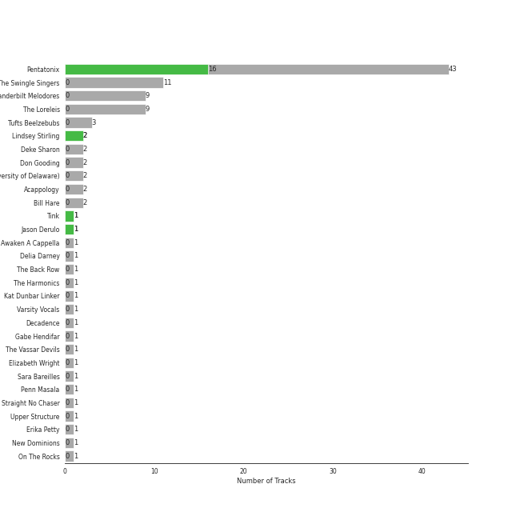

# a cappella

[198 songs](a_cappella_tracks.md)

## Top Artists

See all 59 artists

|   Number of Tracks | Art                                                                                              | Artist                                                   | 🔗                                                           |
|-------------------:|:-------------------------------------------------------------------------------------------------|:---------------------------------------------------------|:------------------------------------------------------------|
|                 36 |  | [Pentatonix](../artists/pentatonix.md)                   | [🔗](https://open.spotify.com/artist/26AHtbjWKiwYzsoGoUZq53) |
|                 20 |  | [Tar Heel Voices](../artists/tar_heel_voices.md)         | [🔗](https://open.spotify.com/artist/1apO6pJsV1nwuF2K8sEsDo) |
|                 16 |  | [Ithacappella](../artists/ithacappella.md)               | [🔗](https://open.spotify.com/artist/5bPTIGQvxRNjr6wl9yyAct) |
|                 11 |  | [The Swingle Singers](../artists/the_swingle_singers.md) | [🔗](https://open.spotify.com/artist/1ZlFYysRdc6YaUH5FkxPl8) |
|                  9 |  | Vanderbilt Melodores                                     | [🔗](https://open.spotify.com/artist/7HkF8fT7TZlrQsjSgWUEXN) |
|                  9 |  | The Loreleis                                             | [🔗](https://open.spotify.com/artist/1fqMjreaczGwFmdmG6AvJs) |
|                  9 |  | The Nor'easters                                          | [🔗](https://open.spotify.com/artist/1aLfVgwt8eBrpvHcutWmqe) |
|                  9 |  | UNC Achordants                                           | [🔗](https://open.spotify.com/artist/1TzZMeOCs4TMYtzgohPMAr) |
|                  8 |  | Mosaic Whispers                                          | [🔗](https://open.spotify.com/artist/0fP33MCfVUaPivyFYLZtoh) |
|                  7 |  | SoCal VoCals                                             | [🔗](https://open.spotify.com/artist/5L30XpwHG77eWCZtelTns9) |
|                  6 |  | Pitch Slapped                                            | [🔗](https://open.spotify.com/artist/7EH7jldX62OIsU1yU1SWE7) |
|                  6 |  | Voices in Your Head                                      | [🔗](https://open.spotify.com/artist/44v8JgDySt9tkgfV3AWxBJ) |
|                  6 |  | Vocal Spectrum                                           | [🔗](https://open.spotify.com/artist/20nWuvMfCct9xv73hRYO7O) |
|                  5 |  | University of Rochester Midnight Ramblers                | [🔗](https://open.spotify.com/artist/2Tv49uvEsNJXUpuFL7HuKu) |
|                  4 |  | The Clef Hangers                                         | [🔗](https://open.spotify.com/artist/5wUTXZIMX0mn6MzFA13qfO) |
|                  3 |  | Tufts Beelzebubs                                         | [🔗](https://open.spotify.com/artist/4VsNVAxuPxZrJMWE2Tprtq) |
|                  2 |  | The Dartmouth Aires                                      | [🔗](https://open.spotify.com/artist/71Cez1b1NqsxIn5u8XNiQD) |
|                  2 |                                                               | Deke Sharon                                              | [🔗](https://open.spotify.com/artist/6eWNb9yuroBpPcQ4sOkL1e) |
|                  2 |                                                               | Don Gooding                                              | [🔗](https://open.spotify.com/artist/66iv9KzffeiANddjYouG6U) |
|                  2 |  | University of Rochester YellowJackets                    | [🔗](https://open.spotify.com/artist/5PdBpsZXvnEbbTe1589fMO) |
|                  2 |  | The Pitchforks                                           | [🔗](https://open.spotify.com/artist/5IPABE7EhPLvUVsgM3dlZ8) |
|                  2 |  | University Of Delaware Vocal Point                       | [🔗](https://open.spotify.com/artist/4nrhXBXu7FnxWeSbB21bfk) |
|                  2 |  | Lindsey Stirling                                         | [🔗](https://open.spotify.com/artist/378dH6EszOLFShpRzAQkVM) |
|                  2 |  | [Sara Bareilles](../artists/sara_bareilles.md)           | [🔗](https://open.spotify.com/artist/2Sqr0DXoaYABbjBo9HaMkM) |
|                  2 |  | Acappology                                               | [🔗](https://open.spotify.com/artist/21v1APtcWJHRmeKdBRVbYs) |
|                  2 |  | Tufts sQ!                                                | [🔗](https://open.spotify.com/artist/21QIHECpmN2KwhpVhIWHpT) |
|                  2 |  | The MIT Logarhythms                                      | [🔗](https://open.spotify.com/artist/1jz5HCLwsDkpBYz80n9wbR) |
|                  2 |  | Bill Hare                                                | [🔗](https://open.spotify.com/artist/10WhKnqdsfpYWDgZhjrday) |
|                  2 |  | The Virginia Sil'hooettes                                | [🔗](https://open.spotify.com/artist/0LKgClZwZKGhM5BkCzjfMX) |
|                  1 |  | Awaken A Cappella                                        | [🔗](https://open.spotify.com/artist/7zjm9GiXJPq0z3bKETWl1N) |
|                  1 |                                                               | Shams Ahmed                                              | [🔗](https://open.spotify.com/artist/7rIkgg1ozqQIezA7c8Khf4) |
|                  1 |                                                               | Delia Darney                                             | [🔗](https://open.spotify.com/artist/7ikvHdyyUnB92bHTgFcctU) |
|                  1 |  | Off The Beat                                             | [🔗](https://open.spotify.com/artist/7aCUqnLkFEQd2FPL6RK1tW) |
|                  1 |  | UGA Noteworthy                                           | [🔗](https://open.spotify.com/artist/6MyHz1OaVtj1w2y6JTu2u5) |
|                  1 |                                                               | Roxorloops & Blady Kris                                  | [🔗](https://open.spotify.com/artist/6HRJOlHBoo07WcZdXZAADI) |
|                  1 |  | BYU Vocal Point                                          | [🔗](https://open.spotify.com/artist/5zhxxb24WP6q6rbLHAn2UQ) |
|                  1 |  | The Harmonics                                            | [🔗](https://open.spotify.com/artist/528Rcthd9JqtIrlbrGKNsG) |
|                  1 |                                                               | Kat Dunbar Linker                                        | [🔗](https://open.spotify.com/artist/512QZ1TM6L4uXmWCVOKHtV) |
|                  1 |  | Tink                                                     | [🔗](https://open.spotify.com/artist/4v6XOdonnfpdTKTRJArG7v) |
|                  1 |  | Da Vinci's Notebook                                      | [🔗](https://open.spotify.com/artist/4rIDY3ojaWd7Z9ky9SFc1g) |
|                  1 |  | Varsity Vocals                                           | [🔗](https://open.spotify.com/artist/4bQp9Lm7LgRMLtqEsH3Bqf) |
|                  1 |                                                               | Emily Shanny                                             | [🔗](https://open.spotify.com/artist/3oWiUIUDPWJmvB8wElpaO5) |
|                  1 |                                                               | Gabe Hendifar                                            | [🔗](https://open.spotify.com/artist/3YIBM4yvZHT4lRQa14eHQh) |
|                  1 |  | Hullabahoos                                              | [🔗](https://open.spotify.com/artist/3S1DEHnGNfWmamdZEyLs8I) |
|                  1 |  | Eight Beat Measure                                       | [🔗](https://open.spotify.com/artist/3My1YRLewqqDXME2OkBpdZ) |
|                  1 |  | The Vassar Devils                                        | [🔗](https://open.spotify.com/artist/31EncJhuSBcAIsZGA3G1GK) |
|                  1 |  | Elizabeth Wright                                         | [🔗](https://open.spotify.com/artist/2tQ7EzEpu1KFpseMdHGSzL) |
|                  1 |  | Penn Masala                                              | [🔗](https://open.spotify.com/artist/2MhJb1ljKttJewuYZTpXxr) |
|                  1 |                                                               | Beejul Khatri                                            | [🔗](https://open.spotify.com/artist/24SlCPf92d5VTzhI0ztENn) |
|                  1 |  | Straight No Chaser                                       | [🔗](https://open.spotify.com/artist/1yQ8S4xdGOGbUcpaPR6hCM) |
|                  1 |  | Upper Structure                                          | [🔗](https://open.spotify.com/artist/1tlKq97YGAGBavozMVeddE) |
|                  1 |  | Tufts Jackson Jills                                      | [🔗](https://open.spotify.com/artist/1dUJZ0lbobmanl4W14h0a2) |
|                  1 |  | Academical Village People                                | [🔗](https://open.spotify.com/artist/1Vjug1h4HXCeplbouQEbV3) |
|                  1 |                                                               | Erika Petty                                              | [🔗](https://open.spotify.com/artist/15YH0MYEIRY7AmrrwfVO4W) |
|                  1 |  | The Virginia Gentlemen                                   | [🔗](https://open.spotify.com/artist/0steWfkS4hwaErh84SlHMW) |
|                  1 |  | The Bostonians                                           | [🔗](https://open.spotify.com/artist/0gW6hG0g7pVNbHgvmYwHDl) |
|                  1 |  | Jason Derulo                                             | [🔗](https://open.spotify.com/artist/07YZf4WDAMNwqr4jfgOZ8y) |
|                  1 |  | N'Harmonics                                              | [🔗](https://open.spotify.com/artist/02WQpZmto5LiTgoorLhpLK) |
|                  1 |  | On The Rocks                                             | [🔗](https://open.spotify.com/artist/00IjdWQ46sSBP4gZYObAMx) |

## Top Albums

See all 81 albums

|   Number of Tracks | Art                                                                                              | Album                                        | 🔗                                                          |
|-------------------:|:-------------------------------------------------------------------------------------------------|:---------------------------------------------|:-----------------------------------------------------------|
|                  8 |  | Quarter Past                                 | [🔗](https://open.spotify.com/album/1pScBPjmT5w3s0BTgkdgJy) |
|                  8 |  | BOCA 2015: Best Of College A Cappella        | [🔗](https://open.spotify.com/album/0gyhBvJs1GiI31cMMmKLnK) |
|                  7 |  | PTX, Vol. 2                                  | [🔗](https://open.spotify.com/album/12dPqNFIdjiVFSHvtsDmzJ) |
|                  6 |  | PTX, Vol. III                                | [🔗](https://open.spotify.com/album/32y54TelUHSUDWVOx4h1B4) |
|                  6 |  | PTX, Vol. 1                                  | [🔗](https://open.spotify.com/album/5wGlP6EqF7akh6N3UGfKVZ) |
|                  6 |  | M                                            | [🔗](https://open.spotify.com/album/1B0XzLFo4XYh8QIwPRTdpR) |
|                  6 |  | Keepin' it Low Key                           | [🔗](https://open.spotify.com/album/4EmdqB8w7gEONRX5QLypQZ) |
|                  5 |  | The Party Upstairs                           | [🔗](https://open.spotify.com/album/2AIAKP2FxbYNjmwQgAkqZz) |
|                  5 |  | Pitch Slapped - EP                           | [🔗](https://open.spotify.com/album/5I08qbUSg8f48kenQs7Tg6) |
|                  5 |  | BOCA 2010: Best Of College A Cappella        | [🔗](https://open.spotify.com/album/3HSd3voAxPxS50UrfInBVJ) |
|                  5 |  | BOCA 2008: Best Of College A Cappella        | [🔗](https://open.spotify.com/album/4Z0ju0i47UZ2Y4icq2f3wZ) |
|                  4 |  | Pentatonix (Deluxe Version)                  | [🔗](https://open.spotify.com/album/6qf9tE8pNRW0kX1Cucrixr) |
|                  4 |  | Off the Hook                                 | [🔗](https://open.spotify.com/album/1wfYTTpHsGxvIjDwsPLAAC) |
|                  4 |  | Greene St.                                   | [🔗](https://open.spotify.com/album/3qJMqi0VzTFGSDTTMUI5n7) |
|                  4 |  | Ferris Wheels                                | [🔗](https://open.spotify.com/album/5ASqFPQZT7iJ3Txsly4JIC) |
|                  4 |  | Breakdown!                                   | [🔗](https://open.spotify.com/album/7u7dNsbxjcxVoffJELqtCV) |
|                  4 |  | BOCA 2014: Best Of College A Cappella        | [🔗](https://open.spotify.com/album/7rZoAMtoZ8s5mLIlUTWgVT) |
|                  4 |  | BOCA 2009: Best Of College A Cappella        | [🔗](https://open.spotify.com/album/50WaSkL4pVvz9Crsca7oNV) |
|                  4 |  | 1988                                         | [🔗](https://open.spotify.com/album/6nktHqHKPt8kT4ozUJvwrs) |
|                  3 |  | Unwrapped                                    | [🔗](https://open.spotify.com/album/6ua3tHyrfZNh6CpZLzCAuT) |
|                  3 |  | Songs for Padded Rooms                       | [🔗](https://open.spotify.com/album/0h3bmbpSuD01ha1k52E1uz) |
|                  3 |  | Sincerely,                                   | [🔗](https://open.spotify.com/album/4szRoyYFWqLMea8NLx2TpL) |
|                  3 |  | RISE                                         | [🔗](https://open.spotify.com/album/6V8819n4bdv7dA5mFdCIAo) |
|                  3 |  | PTX Vol. IV - Classics                       | [🔗](https://open.spotify.com/album/00JpoY0ZaQRXTNJUruibfX) |
|                  3 |  | PTX Presents: Top Pop, Vol. I                | [🔗](https://open.spotify.com/album/2viOlnLfhPLDgx7hvBqLwW) |
|                  3 |  | BOCA 2018: Best of College A Cappella        | [🔗](https://open.spotify.com/album/4F7k4viXqEAIlrB5rbAPbF) |
|                  3 |  | BOCA 2013: Best of College A Cappella        | [🔗](https://open.spotify.com/album/6Pqey2mc4EWSfYNH3bifbO) |
|                  3 |  | BOCA 2012: Best Of College A Cappella        | [🔗](https://open.spotify.com/album/26eCHp86K2xLQj0B7Cr8he) |
|                  3 |  | BOCA 2011: Best Of College A Cappella        | [🔗](https://open.spotify.com/album/27d96rqnXRtmrGBGHJzPBh) |
|                  2 |  | Where the Secret Lies                        | [🔗](https://open.spotify.com/album/6kKcn38yjU8iFvlWCbcQsL) |
|                  2 |  | Weather To Fly                               | [🔗](https://open.spotify.com/album/2AW4oP7GeAcKOWRY5x7O0o) |
|                  2 |  | Wavelength                                   | [🔗](https://open.spotify.com/album/56RyapLbZ4DESHfzD87X7F) |
|                  2 |  | Vocal Spectrum III                           | [🔗](https://open.spotify.com/album/4F5N06bwpwxllsHAJh8Xn6) |
|                  2 |  | Vocal Spectrum II                            | [🔗](https://open.spotify.com/album/1RDzZXCmf9q1SQbyz48HFq) |
|                  2 |  | V                                            | [🔗](https://open.spotify.com/album/7wPsYBhUlqtAgPr2hbbmP3) |
|                  2 |  | That's Christmas To Me (Deluxe Edition)      | [🔗](https://open.spotify.com/album/082VlX7cBth0o8xqDGclNn) |
|                  2 |  | Stages                                       | [🔗](https://open.spotify.com/album/3mnYoDcAHKx6uA91f7rtAa) |
|                  2 |  | Permit to Harmonize                          | [🔗](https://open.spotify.com/album/4aHUBNFRDR1DzCO8GULLTD) |
|                  2 |  | PTX                                          | [🔗](https://open.spotify.com/album/77RBn8pRsfXlZdfTQh221D) |
|                  2 |  | III                                          | [🔗](https://open.spotify.com/album/3iFvXj07Frbs54rK9CzCIo) |
|                  2 |  | I Used to Live Alone                         | [🔗](https://open.spotify.com/album/0AmRRsaQVm5noeAB6LF8yA) |
|                  2 |  | Déjà Blue                                    | [🔗](https://open.spotify.com/album/1mZNLR8qY6GhhrnCmtEAv3) |
|                  2 |  | Behind Bars                                  | [🔗](https://open.spotify.com/album/40g8iY5VB5sTJ31943mAzQ) |
|                  2 |  | BOCA 2016: Best Of College A Cappella        | [🔗](https://open.spotify.com/album/2AOr4esohQurJGXklhRH1a) |
|                  2 |  | Almost 8:08                                  | [🔗](https://open.spotify.com/album/1gbG9XfNmlfNGEnOTH0f6N) |
|                  2 |  | A Kick & A Wallop                            | [🔗](https://open.spotify.com/album/5wnXtRvlemaPLxZFTpWtix) |
|                  1 |  | Voices Only 2013 College A Cappella, Vol. 1  | [🔗](https://open.spotify.com/album/6zr4GyBIMy2GRvIGPflYaK) |
|                  1 |  | Voices Only 2009 College A Cappella (Disc 1) | [🔗](https://open.spotify.com/album/20PLlTE6r1hsQrmyhUW7oB) |
|                  1 |  | Vocal Spectrum V                             | [🔗](https://open.spotify.com/album/3thUTTJbMtypYYmvsU6ucZ) |
|                  1 |  | Vocal Spectrum                               | [🔗](https://open.spotify.com/album/1rwY1OIG97HcTydwEVtqOP) |
|                  1 |  | VoCabulary                                   | [🔗](https://open.spotify.com/album/6QTtvpKN8GebVCKsx8YRmJ) |
|                  1 |  | Under the Influence (Ultimate Edition)       | [🔗](https://open.spotify.com/album/2jeIoe6RbirPCprvXQnqqn) |
|                  1 |  | Unbound                                      | [🔗](https://open.spotify.com/album/5KqLmDu7Lui1qqdnItWDUs) |
|                  1 |  | The Sound of Silence                         | [🔗](https://open.spotify.com/album/2d5CHsmyOYGqfjDaPrdEzc) |
|                  1 |  | The Reading Room Sessions (Fall 2017)        | [🔗](https://open.spotify.com/album/4xbXu4kEwTS8NOTX6aRwkg) |
|                  1 |  | The Mallard                                  | [🔗](https://open.spotify.com/album/2IV5LQ4DzCjAIVwYZMHYgo) |
|                  1 |  | The Life and Times of Mike Fanning           | [🔗](https://open.spotify.com/album/7FNdaE5nvtVmhPlc9wjQrx) |
|                  1 |  | Storming The Castle                          | [🔗](https://open.spotify.com/album/1wjibXmmViZMNA1HsMo7f6) |
|                  1 |  | Spotlight on Bach                            | [🔗](https://open.spotify.com/album/3qHHoQNFqZptsQE9Y3esLh) |
|                  1 |  | Rain Check                                   | [🔗](https://open.spotify.com/album/6xuVrseH6zVGlcMojwowxn) |
|                  1 |  | Oasis                                        | [🔗](https://open.spotify.com/album/1VpHqAIW8Pu343GJa0UpRQ) |
|                  1 |  | Ignite                                       | [🔗](https://open.spotify.com/album/5O7GFH7FfXuuDlOfNH76Qq) |
|                  1 |  | ICCA 2016: The Extended Cuts                 | [🔗](https://open.spotify.com/album/07xYpylAQHOJoHStqUpKwp) |
|                  1 |  | House Rules                                  | [🔗](https://open.spotify.com/album/1fHxE6WZL6ouusBW4h9nE4) |
|                  1 |  | High Stakes Old Maid                         | [🔗](https://open.spotify.com/album/6sg9WsK06H588Y5VOmwj37) |
|                  1 |  | Fixate                                       | [🔗](https://open.spotify.com/album/2wDs6jkrCEPBJLnLLFWt7J) |
|                  1 |  | Equilibrium                                  | [🔗](https://open.spotify.com/album/6BeTGjWVDQLQhdSM5MBziy) |
|                  1 |  | Encore                                       | [🔗](https://open.spotify.com/album/1AN2Vv5PecNjJEmzys8Gru) |
|                  1 |  | Disturbia                                    | [🔗](https://open.spotify.com/album/3ypmasyBX16BmWt52owYaN) |
|                  1 |  | Defrosted                                    | [🔗](https://open.spotify.com/album/3DLNakCGffrhPaaj9rfepk) |
|                  1 |  | Christmas Is Here!                           | [🔗](https://open.spotify.com/album/6thZNGX8hUVSjUrqJgPB9b) |
|                  1 |  | Burn                                         | [🔗](https://open.spotify.com/album/1fcocQi9SDelG4xiE3d7yQ) |
|                  1 |  | Best of BOCA: The First 20 Years             | [🔗](https://open.spotify.com/album/5bcLIouxn2oBiGvf4vvO6u) |
|                  1 |  | Before You Go                                | [🔗](https://open.spotify.com/album/00x5MddnbpBoWJWtubLhHH) |
|                  1 |  | BOCA 2021: Best of College A Cappella        | [🔗](https://open.spotify.com/album/1eKkeTIlePsRpKkQre78tT) |
|                  1 |  | BOCA 2006: Best Of College A Cappella        | [🔗](https://open.spotify.com/album/3AeoTNhXFgBM7CuODGFelQ) |
|                  1 |  | BOCA 2004: Best Of College A Cappella        | [🔗](https://open.spotify.com/album/5qrIP0zXoDQUSZ9l1ZaECQ) |
|                  1 |  | Against the Grain                            | [🔗](https://open.spotify.com/album/27W6ijbmL6QPNrdQGncwDJ) |
|                  1 |  | A Swing and a Miss                           | [🔗](https://open.spotify.com/album/0qj5ECfme87sP5anevwf81) |
|                  1 |  | A Pentatonix Christmas Deluxe                | [🔗](https://open.spotify.com/album/3sId8sOH47yqOWopzbEtJn) |
|                  1 |  | A Capella Christmas Favourites               | [🔗](https://open.spotify.com/album/4PUNlc0snMF3Bqa8NeWLRk) |

## Top Record Labels

See all 25 labels

|   Number of Tracks | Label                                                                                                       |
|-------------------:|:------------------------------------------------------------------------------------------------------------|
|                 44 | [Varsity Vocals](../labels/varsity_vocals.md)                                                               |
|                 36 | [RCA Records Label](../labels/rca_records_label.md)                                                         |
|                 32 | [A Cappella Records](../labels/a_cappella_records.md)                                                       |
|                 12 | [Ithacappella](../labels/ithacappella.md)                                                                   |
|                  8 | [Vanderbilt Melodores](../labels/vanderbilt_melodores.md)                                                   |
|                  8 | [UNC Achordants](../labels/unc_achordants.md)                                                               |
|                  8 | [Mosaic Whispers](../labels/mosaic_whispers.md)                                                             |
|                  6 | [Tar Heel Voices](../labels/tar_heel_voices.md)                                                             |
|                  6 | [Naked Voice Records](../labels/naked_voice_records.md)                                                     |
|                  5 | [The Loreleis](../labels/the_loreleis.md)                                                                   |
|                  4 | [The Nor'easters](../labels/the_nor_easters.md)                                                             |
|                  4 | [SwingCD](../labels/swingcd.md)                                                                             |
|                  4 | [649668 Records DK2](../labels/649668_records_dk2.md)                                                       |
|                  3 | [The Sound Corporation](../labels/the_sound_corporation.md)                                                 |
|                  3 | [The SoCal VoCals](../labels/the_socal_vocals.md)                                                           |
|                  2 | [world village](../labels/world_village.md)                                                                 |
|                  2 | [Voices Only A Cappella](../labels/voices_only_a_cappella.md)                                               |
|                  2 | [The University of Rochester Midnight Ramblers](../labels/the_university_of_rochester_midnight_ramblers.md) |
|                  2 | [The Clef Hangers](../labels/the_clef_hangers.md)                                                           |
|                  2 | [SoCal VoCals](../labels/socal_vocals.md)                                                                   |
|                  1 | [Uncle Buford Records](../labels/uncle_buford_records.md)                                                   |
|                  1 | [Sonoton Music](../labels/sonoton_music.md)                                                                 |
|                  1 | [Signum OMP](../labels/signum_omp.md)                                                                       |
|                  1 | [Loudr](../labels/loudr.md)                                                                                 |
|                  1 | [Atlantic Records](../labels/atlantic_records.md)                                                           |

## Audio Features

| 10 most Danceable tracks       | 10 least Danceable tracks   |
|:-------------------------------|:----------------------------|
| Uptown Funk                    | The Sound of Silence        |
| Problem                        | The Man Who Can't Be Moved  |
| La Camisa Negra                | Gravity                     |
| Rather Be (Clean Bandit Cover) | Wait It Out                 |
| Toxic                          | Walking in the Air          |
| Finesse                        | Falling Slowly              |
| Telephone                      | We Found Love               |
| Can't Sleep Love (feat. Tink)  | Bluebird                    |
| Can't Sleep Love               | The Music of the Night      |
| Havana                         | Bring Him Home              |

| 10 most Energetic tracks   | 10 least Energetic tracks     |
|:---------------------------|:------------------------------|
| Misery Business            | Santa Baby                    |
| Don't Stop Me Now          | The Sound of Silence          |
| Elastic Heart              | The Music of the Night        |
| Russian Roulette           | Bring Him Home                |
| Finesse                    | Lullabye (Goodnight My Angel) |
| Telephone                  | Walking in the Air            |
| Finesse - Remix            | River                         |
| My Happy Ending            | Amazing Grace                 |
| Bang Bang                  | Run to You                    |
| Don't Stop Believin'       | Woods                         |

| 10 most Speechy tracks                    | 10 least Speechy tracks   |
|:------------------------------------------|:--------------------------|
| Hey Momma / Hit the Road Jack             | Falling Slowly            |
| Bang Bang                                 | Cough Syrup               |
| Uptown Funk                               | Good Vibrations           |
| Don't Stop Me Now                         | Latch                     |
| I'd Like To                               | Demons                    |
| Cry Me a River                            | The Sound of Silence      |
| Movin' On                                 | We All Need Saving        |
| Waka Waka (This Time for Africa)          | Machine Gun               |
| Attention                                 | Samson                    |
| Too Close (feat. Roxorloops & Blady Kris) | We Found Love             |

| 10 most Acoustic tracks       | 10 least Acoustic tracks      |
|:------------------------------|:------------------------------|
| Lullabye (Goodnight My Angel) | Hey Momma / Hit the Road Jack |
| Amazing Grace                 | Wrecking Ball                 |
| Bring Him Home                | Problem                       |
| Walking in the Air            | We Are Young                  |
| Bluebird                      | Starships                     |
| Prelude No.1 in C Major       | Talk Dirty                    |
| Demons                        | Domino                        |
| The Music of the Night        | The Baddest Girl              |
| I Wanna Be Like You           | Daft Punk                     |
| Good Vibrations               | I Need Your Love              |

| 10 most Instrumental tracks   | 10 least Instrumental tracks   |
|:------------------------------|:-------------------------------|
| Prelude No.1 in C Major       | Finesse - Remix                |
| Libertango                    | We All Need Saving             |
| Eine kleine Nachtmusik        | Pure Imagination               |
| Dance of the Sugar Plum Fairy | Movin' On                      |
| Here (In Your Arms)           | Stay                           |
| Falling Slowly                | Work Song                      |
| Home                          | Carry On Wayward Son           |
| God Only Knows                | Smooth                         |
| Walking in the Air            | Little Lion Man                |
| Break Free                    | Chandelier                     |

| 10 most Live tracks     | 10 least Live tracks                               |
|:------------------------|:---------------------------------------------------|
| Brand New Jones         | There Goes My Baby                                 |
| I'd Like To             | Demons                                             |
| Sound Of Silence        | All Time Low                                       |
| Smooth                  | I Write Sins Not Tragedies                         |
| Talk Dirty              | Papaoutai (Stromae Cover) (feat. Lindsey Stirling) |
| Starships               | Finesse                                            |
| Disturbia               | Russian Roulette                                   |
| Havana                  | Africa                                             |
| Let It Go               | Bang Bang                                          |
| Supermassive Black Hole | Paranoid Android                                   |

| 10 most Happy tracks    | 10 least Happy tracks         |
|:------------------------|:------------------------------|
| Big Yellow Taxi         | Latch                         |
| I Want You Back         | She Used to Be Mine           |
| Attention               | Walking in the Air            |
| Finesse                 | Gravity                       |
| Na Na Na                | We Found Love                 |
| Domino                  | Say Something                 |
| Smooth                  | Lullabye (Goodnight My Angel) |
| Toxic                   | The Music of the Night        |
| I'd Like To             | The Sound of Silence          |
| Supermassive Black Hole | Bring Him Home                |
