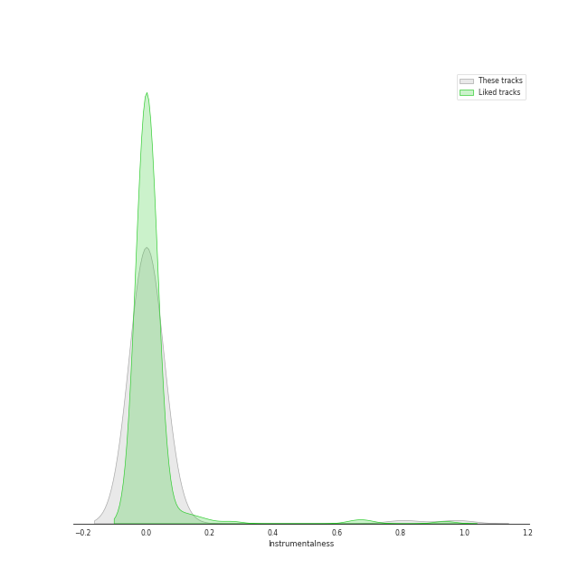
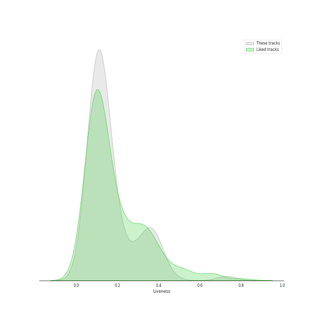

# Audio Features for a cappella

## Danceability

| ​ | 10 most Danceable tracks | ​​ | 10 least Danceable tracks |
|:---|:---|:---|:---|
|  | Uptown Funk (0.847) |  | Bluebird (0.184) |
|  | Rather Be (Clean Bandit Cover) (0.803) |  | Walking in the Air (0.224) |
|  | Sexyback (0.782) |  | Gravity (0.231) |
|  | Finesse (0.763) |  | Run to You (0.24) |
|  | Sleigh Ride (0.745) |  | Imagine (0.243) |
|  | Can't Sleep Love (feat. Tink) (0.734) |  | Say Something (0.249) |
|  | Can't Sleep Love (0.73) |  | Amazing Grace (0.25) |
|  | Havana (0.726) |  | Lullabye (Goodnight My Angel) (0.257) |
|  | Problem (Ariana Grande Cover) (0.721) |  | Over The Rainbow (0.266) |
|  | Santa Baby (0.72) |  | Can't Help Falling In Love (0.272) |

## Energy

| ​ | 10 most Energetic tracks | ​​ | 10 least Energetic tracks |
|:---|:---|:---|:---|
|  | Elastic Heart (0.881) |  | Run to You (0.0622) |
|  | Finesse (0.836) |  | Amazing Grace (0.0642) |
|  | My Happy Ending (0.828) |  | River (0.0684) |
|  | DNA (0.798) |  | Walking in the Air (0.0789) |
|  | Manwa Laage (0.791) |  | Lullabye (Goodnight My Angel) (0.0832) |
|  | How Big, How Blue, How Beautiful (0.78) |  | Santa Baby (0.12) |
|  | Shake It Out (0.778) |  | Over The Rainbow (0.155) |
|  | Hey Momma / Hit the Road Jack (0.767) |  | Can't Help Falling In Love (0.16) |
|  | Aha! (0.761) |  | Colder Weather (0.172) |
|  | Chandelier (0.756) |  | Bluebird (0.198) |

## Speechiness

| ​ | 10 most Speechy tracks | ​​ | 10 least Speechy tracks |
|:---|:---|:---|:---|
|  | Hey Momma / Hit the Road Jack (0.433) |  | It's the Most Wonderful Time of the Year (0.0256) |
|  | Uptown Funk (0.34) |  | Mary, Did You Know? (0.0269) |
|  | Bang Bang (0.34) |  | The Sound of Silence (0.0273) |
|  | The 12 Days of Christmas (0.316) |  | Latch (0.0277) |
|  | Attention (0.15) |  | Cough Syrup (0.0278) |
|  | Sexyback (0.117) |  | God Only Knows (0.0286) |
|  | I Want You Back (feat. Sara Bareilles) (0.113) |  | Havana (0.0287) |
|  | Attention (0.107) |  | Landslide (0.0289) |
|  | Manwa Laage (0.102) |  | Sleigh Ride (0.029) |
|  | Starships (0.0944) |  | Over The Rainbow (0.0292) |

## Acousticness

| ​ | 10 most Acoustic tracks | ​​ | 10 least Acoustic tracks |
|:---|:---|:---|:---|
|  | Lullabye (Goodnight My Angel) (0.991) |  | I Need Your Love (0.00319) |
|  | Amazing Grace (0.987) |  | Daft Punk (0.00403) |
|  | Walking in the Air (0.975) |  | The Baddest Girl (0.00637) |
|  | Prelude No.1 in C Major (0.972) |  | Chandelier (0.0115) |
|  | Bluebird (0.972) |  | Starships (0.0176) |
|  | River (0.952) |  | We Are Young (0.02) |
|  | Landslide (0.919) |  | Wrecking Ball (0.0208) |
|  | Gravity (0.918) |  | Hey Momma / Hit the Road Jack (0.0214) |
|  | Santa Baby (0.915) |  | Sexyback (0.0246) |
|  | God Only Knows (0.904) |  | Show You How to Love (0.0304) |

## Instrumentalness

| ​ | 10 most Instrumental tracks | ​​ | 10 least Instrumental tracks |
|:---|:---|:---|:---|
|  | Prelude No.1 in C Major (0.977) |  | Natural Disaster (0.0) |
|  | Libertango (0.809) |  | Sleigh Ride (0.0) |
|  | Dance of the Sugar Plum Fairy (0.079) |  | Hallelujah (0.0) |
|  | God Only Knows (0.0016) |  | Gravity (0.0) |
|  | Walking in the Air (0.000957) |  | The Sound of Silence (0.0) |
|  | Break Free (0.000898) |  | Show You How to Love (0.0) |
|  | O Come, O Come Emmanuel (0.000413) |  | I Will Follow You Into the Dark (0.0) |
|  | River (6.41e-05) |  | Love Again (0.0) |
|  | Standing By (5.54e-05) |  | Wrecking Ball (0.0) |
|  | Supermassive Black Hole (4.25e-05) |  | Who Are You (0.0) |

## Liveness

| ​ | 10 most Live tracks | ​​ | 10 least Live tracks |
|:---|:---|:---|:---|
|  | Sound Of Silence (0.731) |  | Bang Bang (0.0429) |
|  | Starships (0.447) |  | Finesse (0.0503) |
|  | Havana (0.385) |  | Papaoutai (Stromae Cover) (feat. Lindsey Stirling) (0.0551) |
|  | Supermassive Black Hole (0.384) |  | Sexyback (0.0589) |
|  | Let It Go (0.384) |  | All Time Low (0.062) |
|  | The 12 Days of Christmas (0.378) |  | I Need Your Love (0.0741) |
|  | Eleanor Rigby (0.377) |  | Hey Momma / Hit the Road Jack (0.0747) |
|  | Chandelier (0.374) |  | Attention (0.0748) |
|  | See Through (0.37) |  | Rather Be (Clean Bandit Cover) (0.0748) |
|  | The Sound of Silence (0.368) |  | Break Free (0.0822) |

## Valence

| ​ | 10 most Happy tracks | ​​ | 10 least Happy tracks |
|:---|:---|:---|:---|
|  | Attention (0.907) |  | Lullabye (Goodnight My Angel) (0.0673) |
|  | Finesse (0.903) |  | Say Something (0.0812) |
|  | Sleigh Ride (0.87) |  | Gravity (0.0845) |
|  | Na Na Na (0.862) |  | Walking in the Air (0.0957) |
|  | Supermassive Black Hole (0.826) |  | Latch (0.0988) |
|  | Natural Disaster (0.819) |  | Sound Of Silence (0.1) |
|  | Sexyback (0.815) |  | Amazing Grace (0.107) |
|  | Rockin' Around the Christmas Tree (0.809) |  | Shake It Out (0.136) |
|  | Everybody Talks (0.769) |  | River (0.137) |
|  | Havana (0.749) |  | God Only Knows (0.138) |

## Tempo

| ​ | 10 most Fast tracks | ​​ | 10 least Fast tracks |
|:---|:---|:---|:---|
|  | Attention (204.19) |  | Bluebird (66.753) |
|  | Hey Momma / Hit the Road Jack (203.068) |  | Lullabye (Goodnight My Angel) (72.925) |
|  | On The 4th Of July (199.616) |  | Bang Bang (74.451) |
|  | Gunpowder & Lead (187.614) |  | Rockin' Around the Christmas Tree (75.523) |
|  | My Happy Ending (175.719) |  | The Baddest Girl (77.861) |
|  | Chandelier (173.893) |  | The Christmas Song (Chestnuts Roasting on an Open Fire) (78.918) |
|  | Aha! (172.015) |  | Daddy Lessons (79.98) |
|  | Carol of the Bells (171.857) |  | Prelude No.1 in C Major (80.208) |
|  | Gravity (167.19) |  | Manwa Laage (81.432) |
|  | Everybody Talks (160.597) |  | Over The Rainbow (83.736) |
