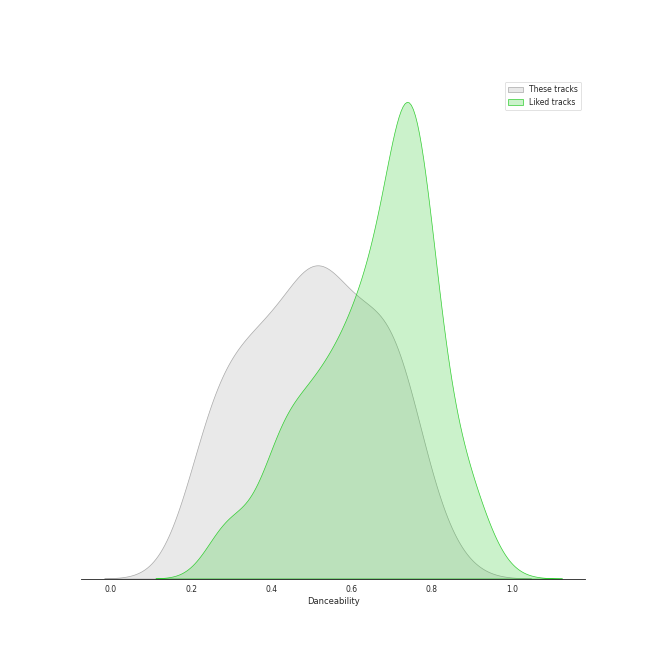
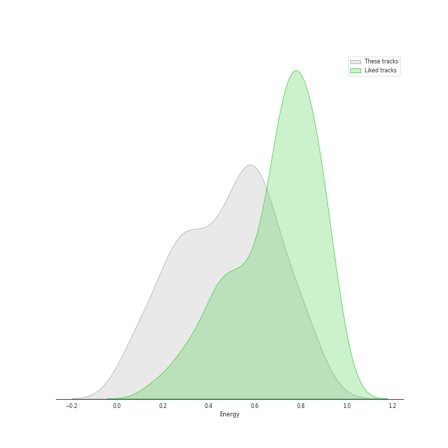
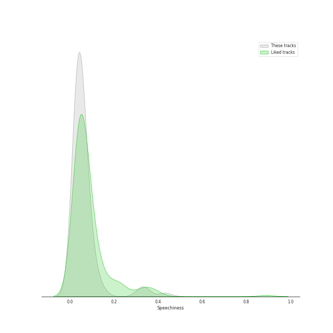
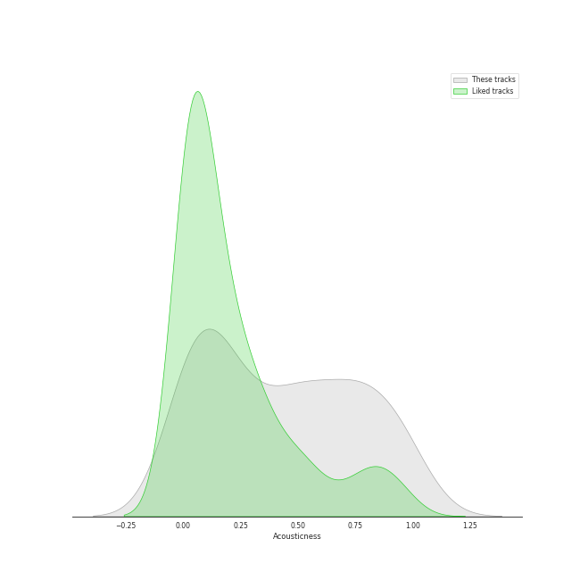
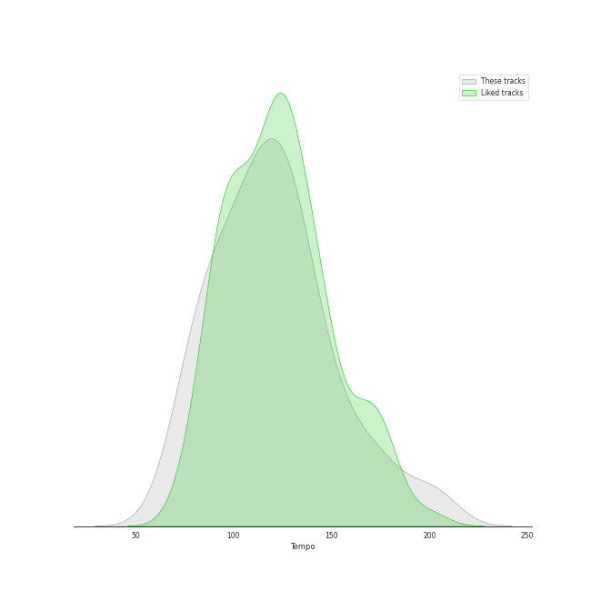

# Audio Features for a cappella

## Danceability

| 10 most Danceable tracks | 10 least Danceable tracks |
|:---|:---|
| Uptown Funk (0.847) | Bluebird (0.184) |
| Rather Be (Clean Bandit Cover) (0.803) | Walking in the Air (0.224) |
| Sexyback (0.782) | Gravity (0.231) |
| Finesse (0.763) | Run to You (0.24) |
| Sleigh Ride (0.745) | Imagine (0.243) |
| Can't Sleep Love (feat. Tink) (0.734) | Say Something (0.249) |
| Can't Sleep Love (0.73) | Amazing Grace (0.25) |
| Havana (0.726) | Lullabye (Goodnight My Angel) (0.257) |
| Problem (Ariana Grande Cover) (0.721) | Over The Rainbow (0.266) |
| Santa Baby (0.72) | Can't Help Falling In Love (0.272) |

## Energy

| 10 most Energetic tracks | 10 least Energetic tracks |
|:---|:---|
| Elastic Heart (0.881) | Run to You (0.0622) |
| Finesse (0.836) | Amazing Grace (0.0642) |
| My Happy Ending (0.828) | River (0.0684) |
| DNA (0.798) | Walking in the Air (0.0789) |
| Manwa Laage (0.791) | Lullabye (Goodnight My Angel) (0.0832) |
| How Big, How Blue, How Beautiful (0.78) | Santa Baby (0.12) |
| Shake It Out (0.778) | Over The Rainbow (0.155) |
| Hey Momma / Hit the Road Jack (0.767) | Can't Help Falling In Love (0.16) |
| Aha! (0.761) | Colder Weather (0.172) |
| Chandelier (0.756) | Bluebird (0.198) |

## Speechiness

| 10 most Speechy tracks | 10 least Speechy tracks |
|:---|:---|
| Hey Momma / Hit the Road Jack (0.433) | It's the Most Wonderful Time of the Year (0.0256) |
| Uptown Funk (0.34) | Mary, Did You Know? (0.0269) |
| Bang Bang (0.34) | The Sound of Silence (0.0273) |
| The 12 Days of Christmas (0.316) | Latch (0.0277) |
| Attention (0.15) | Cough Syrup (0.0278) |
| Sexyback (0.117) | God Only Knows (0.0286) |
| I Want You Back (feat. Sara Bareilles) (0.113) | Havana (0.0287) |
| Attention (0.107) | Landslide (0.0289) |
| Manwa Laage (0.102) | Sleigh Ride (0.029) |
| Starships (0.0944) | Over The Rainbow (0.0292) |

## Acousticness

| 10 most Acoustic tracks | 10 least Acoustic tracks |
|:---|:---|
| Lullabye (Goodnight My Angel) (0.991) | I Need Your Love (0.00319) |
| Amazing Grace (0.987) | Daft Punk (0.00403) |
| Walking in the Air (0.975) | The Baddest Girl (0.00637) |
| Prelude No.1 in C Major (0.972) | Chandelier (0.0115) |
| Bluebird (0.972) | Starships (0.0176) |
| River (0.952) | We Are Young (0.02) |
| Landslide (0.919) | Wrecking Ball (0.0208) |
| Gravity (0.918) | Hey Momma / Hit the Road Jack (0.0214) |
| Santa Baby (0.915) | Sexyback (0.0246) |
| God Only Knows (0.904) | Show You How to Love (0.0304) |

## Instrumentalness

| 10 most Instrumental tracks | 10 least Instrumental tracks |
|:---|:---|
| Prelude No.1 in C Major (0.977) | Natural Disaster (0.0) |
| Libertango (0.809) | Sleigh Ride (0.0) |
| Eine kleine Nachtmusik (0.653) | Hallelujah (0.0) |
| Dance of the Sugar Plum Fairy (0.079) | Gravity (0.0) |
| God Only Knows (0.0016) | The Sound of Silence (0.0) |
| Walking in the Air (0.000957) | Show You How to Love (0.0) |
| Break Free (0.000898) | I Will Follow You Into the Dark (0.0) |
| O Come, O Come Emmanuel (0.000413) | Love Again (0.0) |
| River (6.41e-05) | Wrecking Ball (0.0) |
| Standing By (5.54e-05) | Who Are You (0.0) |

## Liveness

| 10 most Live tracks | 10 least Live tracks |
|:---|:---|
| Sound Of Silence (0.731) | Bang Bang (0.0429) |
| Starships (0.447) | Finesse (0.0503) |
| Havana (0.385) | Papaoutai (Stromae Cover) (feat. Lindsey Stirling) (0.0551) |
| Supermassive Black Hole (0.384) | Sexyback (0.0589) |
| Let It Go (0.384) | All Time Low (0.062) |
| The 12 Days of Christmas (0.378) | I Need Your Love (0.0741) |
| Eleanor Rigby (0.377) | Hey Momma / Hit the Road Jack (0.0747) |
| Chandelier (0.374) | Attention (0.0748) |
| See Through (0.37) | Rather Be (Clean Bandit Cover) (0.0748) |
| The Sound of Silence (0.368) | Eine kleine Nachtmusik (0.0802) |

## Valence

| 10 most Happy tracks | 10 least Happy tracks |
|:---|:---|
| Attention (0.907) | Lullabye (Goodnight My Angel) (0.0673) |
| Finesse (0.903) | Say Something (0.0812) |
| Sleigh Ride (0.87) | Gravity (0.0845) |
| Na Na Na (0.862) | Walking in the Air (0.0957) |
| Supermassive Black Hole (0.826) | Latch (0.0988) |
| Natural Disaster (0.819) | Sound Of Silence (0.1) |
| Sexyback (0.815) | Amazing Grace (0.107) |
| Rockin' Around the Christmas Tree (0.809) | Shake It Out (0.136) |
| Everybody Talks (0.769) | River (0.137) |
| Havana (0.749) | God Only Knows (0.138) |

## Tempo

| 10 most Fast tracks | 10 least Fast tracks |
|:---|:---|
| Attention (204.19) | Bluebird (66.753) |
| Hey Momma / Hit the Road Jack (203.068) | Lullabye (Goodnight My Angel) (72.925) |
| On The 4th Of July (199.616) | Bang Bang (74.451) |
| Gunpowder & Lead (187.614) | Rockin' Around the Christmas Tree (75.523) |
| My Happy Ending (175.719) | The Baddest Girl (77.861) |
| Chandelier (173.893) | The Christmas Song (Chestnuts Roasting on an Open Fire) (78.918) |
| Aha! (172.015) | Daddy Lessons (79.98) |
| Carol of the Bells (171.857) | Prelude No.1 in C Major (80.208) |
| Gravity (167.19) | Manwa Laage (81.432) |
| Everybody Talks (160.597) | Over The Rainbow (83.736) |
