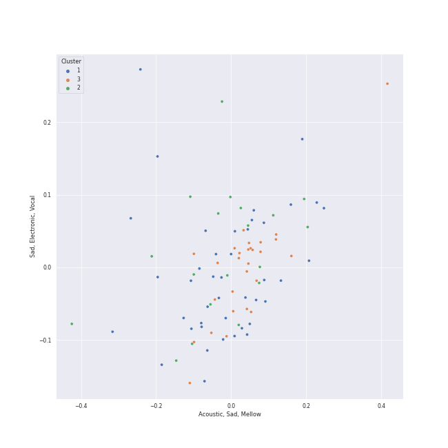

# Clusters in a cappella

## Cluster #1

29 tracks

| Art | Track | Album | Artists | Label | Rank | 💚 | 🔗 |
|:---|:---|:---|:---|:---|---:|:---|:---|
|  | Let It Go | That's Christmas To Me (Deluxe Edition) | [Pentatonix](../../../../artists/pentatonix/overview.md) | [RCA Records Label](../../../../labels/rca_records_label) | 648 | | [🔗](https://open.spotify.com/track/2G7K3Op9y3HhqrF2TdHP95) |
|  | Show You How to Love | PTX, Vol. 1 | [Pentatonix](../../../../artists/pentatonix/overview.md) | [RCA Records Label](../../../../labels/rca_records_label) | nan | | [🔗](https://open.spotify.com/track/0jExzGwfnZ1vTuCVB7w3vM) |
|  | We Are Young | PTX, Vol. 1 | [Pentatonix](../../../../artists/pentatonix/overview.md) | [RCA Records Label](../../../../labels/rca_records_label) | nan | 💚 | [🔗](https://open.spotify.com/track/5mMoySkxdUWlTw6X2l4egi) |
|  | See Through | PTX, Vol. III | [Pentatonix](../../../../artists/pentatonix/overview.md) | [RCA Records Label](../../../../labels/rca_records_label) | nan | | [🔗](https://open.spotify.com/track/6UNqsxeupIqwNds2oSDYnY) |
|  | Sweater Weather | Christmas Is Here! | [Pentatonix](../../../../artists/pentatonix/overview.md) | [RCA Records Label](../../../../labels/rca_records_label) | nan | | [🔗](https://open.spotify.com/track/50YYe94G19kWVyhzdEXxki) |
|  | Carol of the Bells | PTXmas (Deluxe Edition) | [Pentatonix](../../../../artists/pentatonix/overview.md) | [RCA Records Label](../../../../labels/rca_records_label) | nan | | [🔗](https://open.spotify.com/track/4cJhiux4xzrdgSHUeAjP48) |
|  | Gunpowder & Lead | BOCA 2012: Best Of College A Cappella | Acappology | [Varsity Vocals](../../../../labels/varsity_vocals) | nan | | [🔗](https://open.spotify.com/track/4VULVdHqtgipHNPFnVRQ7D) |
|  | Here | Sincerely, | The Loreleis | The Loreleis | nan | | [🔗](https://open.spotify.com/track/6jCsjDAeVU2fvbBb7hZe8X) |
|  | DNA | Burn | The Loreleis | Loudr | nan | | [🔗](https://open.spotify.com/track/5ga8GnfhDfcscqlzIFNoBp) |
|  | I Want You Back (feat. Sara Bareilles) | Under the Influence (Ultimate Edition) | Straight No Chaser, [Sara Bareilles](../../../../artists/sara_bareilles/overview.md) | [Atlantic Records](../../../../labels/atlantic_records) | nan | 💚 | [🔗](https://open.spotify.com/track/5teF3el9gP5j2cf7Dvkbm0) |
## Cluster #2

35 tracks

| Art | Track | Album | Artists | Label | Rank | 💚 | 🔗 |
|:---|:---|:---|:---|:---|---:|:---|:---|
|  | Imagine | PTX Vol. IV - Classics | [Pentatonix](../../../../artists/pentatonix/overview.md) | [RCA Records Label](../../../../labels/rca_records_label) | 696 | 💚 | [🔗](https://open.spotify.com/track/1UaTmLT3nB1sNBfv1hkqU1) |
|  | Can't Help Falling In Love | PTX Vol. IV - Classics | [Pentatonix](../../../../artists/pentatonix/overview.md) | [RCA Records Label](../../../../labels/rca_records_label) | nan | 💚 | [🔗](https://open.spotify.com/track/1xKScU3i8ho0OIhNoC5YW9) |
|  | The Christmas Song (Chestnuts Roasting on an Open Fire) | PTXmas (Deluxe Edition) | [Pentatonix](../../../../artists/pentatonix/overview.md) | [RCA Records Label](../../../../labels/rca_records_label) | nan | | [🔗](https://open.spotify.com/track/3M2xVmqG5GgthkaRJBntBk) |
|  | O Come, O Come Emmanuel | PTXmas (Deluxe Edition) | [Pentatonix](../../../../artists/pentatonix/overview.md) | [RCA Records Label](../../../../labels/rca_records_label) | nan | | [🔗](https://open.spotify.com/track/4eKD9QhFqvwA4ilUAkQAbI) |
|  | Poor Wayfaring Stranger | Weather To Fly | The Swingle Singers | world village | nan | | [🔗](https://open.spotify.com/track/3vZI7kzLJgzZEVu8hB1ZTS) |
|  | God Only Knows | Ferris Wheels | The Swingle Singers | SwingCD | nan | | [🔗](https://open.spotify.com/track/6CrOQIE1PpRdh12PvmUt3c) |
|  | Colder Weather | M | Vanderbilt Melodores | Vanderbilt Melodores | nan | | [🔗](https://open.spotify.com/track/6ZlO7zjdkGguzlzqETjQWX) |
|  | Come Sail Away | BOCA 2008: Best Of College A Cappella | Tufts Beelzebubs | [Varsity Vocals](../../../../labels/varsity_vocals) | nan | | [🔗](https://open.spotify.com/track/4shx271boRWtwHWM2bTpGa) |
|  | Landslide | A Kick & A Wallop | The Loreleis | [A Cappella Records](../../../../labels/a_cappella_records) | nan | | [🔗](https://open.spotify.com/track/1gViYygDgkWPAH8q6WfsN0) |
|  | She Used to Be Mine | BOCA 2018: Best of College A Cappella | Upper Structure | [Varsity Vocals](../../../../labels/varsity_vocals) | nan | | [🔗](https://open.spotify.com/track/6jcJMJ6CcYPzPZ9386CJd5) |
## Cluster #3

26 tracks

| Art | Track | Album | Artists | Label | Rank | 💚 | 🔗 |
|:---|:---|:---|:---|:---|---:|:---|:---|
|  | Valerie | BOCA 2013: Best of College A Cappella | Decadence | [Varsity Vocals](../../../../labels/varsity_vocals) | nan | | [🔗](https://open.spotify.com/track/18OOiO2QFVNYwixjqj1jks) |
|  | Natural Disaster | PTX, Vol. 2 | [Pentatonix](../../../../artists/pentatonix/overview.md) | [RCA Records Label](../../../../labels/rca_records_label) | nan | | [🔗](https://open.spotify.com/track/04nemEju86ULMJ1iy6EAsF) |
|  | Daft Punk | PTX, Vol. 2 | [Pentatonix](../../../../artists/pentatonix/overview.md) | [RCA Records Label](../../../../labels/rca_records_label) | nan | 💚 | [🔗](https://open.spotify.com/track/6ukvsBzq4d1vBsAUmz7ZVt) |
|  | It's the Most Wonderful Time of the Year | That's Christmas To Me (Deluxe Edition) | [Pentatonix](../../../../artists/pentatonix/overview.md) | [RCA Records Label](../../../../labels/rca_records_label) | nan | | [🔗](https://open.spotify.com/track/4DXJt41B9ZPh3UmxiPkBT0) |
|  | Havana | PTX Presents: Top Pop, Vol. I | [Pentatonix](../../../../artists/pentatonix/overview.md) | [RCA Records Label](../../../../labels/rca_records_label) | nan | 💚 | [🔗](https://open.spotify.com/track/0wkiCJqCtI8keITfZ642jg) |
|  | Can't Sleep Love (feat. Tink) | Pentatonix (Deluxe Version) | [Pentatonix](../../../../artists/pentatonix/overview.md), Tink | [RCA Records Label](../../../../labels/rca_records_label) | nan | 💚 | [🔗](https://open.spotify.com/track/1GXFYdKM6MNrogE2PacpKe) |
|  | Na Na Na | Pentatonix (Deluxe Version) | [Pentatonix](../../../../artists/pentatonix/overview.md) | [RCA Records Label](../../../../labels/rca_records_label) | nan | | [🔗](https://open.spotify.com/track/6v08G3CGcoyiODIWZoOxR4) |
|  | Problem (Ariana Grande Cover) | PTX, Vol. III | [Pentatonix](../../../../artists/pentatonix/overview.md) | [RCA Records Label](../../../../labels/rca_records_label) | 397 | 💚 | [🔗](https://open.spotify.com/track/45h4cCw7ccsRXb0Orle2an) |
|  | Rockin' Around the Christmas Tree | Christmas Is Here! | [Pentatonix](../../../../artists/pentatonix/overview.md) | [RCA Records Label](../../../../labels/rca_records_label) | nan | | [🔗](https://open.spotify.com/track/3Fu6XvAT5yjzO8GMcvuM1s) |
|  | Everybody Talks | BOCA 2014: Best Of College A Cappella | Tufts Beelzebubs | [Varsity Vocals](../../../../labels/varsity_vocals) | nan | | [🔗](https://open.spotify.com/track/4uJ9zT1WIdRQXY0cd71Pki) |