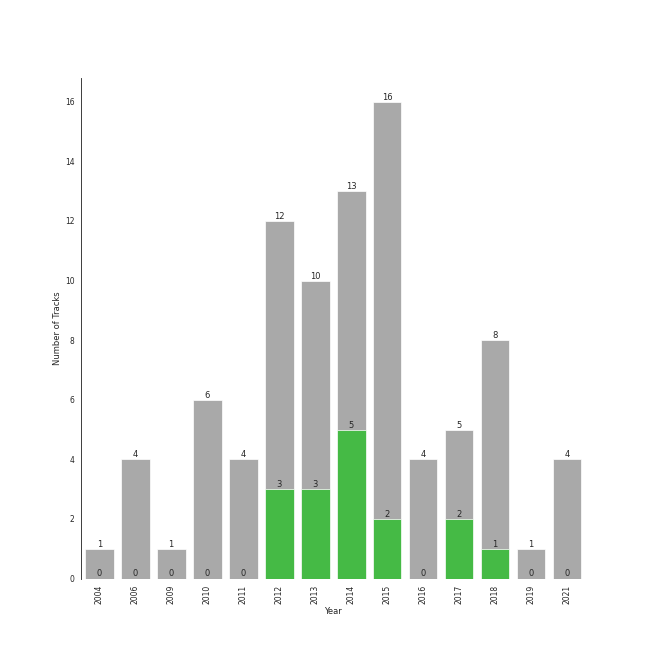

# a cappella

89 songs

[See Track Features](audio_features.md)

[See Clusters](clusters/overview.md)

## Top Artists

| Art | Tracks | 💚 | Artist | 🔗 |
|:---|---:|---:|:---|:---|
|  | 43 | 16 | [Pentatonix](../../artists/pentatonix/overview.md) | [🔗](https://open.spotify.com/artist/26AHtbjWKiwYzsoGoUZq53) |
|  | 2 | 2 | [Lindsey Stirling](../../artists/lindsey_stirling/overview.md) | [🔗](https://open.spotify.com/artist/378dH6EszOLFShpRzAQkVM) |
|  | 1 | 1 | Tink | [🔗](https://open.spotify.com/artist/4v6XOdonnfpdTKTRJArG7v) |
|  | 1 | 1 | [Jason Derulo](../../artists/jason_derulo/overview.md) | [🔗](https://open.spotify.com/artist/07YZf4WDAMNwqr4jfgOZ8y) |
|  | 11 | 0 | The Swingle Singers | [🔗](https://open.spotify.com/artist/1ZlFYysRdc6YaUH5FkxPl8) |
|  | 9 | 0 | Vanderbilt Melodores | [🔗](https://open.spotify.com/artist/7HkF8fT7TZlrQsjSgWUEXN) |
|  | 9 | 0 | The Loreleis | [🔗](https://open.spotify.com/artist/1fqMjreaczGwFmdmG6AvJs) |
|  | 3 | 0 | Tufts Beelzebubs | [🔗](https://open.spotify.com/artist/4VsNVAxuPxZrJMWE2Tprtq) |
| | 2 | 0 | Deke Sharon | [🔗](https://open.spotify.com/artist/6eWNb9yuroBpPcQ4sOkL1e) |
| | 2 | 0 | Don Gooding | [🔗](https://open.spotify.com/artist/66iv9KzffeiANddjYouG6U) |

See all 30 artists

| Art | Tracks | 💚 | Artist | 🔗 |
|:---|---:|---:|:---|:---|
|  | 2 | 0 | Vocal Point (University of Delaware) | [🔗](https://open.spotify.com/artist/4nrhXBXu7FnxWeSbB21bfk) |
|  | 2 | 0 | Acappology | [🔗](https://open.spotify.com/artist/21v1APtcWJHRmeKdBRVbYs) |
|  | 2 | 0 | Bill Hare | [🔗](https://open.spotify.com/artist/10WhKnqdsfpYWDgZhjrday) |
|  | 1 | 0 | Awaken A Cappella | [🔗](https://open.spotify.com/artist/7zjm9GiXJPq0z3bKETWl1N) |
| | 1 | 0 | Delia Darney | [🔗](https://open.spotify.com/artist/7ikvHdyyUnB92bHTgFcctU) |
|  | 1 | 0 | The Back Row | [🔗](https://open.spotify.com/artist/5GaN9YyrJyPmJd6dALWhQh) |
|  | 1 | 0 | The Harmonics | [🔗](https://open.spotify.com/artist/528Rcthd9JqtIrlbrGKNsG) |
| | 1 | 0 | Kat Dunbar Linker | [🔗](https://open.spotify.com/artist/512QZ1TM6L4uXmWCVOKHtV) |
|  | 1 | 0 | Varsity Vocals | [🔗](https://open.spotify.com/artist/4bQp9Lm7LgRMLtqEsH3Bqf) |
|  | 1 | 0 | Decadence | [🔗](https://open.spotify.com/artist/3uBUg8TtKXz6m3wY5aXa9I) |
| | 1 | 0 | Gabe Hendifar | [🔗](https://open.spotify.com/artist/3YIBM4yvZHT4lRQa14eHQh) |
|  | 1 | 0 | The Vassar Devils | [🔗](https://open.spotify.com/artist/31EncJhuSBcAIsZGA3G1GK) |
|  | 1 | 0 | Elizabeth Wright | [🔗](https://open.spotify.com/artist/2tQ7EzEpu1KFpseMdHGSzL) |
|  | 1 | 0 | [Sara Bareilles](../../artists/sara_bareilles/overview.md) | [🔗](https://open.spotify.com/artist/2Sqr0DXoaYABbjBo9HaMkM) |
|  | 1 | 0 | Penn Masala | [🔗](https://open.spotify.com/artist/2MhJb1ljKttJewuYZTpXxr) |
|  | 1 | 0 | Straight No Chaser | [🔗](https://open.spotify.com/artist/1yQ8S4xdGOGbUcpaPR6hCM) |
|  | 1 | 0 | Upper Structure | [🔗](https://open.spotify.com/artist/1tlKq97YGAGBavozMVeddE) |
| | 1 | 0 | Erika Petty | [🔗](https://open.spotify.com/artist/15YH0MYEIRY7AmrrwfVO4W) |
|  | 1 | 0 | New Dominions | [🔗](https://open.spotify.com/artist/0PzFyYSC4Y7JarVyByrJPc) |
|  | 1 | 0 | On The Rocks | [🔗](https://open.spotify.com/artist/00IjdWQ46sSBP4gZYObAMx) |

## Most and least listened tracks
| ​ | Most listened tracks | Rank | ​​ | Least listened tracks | Rank |
|:---|:---|---:|:---|:---|---:|
|  | [Problem (Ariana Grande Cover)](../../artists/pentatonix/overview.md) | 431 |  | [Natural Disaster](../../artists/pentatonix/overview.md) | nan |
|  | [Sleigh Ride](../../artists/pentatonix/overview.md) | 664 |  | [Hallelujah](../../artists/pentatonix/overview.md) | nan |
|  | [Let It Go](../../artists/pentatonix/overview.md) | 670 |  | Gravity | nan |
|  | [Mary, Did You Know?](../../artists/pentatonix/overview.md) | 681 |  | [The Sound of Silence](../../artists/pentatonix/overview.md) | nan |
|  | [Imagine](../../artists/pentatonix/overview.md) | 718 |  | [Show You How to Love](../../artists/pentatonix/overview.md) | nan |
|  | [Dance of the Sugar Plum Fairy](../../artists/pentatonix/overview.md) | 734 |  | Amazing Grace | nan |
|  | My Happy Ending | nan |  | I Will Follow You Into the Dark | nan |
|  | [Radioactive](../../artists/pentatonix/overview.md) | nan |  | [Love Again](../../artists/pentatonix/overview.md) | nan |
|  | Sound Of Silence | nan |  | [Havana](../../artists/pentatonix/overview.md) | nan |
|  | [Over The Rainbow](../../artists/pentatonix/overview.md) | nan |  | [I Need Your Love](../../artists/pentatonix/overview.md) | nan |

## Top Albums

| Art | Tracks | 💚 | Album | Release Date | 🔗 |
|:---|---:|---:|:---|:---|:---|
|  | 7 | 3 | PTX, Vol. 2 | 2013-11-05 | [🔗](https://open.spotify.com/album/12dPqNFIdjiVFSHvtsDmzJ) |
|  | 6 | 4 | PTX, Vol. III | 2014-09-23 | [🔗](https://open.spotify.com/album/32y54TelUHSUDWVOx4h1B4) |
|  | 6 | 3 | PTX, Vol. 1 | 2012-06-26 | [🔗](https://open.spotify.com/album/5wGlP6EqF7akh6N3UGfKVZ) |
|  | 6 | 0 | M | 2015-03-30 | [🔗](https://open.spotify.com/album/1B0XzLFo4XYh8QIwPRTdpR) |
|  | 5 | 0 | That's Christmas To Me (Deluxe Edition) | 2015-10-30 | [🔗](https://open.spotify.com/album/082VlX7cBth0o8xqDGclNn) |
|  | 4 | 2 | Pentatonix (Deluxe Version) | 2015-10-16 | [🔗](https://open.spotify.com/album/6qf9tE8pNRW0kX1Cucrixr) |
|  | 4 | 0 | Ferris Wheels | 2010-01-01 | [🔗](https://open.spotify.com/album/5ASqFPQZT7iJ3Txsly4JIC) |
|  | 3 | 2 | PTX Vol. IV - Classics | 2017-04-07 | [🔗](https://open.spotify.com/album/00JpoY0ZaQRXTNJUruibfX) |
|  | 3 | 1 | PTX Presents: Top Pop, Vol. I | 2018-04-13 | [🔗](https://open.spotify.com/album/2viOlnLfhPLDgx7hvBqLwW) |
|  | 3 | 0 | Unwrapped | 2006-09-12 | [🔗](https://open.spotify.com/album/6ua3tHyrfZNh6CpZLzCAuT) |

See all 38 albums

| Art | Tracks | 💚 | Album | Release Date | 🔗 |
|:---|---:|---:|:---|:---|:---|
|  | 3 | 0 | Sincerely, | 2016-03-22 | [🔗](https://open.spotify.com/album/4szRoyYFWqLMea8NLx2TpL) |
|  | 3 | 0 | PTXmas (Deluxe Edition) | 2012-11-12 | [🔗](https://open.spotify.com/album/5ZwH7KH8Zw0m76hYwANMos) |
|  | 3 | 0 | BOCA 2018: Best of College A Cappella | 2021-02-04 | [🔗](https://open.spotify.com/album/4F7k4viXqEAIlrB5rbAPbF) |
|  | 3 | 0 | BOCA 2015: Best Of College A Cappella | 2014-12-19 | [🔗](https://open.spotify.com/album/0gyhBvJs1GiI31cMMmKLnK) |
|  | 2 | 1 | PTX | 2014-09-19 | [🔗](https://open.spotify.com/album/77RBn8pRsfXlZdfTQh221D) |
|  | 2 | 0 | Where the Secret Lies | 2018 | [🔗](https://open.spotify.com/album/6kKcn38yjU8iFvlWCbcQsL) |
|  | 2 | 0 | Weather To Fly | 2013-09-16 | [🔗](https://open.spotify.com/album/2AW4oP7GeAcKOWRY5x7O0o) |
|  | 2 | 0 | Christmas Is Here! | 2018-10-19 | [🔗](https://open.spotify.com/album/6thZNGX8hUVSjUrqJgPB9b) |
|  | 2 | 0 | BOCA 2008: Best Of College A Cappella | 2011-02-15 | [🔗](https://open.spotify.com/album/4Z0ju0i47UZ2Y4icq2f3wZ) |
|  | 2 | 0 | A Kick & A Wallop | 2012-03-24 | [🔗](https://open.spotify.com/album/5wnXtRvlemaPLxZFTpWtix) |
|  | 1 | 0 | The Sound of Silence | 2019-02-15 | [🔗](https://open.spotify.com/album/2d5CHsmyOYGqfjDaPrdEzc) |
|  | 1 | 0 | The Reading Room Sessions (Fall 2017) | 2017 | [🔗](https://open.spotify.com/album/4xbXu4kEwTS8NOTX6aRwkg) |
|  | 1 | 0 | Spotlight on Bach | 2010-02-22 | [🔗](https://open.spotify.com/album/3qHHoQNFqZptsQE9Y3esLh) |
|  | 1 | 0 | Rain Check | 2010-11-09 | [🔗](https://open.spotify.com/album/6xuVrseH6zVGlcMojwowxn) |
|  | 1 | 0 | Encore | 2013-05-03 | [🔗](https://open.spotify.com/album/1AN2Vv5PecNjJEmzys8Gru) |
|  | 1 | 0 | Christmas Cheers (Deluxe) | 2009-11-02 | [🔗](https://open.spotify.com/album/2M5NEqQVs7kIit8QbtXrRs) |
|  | 1 | 0 | Burn | 2014-03-29 | [🔗](https://open.spotify.com/album/1fcocQi9SDelG4xiE3d7yQ) |
|  | 1 | 0 | BOCA 2021: Best of College A Cappella | 2021-02-06 | [🔗](https://open.spotify.com/album/1eKkeTIlePsRpKkQre78tT) |
|  | 1 | 0 | BOCA 2016: Best Of College A Cappella | 2015-12-15 | [🔗](https://open.spotify.com/album/2AOr4esohQurJGXklhRH1a) |
|  | 1 | 0 | BOCA 2014: Best Of College A Cappella | 2014-01-31 | [🔗](https://open.spotify.com/album/7rZoAMtoZ8s5mLIlUTWgVT) |
|  | 1 | 0 | BOCA 2013: Best of College A Cappella | 2016 | [🔗](https://open.spotify.com/album/6Pqey2mc4EWSfYNH3bifbO) |
|  | 1 | 0 | BOCA 2012: Best Of College A Cappella | 2012-01-01 | [🔗](https://open.spotify.com/album/26eCHp86K2xLQj0B7Cr8he) |
|  | 1 | 0 | BOCA 2010: Best Of College A Cappella | 2011-02-15 | [🔗](https://open.spotify.com/album/3HSd3voAxPxS50UrfInBVJ) |
|  | 1 | 0 | BOCA 2009: Best Of College A Cappella | 2011-02-15 | [🔗](https://open.spotify.com/album/50WaSkL4pVvz9Crsca7oNV) |
|  | 1 | 0 | BOCA 2006: Best Of College A Cappella | 2006-01-01 | [🔗](https://open.spotify.com/album/3AeoTNhXFgBM7CuODGFelQ) |
|  | 1 | 0 | BOCA 2004: Best Of College A Cappella | 2004-01-01 | [🔗](https://open.spotify.com/album/5qrIP0zXoDQUSZ9l1ZaECQ) |
|  | 1 | 0 | A Pentatonix Christmas Deluxe | 2017-12-06 | [🔗](https://open.spotify.com/album/3sId8sOH47yqOWopzbEtJn) |
|  | 1 | 0 | A Capella Christmas Favourites | 2018-12-03 | [🔗](https://open.spotify.com/album/4PUNlc0snMF3Bqa8NeWLRk) |

## Top Record Labels

| Tracks | 💚 | Label |
|---:|---:|:---|
| 43 | 16 | [RCA Records Label](../../labels/rca_records_label/overview.md) |
| 17 | 0 | [Varsity Vocals](../../labels/varsity_vocals/overview.md) |
| 8 | 0 | Vanderbilt Melodores |
| 5 | 0 | The Loreleis |
| 4 | 0 | SwingCD |
| 3 | 0 | The Sound Corporation |
| 3 | 0 | [A Cappella Records](../../labels/a_cappella_records/overview.md) |
| 2 | 0 | world village |
| 1 | 0 | Sonoton Music |
| 1 | 0 | Signum OMP |

See all 13 labels

| Tracks | 💚 | Label |
|---:|---:|:---|
| 1 | 0 | Loudr |
| 1 | 0 | [Atlantic Records](../../labels/atlantic_records/overview.md) |
| 1 | 0 | Atco |

## Top Producers

| Art | Producer | Tracks | Credit Types |
|:---|:---|---:|:---|
| | Ben Bram | 4 | Songwriter, Arranger |
| | Kevin Olusola | 3 | Songwriter |
| | Avi Kaplan | 3 | Songwriter |
| | Kirstin | 3 | Songwriter |
| | Scott Hoying | 3 | Songwriter |
| | Mitch Grassi | 3 | Songwriter |
| | Jimmy Napes | 2 | Songwriter |
|  | [Pentatonix](../../artists/pentatonix/overview.md) | 2 | Arranger |
| | [Savan Kotecha](../../producers/savan_kotecha/overview.md) | 1 | Songwriter |
| | Ben McKee | 1 | Songwriter |

View all

| Art | Producer | Tracks | Credit Types |
|:---|:---|---:|:---|
|  | Young Thug | 1 | Songwriter |
|  | [Ariana Grande](../../artists/ariana_grande/overview.md) | 1 | Songwriter |
| | Nikki Cislyn | 1 | Songwriter |
| | Wayne Sermon | 1 | Songwriter |
| | [ILYA](../../producers/ilya/overview.md) | 1 | Songwriter |
| | George David Weiss | 1 | Songwriter |
| | Luigi Creatore | 1 | Songwriter |
| | Elof Loelv | 1 | Songwriter |
| | Kaan Gunesberk | 1 | Songwriter |
|  | Nate Ruess | 1 | Songwriter |
| | Jeff Bhasker | 1 | Songwriter |
|  | Stromae | 1 | Songwriter |
| | Brian Lee | 1 | Songwriter |
| | Yoko Ono | 1 | Lyricist |
| | Starrah | 1 | Songwriter |
| | Dan Reynolds | 1 | Songwriter |
| | Louis Bell | 1 | Songwriter |
| | Andrew Watt | 1 | Songwriter |
| | Howard Lawrence | 1 | Songwriter |
|  | [Camila Cabello](../../artists/camila_cabello/overview.md) | 1 | Songwriter |
| | Kevin Figueiredo | 1 | Songwriter |
| | Ali Tamposi | 1 | Songwriter |
| | Alex da Kid | 1 | Songwriter |
| | [Jack Antonoff](../../producers/jack_antonoff/overview.md) | 1 | Songwriter |
| | Sampha | 1 | Songwriter |
|  | Pharrell Williams | 1 | Songwriter |
| | Teddy Peña (Peña, Teddy) | 1 | Songwriter |
| | Hugo Peretti | 1 | Songwriter |
| | Guy Lawrence | 1 | Songwriter |
|  | [Imogen Heap](../../artists/imogen_heap/overview.md) | 1 | Lyricist, Songwriter |
| | Andrew Dost | 1 | Songwriter |
|  | Iggy Azalea | 1 | Songwriter |
| | Jack Patterson | 1 | Songwriter |
| | [John Lennon](../../producers/john_lennon/overview.md) | 1 | Lyricist, Songwriter |
| | Josh Mosser | 1 | Songwriter |
|  | Sam Smith | 1 | Songwriter |
| | [Max Martin](../../producers/max_martin/overview.md) | 1 | Songwriter |
| | Grace Chatto | 1 | Songwriter |
| | Timmaz Zolleyn | 1 | Songwriter |
| | William Wells | 1 | Songwriter |
| | Jessie Ware | 1 | Songwriter |
| | Carl Martin | 1 | Songwriter |
| | Frank Dukes | 1 | Songwriter |

## Years

| ​ | 10 newest albums | ​​ | 10 oldest albums |
|:---|:---|:---|:---|
|  | BOCA 2021: Best of College A Cappella (2021-02-06) |  | BOCA 2004: Best Of College A Cappella (2004-01-01) |
|  | BOCA 2018: Best of College A Cappella (2021-02-04) |  | BOCA 2006: Best Of College A Cappella (2006-01-01) |
|  | The Sound of Silence (2019-02-15) |  | Unwrapped (2006-09-12) |
|  | A Capella Christmas Favourites (2018-12-03) |  | Christmas Cheers (Deluxe) (2009-11-02) |
|  | Christmas Is Here! (2018-10-19) |  | Ferris Wheels (2010-01-01) |
|  | PTX Presents: Top Pop, Vol. I (2018-04-13) |  | Spotlight on Bach (2010-02-22) |
|  | Where the Secret Lies (2018) |  | Rain Check (2010-11-09) |
|  | A Pentatonix Christmas Deluxe (2017-12-06) |  | BOCA 2010: Best Of College A Cappella (2011-02-15) |
|  | PTX Vol. IV - Classics (2017-04-07) |  | BOCA 2009: Best Of College A Cappella (2011-02-15) |
|  | The Reading Room Sessions (Fall 2017) (2017) |  | BOCA 2008: Best Of College A Cappella (2011-02-15) |

