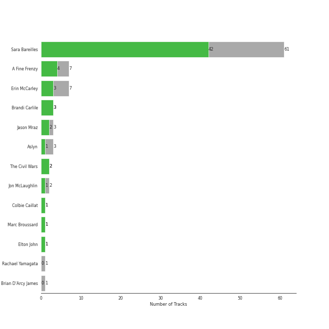
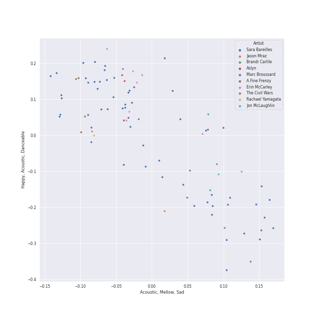
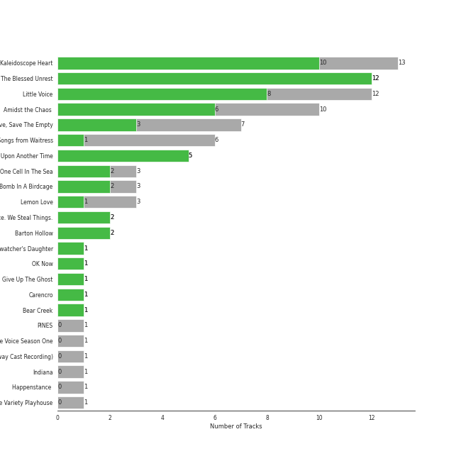

# acoustic pop

[87 songs](acoustic_pop_tracks.md)

## Top Artists

See all 11 artists

| Art | Tracks | 💚 | Artist | 🔗 |
|:---|---:|---:|:---|:---|
|  | 59 | 41 | [Sara Bareilles](../artists/sara_bareilles.md) | [🔗](https://open.spotify.com/artist/2Sqr0DXoaYABbjBo9HaMkM) |
|  | 7 | 4 | A Fine Frenzy | [🔗](https://open.spotify.com/artist/5dTYaRzOn4rXGBLH052EeQ) |
|  | 7 | 3 | Erin McCarley | [🔗](https://open.spotify.com/artist/6Y4bCmUNPDKqc7dHkVvgim) |
|  | 3 | 2 | Jason Mraz | [🔗](https://open.spotify.com/artist/4phGZZrJZRo4ElhRtViYdl) |
|  | 3 | 1 | Aslyn | [🔗](https://open.spotify.com/artist/6seR0G84QQq1NIW844E7Qq) |
|  | 3 | 1 | KT Tunstall | [🔗](https://open.spotify.com/artist/5zzrJD2jXrE9dZ1AklRFcL) |
|  | 2 | 2 | The Civil Wars | [🔗](https://open.spotify.com/artist/6J7rw7NELJUCThPbAfyLIE) |
|  | 2 | 1 | Jon McLaughlin | [🔗](https://open.spotify.com/artist/6z29S0IoiBJpSMP8plyCj7) |
|  | 1 | 1 | Colbie Caillat | [🔗](https://open.spotify.com/artist/6aZyMrc4doVtZyKNilOmwu) |
|  | 1 | 1 | Marc Broussard | [🔗](https://open.spotify.com/artist/4cEwEednPwWCdYT7ZhROZe) |
|  | 1 | 0 | Rachael Yamagata | [🔗](https://open.spotify.com/artist/7w0qj2HiAPIeUcoPogvOZ6) |

## Top Albums

See all 19 albums

| Art | Tracks | 💚 | Album | Release Date | 🔗 |
|:---|---:|---:|:---|:---|:---|
|  | 13 | 10 | Kaleidoscope Heart | 2010-09-07 | [🔗](https://open.spotify.com/album/627ukPRwYxyBREHxBq0vGJ) |
|  | 12 | 11 | The Blessed Unrest | 2013-07-16 | [🔗](https://open.spotify.com/album/7lpbyGc4fHsQkBTsfWVBhp) |
|  | 12 | 8 | Little Voice | 2007-07-03 | [🔗](https://open.spotify.com/album/2Z9WUERfMjOgQ6ze9TcGbF) |
|  | 10 | 6 | Amidst the Chaos (Bonus Version) | 2019-05-10 | [🔗](https://open.spotify.com/album/5x2sDapUIdq0qk1ezff3gm) |
|  | 7 | 3 | Love, Save The Empty | 2009 | [🔗](https://open.spotify.com/album/1tF7625TFqvfzMbappj1pQ) |
|  | 6 | 1 | What's Inside: Songs from Waitress | 2015-11-06 | [🔗](https://open.spotify.com/album/1s6codM2ZAB008t9GTyaEk) |
|  | 5 | 5 | Once Upon Another Time | 2012-05-22 | [🔗](https://open.spotify.com/album/1PrqYZJRzGNf8AsSOraxnZ) |
|  | 3 | 2 | One Cell In The Sea | 2007 | [🔗](https://open.spotify.com/album/0Ot7MEgreG2R93aN42M9iK) |
|  | 3 | 2 | Bomb In A Birdcage | 2009-01-01 | [🔗](https://open.spotify.com/album/07IV5RxLvAUeZbcPm4zOzn) |
|  | 3 | 1 | Lemon Love | 2005-01-01 | [🔗](https://open.spotify.com/album/5YToJrWwzdA6W2NxxDoteE) |
|  | 3 | 1 | Eye To The Telescope | 2005-01-01 | [🔗](https://open.spotify.com/album/3j70PDKieTWQAwas3bPHRZ) |
|  | 2 | 2 | We Sing. We Dance. We Steal Things. | 2008-05-12 | [🔗](https://open.spotify.com/album/04G0YylSjvDQZrjOfE5jA5) |
|  | 2 | 2 | Barton Hollow | 2011-02-01 | [🔗](https://open.spotify.com/album/4uWgDFxGAp7XlVSHuVBv4E) |
|  | 1 | 1 | OK Now | 2008-01-01 | [🔗](https://open.spotify.com/album/3fKJJQFV6a61fnKYDDj2LU) |
|  | 1 | 1 | Carencro | 2004-08-03 | [🔗](https://open.spotify.com/album/15dP7BadtY55t9VvFlVrBA) |
|  | 1 | 0 | PINES | 2012-01-01 | [🔗](https://open.spotify.com/album/1876e9QcHkJ3Hgo4NqKXBN) |
|  | 1 | 0 | Indiana | 2007-01-01 | [🔗](https://open.spotify.com/album/2UpO4j1Zpptiwk3wbUIWmU) |
|  | 1 | 0 | Happenstance (Deluxe Version) | 2004-06-08 | [🔗](https://open.spotify.com/album/66p6CIMdxQFO3Igg9xo14a) |
|  | 1 | 0 | Brave Enough: Live at the Variety Playhouse | 2013-10-22 | [🔗](https://open.spotify.com/album/7L4ZgnQqEhCEsV9GnMeXtE) |

## Top Record Labels

See all 11 labels

| Tracks | 💚 | Label |
|---:|---:|:---|
| 59 | 41 | [Epic](../labels/epic.md) |
| 10 | 5 | [Virgin Records](../labels/virgin_records.md) |
| 7 | 3 | Universal (MT) |
| 3 | 1 | Relentless |
| 3 | 1 | [Capitol Records](../labels/capitol_records.md) |
| 2 | 2 | sensibility recordings |
| 2 | 2 | [Atlantic Records](../labels/atlantic_records.md) |
| 2 | 2 | ATG |
| 2 | 1 | Island Def Jam |
| 1 | 1 | Island Records |
| 1 | 0 | Private Music |

## Years

| 10 newest albums | 10 oldest albums |
|:---|:---|
| 
 Amidst the Chaos (Bonus Version) (2019-05-10)
 | 
 Happenstance (Deluxe Version) (2004-06-08)
 |
| 
 What's Inside: Songs from Waitress (2015-11-06)
 | 
 Carencro (2004-08-03)
 |
| 
 Brave Enough: Live at the Variety Playhouse (2013-10-22)
 | 
 Lemon Love (2005-01-01)
 |
| 
 The Blessed Unrest (2013-07-16)
 | 
 Eye To The Telescope (2005-01-01)
 |
| 
 Once Upon Another Time (2012-05-22)
 | 
 One Cell In The Sea (2007)
 |
| 
 PINES (2012-01-01)
 | 
 Indiana (2007-01-01)
 |
| 
 Barton Hollow (2011-02-01)
 | 
 Little Voice (2007-07-03)
 |
| 
 Kaleidoscope Heart (2010-09-07)
 | 
 OK Now (2008-01-01)
 |
| 
 Bomb In A Birdcage (2009-01-01)
 | 
 We Sing. We Dance. We Steal Things. (2008-05-12)
 |
| 
 Love, Save The Empty (2009)
 | 
 Love, Save The Empty (2009)
 |
## Audio Features

| 10 most Danceable tracks | 10 least Danceable tracks |
|:---|:---|
| Little Black Dress (0.787) | Stay (0.262) |
| Eden (0.776) | Gravity (0.27) |
| Electric Twist (0.773) | Once Upon Another Time (0.275) |
| Black Horse And The Cherry Tree (0.748) | Poison & Wine (0.285) |
| Blow Away (0.747) | City (0.319) |
| I Choose You (0.731) | Come Round Soon (0.338) |
| I'm Yours (0.703) | Bluebird (0.34) |
| I Didn't Plan It (0.695) | Bright Lights and Cityscapes (0.343) |
| Let The Rain (0.694) | Everything Changes (0.348) |
| Lie To Me (0.683) | We All Need Saving (0.35) |

| 10 most Energetic tracks | 10 least Energetic tracks |
|:---|:---|
| Hello/Goodbye (0.893) | Kaleidoscope Heart (0.0516) |
| Bad Idea (feat. Jason Mraz) (0.889) | Goodbye Yellow Brick Road - Live at the Variety Playhouse, Atlanta, GA - May 2013 (0.114) |
| Morningside (0.88) | Manhattan (0.168) |
| SleepWalking (0.874) | Bright Lights and Cityscapes (0.184) |
| Let The Rain (0.873) | Poison & Wine (0.186) |
| Gotta Get Over You (0.867) | Bluebird (0.203) |
| Love, Save The Empty (0.865) | Once Upon Another Time (0.216) |
| Bobble Head (0.862) | Almost Lover (0.24) |
| Fairytale (0.857) | What's Inside (0.242) |
| Brave (0.836) | We All Need Saving (0.263) |

| 10 most Speechy tracks | 10 least Speechy tracks |
|:---|:---|
| Home (0.128) | Satellite Call (0.0241) |
| Electric Twist (0.125) | Lemon Love (0.0244) |
| Opening Up (0.0936) | Whisper (0.0252) |
| Kaleidoscope Heart (0.0927) | Pitter-Pat (0.0256) |
| Come Round Soon (0.0776) | Machine Gun (0.0268) |
| Bad Idea (feat. Jason Mraz) (0.0704) | Orpheus (0.0269) |
| Black Horse And The Cherry Tree (0.0641) | Sweet As Whole (0.0275) |
| Fire (0.057) | Breathe Again (0.0278) |
| Eden (0.0562) | Islands (0.0284) |
| Little Black Dress (0.0554) | Poison & Wine (0.0288) |

| 10 most Acoustic tracks | 10 least Acoustic tracks |
|:---|:---|
| Bright Lights and Cityscapes (0.977) | Now Is The Start (0.00124) |
| Manhattan (0.972) | Brave (0.00502) |
| Goodbye Yellow Brick Road - Live at the Variety Playhouse, Atlanta, GA - May 2013 (0.959) | Many the Miles (0.00796) |
| Almost Lover (0.947) | Vegas (0.00881) |
| Bluebird (0.933) | Bad Idea (feat. Jason Mraz) (0.0168) |
| What's Inside (0.919) | Wicked Love (0.0178) |
| Once Upon Another Time (0.896) | Gonna Get Over You (0.0199) |
| Miss Simone (0.859) | Love Song (0.0208) |
| Gravity (0.834) | It's Not That Easy (0.0225) |
| Someone Who Loves Me (0.826) | Let The Rain (0.023) |

| 10 most Instrumental tracks | 10 least Instrumental tracks |
|:---|:---|
| Now Is The Start (0.0353) | Say You're Sorry (0.0) |
| Satellite Call (0.0318) | Sweet As Whole (0.0) |
| Islands (0.0261) | Lucky (0.0) |
| Armor (0.0145) | Come Round Soon (0.0) |
| Breathe Again (0.00655) | Black Horse And The Cherry Tree (0.0) |
| Miss Simone (0.00407) | Kaleidoscope Heart (0.0) |
| The Light (0.00375) | Everything Changes (0.0) |
| No Such Thing (0.00175) | I'm Yours (0.0) |
| Whisper (0.00168) | Wally (0.0) |
| Fire (0.00165) | Vegas (0.0) |

| 10 most Live tracks | 10 least Live tracks |
|:---|:---|
| Goodbye Yellow Brick Road - Live at the Variety Playhouse, Atlanta, GA - May 2013 (0.781) | Uncharted (0.0343) |
| Home (0.393) | Brave (0.0425) |
| Ashes And Wine (0.379) | Eden (0.0456) |
| Fire (0.363) | Chasing The Sun (0.0497) |
| Black Horse And The Cherry Tree (0.34) | King of Anything (0.0574) |
| Lemon Love (0.327) | Be Be Your Love (0.0667) |
| Let The Rain (0.297) | The Light (0.0691) |
| It's Not That Easy (0.274) | Islands (0.0699) |
| Pitter-Pat (0.263) | Blow Away (0.0701) |
| SleepWalking (0.26) | Whisper (0.0708) |

| 10 most Happy tracks | 10 least Happy tracks |
|:---|:---|
| I Choose You (0.947) | Once Upon Another Time (0.0551) |
| Black Horse And The Cherry Tree (0.917) | Islands (0.0863) |
| Blow Away (0.891) | Everything Changes (0.0983) |
| Electric Twist (0.858) | We All Need Saving (0.117) |
| Say You're Sorry (0.846) | Bluebird (0.161) |
| King of Anything (0.81) | What's Inside (0.162) |
| Home (0.795) | Almost Lover (0.167) |
| Lie To Me (0.795) | Goodbye Yellow Brick Road - Live at the Variety Playhouse, Atlanta, GA - May 2013 (0.168) |
| I Didn't Plan It (0.787) | She Used To Be Mine (0.172) |
| Bad Idea (feat. Jason Mraz) (0.787) | Stay (0.181) |
