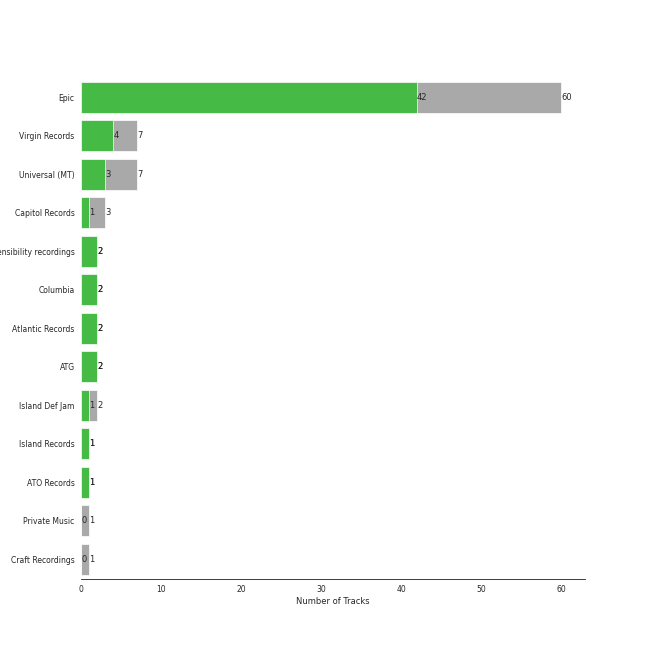

# acoustic pop

[86 songs](acoustic_pop_tracks.md)

## Top Artists

See all 12 artists

|   Number of Tracks | Art                                                                                              | Artist                                         | 🔗                                                           |
|-------------------:|:-------------------------------------------------------------------------------------------------|:-----------------------------------------------|:------------------------------------------------------------|
|                 59 |  | [Sara Bareilles](../artists/sara_bareilles.md) | [🔗](https://open.spotify.com/artist/2Sqr0DXoaYABbjBo9HaMkM) |
|                  7 |  | Erin McCarley                                  | [🔗](https://open.spotify.com/artist/6Y4bCmUNPDKqc7dHkVvgim) |
|                  7 |  | A Fine Frenzy                                  | [🔗](https://open.spotify.com/artist/5dTYaRzOn4rXGBLH052EeQ) |
|                  3 |  | Aslyn                                          | [🔗](https://open.spotify.com/artist/6seR0G84QQq1NIW844E7Qq) |
|                  3 |  | Jason Mraz                                     | [🔗](https://open.spotify.com/artist/4phGZZrJZRo4ElhRtViYdl) |
|                  2 |  | Jon McLaughlin                                 | [🔗](https://open.spotify.com/artist/6z29S0IoiBJpSMP8plyCj7) |
|                  2 |  | The Civil Wars                                 | [🔗](https://open.spotify.com/artist/6J7rw7NELJUCThPbAfyLIE) |
|                  1 |  | Rachael Yamagata                               | [🔗](https://open.spotify.com/artist/7w0qj2HiAPIeUcoPogvOZ6) |
|                  1 |  | Colbie Caillat                                 | [🔗](https://open.spotify.com/artist/6aZyMrc4doVtZyKNilOmwu) |
|                  1 |  | Gavin DeGraw                                   | [🔗](https://open.spotify.com/artist/5DYAABs8rkY9VhwtENoQCz) |
|                  1 |  | Marc Broussard                                 | [🔗](https://open.spotify.com/artist/4cEwEednPwWCdYT7ZhROZe) |
|                  1 |  | Brandi Carlile                                 | [🔗](https://open.spotify.com/artist/2sG4zTOLvjKG1PSoOyf5Ej) |

## Top Albums

See all 20 albums

|   Number of Tracks | Art                                                                                              | Album                                       | 🔗                                                          |
|-------------------:|:-------------------------------------------------------------------------------------------------|:--------------------------------------------|:-----------------------------------------------------------|
|                 13 |  | Kaleidoscope Heart                          | [🔗](https://open.spotify.com/album/627ukPRwYxyBREHxBq0vGJ) |
|                 12 |  | The Blessed Unrest                          | [🔗](https://open.spotify.com/album/7lpbyGc4fHsQkBTsfWVBhp) |
|                 12 |  | Little Voice                                | [🔗](https://open.spotify.com/album/2Z9WUERfMjOgQ6ze9TcGbF) |
|                 10 |  | Amidst the Chaos (Bonus Version)            | [🔗](https://open.spotify.com/album/5x2sDapUIdq0qk1ezff3gm) |
|                  7 |  | Love, Save The Empty                        | [🔗](https://open.spotify.com/album/1tF7625TFqvfzMbappj1pQ) |
|                  6 |  | What's Inside: Songs from Waitress          | [🔗](https://open.spotify.com/album/1s6codM2ZAB008t9GTyaEk) |
|                  5 |  | Once Upon Another Time                      | [🔗](https://open.spotify.com/album/1PrqYZJRzGNf8AsSOraxnZ) |
|                  3 |  | One Cell In The Sea                         | [🔗](https://open.spotify.com/album/0Ot7MEgreG2R93aN42M9iK) |
|                  3 |  | Lemon Love                                  | [🔗](https://open.spotify.com/album/5YToJrWwzdA6W2NxxDoteE) |
|                  3 |  | Bomb In A Birdcage                          | [🔗](https://open.spotify.com/album/07IV5RxLvAUeZbcPm4zOzn) |
|                  2 |  | We Sing. We Dance. We Steal Things.         | [🔗](https://open.spotify.com/album/04G0YylSjvDQZrjOfE5jA5) |
|                  2 |  | Barton Hollow                               | [🔗](https://open.spotify.com/album/4uWgDFxGAp7XlVSHuVBv4E) |
|                  1 |  | PINES                                       | [🔗](https://open.spotify.com/album/1876e9QcHkJ3Hgo4NqKXBN) |
|                  1 |  | OK Now                                      | [🔗](https://open.spotify.com/album/3fKJJQFV6a61fnKYDDj2LU) |
|                  1 |  | Indiana                                     | [🔗](https://open.spotify.com/album/2UpO4j1Zpptiwk3wbUIWmU) |
|                  1 |  | Happenstance (Deluxe Version)               | [🔗](https://open.spotify.com/album/66p6CIMdxQFO3Igg9xo14a) |
|                  1 |  | Chariot - Stripped                          | [🔗](https://open.spotify.com/album/0Fm4Qx8IVHEEBYPeRzNUGI) |
|                  1 |  | Carencro                                    | [🔗](https://open.spotify.com/album/15dP7BadtY55t9VvFlVrBA) |
|                  1 |  | Brave Enough: Live at the Variety Playhouse | [🔗](https://open.spotify.com/album/7L4ZgnQqEhCEsV9GnMeXtE) |
|                  1 |  | Bear Creek                                  | [🔗](https://open.spotify.com/album/5b8YTIrc88vdnfRguZqvVE) |

## Top Record Labels

See all 12 labels

|   Number of Tracks | Label                                                         |
|-------------------:|:--------------------------------------------------------------|
|                 59 | [Epic](../labels/epic.md)                                     |
|                  7 | [Virgin Records](../labels/virgin_records.md)                 |
|                  7 | [Universal (MT)](../labels/universal__mt_.md)                 |
|                  3 | [Capitol Records](../labels/capitol_records.md)               |
|                  2 | [sensibility recordings](../labels/sensibility_recordings.md) |
|                  2 | [Island Def Jam](../labels/island_def_jam.md)                 |
|                  2 | [Atlantic Records](../labels/atlantic_records.md)             |
|                  2 | [ATG](../labels/atg.md)                                       |
|                  1 | [Private Music](../labels/private_music.md)                   |
|                  1 | [J Records](../labels/j_records.md)                           |
|                  1 | [Island Records](../labels/island_records.md)                 |
|                  1 | [Columbia](../labels/columbia.md)                             |

## Audio Features

| 10 most Danceable tracks   | 10 least Danceable tracks    |
|:---------------------------|:-----------------------------|
| Little Black Dress         | Everything Changes           |
| Eden                       | Bright Lights and Cityscapes |
| Electric Twist             | Bluebird                     |
| Blow Away                  | Come Round Soon              |
| I Choose You               | City                         |
| I'm Yours                  | Poison & Wine                |
| I Didn't Plan It           | Chariot                      |
| Let The Rain               | Once Upon Another Time       |
| Lie To Me                  | Gravity                      |
| No Such Thing              | Stay                         |

| 10 most Energetic tracks    | 10 least Energetic tracks                                                         |
|:----------------------------|:----------------------------------------------------------------------------------|
| Hello/Goodbye               | We All Need Saving                                                                |
| Bad Idea (feat. Jason Mraz) | What's Inside                                                                     |
| Morningside                 | Almost Lover                                                                      |
| SleepWalking                | Once Upon Another Time                                                            |
| Let The Rain                | Bluebird                                                                          |
| Gotta Get Over You          | Poison & Wine                                                                     |
| Love, Save The Empty        | Bright Lights and Cityscapes                                                      |
| Bobble Head                 | Manhattan                                                                         |
| Fairytale                   | Goodbye Yellow Brick Road - Live at the Variety Playhouse, Atlanta, GA - May 2013 |
| Brave                       | Kaleidoscope Heart                                                                |

| 10 most Speechy tracks      | 10 least Speechy tracks   |
|:----------------------------|:--------------------------|
| Home                        | Poison & Wine             |
| Electric Twist              | Islands                   |
| Opening Up                  | Breathe Again             |
| Kaleidoscope Heart          | Sweet As Whole            |
| Come Round Soon             | Orpheus                   |
| Bad Idea (feat. Jason Mraz) | Machine Gun               |
| Fire                        | Pitter-Pat                |
| Eden                        | Whisper                   |
| Little Black Dress          | Lemon Love                |
| Bobble Head                 | Satellite Call            |

| 10 most Acoustic tracks                                                           | 10 least Acoustic tracks    |
|:----------------------------------------------------------------------------------|:----------------------------|
| Bright Lights and Cityscapes                                                      | Let The Rain                |
| Manhattan                                                                         | It's Not That Easy          |
| Goodbye Yellow Brick Road - Live at the Variety Playhouse, Atlanta, GA - May 2013 | Love Song                   |
| Almost Lover                                                                      | Gonna Get Over You          |
| Bluebird                                                                          | Wicked Love                 |
| What's Inside                                                                     | Bad Idea (feat. Jason Mraz) |
| Once Upon Another Time                                                            | Vegas                       |
| Miss Simone                                                                       | Many the Miles              |
| Gravity                                                                           | Brave                       |
| Someone Who Loves Me                                                              | Now Is The Start            |

| 10 most Instrumental tracks   | 10 least Instrumental tracks   |
|:------------------------------|:-------------------------------|
| Now Is The Start              | She Used To Be Mine            |
| Satellite Call                | Opening Up                     |
| Islands                       | Bad Idea (feat. Jason Mraz)    |
| Armor                         | Everything Changes             |
| Breathe Again                 | If I Can't Have You            |
| Miss Simone                   | Industry                       |
| The Light                     | Little Black Dress             |
| No Such Thing                 | Hercules                       |
| Whisper                       | Once Upon Another Time         |
| Fire                          | Say You're Sorry               |

| 10 most Live tracks                                                               | 10 least Live tracks   |
|:----------------------------------------------------------------------------------|:-----------------------|
| Goodbye Yellow Brick Road - Live at the Variety Playhouse, Atlanta, GA - May 2013 | Whisper                |
| Home                                                                              | Blow Away              |
| Ashes And Wine                                                                    | Islands                |
| Chariot                                                                           | The Light              |
| Fire                                                                              | Be Be Your Love        |
| Lemon Love                                                                        | King of Anything       |
| Let The Rain                                                                      | Chasing The Sun        |
| It's Not That Easy                                                                | Eden                   |
| Pitter-Pat                                                                        | Brave                  |
| SleepWalking                                                                      | Uncharted              |

| 10 most Happy tracks        | 10 least Happy tracks                                                             |
|:----------------------------|:----------------------------------------------------------------------------------|
| I Choose You                | Stay                                                                              |
| Blow Away                   | She Used To Be Mine                                                               |
| Electric Twist              | Goodbye Yellow Brick Road - Live at the Variety Playhouse, Atlanta, GA - May 2013 |
| Say You're Sorry            | Almost Lover                                                                      |
| King of Anything            | What's Inside                                                                     |
| Lie To Me                   | Bluebird                                                                          |
| Home                        | We All Need Saving                                                                |
| Bad Idea (feat. Jason Mraz) | Everything Changes                                                                |
| I Didn't Plan It            | Islands                                                                           |
| Morningside                 | Once Upon Another Time                                                            |
