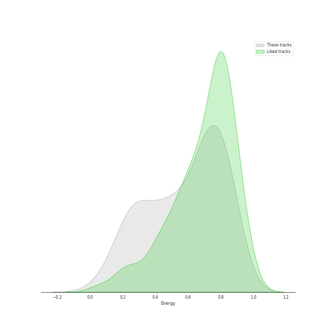
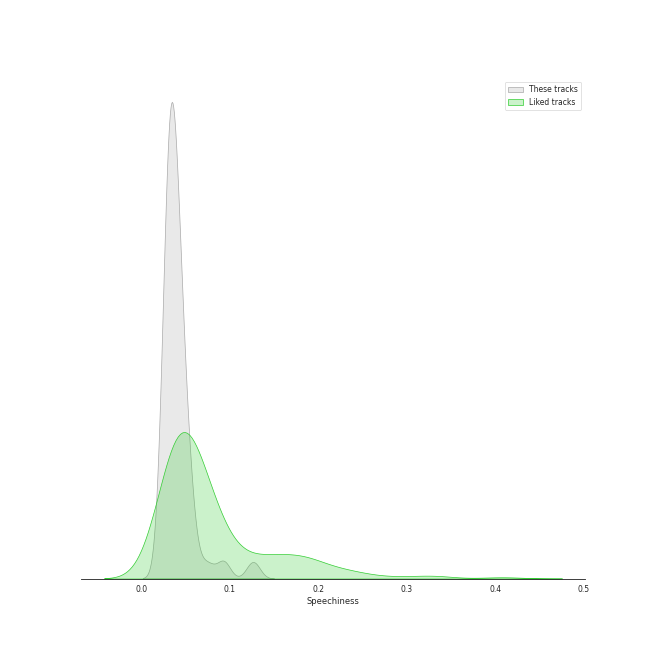
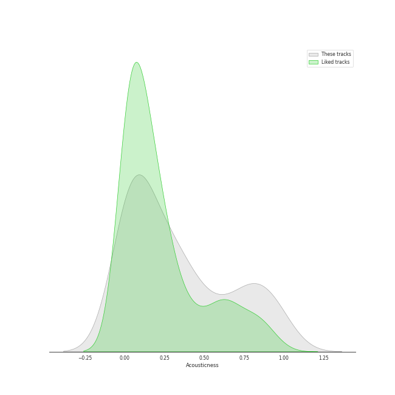
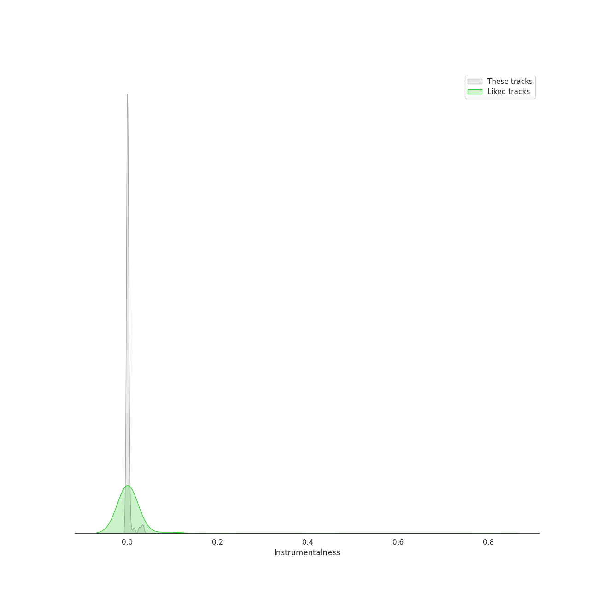
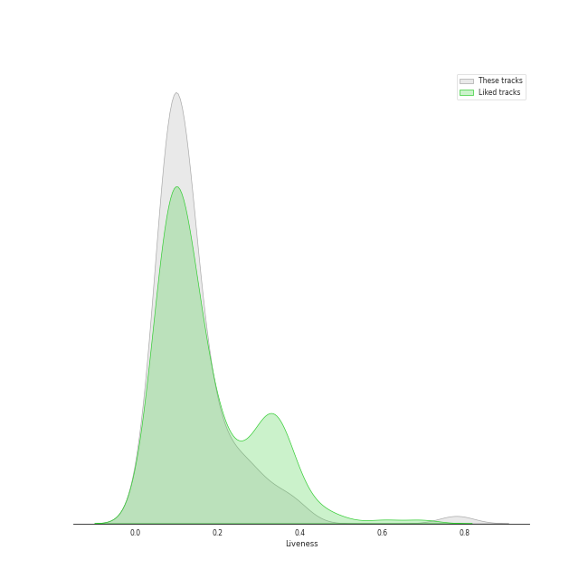
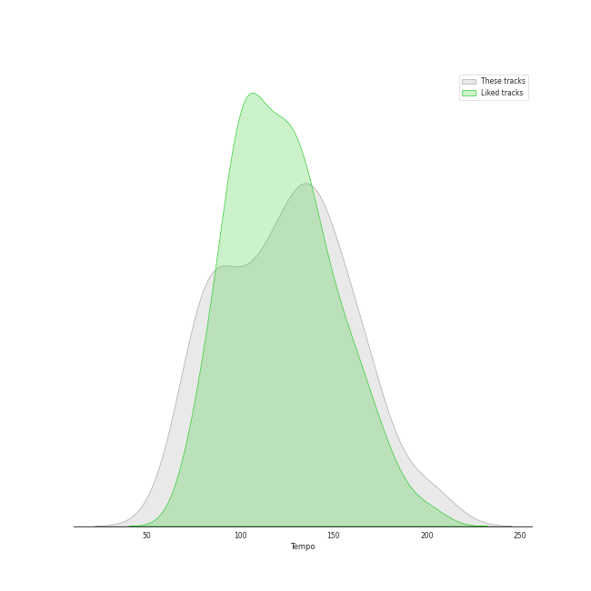

# Track Features for acoustic pop

## Danceability

| ​ | 10 most Danceable tracks | ​​ | 10 least Danceable tracks |
|:---|:---|:---|:---|
|  | Little Black Dress (0.787) |  | Stay (0.262) |
|  | Eden (0.776) |  | Gravity (0.27) |
|  | Electric Twist (0.773) |  | Once Upon Another Time (0.275) |
|  | Blow Away (0.747) |  | Poison & Wine (0.285) |
|  | I Choose You (0.731) |  | City (0.319) |
|  | I'm Yours (0.703) |  | Little Voice (0.321) |
|  | I Didn't Plan It (0.695) |  | Come Round Soon (0.338) |
|  | Let The Rain (0.694) |  | Bluebird (0.34) |
|  | Lie To Me (0.683) |  | Bright Lights and Cityscapes (0.343) |
|  | No Such Thing (0.677) |  | Everything Changes (0.348) |

## Energy

| ​ | 10 most Energetic tracks | ​​ | 10 least Energetic tracks |
|:---|:---|:---|:---|
|  | Hello/Goodbye (0.893) |  | Kaleidoscope Heart (0.0516) |
|  | Bad Idea (feat. Jason Mraz) (0.889) |  | Goodbye Yellow Brick Road - Live at the Variety Playhouse, Atlanta, GA - May 2013 (0.114) |
|  | Morningside (0.88) |  | Manhattan (0.168) |
|  | SleepWalking (0.874) |  | Bright Lights and Cityscapes (0.184) |
|  | Let The Rain (0.873) |  | Poison & Wine (0.186) |
|  | Gotta Get Over You (0.867) |  | Bluebird (0.203) |
|  | Love, Save The Empty (0.865) |  | Little Voice (0.208) |
|  | Bobble Head (0.862) |  | Once Upon Another Time (0.216) |
|  | Fairytale (0.857) |  | Almost Lover (0.24) |
|  | Brave (0.836) |  | What's Inside (0.242) |

## Speechiness

| ​ | 10 most Speechy tracks | ​​ | 10 least Speechy tracks |
|:---|:---|:---|:---|
|  | Home (0.128) |  | Satellite Call (0.0241) |
|  | Electric Twist (0.125) |  | Lemon Love (0.0244) |
|  | Opening Up (0.0936) |  | Whisper (0.0252) |
|  | Kaleidoscope Heart (0.0927) |  | Pitter-Pat (0.0256) |
|  | Come Round Soon (0.0776) |  | Machine Gun (0.0268) |
|  | Bad Idea (feat. Jason Mraz) (0.0704) |  | Orpheus (0.0269) |
|  | Fire (0.057) |  | Sweet As Whole (0.0275) |
|  | Eden (0.0562) |  | Breathe Again (0.0278) |
|  | Little Black Dress (0.0554) |  | Islands (0.0284) |
|  | Bobble Head (0.0547) |  | Poison & Wine (0.0288) |

## Acousticness

| ​ | 10 most Acoustic tracks | ​​ | 10 least Acoustic tracks |
|:---|:---|:---|:---|
|  | Bright Lights and Cityscapes (0.977) |  | Now Is The Start (0.00124) |
|  | Manhattan (0.972) |  | Brave (0.00502) |
|  | Goodbye Yellow Brick Road - Live at the Variety Playhouse, Atlanta, GA - May 2013 (0.959) |  | Many the Miles (0.00796) |
|  | Almost Lover (0.947) |  | Vegas (0.00881) |
|  | Bluebird (0.933) |  | Bad Idea (feat. Jason Mraz) (0.0168) |
|  | What's Inside (0.919) |  | Wicked Love (0.0178) |
|  | Once Upon Another Time (0.896) |  | Gonna Get Over You (0.0199) |
|  | Little Voice (0.89) |  | Love Song (0.0208) |
|  | Miss Simone (0.859) |  | It's Not That Easy (0.0225) |
|  | Gravity (0.834) |  | Let The Rain (0.023) |

## Instrumentalness

| ​ | 10 most Instrumental tracks | ​​ | 10 least Instrumental tracks |
|:---|:---|:---|:---|
|  | Now Is The Start (0.0353) |  | Say You're Sorry (0.0) |
|  | Satellite Call (0.0318) |  | Sweet As Whole (0.0) |
|  | Islands (0.0261) |  | Lucky (0.0) |
|  | Armor (0.0145) |  | Come Round Soon (0.0) |
|  | Breathe Again (0.00655) |  | Kaleidoscope Heart (0.0) |
|  | Miss Simone (0.00407) |  | Everything Changes (0.0) |
|  | The Light (0.00375) |  | I'm Yours (0.0) |
|  | No Such Thing (0.00175) |  | Wally (0.0) |
|  | Whisper (0.00168) |  | Vegas (0.0) |
|  | Fire (0.00165) |  | Hercules (0.0) |

## Liveness

| ​ | 10 most Live tracks | ​​ | 10 least Live tracks |
|:---|:---|:---|:---|
|  | Goodbye Yellow Brick Road - Live at the Variety Playhouse, Atlanta, GA - May 2013 (0.781) |  | Uncharted (0.0343) |
|  | Home (0.393) |  | Brave (0.0425) |
|  | Ashes And Wine (0.379) |  | Eden (0.0456) |
|  | Fire (0.363) |  | Chasing The Sun (0.0497) |
|  | Lemon Love (0.327) |  | King of Anything (0.0574) |
|  | Let The Rain (0.297) |  | Be Be Your Love (0.0667) |
|  | It's Not That Easy (0.274) |  | The Light (0.0691) |
|  | Pitter-Pat (0.263) |  | Islands (0.0699) |
|  | SleepWalking (0.26) |  | Blow Away (0.0701) |
|  | Not Alone (0.256) |  | Whisper (0.0708) |

## Valence

| ​ | 10 most Happy tracks | ​​ | 10 least Happy tracks |
|:---|:---|:---|:---|
|  | I Choose You (0.947) |  | Once Upon Another Time (0.0551) |
|  | Blow Away (0.891) |  | Islands (0.0863) |
|  | Electric Twist (0.858) |  | Everything Changes (0.0983) |
|  | Say You're Sorry (0.846) |  | We All Need Saving (0.117) |
|  | King of Anything (0.81) |  | Little Voice (0.134) |
|  | Home (0.795) |  | Bluebird (0.161) |
|  | Lie To Me (0.795) |  | What's Inside (0.162) |
|  | I Didn't Plan It (0.787) |  | Almost Lover (0.167) |
|  | Bad Idea (feat. Jason Mraz) (0.787) |  | Goodbye Yellow Brick Road - Live at the Variety Playhouse, Atlanta, GA - May 2013 (0.168) |
|  | Morningside (0.785) |  | She Used To Be Mine (0.172) |

## Tempo

| ​ | 10 most Fast tracks | ​​ | 10 least Fast tracks |
|:---|:---|:---|:---|
|  | Uncharted (203.962) |  | What's Inside (63.218) |
|  | Little Voice (203.518) |  | Bright Lights and Cityscapes (66.509) |
|  | Brave (185.063) |  | We All Need Saving (74.717) |
|  | Wicked Love (179.894) |  | Come Round Soon (74.751) |
|  | Bobble Head (171.94) |  | Basket Case (76.196) |
|  | Say You're Sorry (170.016) |  | Sticky-Sweet (77.028) |
|  | Breathe Again (169.677) |  | Armor (78.784) |
|  | Gravity (168.964) |  | Maybe They're Magic (79.303) |
|  | Bad Idea (feat. Jason Mraz) (167.936) |  | Vegas (79.999) |
|  | Eyes on You (165.97) |  | Islands (80.023) |
