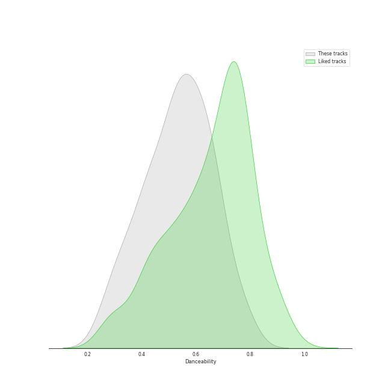
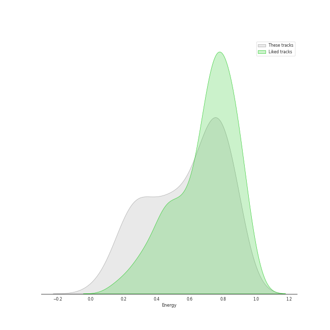
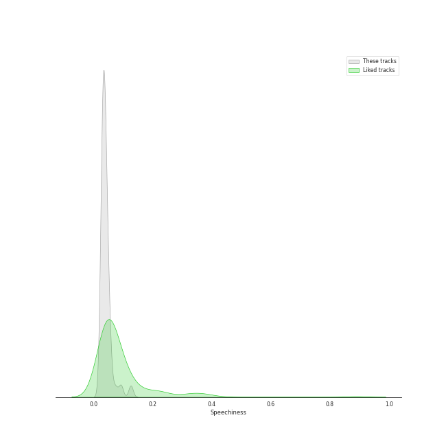
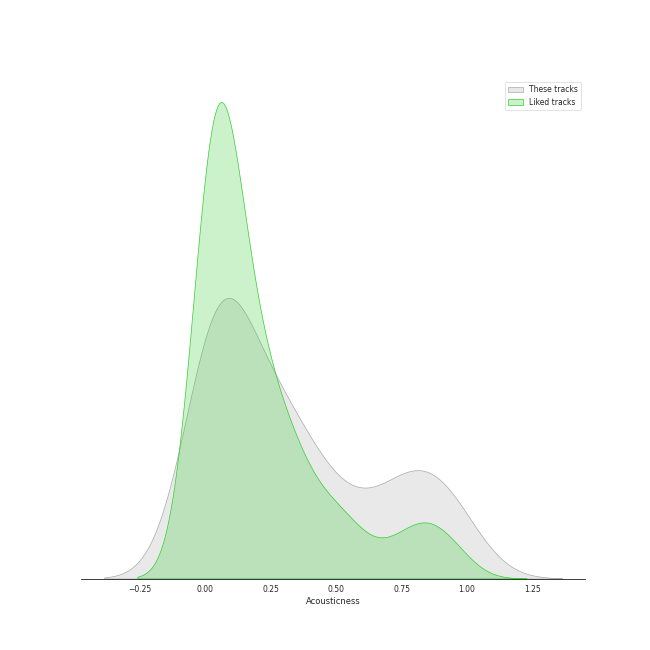
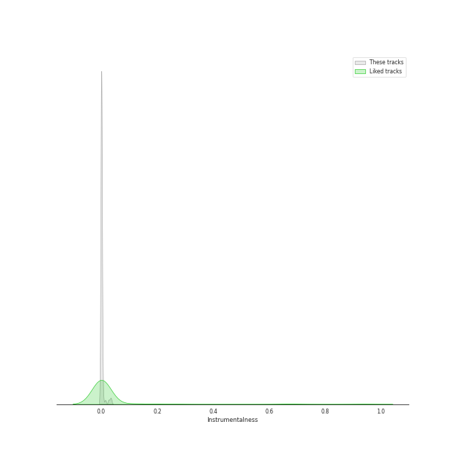
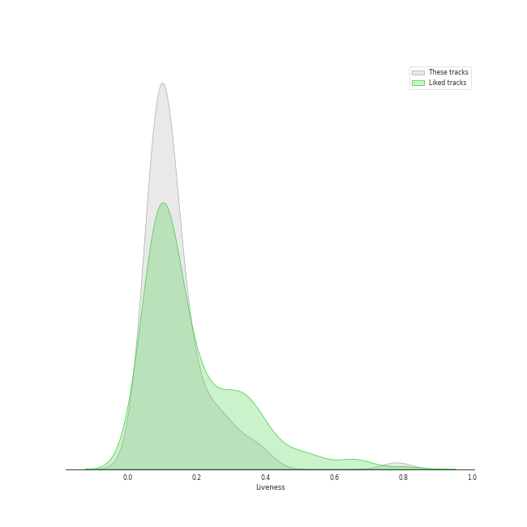
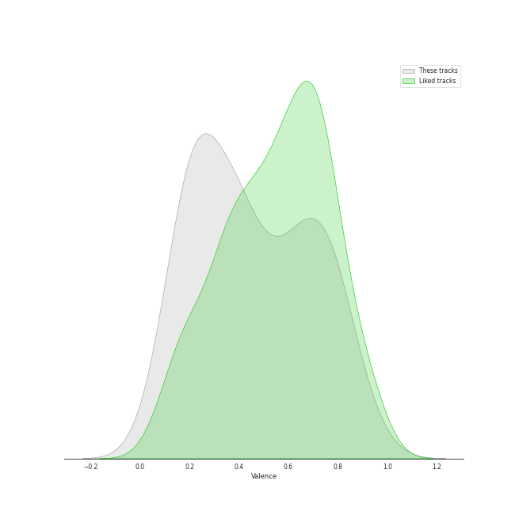
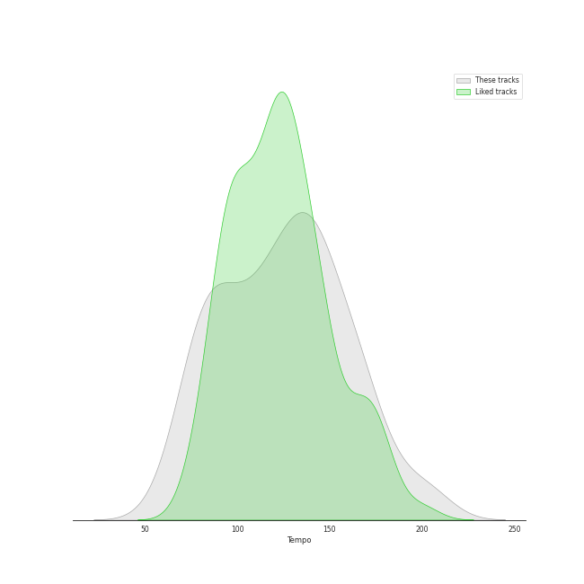

# Audio Features for acoustic pop

## Danceability

| 10 most Danceable tracks | 10 least Danceable tracks |
|:---|:---|
| Little Black Dress (0.787) | Stay (0.262) |
| Eden (0.776) | Gravity (0.27) |
| Electric Twist (0.773) | Once Upon Another Time (0.275) |
| Blow Away (0.747) | Poison & Wine (0.285) |
| I Choose You (0.731) | City (0.319) |
| I'm Yours (0.703) | Come Round Soon (0.338) |
| I Didn't Plan It (0.695) | Bluebird (0.34) |
| Let The Rain (0.694) | Bright Lights and Cityscapes (0.343) |
| Lie To Me (0.683) | Everything Changes (0.348) |
| No Such Thing (0.677) | We All Need Saving (0.35) |

## Energy

| 10 most Energetic tracks | 10 least Energetic tracks |
|:---|:---|
| Hello/Goodbye (0.893) | Kaleidoscope Heart (0.0516) |
| Bad Idea (feat. Jason Mraz) (0.889) | Goodbye Yellow Brick Road - Live at the Variety Playhouse, Atlanta, GA - May 2013 (0.114) |
| Morningside (0.88) | Manhattan (0.168) |
| SleepWalking (0.874) | Bright Lights and Cityscapes (0.184) |
| Let The Rain (0.873) | Poison & Wine (0.186) |
| Gotta Get Over You (0.867) | Bluebird (0.203) |
| Love, Save The Empty (0.865) | Once Upon Another Time (0.216) |
| Bobble Head (0.862) | Almost Lover (0.24) |
| Fairytale (0.857) | What's Inside (0.242) |
| Brave (0.836) | We All Need Saving (0.263) |

## Speechiness

| 10 most Speechy tracks | 10 least Speechy tracks |
|:---|:---|
| Home (0.128) | Satellite Call (0.0241) |
| Electric Twist (0.125) | Lemon Love (0.0244) |
| Opening Up (0.0936) | Whisper (0.0252) |
| Kaleidoscope Heart (0.0927) | Pitter-Pat (0.0256) |
| Come Round Soon (0.0776) | Machine Gun (0.0268) |
| Bad Idea (feat. Jason Mraz) (0.0704) | Orpheus (0.0269) |
| Fire (0.057) | Sweet As Whole (0.0275) |
| Eden (0.0562) | Breathe Again (0.0278) |
| Little Black Dress (0.0554) | Islands (0.0284) |
| Bobble Head (0.0547) | Poison & Wine (0.0288) |

## Acousticness

| 10 most Acoustic tracks | 10 least Acoustic tracks |
|:---|:---|
| Bright Lights and Cityscapes (0.977) | Now Is The Start (0.00124) |
| Manhattan (0.972) | Brave (0.00502) |
| Goodbye Yellow Brick Road - Live at the Variety Playhouse, Atlanta, GA - May 2013 (0.959) | Many the Miles (0.00796) |
| Almost Lover (0.947) | Vegas (0.00881) |
| Bluebird (0.933) | Bad Idea (feat. Jason Mraz) (0.0168) |
| What's Inside (0.919) | Wicked Love (0.0178) |
| Once Upon Another Time (0.896) | Gonna Get Over You (0.0199) |
| Miss Simone (0.859) | Love Song (0.0208) |
| Gravity (0.834) | It's Not That Easy (0.0225) |
| Someone Who Loves Me (0.826) | Let The Rain (0.023) |

## Instrumentalness

| 10 most Instrumental tracks | 10 least Instrumental tracks |
|:---|:---|
| Now Is The Start (0.0353) | Say You're Sorry (0.0) |
| Satellite Call (0.0318) | Sweet As Whole (0.0) |
| Islands (0.0261) | Lucky (0.0) |
| Armor (0.0145) | Come Round Soon (0.0) |
| Breathe Again (0.00655) | Kaleidoscope Heart (0.0) |
| Miss Simone (0.00407) | Everything Changes (0.0) |
| The Light (0.00375) | I'm Yours (0.0) |
| No Such Thing (0.00175) | Wally (0.0) |
| Whisper (0.00168) | Vegas (0.0) |
| Fire (0.00165) | Hercules (0.0) |

## Liveness

| 10 most Live tracks | 10 least Live tracks |
|:---|:---|
| Goodbye Yellow Brick Road - Live at the Variety Playhouse, Atlanta, GA - May 2013 (0.781) | Uncharted (0.0343) |
| Home (0.393) | Brave (0.0425) |
| Ashes And Wine (0.379) | Eden (0.0456) |
| Fire (0.363) | Chasing The Sun (0.0497) |
| Lemon Love (0.327) | King of Anything (0.0574) |
| Let The Rain (0.297) | Be Be Your Love (0.0667) |
| It's Not That Easy (0.274) | The Light (0.0691) |
| Pitter-Pat (0.263) | Islands (0.0699) |
| SleepWalking (0.26) | Blow Away (0.0701) |
| Not Alone (0.256) | Whisper (0.0708) |

## Valence

| 10 most Happy tracks | 10 least Happy tracks |
|:---|:---|
| I Choose You (0.947) | Once Upon Another Time (0.0551) |
| Blow Away (0.891) | Islands (0.0863) |
| Electric Twist (0.858) | Everything Changes (0.0983) |
| Say You're Sorry (0.846) | We All Need Saving (0.117) |
| King of Anything (0.81) | Bluebird (0.161) |
| Home (0.795) | What's Inside (0.162) |
| Lie To Me (0.795) | Almost Lover (0.167) |
| I Didn't Plan It (0.787) | Goodbye Yellow Brick Road - Live at the Variety Playhouse, Atlanta, GA - May 2013 (0.168) |
| Bad Idea (feat. Jason Mraz) (0.787) | She Used To Be Mine (0.172) |
| Morningside (0.785) | Stay (0.181) |

## Tempo

| 10 most Fast tracks | 10 least Fast tracks |
|:---|:---|
| Uncharted (203.962) | What's Inside (63.218) |
| Brave (185.063) | Bright Lights and Cityscapes (66.509) |
| Wicked Love (179.894) | We All Need Saving (74.717) |
| Bobble Head (171.94) | Come Round Soon (74.751) |
| Say You're Sorry (170.016) | Basket Case (76.196) |
| Breathe Again (169.677) | Sticky-Sweet (77.028) |
| Gravity (168.964) | Armor (78.784) |
| Bad Idea (feat. Jason Mraz) (167.936) | Vegas (79.999) |
| Eyes on You (165.97) | Islands (80.023) |
| Chasing The Sun (164.989) | Orpheus (80.365) |
