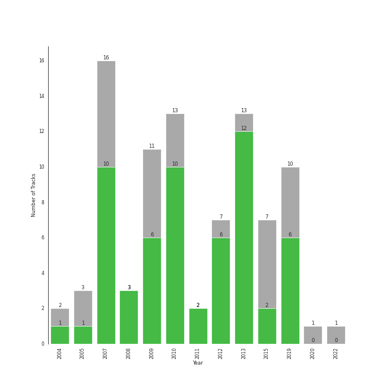

# acoustic pop

89 songs

[See Track Features](audio_features.md)

[See Clusters](clusters/overview.md)

## Top Artists

| Art | Tracks | 💚 | Artist | 🔗 |
|:---|---:|---:|:---|:---|
|  | 61 | 42 | [Sara Bareilles](../../artists/sara_bareilles/overview.md) | [🔗](https://open.spotify.com/artist/2Sqr0DXoaYABbjBo9HaMkM) |
|  | 7 | 4 | A Fine Frenzy | [🔗](https://open.spotify.com/artist/5dTYaRzOn4rXGBLH052EeQ) |
|  | 7 | 3 | Erin McCarley | [🔗](https://open.spotify.com/artist/6Y4bCmUNPDKqc7dHkVvgim) |
|  | 3 | 3 | Brandi Carlile | [🔗](https://open.spotify.com/artist/2sG4zTOLvjKG1PSoOyf5Ej) |
|  | 3 | 2 | Jason Mraz | [🔗](https://open.spotify.com/artist/4phGZZrJZRo4ElhRtViYdl) |
|  | 2 | 2 | The Civil Wars | [🔗](https://open.spotify.com/artist/6J7rw7NELJUCThPbAfyLIE) |
|  | 3 | 1 | Aslyn | [🔗](https://open.spotify.com/artist/6seR0G84QQq1NIW844E7Qq) |
|  | 2 | 1 | Jon McLaughlin | [🔗](https://open.spotify.com/artist/6z29S0IoiBJpSMP8plyCj7) |
|  | 1 | 1 | Colbie Caillat | [🔗](https://open.spotify.com/artist/6aZyMrc4doVtZyKNilOmwu) |
|  | 1 | 1 | Marc Broussard | [🔗](https://open.spotify.com/artist/4cEwEednPwWCdYT7ZhROZe) |

See all 12 artists

| Art | Tracks | 💚 | Artist | 🔗 |
|:---|---:|---:|:---|:---|
|  | 1 | 0 | Rachael Yamagata | [🔗](https://open.spotify.com/artist/7w0qj2HiAPIeUcoPogvOZ6) |
|  | 1 | 0 | Brian D'Arcy James | [🔗](https://open.spotify.com/artist/3oYQrBzEQNpxnjWXP54B4n) |

## Most and least listened tracks
| ​ | Most listened tracks | Rank | ​​ | Least listened tracks | Rank |
|:---|:---|---:|:---|:---|---:|
|  | [Machine Gun](../../artists/sara_bareilles/overview.md) | 229 |  | [Say You're Sorry](../../artists/sara_bareilles/overview.md) | nan |
|  | [Between the Lines](../../artists/sara_bareilles/overview.md) | 279 |  | [Sweet As Whole](../../artists/sara_bareilles/overview.md) | nan |
|  | [Many the Miles](../../artists/sara_bareilles/overview.md) | 289 |  | [Satellite Call](../../artists/sara_bareilles/overview.md) | nan |
|  | [Fairytale](../../artists/sara_bareilles/overview.md) | 324 |  | The Eye | nan |
|  | [Lie To Me](../../artists/sara_bareilles/overview.md) | 376 |  | [Breathe Again](../../artists/sara_bareilles/overview.md) | nan |
|  | [I Choose You](../../artists/sara_bareilles/overview.md) | 425 |  | [Come Round Soon](../../artists/sara_bareilles/overview.md) | nan |
|  | Poison & Wine | 460 |  | [Eden](../../artists/sara_bareilles/overview.md) | nan |
|  | [Manhattan](../../artists/sara_bareilles/overview.md) | 497 |  | [Eyes on You](../../artists/sara_bareilles/overview.md) | nan |
|  | [Not Alone](../../artists/sara_bareilles/overview.md) | 599 |  | [Kaleidoscope Heart](../../artists/sara_bareilles/overview.md) | nan |
|  | [Poetry by Dead Men](../../artists/sara_bareilles/overview.md) | 630 |  | [Everything Changes](../../artists/sara_bareilles/overview.md) | nan |

## Top Albums

| Art | Tracks | 💚 | Album | Release Date | 🔗 |
|:---|---:|---:|:---|:---|:---|
|  | 13 | 10 | Kaleidoscope Heart | 2010-09-07 | [🔗](https://open.spotify.com/album/627ukPRwYxyBREHxBq0vGJ) |
|  | 12 | 12 | The Blessed Unrest | 2013-07-16 | [🔗](https://open.spotify.com/album/7lpbyGc4fHsQkBTsfWVBhp) |
|  | 12 | 8 | Little Voice | 2007-07-03 | [🔗](https://open.spotify.com/album/2Z9WUERfMjOgQ6ze9TcGbF) |
|  | 10 | 6 | Amidst the Chaos (Bonus Version) | 2019-05-10 | [🔗](https://open.spotify.com/album/5x2sDapUIdq0qk1ezff3gm) |
|  | 7 | 3 | Love, Save The Empty | 2009 | [🔗](https://open.spotify.com/album/1tF7625TFqvfzMbappj1pQ) |
|  | 6 | 1 | What's Inside: Songs from Waitress | 2015-11-06 | [🔗](https://open.spotify.com/album/1s6codM2ZAB008t9GTyaEk) |
|  | 5 | 5 | Once Upon Another Time | 2012-05-22 | [🔗](https://open.spotify.com/album/1PrqYZJRzGNf8AsSOraxnZ) |
|  | 3 | 2 | One Cell In The Sea | 2007 | [🔗](https://open.spotify.com/album/0Ot7MEgreG2R93aN42M9iK) |
|  | 3 | 2 | Bomb In A Birdcage | 2009-01-01 | [🔗](https://open.spotify.com/album/07IV5RxLvAUeZbcPm4zOzn) |
|  | 3 | 1 | Lemon Love | 2005-01-01 | [🔗](https://open.spotify.com/album/5YToJrWwzdA6W2NxxDoteE) |

See all 23 albums

| Art | Tracks | 💚 | Album | Release Date | 🔗 |
|:---|---:|---:|:---|:---|:---|
|  | 2 | 2 | We Sing. We Dance. We Steal Things. | 2008-05-12 | [🔗](https://open.spotify.com/album/04G0YylSjvDQZrjOfE5jA5) |
|  | 2 | 2 | Barton Hollow | 2011-02-01 | [🔗](https://open.spotify.com/album/4uWgDFxGAp7XlVSHuVBv4E) |
|  | 1 | 1 | The Firewatcher's Daughter | 2015-03-06 | [🔗](https://open.spotify.com/album/5ZpxRLVRkCZ2BXXW1KYbTB) |
|  | 1 | 1 | OK Now | 2008-01-01 | [🔗](https://open.spotify.com/album/3fKJJQFV6a61fnKYDDj2LU) |
|  | 1 | 1 | Give Up The Ghost | 2009-10-05 | [🔗](https://open.spotify.com/album/1NhFksWs1Nsz6wQI8ysTkv) |
|  | 1 | 1 | Carencro | 2004-08-03 | [🔗](https://open.spotify.com/album/15dP7BadtY55t9VvFlVrBA) |
|  | 1 | 1 | Bear Creek | 2012-06-04 | [🔗](https://open.spotify.com/album/5b8YTIrc88vdnfRguZqvVE) |
|  | 1 | 0 | PINES | 2012-01-01 | [🔗](https://open.spotify.com/album/1876e9QcHkJ3Hgo4NqKXBN) |
|  | 1 | 0 | More Love - Songs from Little Voice Season One | 2020-09-04 | [🔗](https://open.spotify.com/album/52fzvqGSm991mT6pBgAS6g) |
|  | 1 | 0 | Into The Woods (2022 Broadway Cast Recording) | 2022-09-30 | [🔗](https://open.spotify.com/album/5z6BFXI711HbSAXDjgOAHE) |
|  | 1 | 0 | Indiana | 2007-01-01 | [🔗](https://open.spotify.com/album/2UpO4j1Zpptiwk3wbUIWmU) |
|  | 1 | 0 | Happenstance (Deluxe Version) | 2004-06-08 | [🔗](https://open.spotify.com/album/66p6CIMdxQFO3Igg9xo14a) |
|  | 1 | 0 | Brave Enough: Live at the Variety Playhouse | 2013-10-22 | [🔗](https://open.spotify.com/album/7L4ZgnQqEhCEsV9GnMeXtE) |

## Top Record Labels

| Tracks | 💚 | Label |
|---:|---:|:---|
| 60 | 42 | [Epic](../../labels/epic/overview.md) |
| 7 | 4 | [Virgin Records](../../labels/virgin_records/overview.md) |
| 7 | 3 | Universal (MT) |
| 2 | 2 | sensibility recordings |
| 2 | 2 | [Columbia](../../labels/columbia/overview.md) |
| 2 | 2 | [Atlantic Records](../../labels/atlantic_records/overview.md) |
| 2 | 2 | ATG |
| 3 | 1 | [Capitol Records](../../labels/capitol_records/overview.md) |
| 2 | 1 | Island Def Jam |
| 1 | 1 | [Island Records](../../labels/island_records/overview.md) |

See all 13 labels

| Tracks | 💚 | Label |
|---:|---:|:---|
| 1 | 1 | ATO Records |
| 1 | 0 | Private Music |
| 1 | 0 | [Craft Recordings](../../labels/craft_recordings/overview.md) |

## Top Producers

| Art | Producer | Tracks | Credit Types |
|:---|:---|---:|:---|
|  | [Sara Bareilles](../../artists/sara_bareilles/overview.md) | 32 | Lyricist, Songwriter, Producer |
| | John O'Mahony | 9 | Producer |
| | Kurt Uenala | 7 | Producer |
| | Neal Avron | 6 | Arranger, Producer |
| | T-Bone Burnett | 6 | Producer |
| | Jason Wormer | 6 | Producer |
| | Mark Endert | 3 | Producer |
|  | Jason Mraz | 2 | Lyricist, Songwriter, Producer |
| | Martin Terefe | 2 | Producer |
| | Jeremy Darby | 2 | Producer |

View all

| Art | Producer | Tracks | Credit Types |
|:---|:---|---:|:---|
| | [Jack Antonoff](../../producers/jack_antonoff/overview.md) | 2 | Songwriter |
|  | Brandi Carlile | 2 | Songwriter, Lyricist, Producer |
| | Lukas Burton | 2 | Producer, Songwriter |
| | Todor Kobakov | 2 | Arranger |
| | Alison Sudol | 2 | Lyricist, Songwriter |
| | Tim Hanseroth | 2 | Songwriter, Producer |
| | Mike Piersante | 2 | Producer |
| | Hal Cragin | 2 | Producer, Songwriter |
| | Matt Hales | 2 | Songwriter |
| | Javier Dunn | 1 | Songwriter |
| | Zachary Dawes | 1 | Producer |
| | Tommy Walter | 1 | Producer |
| | Jason Hall | 1 | Producer |
| | Patrick Benson | 1 | Producer |
| | Pete Harper | 1 | Songwriter |
| | Phil Hanseroth | 1 | Producer |
| | Aaron Sterling | 1 | Songwriter |
| | Jason Blynn | 1 | Songwriter |
| | Suzie Katayama | 1 | Arranger |
|  | Colbie Caillat | 1 | Songwriter |
| | Jay Joyce | 1 | Producer |
| | Joe Zook | 1 | Producer |
| | Lori McKenna | 1 | Songwriter |
| | Iain Hill | 1 | Producer |
| | Timothy Fagan | 1 | Songwriter |
|  | Emily King | 1 | Songwriter |
| | Drew Ramsey | 1 | Producer |
| | Eric Rosse | 1 | Producer |
| | Mike Anderson | 1 | Songwriter |
| | Hal Y. Burton | 1 | Producer |
| | Justin Tranter | 1 | Songwriter |
| | Joseph Lorge | 1 | Producer |
| | Michael Brauer | 1 | Producer |
| | Marshall Altman | 1 | Arranger, Producer |
| | Trina Shoemaker | 1 | Producer |
| | Dyre Gormsen | 1 | Producer |
| | [Tony Maserati](../../producers/tony_maserati/overview.md) | 1 | Producer |
| | Shannon Sanders | 1 | Producer |
| | Carl Lieberman, RPT | 1 | Producer |
| | Jon Ervie | 1 | Producer |
| | Sam Farrar | 1 | Songwriter |

## Years

| ​ | 10 newest albums | ​​ | 10 oldest albums |
|:---|:---|:---|:---|
|  | Into The Woods (2022 Broadway Cast Recording) (2022-09-30) |  | Happenstance (Deluxe Version) (2004-06-08) |
|  | More Love - Songs from Little Voice Season One (2020-09-04) |  | Carencro (2004-08-03) |
|  | Amidst the Chaos (Bonus Version) (2019-05-10) |  | Lemon Love (2005-01-01) |
|  | What's Inside: Songs from Waitress (2015-11-06) |  | One Cell In The Sea (2007) |
|  | The Firewatcher's Daughter (2015-03-06) |  | Indiana (2007-01-01) |
|  | Brave Enough: Live at the Variety Playhouse (2013-10-22) |  | Little Voice (2007-07-03) |
|  | The Blessed Unrest (2013-07-16) |  | OK Now (2008-01-01) |
|  | Bear Creek (2012-06-04) |  | We Sing. We Dance. We Steal Things. (2008-05-12) |
|  | Once Upon Another Time (2012-05-22) |  | Love, Save The Empty (2009) |
|  | PINES (2012-01-01) |  | Bomb In A Birdcage (2009-01-01) |

