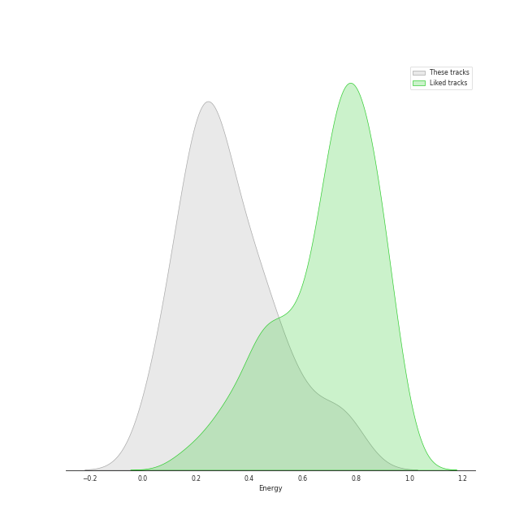
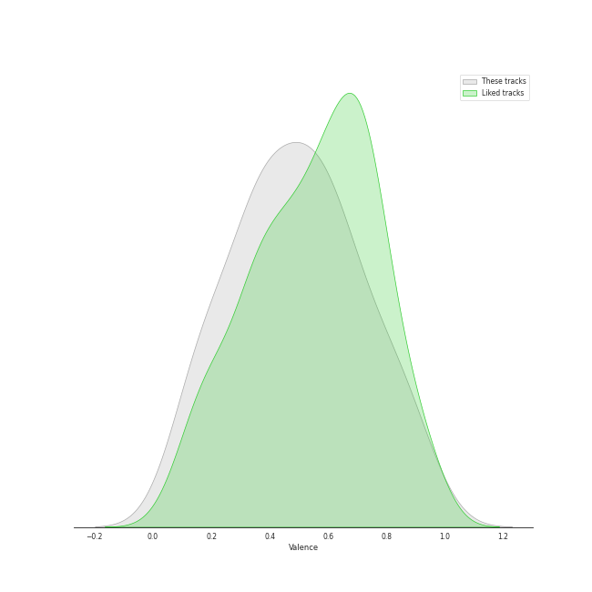

# Audio Features for adult standards

## Danceability

| 10 most Danceable tracks | 10 least Danceable tracks |
|:---|:---|
| I Wan'na Be Like You (The Monkey Song) (0.746) | Nature Boy (0.203) |
| Baby It's Cold Outside (0.724) | The Christmas Song (0.226) |
| Everything (0.686) | Can't Help Falling in Love (0.234) |
| Someday (feat. Meghan Trainor) (0.671) | Strangers In The Night (0.259) |
| Fly Me To The Moon (In Other Words) (0.668) | Unforgettable (0.286) |
| Let It Snow! Let It Snow! Let It Snow! (with The B. Swanson Quartet) (0.652) | White Christmas (0.317) |
| The Best Is yet to Come (0.647) | The Christmas Song (Merry Christmas To You) (0.319) |
| The Way You Look Tonight (0.642) | It's Beginning to Look a Lot like Christmas (0.339) |
| Santa Baby (0.641) | Unforgettable (0.349) |
| Call Me Irresponsible (0.639) | Let It Snow! Let It Snow! Let It Snow! (0.451) |

## Energy

| 10 most Energetic tracks | 10 least Energetic tracks |
|:---|:---|
| Can't Take My Eyes off You (0.764) | Baby It's Cold Outside (0.0813) |
| Haven't Met You Yet (0.733) | Nature Boy (0.0895) |
| Everything (0.688) | Santa Baby (0.0964) |
| Moondance (0.614) | White Christmas (0.158) |
| Frosty the Snowman (feat. The Puppini Sisters) (0.591) | The Christmas Song (0.17) |
| Feeling Good (0.548) | Unforgettable (0.182) |
| Someday (feat. Meghan Trainor) (0.539) | L-O-V-E - 2000 Remaster (0.187) |
| Cry Me a River (0.483) | Baby, It's Cold Outside (0.196) |
| The Way You Look Tonight (0.483) | The Christmas Song (Merry Christmas To You) (0.21) |
| Strangers In The Night (0.473) | It's Beginning To Look Like Christmas (0.212) |

## Speechiness

| 10 most Speechy tracks | 10 least Speechy tracks |
|:---|:---|
| Baby, It's Cold Outside (with Dorothy Kirsten) (0.131) | Everything (0.0254) |
| I Wan'na Be Like You (The Monkey Song) (0.0995) | Unforgettable (0.028) |
| L-O-V-E - 2000 Remaster (0.0928) | The Way You Look Tonight (0.028) |
| Can't Take My Eyes off You (0.0746) | Call Me Irresponsible (0.0292) |
| Moondance (0.0737) | Can't Help Falling in Love (0.0293) |
| That's Life (0.0729) | La vie en rose (feat. Cécile McLorin Salvant) (0.0294) |
| The Best Is yet to Come (0.0691) | Strangers In The Night (0.0295) |
| Fly Me To The Moon - 2008 Remastered (0.06) | Home (0.0301) |
| Let It Snow! Let It Snow! Let It Snow! (with The B. Swanson Quartet) (0.0595) | Unforgettable (0.031) |
| Baby, It's Cold Outside (0.0571) | Sunny (0.0331) |

## Acousticness

| 10 most Acoustic tracks | 10 least Acoustic tracks |
|:---|:---|
| Nature Boy (0.971) | Easy (0.112) |
| Baby, It's Cold Outside (with Dorothy Kirsten) (0.963) | Haven't Met You Yet (0.152) |
| Baby It's Cold Outside (0.931) | Someday (feat. Meghan Trainor) (0.18) |
| Unforgettable (0.92) | The Best Is yet to Come (0.355) |
| The Christmas Song (Merry Christmas To You) (0.92) | Everything (0.39) |
| Let It Snow! Let It Snow! Let It Snow! (0.912) | I've Got You Under My Skin - Remastered 1998 (0.452) |
| It's Beginning to Look a Lot like Christmas (0.908) | Fly Me To The Moon (In Other Words) (0.453) |
| Let It Snow! Let It Snow! Let It Snow! (with The B. Swanson Quartet) (0.903) | Sunny (0.494) |
| Baby, It's Cold Outside (0.882) | Feeling Good (0.533) |
| The Christmas Song (0.872) | L-O-V-E (0.543) |

## Instrumentalness

| 10 most Instrumental tracks | 10 least Instrumental tracks |
|:---|:---|
| White Christmas (0.353) | The Way You Look Tonight (0.0) |
| Nature Boy (0.0213) | Someday (feat. Meghan Trainor) (0.0) |
| Unforgettable (0.0152) | La vie en rose (feat. Cécile McLorin Salvant) (0.0) |
| Can't Help Falling in Love (0.0111) | Moondance (0.0) |
| The Way You Look Tonight (0.000282) | Frosty the Snowman (feat. The Puppini Sisters) (0.0) |
| Baby, It's Cold Outside (with Dorothy Kirsten) (0.000253) | Rockin' Around The Christmas Tree (0.0) |
| I Wan'na Be Like You (The Monkey Song) (0.000238) | It's Beginning To Look Like Christmas (0.0) |
| Unforgettable (0.000138) | That's Life (0.0) |
| The Christmas Song (0.000119) | Baby, It's Cold Outside (0.0) |
| Call Me Irresponsible (8.68e-05) | Haven't Met You Yet (0.0) |

## Liveness

| 10 most Live tracks | 10 least Live tracks |
|:---|:---|
| Baby, It's Cold Outside (with Dorothy Kirsten) (0.706) | Baby, It's Cold Outside (0.0513) |
| Rockin' Around The Christmas Tree (0.505) | Easy (0.0596) |
| Moondance (0.401) | Fly Me To The Moon (In Other Words) (0.0621) |
| Sunny (0.37) | Can't Take My Eyes off You (0.0692) |
| Let It Snow! Let It Snow! Let It Snow! (with The B. Swanson Quartet) (0.362) | Someday (feat. Meghan Trainor) (0.0748) |
| That's Life (0.346) | Cry Me a River (0.0754) |
| It's Beginning to Look a Lot like Christmas (0.341) | L-O-V-E - 2000 Remaster (0.0792) |
| White Christmas (0.338) | Fly Me To The Moon - 2008 Remastered (0.0797) |
| The Best Is yet to Come (0.296) | Unforgettable (0.0798) |
| I Wan'na Be Like You (The Monkey Song) (0.281) | Can't Help Falling in Love (0.0922) |

## Valence

| 10 most Happy tracks | 10 least Happy tracks |
|:---|:---|
| Someday (feat. Meghan Trainor) (0.934) | Can't Help Falling in Love (0.0969) |
| Rockin' Around The Christmas Tree (0.898) | Nature Boy (0.115) |
| Let It Snow! Let It Snow! Let It Snow! (with The B. Swanson Quartet) (0.836) | Unforgettable (0.142) |
| Frosty the Snowman (feat. The Puppini Sisters) (0.829) | The Christmas Song (0.162) |
| Haven't Met You Yet (0.796) | Unforgettable (0.178) |
| I Wan'na Be Like You (The Monkey Song) (0.795) | The Christmas Song (Merry Christmas To You) (0.209) |
| L-O-V-E - 2000 Remaster (0.728) | White Christmas (0.247) |
| Baby, It's Cold Outside (with Dorothy Kirsten) (0.703) | Sunny (0.296) |
| Let It Snow! Let It Snow! Let It Snow! (0.701) | Home (0.34) |
| That's Life (0.664) | La vie en rose (feat. Cécile McLorin Salvant) (0.342) |

## Tempo

| 10 most Fast tracks | 10 least Fast tracks |
|:---|:---|
| Can't Help Falling in Love (174.036) | La vie en rose (feat. Cécile McLorin Salvant) (63.378) |
| Nature Boy (173.451) | Come Fly With Me - Remastered 1998 (67.008) |
| The Christmas Song (163.863) | Rockin' Around The Christmas Tree (67.196) |
| L-O-V-E - 2000 Remaster (157.47) | Santa Baby (76.273) |
| Sleigh Ride (154.759) | The Christmas Song (Merry Christmas To You) (78.696) |
| Frosty the Snowman (feat. The Puppini Sisters) (147.381) | L-O-V-E (78.884) |
| Let It Snow! Let It Snow! Let It Snow! (with The B. Swanson Quartet) (142.169) | Unforgettable (85.691) |
| Moondance (140.736) | Strangers In The Night (90.348) |
| Unforgettable (136.094) | It's Beginning to Look a Lot like Christmas (94.775) |
| Let It Snow! Let It Snow! Let It Snow! (134.009) | Someday (feat. Meghan Trainor) (94.98) |
