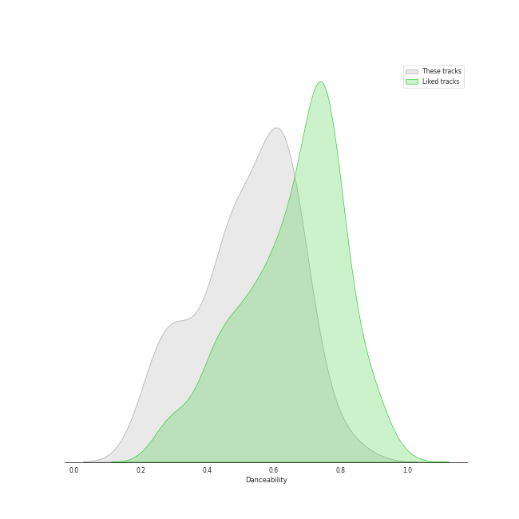
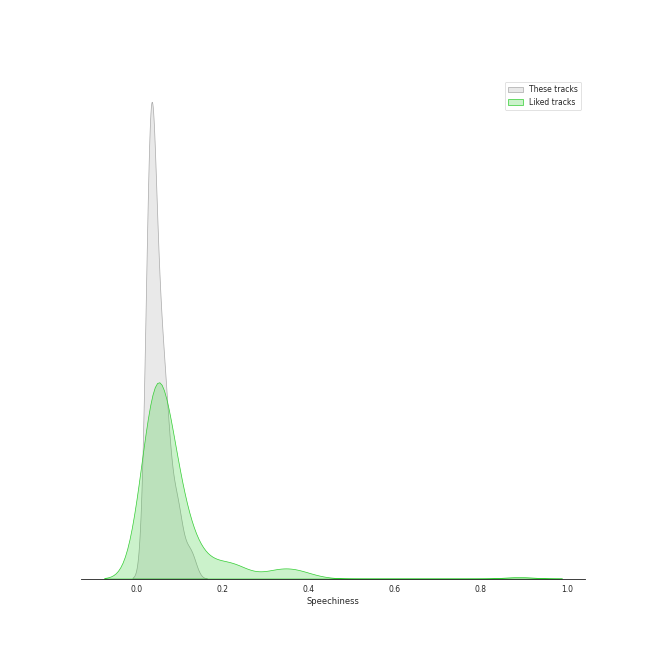
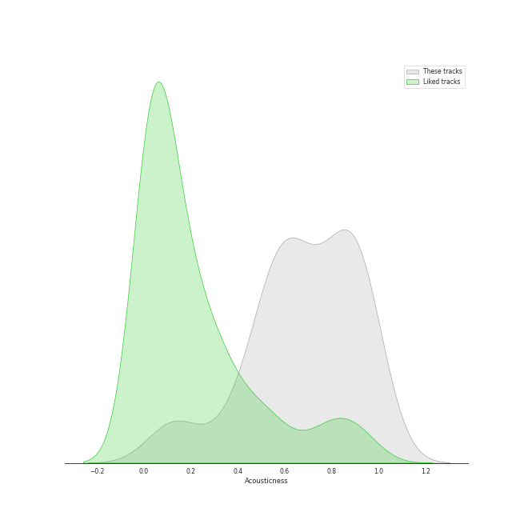
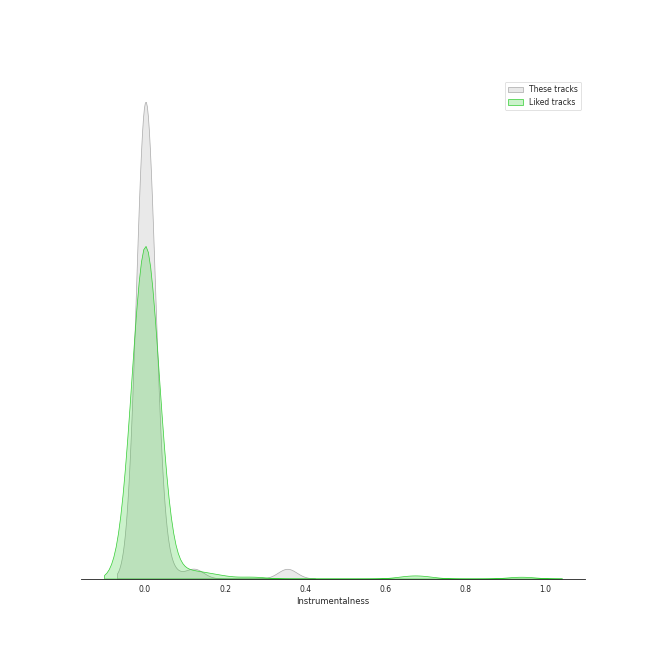
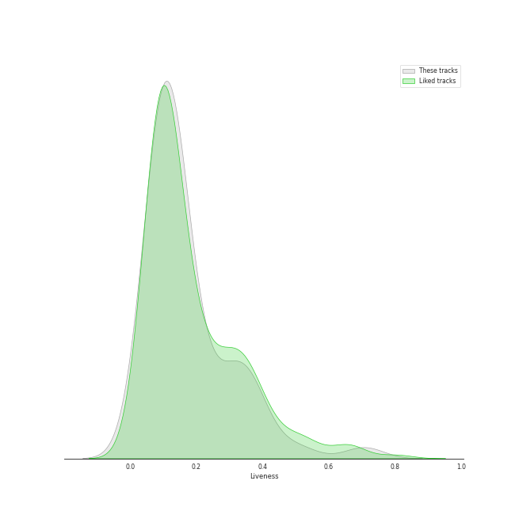
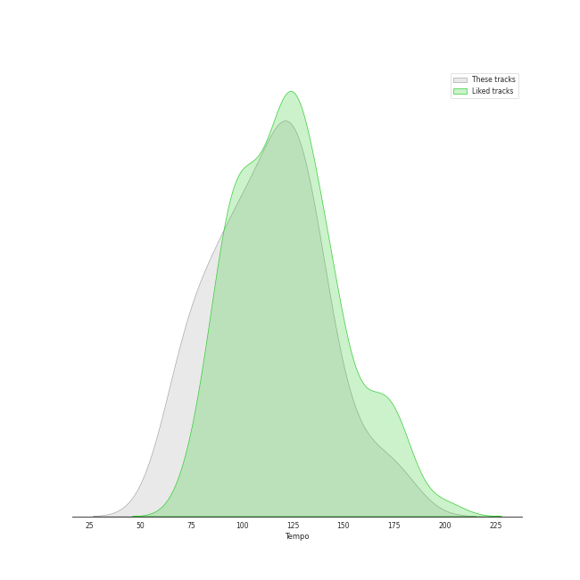

# Track Features for adult standards

## Danceability

| ​ | 10 most Danceable tracks | ​​ | 10 least Danceable tracks |
|:---|:---|:---|:---|
|  | Here Comes Santa Claus (Right Down Santa Claus Lane) - 1947 Version (0.834) |  | Nature Boy (0.203) |
|  | I Wan'na Be Like You (The Monkey Song) (0.746) |  | The Christmas Song (0.226) |
|  | Baby It's Cold Outside (0.724) |  | Can't Help Falling in Love (0.234) |
|  | Everything (0.686) |  | Strangers In The Night (0.259) |
|  | A Holly Jolly Christmas - Single Version (0.683) |  | What A Wonderful World (0.271) |
|  | Mack the Knife (0.673) |  | Unforgettable (0.286) |
|  | Someday (feat. Meghan Trainor) (0.671) |  | White Christmas - 1947 Version (0.317) |
|  | Fly Me To The Moon (In Other Words) (0.668) |  | The Christmas Song (Merry Christmas To You) (0.319) |
|  | Cheek To Cheek (0.663) |  | It's Beginning to Look a Lot like Christmas (0.339) |
|  | Let It Snow! Let It Snow! Let It Snow! (with The B. Swanson Quartet) (0.652) |  | Unforgettable (0.349) |

## Energy

| ​ | 10 most Energetic tracks | ​​ | 10 least Energetic tracks |
|:---|:---|:---|:---|
|  | Can't Take My Eyes off You (0.764) |  | I'll Be Seeing You (0.0304) |
|  | Haven't Met You Yet (0.733) |  | La vie en rose - Single Version (0.0406) |
|  | Everything (0.688) |  | Baby It's Cold Outside (0.0813) |
|  | Moondance (0.614) |  | Nature Boy (0.0895) |
|  | Frosty the Snowman (feat. The Puppini Sisters) (0.591) |  | Santa Baby (0.0964) |
|  | Feeling Good (0.548) |  | Dream A Little Dream Of Me - Single Version (0.104) |
|  | Someday (feat. Meghan Trainor) (0.539) |  | Dream A Little Dream Of Me (0.154) |
|  | Cry Me a River (0.483) |  | White Christmas - 1947 Version (0.158) |
|  | The Way You Look Tonight (0.483) |  | What A Wonderful World (0.165) |
|  | Strangers In The Night (0.473) |  | The Christmas Song (0.17) |

## Speechiness

| ​ | 10 most Speechy tracks | ​​ | 10 least Speechy tracks |
|:---|:---|:---|:---|
|  | Baby, It's Cold Outside (with Dorothy Kirsten) (0.131) |  | Everything (0.0254) |
|  | Dream A Little Dream Of Me - Single Version (0.101) |  | Unforgettable (0.028) |
|  | I Wan'na Be Like You (The Monkey Song) (0.0995) |  | The Way You Look Tonight (0.028) |
|  | L-O-V-E - 2000 Remaster (0.0928) |  | Call Me Irresponsible (0.0292) |
|  | Cheek To Cheek (0.0914) |  | Can't Help Falling in Love (0.0293) |
|  | Dream A Little Dream Of Me (0.0839) |  | La vie en rose (feat. Cécile McLorin Salvant) (0.0294) |
|  | Can't Take My Eyes off You (0.0746) |  | Strangers In The Night (0.0295) |
|  | Moondance (0.0737) |  | Home (0.0301) |
|  | That's Life (0.0729) |  | A Holly Jolly Christmas - Single Version (0.0303) |
|  | Blue Moon (0.0698) |  | Unforgettable (0.031) |

## Acousticness

| ​ | 10 most Acoustic tracks | ​​ | 10 least Acoustic tracks |
|:---|:---|:---|:---|
|  | I'll Be Seeing You (0.989) |  | Easy (0.112) |
|  | Blue Moon (0.982) |  | Haven't Met You Yet (0.152) |
|  | Nature Boy (0.971) |  | Someday (feat. Meghan Trainor) (0.18) |
|  | Baby, It's Cold Outside (with Dorothy Kirsten) (0.963) |  | The Best Is yet to Come (0.355) |
|  | Baby It's Cold Outside (0.931) |  | Everything (0.39) |
|  | Unforgettable (0.92) |  | I've Got You Under My Skin - Remastered 1998 (0.452) |
|  | The Christmas Song (Merry Christmas To You) (0.92) |  | Fly Me To The Moon (In Other Words) (0.453) |
|  | Dream A Little Dream Of Me (0.916) |  | Sunny (0.494) |
|  | Dream A Little Dream Of Me - Single Version (0.913) |  | Feeling Good (0.533) |
|  | Let It Snow! Let It Snow! Let It Snow! (0.912) |  | L-O-V-E (0.543) |

## Instrumentalness

| ​ | 10 most Instrumental tracks | ​​ | 10 least Instrumental tracks |
|:---|:---|:---|:---|
|  | White Christmas - 1947 Version (0.353) |  | Dream A Little Dream Of Me (0.0) |
|  | Blue Moon (0.12) |  | Mack the Knife (0.0) |
|  | I'll Be Seeing You (0.0555) |  | The Way You Look Tonight (0.0) |
|  | Nature Boy (0.0213) |  | Someday (feat. Meghan Trainor) (0.0) |
|  | Unforgettable (0.0152) |  | La vie en rose (feat. Cécile McLorin Salvant) (0.0) |
|  | Can't Help Falling in Love (0.0111) |  | Moondance (0.0) |
|  | La vie en rose - Single Version (0.000364) |  | Here Comes Santa Claus (Right Down Santa Claus Lane) - 1947 Version (0.0) |
|  | The Way You Look Tonight (0.000282) |  | Frosty the Snowman (feat. The Puppini Sisters) (0.0) |
|  | Baby, It's Cold Outside (with Dorothy Kirsten) (0.000253) |  | Rockin' Around The Christmas Tree (0.0) |
|  | I Wan'na Be Like You (The Monkey Song) (0.000238) |  | Cheek To Cheek (0.0) |

## Liveness

| ​ | 10 most Live tracks | ​​ | 10 least Live tracks |
|:---|:---|:---|:---|
|  | Baby, It's Cold Outside (with Dorothy Kirsten) (0.706) |  | Baby, It's Cold Outside (0.0513) |
|  | Rockin' Around The Christmas Tree (0.505) |  | Easy (0.0596) |
|  | Moondance (0.401) |  | Fly Me To The Moon (In Other Words) (0.0621) |
|  | Sunny (0.37) |  | Can't Take My Eyes off You (0.0692) |
|  | Let It Snow! Let It Snow! Let It Snow! (with The B. Swanson Quartet) (0.362) |  | Someday (feat. Meghan Trainor) (0.0748) |
|  | That's Life (0.346) |  | Cry Me a River (0.0754) |
|  | It's Beginning to Look a Lot like Christmas (0.341) |  | A Holly Jolly Christmas - Single Version (0.076) |
|  | White Christmas - 1947 Version (0.338) |  | L-O-V-E - 2000 Remaster (0.0792) |
|  | Mack the Knife (0.332) |  | Fly Me To The Moon - 2008 Remastered (0.0797) |
|  | The Best Is yet to Come (0.296) |  | Unforgettable (0.0798) |

## Valence

| ​ | 10 most Happy tracks | ​​ | 10 least Happy tracks |
|:---|:---|:---|:---|
|  | Here Comes Santa Claus (Right Down Santa Claus Lane) - 1947 Version (0.976) |  | Can't Help Falling in Love (0.0969) |
|  | Someday (feat. Meghan Trainor) (0.934) |  | Nature Boy (0.115) |
|  | Rockin' Around The Christmas Tree (0.898) |  | Unforgettable (0.142) |
|  | A Holly Jolly Christmas - Single Version (0.888) |  | The Christmas Song (0.162) |
|  | Let It Snow! Let It Snow! Let It Snow! (with The B. Swanson Quartet) (0.836) |  | Unforgettable (0.178) |
|  | Frosty the Snowman (feat. The Puppini Sisters) (0.829) |  | I'll Be Seeing You (0.188) |
|  | Haven't Met You Yet (0.796) |  | What A Wonderful World (0.203) |
|  | I Wan'na Be Like You (The Monkey Song) (0.795) |  | The Christmas Song (Merry Christmas To You) (0.209) |
|  | L-O-V-E - 2000 Remaster (0.728) |  | White Christmas - 1947 Version (0.247) |
|  | Mack the Knife (0.713) |  | La vie en rose - Single Version (0.285) |

## Tempo

| ​ | 10 most Fast tracks | ​​ | 10 least Fast tracks |
|:---|:---|:---|:---|
|  | Can't Help Falling in Love (174.036) |  | La vie en rose (feat. Cécile McLorin Salvant) (63.378) |
|  | Nature Boy (173.451) |  | Come Fly With Me - Remastered 1998 (67.008) |
|  | The Christmas Song (163.863) |  | Rockin' Around The Christmas Tree (67.196) |
|  | L-O-V-E - 2000 Remaster (157.47) |  | La vie en rose - Single Version (70.138) |
|  | Sleigh Ride (154.759) |  | Santa Baby (76.273) |
|  | Frosty the Snowman (feat. The Puppini Sisters) (147.381) |  | Dream A Little Dream Of Me - Single Version (76.497) |
|  | Let It Snow! Let It Snow! Let It Snow! (with The B. Swanson Quartet) (142.169) |  | What A Wonderful World (77.082) |
|  | Moondance (140.736) |  | The Christmas Song (Merry Christmas To You) (78.696) |
|  | A Holly Jolly Christmas - Single Version (140.467) |  | L-O-V-E (78.884) |
|  | Unforgettable (136.094) |  | Unforgettable (85.691) |
