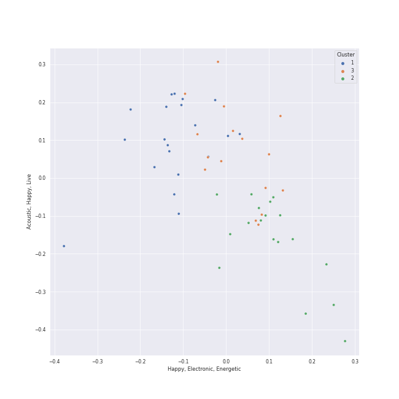

# Clusters in adult standards

## Cluster #1

16 tracks

| Art | Track | Album | Artists | Label | Rank | 💚 | 🔗 |
|:---|:---|:---|:---|:---|---:|:---|:---|
|  | Dream A Little Dream Of Me | Ella: The Legendary Decca Recordings | Ella Fitzgerald, Louis Armstrong | Verve Reissues | nan | 💚 | [🔗](https://open.spotify.com/track/0KBvapFwuz8gPKu6Gw23WN) |
|  | What A Wonderful World | What A Wonderful World | Louis Armstrong | [GRP](../../../../labels/grp) | nan | 💚 | [🔗](https://open.spotify.com/track/29U7stRjqHU6rMiS8BfaI9) |
|  | La vie en rose (feat. Cécile McLorin Salvant) | love (Deluxe Edition) | [Michael Bublé](../../../../artists/michael_bublé/overview.md), Cécile McLorin Salvant | [Reprise](../../../../labels/reprise) | nan | | [🔗](https://open.spotify.com/track/1QELw50Dl95LusF6uOkDqk) |
|  | The Christmas Song | Christmas (Deluxe Special Edition) | [Michael Bublé](../../../../artists/michael_bublé/overview.md) | [143](../../../../labels/143), [Reprise](../../../../labels/reprise) | nan | | [🔗](https://open.spotify.com/track/4SWAozNLRfZXF25ghKqm2q) |
|  | Home | It's Time | [Michael Bublé](../../../../artists/michael_bublé/overview.md) | [143](../../../../labels/143), [Reprise](../../../../labels/reprise) | nan | 💚 | [🔗](https://open.spotify.com/track/3ISaSNZCxIzTGwQuBq6Xrr) |
|  | I'll Be Seeing You | Billie Holiday | Billie Holiday | Verve Reissues | 327 | | [🔗](https://open.spotify.com/track/4smkJW6uzoHxGReZqqwHS5) |
|  | Unforgettable | Unforgettable: With Love | Natalie Cole, Nat King Cole | [Craft Recordings](../../../../labels/craft_recordings) | nan | | [🔗](https://open.spotify.com/track/2MVQbDuhVs2muWFURtIdNb) |
|  | Nature Boy | The Nat King Cole Story | Nat King Cole | [Capitol Records](../../../../labels/capitol_records) | nan | 💚 | [🔗](https://open.spotify.com/track/2WMyu5IYgxEuCd6xgFgJrl) |
|  | The Christmas Song (Merry Christmas To You) | The Christmas Song (Expanded Edition) | Nat King Cole | CAPITOL CATALOG MKT (C92) | 306 | | [🔗](https://open.spotify.com/track/4PS1e8f2LvuTFgUs1Cn3ON) |
|  | Unforgettable | Unforgettable | Nat King Cole | CAPITOL CATALOG MKT (C92) | nan | | [🔗](https://open.spotify.com/track/648TTtYB0bH0P8Hfy0FmkL) |
## Cluster #2

18 tracks

| Art | Track | Album | Artists | Label | Rank | 💚 | 🔗 |
|:---|:---|:---|:---|:---|---:|:---|:---|
|  | Dream A Little Dream Of Me | What A Wonderful World | Louis Armstrong | [GRP](../../../../labels/grp) | nan | | [🔗](https://open.spotify.com/track/3HuJDcOWx0gE9Yng2uWY7K) |
|  | I've Got You Under My Skin - Remastered 1998 | Songs For Swingin' Lovers! (Remastered) | [Frank Sinatra](../../../../artists/frank_sinatra/overview.md) | [Capitol Records](../../../../labels/capitol_records) | nan | | [🔗](https://open.spotify.com/track/3aEJMh1cXKEjgh52claxQp) |
|  | Fly Me To The Moon - 2008 Remastered | Nothing But The Best (2008 Remastered) | [Frank Sinatra](../../../../artists/frank_sinatra/overview.md), Count Basie | FRANK SINATRA DIGITAL REPRISE | nan | | [🔗](https://open.spotify.com/track/7FXj7Qg3YorUxdrzvrcY25) |
|  | Call Me Irresponsible | Call Me Irresponsible | [Michael Bublé](../../../../artists/michael_bublé/overview.md) | [143](../../../../labels/143), [Reprise](../../../../labels/reprise) | nan | | [🔗](https://open.spotify.com/track/25RxZw46RfYpVWMIrIeZDS) |
|  | Everything | Call Me Irresponsible | [Michael Bublé](../../../../artists/michael_bublé/overview.md) | [143](../../../../labels/143), [Reprise](../../../../labels/reprise) | nan | 💚 | [🔗](https://open.spotify.com/track/4T6HLdP6OcAtqC6tGnQelG) |
|  | The Best Is yet to Come | Call Me Irresponsible | [Michael Bublé](../../../../artists/michael_bublé/overview.md) | [143](../../../../labels/143), [Reprise](../../../../labels/reprise) | nan | | [🔗](https://open.spotify.com/track/56t3m0lqE6zU1EfgFOPqst) |
|  | The Way You Look Tonight | Michael Bublé | [Michael Bublé](../../../../artists/michael_bublé/overview.md) | [143](../../../../labels/143), [Reprise](../../../../labels/reprise) | nan | | [🔗](https://open.spotify.com/track/4YGlRLe6TeBRiXFByBqldf) |
|  | Feeling Good | It's Time | [Michael Bublé](../../../../artists/michael_bublé/overview.md) | [143](../../../../labels/143), [Reprise](../../../../labels/reprise) | 636 | 💚 | [🔗](https://open.spotify.com/track/72PwtNhRrZXNnYeRg5xQ46) |
|  | Cry Me a River | Crazy Love | [Michael Bublé](../../../../artists/michael_bublé/overview.md) | [143](../../../../labels/143), [Reprise](../../../../labels/reprise) | nan | | [🔗](https://open.spotify.com/track/5i04Jy87RLxoZszJqY3QAN) |
|  | L-O-V-E | Unforgettable: With Love | Natalie Cole | [Craft Recordings](../../../../labels/craft_recordings) | nan | | [🔗](https://open.spotify.com/track/637xWjdmJY7CAQJsnsT7Fs) |
## Cluster #3

18 tracks

| Art | Track | Album | Artists | Label | Rank | 💚 | 🔗 |
|:---|:---|:---|:---|:---|---:|:---|:---|
|  | Cheek To Cheek | The Complete Ella And Louis On Verve | Ella Fitzgerald, Louis Armstrong | Verve Reissues | 597 | | [🔗](https://open.spotify.com/track/33jt3kYWjQzqn3xyYQ5ZEh) |
|  | Sleigh Ride | Ella Wishes You A Swinging Christmas (Expanded Edition) | Ella Fitzgerald | Verve Reissues | nan | | [🔗](https://open.spotify.com/track/4ukUoXLuFzMixyZyabSGc4) |
|  | Mack the Knife | The Great American Songbook | Louis Armstrong | [Columbia](../../../../labels/columbia), [Legacy](../../../../labels/legacy) | 392 | | [🔗](https://open.spotify.com/track/0RNxWy0PC3AyH4ThH3aGK6) |
|  | The Way You Look Tonight | Days Of Wine And Roses, Moon River And Other Academy Award Winners | [Frank Sinatra](../../../../artists/frank_sinatra/overview.md) | FRANK SINATRA DIGITAL REPRISE | nan | 💚 | [🔗](https://open.spotify.com/track/0elmUoU7eMPwZX1Mw1MnQo) |
|  | That's Life | That's Life | [Frank Sinatra](../../../../artists/frank_sinatra/overview.md) | FRANK SINATRA DIGITAL REPRISE | nan | | [🔗](https://open.spotify.com/track/4FmCUATNIarCQh72JYdvnm) |
|  | Come Fly With Me - Remastered 1998 | Come Fly With Me (Expanded Edition) | [Frank Sinatra](../../../../artists/frank_sinatra/overview.md) | [Capitol Records](../../../../labels/capitol_records) | nan | | [🔗](https://open.spotify.com/track/4hHbeIIKO5Y5uLyIEbY9Gn) |
|  | I Wan'na Be Like You (The Monkey Song) | The Jungle Book | Louis Prima, Phil Harris, Bruce Reitherman | [Walt Disney Records](../../../../labels/walt_disney_records) | nan | | [🔗](https://open.spotify.com/track/2EeVPGHq2I7fjeDfT6LEYX) |
|  | L-O-V-E - 2000 Remaster | Romance | Nat King Cole | [UME - Global Clearing House](../../../../labels/ume_-_global_clearing_house) | nan | | [🔗](https://open.spotify.com/track/6OHPdG4tYiHRPUHwf68nRU) |
|  | Let It Snow! Let It Snow! Let It Snow! | A Winter Romance | Dean Martin | [Capitol Records](../../../../labels/capitol_records) | 716 | | [🔗](https://open.spotify.com/track/2uFaJJtFpPDc5Pa95XzTvg) |
|  | It's Beginning To Look Like Christmas | White Christmas | Bing Crosby | [Geffen](../../../../labels/geffen) | 679 | | [🔗](https://open.spotify.com/track/44mYhOVgerj2qPjkGDVA6n) |