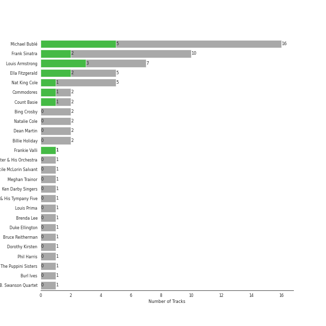
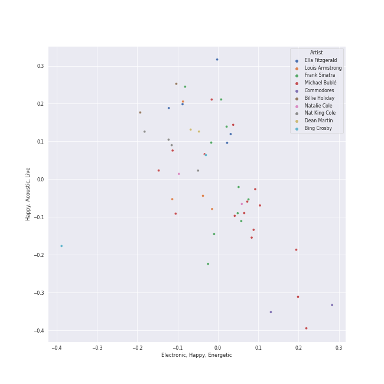
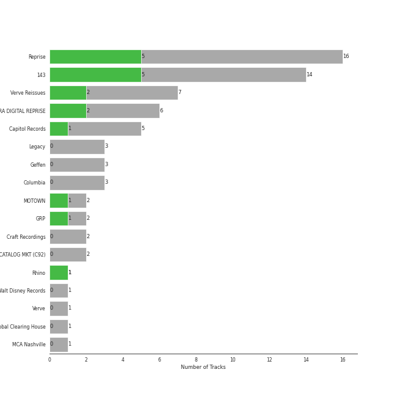
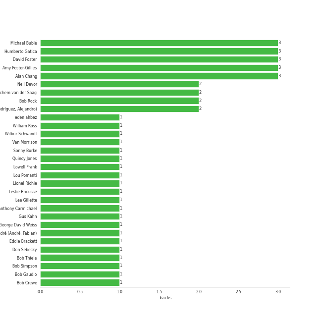
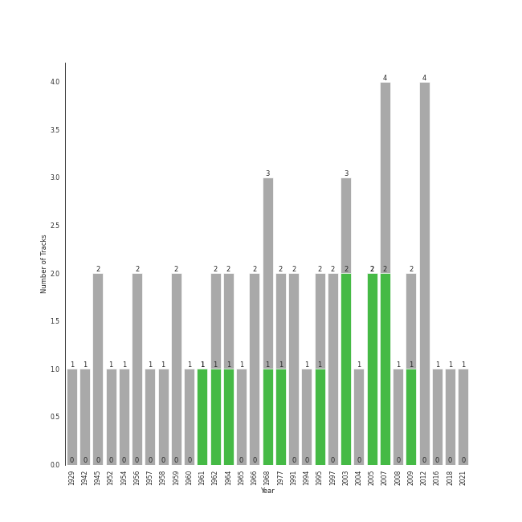

# adult standards

53 songs

[See Track Features](audio_features.md)

[See Clusters](clusters/overview.md)

## Top Artists

| Art | Rank | Tracks | 💚 | Artist | 🔗 |
|:---|---:|---:|---:|:---|:---|
|  | 95 | 16 | 5 | [Michael Bublé](../../artists/michael_bublé/overview.md) | [🔗](https://open.spotify.com/artist/1GxkXlMwML1oSg5eLPiAz3) |
|  | 278 | 7 | 3 | Louis Armstrong | [🔗](https://open.spotify.com/artist/19eLuQmk9aCobbVDHc6eek) |
|  | 330 | 10 | 2 | [Frank Sinatra](../../artists/frank_sinatra/overview.md) | [🔗](https://open.spotify.com/artist/1Mxqyy3pSjf8kZZL4QVxS0) |
|  | 236 | 5 | 2 | Ella Fitzgerald | [🔗](https://open.spotify.com/artist/5V0MlUE1Bft0mbLlND7FJz) |
|  | 248 | 5 | 1 | Nat King Cole | [🔗](https://open.spotify.com/artist/7v4imS0moSyGdXyLgVTIV7) |
|  | 430 | 2 | 1 | Commodores | [🔗](https://open.spotify.com/artist/6twIAGnYuIT1pncMAsXnEm) |
|  | 430 | 2 | 1 | Count Basie | [🔗](https://open.spotify.com/artist/2jFZlvIea42ZvcCw4OeEdA) |
|  | 430 | 1 | 1 | Frankie Valli | [🔗](https://open.spotify.com/artist/3CDKmzJu6uwEGnPLLZffpD) |
|  | 400 | 2 | 0 | Bing Crosby | [🔗](https://open.spotify.com/artist/6ZjFtWeHP9XN7FeKSUe80S) |
|  | 430 | 2 | 0 | Natalie Cole | [🔗](https://open.spotify.com/artist/5tTsrGPwQRWUsHR2Xf7Ke9) |

See all 26 artists

| Art | Rank | Tracks | 💚 | Artist | 🔗 |
|:---|---:|---:|---:|:---|:---|
|  | 413 | 2 | 0 | Dean Martin | [🔗](https://open.spotify.com/artist/49e4v89VmlDcFCMyDv9wQ9) |
|  | 178 | 2 | 0 | Billie Holiday | [🔗](https://open.spotify.com/artist/1YzCsTRb22dQkh9lghPIrp) |
|  | 430 | 1 | 0 | John Scott Trotter & His Orchestra | [🔗](https://open.spotify.com/artist/735L650pvygCZZlPMyHqsN) |
|  | 430 | 1 | 0 | Cécile McLorin Salvant | [🔗](https://open.spotify.com/artist/6PkSULcbxFKkxdgrmPGAvn) |
|  | 430 | 1 | 0 | Meghan Trainor | [🔗](https://open.spotify.com/artist/6JL8zeS1NmiOftqZTRgdTz) |
| | 430 | 1 | 0 | Ken Darby Singers | [🔗](https://open.spotify.com/artist/69UfPJgUmFFAVT740qGVZi) |
|  | 412 | 1 | 0 | Louis Jordan & His Tympany Five | [🔗](https://open.spotify.com/artist/62FPyLpIhmk27hBw6RHlhh) |
|  | 430 | 1 | 0 | Louis Prima | [🔗](https://open.spotify.com/artist/52lBOxCxbJg0ttXEW9CQpW) |
|  | 388 | 1 | 0 | Brenda Lee | [🔗](https://open.spotify.com/artist/4cPHsZM98sKzmV26wlwD2W) |
|  | 430 | 1 | 0 | Duke Ellington | [🔗](https://open.spotify.com/artist/4F7Q5NV6h5TSwCainz8S5A) |
|  | 430 | 1 | 0 | Bruce Reitherman | [🔗](https://open.spotify.com/artist/43HPW60tz4BMYMRnmXMagJ) |
|  | 430 | 1 | 0 | Dorothy Kirsten | [🔗](https://open.spotify.com/artist/3mMDsLh0ODpEuwpvn9sitk) |
|  | 430 | 1 | 0 | Phil Harris | [🔗](https://open.spotify.com/artist/2ISMfPtVzHc9jDDVPUEHDa) |
|  | 365 | 1 | 0 | The Puppini Sisters | [🔗](https://open.spotify.com/artist/1svaANJTE5KrG16fTGDqOs) |
|  | 430 | 1 | 0 | Burl Ives | [🔗](https://open.spotify.com/artist/0MHgLfmQdutffmvWe5XBTN) |
| | 430 | 1 | 0 | B. Swanson Quartet | [🔗](https://open.spotify.com/artist/0JXiS2FrAg3wQYJHcmZdrc) |

## Most and least listened tracks
| Rank | ​ | Most listened tracks | Rank | ​​ | Least listened tracks |
|---:|:---|:---|---:|:---|:---|
| 430 |  | The Christmas Song (Merry Christmas To You) | 974 |  | [Can't Help Falling in Love](../../artists/michael_bublé/overview.md) |
| 455 |  | I'll Be Seeing You | 974 |  | [Fly Me To The Moon - 2008 Remastered](../../artists/frank_sinatra/overview.md) |
| 534 |  | Mack the Knife | 974 |  | Dream A Little Dream Of Me - Single Version |
| 568 |  | Blue Moon | 974 |  | [Strangers In The Night](../../artists/frank_sinatra/overview.md) |
| 769 |  | [Frosty the Snowman (feat. The Puppini Sisters)](../../artists/michael_bublé/overview.md) | 974 |  | Can't Take My Eyes off You |
| 783 |  | Cheek To Cheek | 974 |  | L-O-V-E - 2000 Remaster |
| 829 |  | [Feeling Good](../../artists/michael_bublé/overview.md) | 974 |  | [Sunny](../../artists/frank_sinatra/overview.md) |
| 850 |  | Rockin' Around The Christmas Tree | 974 |  | A Holly Jolly Christmas - Single Version |
| 887 |  | It's Beginning To Look Like Christmas | 974 |  | Unforgettable |
| 923 |  | Baby It's Cold Outside | 974 |  | L-O-V-E |

## Top Albums

| Art | Rank | Tracks | 💚 | Album | Release Date | 🔗 |
|:---|---:|---:|---:|:---|:---|:---|
|  | 505 | 4 | 0 | Christmas (Deluxe Special Edition) | 2012-11-09 | [🔗](https://open.spotify.com/album/7uVimUILdzSZG4KKKWToq0) |
|  | 643 | 3 | 1 | Call Me Irresponsible | 2007-04-27 | [🔗](https://open.spotify.com/album/3h4pyWRJIB9ZyRKXChbX22) |
|  | 553 | 2 | 2 | It's Time | 2005-02-08 | [🔗](https://open.spotify.com/album/457fktVFXVwjQTl9wOLlfg) |
|  | 643 | 2 | 1 | What A Wonderful World | 1968-01-01 | [🔗](https://open.spotify.com/album/6mmv0gwumlFGWDGJXF4yEv) |
|  | 633 | 2 | 1 | Michael Bublé | 2003 | [🔗](https://open.spotify.com/album/3rpSksJSFdNFqk5vne8at2) |
|  | 615 | 2 | 1 | Ella: The Legendary Decca Recordings | 1995-08-29 | [🔗](https://open.spotify.com/album/0G5ZHFj5VmvIWEAuF8NEIT) |
|  | 643 | 2 | 1 | Crazy Love | 2009-10-06 | [🔗](https://open.spotify.com/album/3MXDonOIzrIrCh0HvlACyj) |
|  | 643 | 2 | 1 | Commodores | 1977-01-01 | [🔗](https://open.spotify.com/album/2tzbNCAUTmW4MIM2Ulvrwl) |
|  | 643 | 2 | 0 | Unforgettable: With Love | 1991-06-11 | [🔗](https://open.spotify.com/album/4ilUfGGQXin7hr1srDDXF0) |
|  | 614 | 2 | 0 | A Winter Romance | 1959-01-01 | [🔗](https://open.spotify.com/album/5I48ENiZiaZZSOpec6PdS5) |

See all 40 albums

| Art | Rank | Tracks | 💚 | Album | Release Date | 🔗 |
|:---|---:|---:|---:|:---|:---|:---|
|  | 643 | 1 | 1 | The Very Best of Frankie Valli & The 4 Seasons | 2003-01-14 | [🔗](https://open.spotify.com/album/0NUEQILaBzavnzcMEs4buZ) |
|  | 643 | 1 | 1 | The Nat King Cole Story | 1961-09-25 | [🔗](https://open.spotify.com/album/3NoP1ifIejWkGSDsO9T2xH) |
|  | 643 | 1 | 1 | Sinatra/Basie: The Complete Reprise Studio Recordings | 1962-12-10 | [🔗](https://open.spotify.com/album/2NCtCObbmJoJnplsR5mLAl) |
|  | 643 | 1 | 1 | Love, Ella | 2007-05-03 | [🔗](https://open.spotify.com/album/1y5KGkUKO0NG32MhIIagCA) |
|  | 641 | 1 | 1 | Days Of Wine And Roses, Moon River And Other Academy Award Winners | 1964 | [🔗](https://open.spotify.com/album/7FAo3wmrJNNzz2W5Z5ZG80) |
|  | 643 | 1 | 0 | love (Deluxe Edition) | 2018-11-16 | [🔗](https://open.spotify.com/album/68xKnVblFsSQ48CtgZT0oY) |
|  | 588 | 1 | 0 | White Christmas | 1945-01-01 | [🔗](https://open.spotify.com/album/42KK3F8HTm1dyv5iFsCXdw) |
|  | 643 | 1 | 0 | Unforgettable | 1954-01-01 | [🔗](https://open.spotify.com/album/7GBvXtxnvBluo2f4xBVNkm) |
|  | 643 | 1 | 0 | The Jungle Book | 1997-01-01 | [🔗](https://open.spotify.com/album/7zdZNXoapFcOW663zgLdOE) |
|  | 369 | 1 | 0 | The Great American Songbook | 1929 | [🔗](https://open.spotify.com/album/3AiEMTv9oFDRaDjqv93mOU) |
|  | 525 | 1 | 0 | The Complete Ella And Louis On Verve | 1997-05-20 | [🔗](https://open.spotify.com/album/2uqlkJu6vckJahCsp6Hfcn) |
|  | 643 | 1 | 0 | The Classic Christmas Album | 1945 | [🔗](https://open.spotify.com/album/2B9FcHKqz3PWJlh0yGnmM7) |
|  | 301 | 1 | 0 | The Christmas Song - Expanded Edition | 1962 | [🔗](https://open.spotify.com/album/6vBGI5522jvPi0ZZuGQNp4) |
|  | 643 | 1 | 0 | That's Life | 1966-11 | [🔗](https://open.spotify.com/album/3gNsjaUsu9cRckgUFx5NsY) |
|  | 643 | 1 | 0 | Strangers In The Night (Expanded Edition) | 1966-05 | [🔗](https://open.spotify.com/album/1kyb5tomEXcA106V57puFW) |
|  | 643 | 1 | 0 | Songs For Swingin' Lovers! (Remastered) | 1956-03 | [🔗](https://open.spotify.com/album/4kca7vXd1Wo5GE2DMafvMc) |
|  | 387 | 1 | 0 | Solitude | 1956-01-01 | [🔗](https://open.spotify.com/album/4izD3SCRElbkO06i8yf4Zp) |
|  | 643 | 1 | 0 | Satchmo Serenades | 1952-04-01 | [🔗](https://open.spotify.com/album/17fcllu2aPjrx4ZCm05jMc) |
|  | 643 | 1 | 0 | Romance | 2021-02-12 | [🔗](https://open.spotify.com/album/5MuNxtOyex8o77Qdjaqeng) |
|  | 643 | 1 | 0 | Nothing But The Best (2008 Remastered) | 2008-05-13 | [🔗](https://open.spotify.com/album/3i67sGIVw8EBlgfSRv3Lj2) |
|  | 643 | 1 | 0 | Nobody but Me | 2016-10-21 | [🔗](https://open.spotify.com/album/5wN1OizIFEHDUkRwzIK3wL) |
|  | 566 | 1 | 0 | Merry Christmas From Brenda Lee | 1964-10-19 | [🔗](https://open.spotify.com/album/34wa3zf2prXFMk47t9zHFG) |
|  | 643 | 1 | 0 | Holiday Inn (Original Motion Picture Soundtrack) | 1942-01-01 | [🔗](https://open.spotify.com/album/4ZZvKnA1YJ2KcwjMmHBinq) |
|  | 643 | 1 | 0 | Have A Holly Jolly Christmas | 1965-01-01 | [🔗](https://open.spotify.com/album/5r5iTtNflB2DAKO1t5ih8f) |
|  | 643 | 1 | 0 | Francis A. & Edward K. | 1968-01 | [🔗](https://open.spotify.com/album/5GFkm37IrMR9a4rc6JABkw) |
|  | 643 | 1 | 0 | Ella Wishes You A Swinging Christmas - Expanded Edition | 1960-01-01 | [🔗](https://open.spotify.com/album/2UhPCUgK2IGUrg7lIvMYfb) |
|  | 643 | 1 | 0 | Come Fly with Me | 2004-03-30 | [🔗](https://open.spotify.com/album/0UhvDeKmtgegXeELEVgGRh) |
|  | 643 | 1 | 0 | Come Fly With Me (Expanded Edition) | 1958 | [🔗](https://open.spotify.com/album/66v9QmjAj0Wwhh2OpbU4BE) |
|  | 643 | 1 | 0 | Christmas Songs by Sinatra | 1994-11-08 | [🔗](https://open.spotify.com/album/4XbPmVHP7EYBMoE7ZVjKCU) |
|  | 320 | 1 | 0 | Billie Holiday | 1957-01-01 | [🔗](https://open.spotify.com/album/4MkdTflpaaGGcXb5vtOYRs) |

## Top Record Labels

| Tracks | 💚 | Label |
|---:|---:|:---|
| 16 | 5 | [Reprise](../../labels/reprise/overview.md) |
| 14 | 5 | [143](../../labels/143/overview.md) |
| 7 | 2 | Verve Reissues |
| 6 | 2 | FRANK SINATRA DIGITAL REPRISE |
| 5 | 1 | [Capitol Records](../../labels/capitol_records/overview.md) |
| 2 | 1 | [MOTOWN](../../labels/motown/overview.md) |
| 2 | 1 | [GRP](../../labels/grp/overview.md) |
| 1 | 1 | [Rhino](../../labels/rhino/overview.md) |
| 3 | 0 | [Legacy](../../labels/legacy/overview.md) |
| 3 | 0 | [Geffen](../../labels/geffen/overview.md) |

See all 17 labels

| Tracks | 💚 | Label |
|---:|---:|:---|
| 3 | 0 | [Columbia](../../labels/columbia/overview.md) |
| 2 | 0 | [Craft Recordings](../../labels/craft_recordings/overview.md) |
| 2 | 0 | CAPITOL CATALOG MKT (C92) |
| 1 | 0 | [Walt Disney Records](../../labels/walt_disney_records/overview.md) |
| 1 | 0 | Verve |
| 1 | 0 | [UME - Global Clearing House](../../labels/ume_-_global_clearing_house/overview.md) |
| 1 | 0 | MCA Nashville |

## Top Producers

| Art | Producer | Tracks | Credit Types |
|:---|:---|---:|:---|
| | Alan Chang | 3 | Songwriter, Arranger |
| | Humberto Gatica | 3 | Producer |
| | Amy Foster-Gillies | 3 | Songwriter |
| | David Foster | 3 | Producer, Arranger |
|  | [Michael Bublé](../../artists/michael_bublé/overview.md) | 3 | Songwriter, Arranger |
| | Bob Rock | 2 | Producer, Arranger |
| | Neil Devor | 2 | Producer |
| | Jochem van der Saag | 2 | Producer |
| | Alejandro Rodríguez (Rodríguez, Alejandro) | 2 | Producer |
| | Lionel Richie | 1 | Lyricist, Songwriter |

View all

| Art | Producer | Tracks | Credit Types |
|:---|:---|---:|:---|
| | Anthony Newley | 1 | Songwriter |
| | James Anthony Carmichael | 1 | Producer |
| | Fabian André (André, Fabian) | 1 | Songwriter |
| | Eddie Brackett | 1 | Producer |
| | Bob Simpson | 1 | Producer |
| | Bob Crewe | 1 | Songwriter |
| | Bob Thiele | 1 | Producer, Songwriter |
| | Sonny Burke | 1 | Producer |
| | Wilbur Schwandt | 1 | Songwriter |
|  | Van Morrison | 1 | Lyricist, Songwriter |
| | Lou Pomanti | 1 | Arranger |
| | Gus Kahn | 1 | Lyricist |
| | George David Weiss | 1 | Songwriter |
| | Leslie Bricusse | 1 | Songwriter |
| | Lee Gillette | 1 | Producer |
| | Bart Howard | 1 | Lyricist, Songwriter |
| | William Ross | 1 | Arranger |
| | Don Sebesky | 1 | Arranger |
| | eden ahbez | 1 | Lyricist, Songwriter |
| | Quincy Jones | 1 | Arranger |
| | Bob Gaudio | 1 | Songwriter |
| | Lowell Frank | 1 | Producer |

## Years

| ​ | 10 newest albums | ​​ | 10 oldest albums |
|:---|:---|:---|:---|
|  | Romance (2021-02-12) |  | The Great American Songbook (1929) |
|  | love (Deluxe Edition) (2018-11-16) |  | Holiday Inn (Original Motion Picture Soundtrack) (1942-01-01) |
|  | Nobody but Me (2016-10-21) |  | The Classic Christmas Album (1945) |
|  | Christmas (Deluxe Special Edition) (2012-11-09) |  | White Christmas (1945-01-01) |
|  | Crazy Love (2009-10-06) |  | Satchmo Serenades (1952-04-01) |
|  | Nothing But The Best (2008 Remastered) (2008-05-13) |  | Unforgettable (1954-01-01) |
|  | Love, Ella (2007-05-03) |  | Solitude (1956-01-01) |
|  | Call Me Irresponsible (2007-04-27) |  | Songs For Swingin' Lovers! (Remastered) (1956-03) |
|  | It's Time (2005-02-08) |  | Billie Holiday (1957-01-01) |
|  | Come Fly with Me (2004-03-30) |  | Come Fly With Me (Expanded Edition) (1958) |

