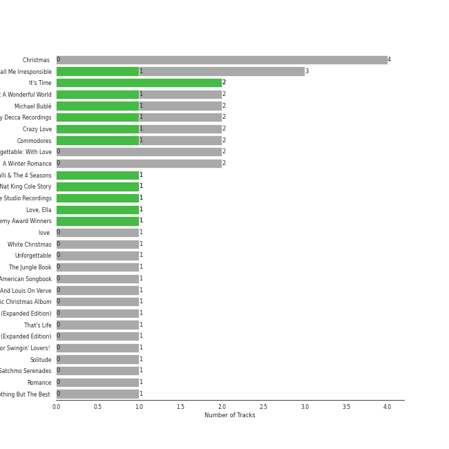

# adult standards

[43 songs](tracks.md)

[See Track Features](audio_features.md)

[See Clusters](clusters/overview.md)

## Top Artists

| Art | Tracks | 💚 | Artist | 🔗 |
|:---|---:|---:|:---|:---|
|  | 16 | 5 | [Michael Bublé](../../artists/michael_bubl_/overview.md) | [🔗](https://open.spotify.com/artist/1GxkXlMwML1oSg5eLPiAz3) |
|  | 10 | 2 | [Frank Sinatra](../../artists/frank_sinatra/overview.md) | [🔗](https://open.spotify.com/artist/1Mxqyy3pSjf8kZZL4QVxS0) |
|  | 5 | 1 | Nat King Cole | [🔗](https://open.spotify.com/artist/7v4imS0moSyGdXyLgVTIV7) |
|  | 2 | 1 | Count Basie | [🔗](https://open.spotify.com/artist/2jFZlvIea42ZvcCw4OeEdA) |
|  | 1 | 1 | Commodores | [🔗](https://open.spotify.com/artist/6twIAGnYuIT1pncMAsXnEm) |
|  | 1 | 1 | Frankie Valli | [🔗](https://open.spotify.com/artist/3CDKmzJu6uwEGnPLLZffpD) |
|  | 2 | 0 | Bing Crosby | [🔗](https://open.spotify.com/artist/6ZjFtWeHP9XN7FeKSUe80S) |
|  | 2 | 0 | Natalie Cole | [🔗](https://open.spotify.com/artist/5tTsrGPwQRWUsHR2Xf7Ke9) |
|  | 2 | 0 | Ella Fitzgerald | [🔗](https://open.spotify.com/artist/5V0MlUE1Bft0mbLlND7FJz) |
|  | 2 | 0 | Dean Martin | [🔗](https://open.spotify.com/artist/49e4v89VmlDcFCMyDv9wQ9) |

See all 24 artists

| Art | Tracks | 💚 | Artist | 🔗 |
|:---|---:|---:|:---|:---|
|  | 1 | 0 | John Scott Trotter & His Orchestra | [🔗](https://open.spotify.com/artist/735L650pvygCZZlPMyHqsN) |
|  | 1 | 0 | Cécile McLorin Salvant | [🔗](https://open.spotify.com/artist/6PkSULcbxFKkxdgrmPGAvn) |
|  | 1 | 0 | Meghan Trainor | [🔗](https://open.spotify.com/artist/6JL8zeS1NmiOftqZTRgdTz) |
|  | 1 | 0 | Ken Darby Singers | [🔗](https://open.spotify.com/artist/69UfPJgUmFFAVT740qGVZi) |
|  | 1 | 0 | Louis Jordan & His Tympany Five | [🔗](https://open.spotify.com/artist/62FPyLpIhmk27hBw6RHlhh) |
|  | 1 | 0 | Louis Prima | [🔗](https://open.spotify.com/artist/52lBOxCxbJg0ttXEW9CQpW) |
|  | 1 | 0 | Brenda Lee | [🔗](https://open.spotify.com/artist/4cPHsZM98sKzmV26wlwD2W) |
|  | 1 | 0 | Duke Ellington | [🔗](https://open.spotify.com/artist/4F7Q5NV6h5TSwCainz8S5A) |
|  | 1 | 0 | Bruce Reitherman | [🔗](https://open.spotify.com/artist/43HPW60tz4BMYMRnmXMagJ) |
|  | 1 | 0 | Dorothy Kirsten | [🔗](https://open.spotify.com/artist/3mMDsLh0ODpEuwpvn9sitk) |
|  | 1 | 0 | Phil Harris | [🔗](https://open.spotify.com/artist/2ISMfPtVzHc9jDDVPUEHDa) |
|  | 1 | 0 | The Puppini Sisters | [🔗](https://open.spotify.com/artist/1svaANJTE5KrG16fTGDqOs) |
|  | 1 | 0 | Burl Ives | [🔗](https://open.spotify.com/artist/0MHgLfmQdutffmvWe5XBTN) |
|  | 1 | 0 | B. Swanson Quartet | [🔗](https://open.spotify.com/artist/0JXiS2FrAg3wQYJHcmZdrc) |

## Top Albums

| Art | Tracks | 💚 | Album | Release Date | 🔗 |
|:---|---:|---:|:---|:---|:---|
|  | 4 | 0 | Christmas (Deluxe Special Edition) | 2012-11-09 | [🔗](https://open.spotify.com/album/7uVimUILdzSZG4KKKWToq0) |
|  | 3 | 1 | Call Me Irresponsible | 2007-04-30 | [🔗](https://open.spotify.com/album/3h4pyWRJIB9ZyRKXChbX22) |
|  | 2 | 2 | It's Time | 2005-02-08 | [🔗](https://open.spotify.com/album/457fktVFXVwjQTl9wOLlfg) |
|  | 2 | 1 | Michael Bublé | 2003 | [🔗](https://open.spotify.com/album/3rpSksJSFdNFqk5vne8at2) |
|  | 2 | 1 | Crazy Love | 2009-10-06 | [🔗](https://open.spotify.com/album/3MXDonOIzrIrCh0HvlACyj) |
|  | 2 | 0 | Unforgettable: With Love | 1991-06-11 | [🔗](https://open.spotify.com/album/4ilUfGGQXin7hr1srDDXF0) |
|  | 2 | 0 | A Winter Romance | 1959-01-01 | [🔗](https://open.spotify.com/album/5I48ENiZiaZZSOpec6PdS5) |
|  | 1 | 1 | The Very Best of Frankie Valli & The 4 Seasons | 2003-01-14 | [🔗](https://open.spotify.com/album/0NUEQILaBzavnzcMEs4buZ) |
|  | 1 | 1 | The Nat King Cole Story | 1991-01-01 | [🔗](https://open.spotify.com/album/3NoP1ifIejWkGSDsO9T2xH) |
|  | 1 | 1 | Sinatra/Basie: The Complete Reprise Studio Recordings | 1962-12-10 | [🔗](https://open.spotify.com/album/2NCtCObbmJoJnplsR5mLAl) |

See all 33 albums

| Art | Tracks | 💚 | Album | Release Date | 🔗 |
|:---|---:|---:|:---|:---|:---|
|  | 1 | 1 | Days Of Wine And Roses, Moon River And Other Academy Award Winners | 1964 | [🔗](https://open.spotify.com/album/7FAo3wmrJNNzz2W5Z5ZG80) |
|  | 1 | 1 | Commodores | 1977-01-01 | [🔗](https://open.spotify.com/album/2tzbNCAUTmW4MIM2Ulvrwl) |
|  | 1 | 0 | love (Deluxe Edition) | 2018-11-16 | [🔗](https://open.spotify.com/album/68xKnVblFsSQ48CtgZT0oY) |
|  | 1 | 0 | White Christmas | 1945-01-01 | [🔗](https://open.spotify.com/album/42KK3F8HTm1dyv5iFsCXdw) |
|  | 1 | 0 | Unforgettable | 1954-01-01 | [🔗](https://open.spotify.com/album/7GBvXtxnvBluo2f4xBVNkm) |
|  | 1 | 0 | The Jungle Book | 1997-01-01 | [🔗](https://open.spotify.com/album/7zdZNXoapFcOW663zgLdOE) |
|  | 1 | 0 | The Classic Christmas Album | 1945 | [🔗](https://open.spotify.com/album/2B9FcHKqz3PWJlh0yGnmM7) |
|  | 1 | 0 | The Christmas Song (Expanded Edition) | 1962 | [🔗](https://open.spotify.com/album/6vBGI5522jvPi0ZZuGQNp4) |
|  | 1 | 0 | That's Life | 1966-11 | [🔗](https://open.spotify.com/album/3gNsjaUsu9cRckgUFx5NsY) |
|  | 1 | 0 | Strangers In The Night (Expanded Edition) | 1966-05 | [🔗](https://open.spotify.com/album/1kyb5tomEXcA106V57puFW) |
|  | 1 | 0 | Songs For Swingin' Lovers! (Remastered) | 1956-03 | [🔗](https://open.spotify.com/album/4kca7vXd1Wo5GE2DMafvMc) |
|  | 1 | 0 | Romance | 2021-02-12 | [🔗](https://open.spotify.com/album/5MuNxtOyex8o77Qdjaqeng) |
|  | 1 | 0 | Nothing But The Best (Remastered) | 2008-01-01 | [🔗](https://open.spotify.com/album/3i67sGIVw8EBlgfSRv3Lj2) |
|  | 1 | 0 | Nobody but Me | 2016-10-21 | [🔗](https://open.spotify.com/album/5wN1OizIFEHDUkRwzIK3wL) |
|  | 1 | 0 | Merry Christmas From Brenda Lee | 1964-10-19 | [🔗](https://open.spotify.com/album/34wa3zf2prXFMk47t9zHFG) |
|  | 1 | 0 | Holiday Inn (Original Motion Picture Soundtrack) | 1942-01-01 | [🔗](https://open.spotify.com/album/4ZZvKnA1YJ2KcwjMmHBinq) |
|  | 1 | 0 | Have A Holly Jolly Christmas | 1965-01-01 | [🔗](https://open.spotify.com/album/5r5iTtNflB2DAKO1t5ih8f) |
|  | 1 | 0 | Francis A. & Edward K. | 1968-01 | [🔗](https://open.spotify.com/album/5GFkm37IrMR9a4rc6JABkw) |
|  | 1 | 0 | Ella: The Legendary Decca Recordings | 1995-08-29 | [🔗](https://open.spotify.com/album/0G5ZHFj5VmvIWEAuF8NEIT) |
|  | 1 | 0 | Ella Wishes You A Swinging Christmas (Expanded Edition) | 1960-01-01 | [🔗](https://open.spotify.com/album/2UhPCUgK2IGUrg7lIvMYfb) |
|  | 1 | 0 | Come Fly with Me | 2004-03-30 | [🔗](https://open.spotify.com/album/0UhvDeKmtgegXeELEVgGRh) |
|  | 1 | 0 | Come Fly With Me (Remastered) | 1958 | [🔗](https://open.spotify.com/album/66v9QmjAj0Wwhh2OpbU4BE) |
|  | 1 | 0 | Christmas Songs by Sinatra | 1994-11-08 | [🔗](https://open.spotify.com/album/4XbPmVHP7EYBMoE7ZVjKCU) |

## Top Record Labels

| Tracks | 💚 | Label |
|---:|---:|:---|
| 16 | 5 | [Reprise](../../labels/reprise/overview.md) |
| 14 | 5 | [143](../../labels/143/overview.md) |
| 6 | 2 | FRANK SINATRA DIGITAL REPRISE |
| 5 | 1 | [Capitol Records](../../labels/capitol_records/overview.md) |
| 1 | 1 | [Rhino](../../labels/rhino/overview.md) |
| 1 | 1 | [MOTOWN](../../labels/motown/overview.md) |
| 3 | 0 | [Geffen](../../labels/geffen/overview.md) |
| 2 | 0 | Verve Reissues |
| 2 | 0 | [Legacy](../../labels/legacy/overview.md) |
| 2 | 0 | Craft Recordings |

See all 15 labels

| Tracks | 💚 | Label |
|---:|---:|:---|
| 2 | 0 | [Columbia](../../labels/columbia/overview.md) |
| 2 | 0 | CAPITOL CATALOG MKT (C92) |
| 1 | 0 | [Walt Disney Records](../../labels/walt_disney_records/overview.md) |
| 1 | 0 | [UME - Global Clearing House](../../labels/ume___global_clearing_house/overview.md) |
| 1 | 0 | MCA Nashville |

## Years

| ​ | 10 newest albums | ​​ | 10 oldest albums |
|:---|:---|:---|:---|
|  | Romance (2021-02-12) |  | Holiday Inn (Original Motion Picture Soundtrack) (1942-01-01) |
|  | love (Deluxe Edition) (2018-11-16) |  | The Classic Christmas Album (1945) |
|  | Nobody but Me (2016-10-21) |  | White Christmas (1945-01-01) |
|  | Christmas (Deluxe Special Edition) (2012-11-09) |  | Unforgettable (1954-01-01) |
|  | Crazy Love (2009-10-06) |  | Songs For Swingin' Lovers! (Remastered) (1956-03) |
|  | Nothing But The Best (Remastered) (2008-01-01) |  | Come Fly With Me (Remastered) (1958) |
|  | Call Me Irresponsible (2007-04-30) |  | A Winter Romance (1959-01-01) |
|  | It's Time (2005-02-08) |  | Ella Wishes You A Swinging Christmas (Expanded Edition) (1960-01-01) |
|  | Come Fly with Me (2004-03-30) |  | The Christmas Song (Expanded Edition) (1962) |
|  | The Very Best of Frankie Valli & The 4 Seasons (2003-01-14) |  | Sinatra/Basie: The Complete Reprise Studio Recordings (1962-12-10) |