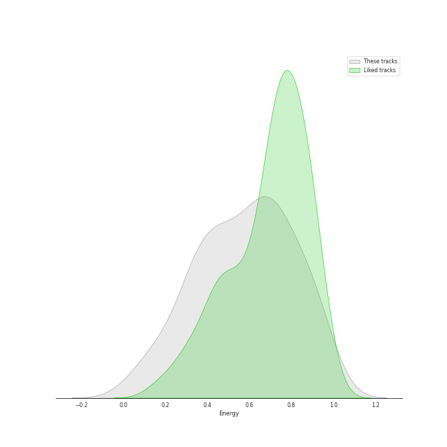
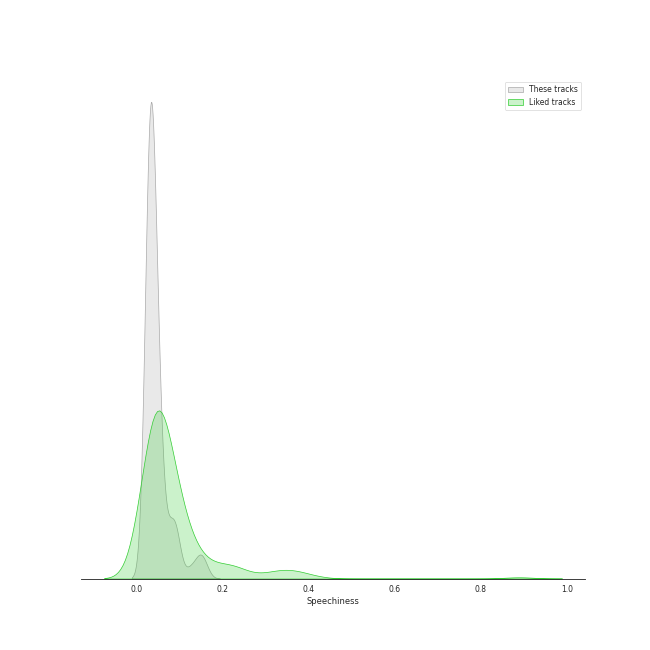
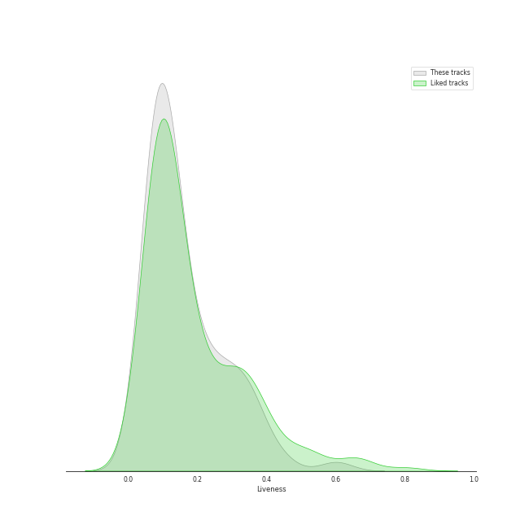

# Track Features for album rock

## Danceability

| ​ | 10 most Danceable tracks | ​​ | 10 least Danceable tracks |
|:---|:---|:---|:---|
|  | Dreams - 2004 Remaster (0.828) |  | Lights (0.193) |
|  | Eye of the Tiger (0.817) |  | Desperado - 2013 Remaster (0.228) |
|  | Sara - 2015 Remaster (0.743) |  | The Great Gig in the Sky (0.274) |
|  | My Life (0.741) |  | She's Always a Woman (0.292) |
|  | A Matter of Trust (0.738) |  | Set the Controls for the Heart of the Sun (0.297) |
|  | (I Can't Get No) Satisfaction - Mono Version (0.723) |  | Dream On (0.307) |
|  | Rhiannon (0.723) |  | Brain Damage (0.324) |
|  | We Didn't Start the Fire (0.712) |  | Come Sail Away (0.324) |
|  | Won't Get Fooled Again - Remix (0.702) |  | Iron Man (0.332) |
|  | Uptown Girl (0.701) |  | Piano Man (0.334) |

## Energy

| ​ | 10 most Energetic tracks | ​​ | 10 least Energetic tracks |
|:---|:---|:---|:---|
|  | We Didn't Start the Fire (0.967) |  | And So It Goes (0.0387) |
|  | Uptown Girl (0.944) |  | And So It Goes (0.0871) |
|  | Go Your Own Way - 2004 Remaster (0.941) |  | She's Got a Way (0.142) |
|  | Immigrant Song - Remaster (0.932) |  | Lullabye (Goodnight, My Angel) (0.157) |
|  | Any Way You Want It (0.932) |  | Landslide (0.161) |
|  | Scenes from an Italian Restaurant (0.931) |  | The Great Gig in the Sky (0.217) |
|  | Movin' Out (Anthony's Song) (0.88) |  | Desperado - 2013 Remaster (0.224) |
|  | The Stranger (0.878) |  | Brain Damage (0.265) |
|  | Only the Good Die Young (0.872) |  | Hey You (0.302) |
|  | 25 or 6 to 4 (0.869) |  | Dust in the Wind (0.322) |

## Speechiness

| ​ | 10 most Speechy tracks | ​​ | 10 least Speechy tracks |
|:---|:---|:---|:---|
|  | Only the Good Die Young (0.159) |  | The Longest Time (0.0262) |
|  | Money (0.144) |  | A Matter of Trust (0.0268) |
|  | Scenes from an Italian Restaurant (0.126) |  | Hotel California - 2013 Remaster (0.027) |
|  | Big Shot (0.0972) |  | Cold as Ice (0.0271) |
|  | Paint It, Black (0.0926) |  | Dreams - 2004 Remaster (0.0276) |
|  | Black Dog - Remaster (0.0904) |  | Piano Man (0.0276) |
|  | Time (0.0841) |  | Dust in the Wind (0.0283) |
|  | The Stranger (0.0837) |  | Smoke on the Water (0.0284) |
|  | Iron Man (0.0765) |  | Comfortably Numb (0.0286) |
|  | Paranoid - 2012 - Remaster (0.0708) |  | Dream On (0.029) |

## Acousticness

| ​ | 10 most Acoustic tracks | ​​ | 10 least Acoustic tracks |
|:---|:---|:---|:---|
|  | She's Got a Way (0.97) |  | Paranoid - 2012 - Remaster (4.52e-05) |
|  | Lullabye (Goodnight, My Angel) (0.948) |  | Any Way You Want It (0.00251) |
|  | Desperado - 2013 Remaster (0.946) |  | Hard To Handle (0.00257) |
|  | And So It Goes (0.941) |  | Carry on Wayward Son (0.00321) |
|  | And So It Goes (0.91) |  | Iron Man (0.00367) |
|  | Landslide (0.883) |  | Hotel California - 2013 Remaster (0.00574) |
|  | She's Always a Woman (0.797) |  | The Chain - 2004 Remaster (0.009) |
|  | The Great Gig in the Sky (0.767) |  | Walk This Way (0.0114) |
|  | I'm a Believer - 2006 Remaster (0.707) |  | Immigrant Song - Remaster (0.013) |
|  | Just the Way You Are (0.703) |  | Pressure (0.0148) |

## Instrumentalness

| ​ | 10 most Instrumental tracks | ​​ | 10 least Instrumental tracks |
|:---|:---|:---|:---|
|  | Set the Controls for the Heart of the Sun (0.905) |  | And So It Goes (0.0) |
|  | The Great Gig in the Sky (0.896) |  | Only the Good Die Young (0.0) |
|  | Breathe (In the Air) (0.728) |  | We Didn't Start the Fire (0.0) |
|  | Smoke on the Water (0.581) |  | Don't Stop Believin' (0.0) |
|  | Brain Damage (0.341) |  | Lullabye (Goodnight, My Angel) (0.0) |
|  | Comfortably Numb (0.312) |  | The Longest Time (0.0) |
|  | Won't Get Fooled Again - Remix (0.235) |  | Uptown Girl (0.0) |
|  | Baba O'Riley (0.185) |  | Pinball Wizard (0.0) |
|  | Immigrant Song - Remaster (0.169) |  | Don't Ask Me Why (0.0) |
|  | Rhiannon (0.0946) |  | Vienna (0.0) |

## Liveness

| ​ | 10 most Live tracks | ​​ | 10 least Live tracks |
|:---|:---|:---|:---|
|  | Uptown Girl (0.601) |  | Iron Man (0.0372) |
|  | Don't Stop Believin' (0.447) |  | The Chain - 2004 Remaster (0.0451) |
|  | Carry on Wayward Son (0.446) |  | Smoke on the Water (0.0535) |
|  | Paint It, Black (0.399) |  | My Life (0.0555) |
|  | Captain Jack (0.374) |  | Hotel California - 2013 Remaster (0.0575) |
|  | Brain Damage (0.366) |  | Won't Get Fooled Again - Remix (0.0584) |
|  | We Didn't Start the Fire (0.356) |  | Movin' Out (Anthony's Song) (0.0591) |
|  | Immigrant Song - Remaster (0.349) |  | Who Are You (0.0655) |
|  | Lights (0.332) |  | The River of Dreams (0.0667) |
|  | Dream On (0.332) |  | Go Your Own Way - 2004 Remaster (0.068) |

## Valence

| ​ | 10 most Happy tracks | ​​ | 10 least Happy tracks |
|:---|:---|:---|:---|
|  | I'm a Believer - 2006 Remaster (0.962) |  | Come Sail Away (0.141) |
|  | Hard To Handle (0.961) |  | Baba O'Riley (0.15) |
|  | (I Can't Get No) Satisfaction - Mono Version (0.931) |  | Comfortably Numb (0.171) |
|  | Movin' Out (Anthony's Song) (0.895) |  | Desperado - 2013 Remaster (0.18) |
|  | We Didn't Start the Fire (0.895) |  | The Great Gig in the Sky (0.181) |
|  | Walk This Way (0.894) |  | Hey You (0.19) |
|  | Smoke on the Water (0.89) |  | New York State of Mind (0.194) |
|  | A Matter of Trust (0.88) |  | She's Got a Way (0.196) |
|  | Don't Ask Me Why (0.868) |  | Stairway to Heaven - Remaster (0.197) |
|  | Pressure (0.851) |  | Brain Damage (0.208) |

## Tempo

| ​ | 10 most Fast tracks | ​​ | 10 least Fast tracks |
|:---|:---|:---|:---|
|  | Lights (205.422) |  | Desperado - 2013 Remaster (60.3) |
|  | Piano Man (179.239) |  | She's Got a Way (75.859) |
|  | She's Always a Woman (176.631) |  | Only the Good Die Young (76.214) |
|  | Paranoid - 2012 - Remaster (163.071) |  | Lullabye (Goodnight, My Angel) (76.48) |
|  | Dream On (160.9) |  | I'm a Believer - 2006 Remaster (80.106) |
|  | Landslide (159.375) |  | Black Dog - Remaster (81.394) |
|  | Paint It, Black (158.691) |  | Stairway to Heaven - Remaster (82.433) |
|  | Iron Man (157.378) |  | The Joker (83.293) |
|  | Who Are You (156.372) |  | The Longest Time (84.347) |
|  | The Chain - 2004 Remaster (151.553) |  | The River of Dreams (89.646) |
