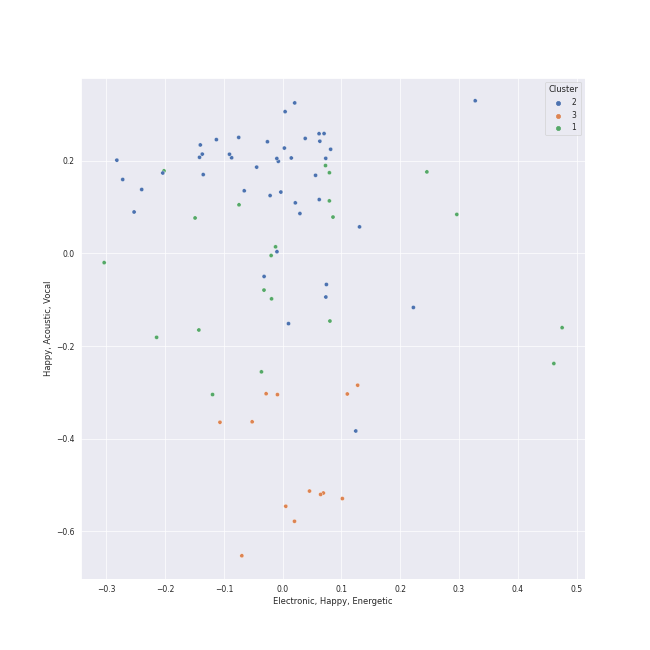

# Clusters in album rock

## Cluster #1

25 tracks

| Art | Track | Album | Artists | Label | 💚 | 🔗 |
|:---|:---|:---|:---|:---|:---|:---|
|  | Dream On | Aerosmith | Aerosmith | [Columbia](../../../../labels/columbia) | 💚 | [🔗](https://open.spotify.com/track/5MxNLUsfh7uzROypsoO5qe) |
|  | The River of Dreams | River Of Dreams | [Billy Joel](../../../../artists/billy_joel/overview.md) | [Columbia](../../../../labels/columbia) | | [🔗](https://open.spotify.com/track/30qVCFYKBtAENjTIBA8FPZ) |
|  | Paranoid - 2012 - Remaster | Paranoid (Remaster) | Black Sabbath | [Rhino](../../../../labels/rhino), [Warner Records](../../../../labels/warner_records) | | [🔗](https://open.spotify.com/track/1Y373MqadDRtclJNdnUXVc) |
|  | The Chain - 2004 Remaster | Rumours (Super Deluxe) | Fleetwood Mac | [Rhino](../../../../labels/rhino), [Warner Records](../../../../labels/warner_records) | | [🔗](https://open.spotify.com/track/5e9TFTbltYBg2xThimr0rU) |
|  | Cold as Ice | Foreigner (Expanded) | Foreigner | Rhino Atlantic | 💚 | [🔗](https://open.spotify.com/track/7vidktgNZFQylTgH1GEnMs) |
|  | Dust in the Wind | Point Of Know Return (Expanded Edition) | Kansas | [Epic](../../../../labels/epic), [Legacy](../../../../labels/legacy) | 💚 | [🔗](https://open.spotify.com/track/6zeE5tKyr8Nu882DQhhSQI) |
|  | Pinball Wizard | Tommy | [The Who](../../../../artists/the_who/overview.md) | [UMC (Universal Music Catalogue)](../../../../labels/umc__universal_music_catalogue_) | 💚 | [🔗](https://open.spotify.com/track/6LbbHFEajG9e4m0G3L47c4) |
|  | Behind Blue Eyes | Who's Next (Deluxe Edition) | [The Who](../../../../artists/the_who/overview.md) | [Polydor Records](../../../../labels/polydor_records) | 💚 | [🔗](https://open.spotify.com/track/0cKk8BKEi7zXbdrYdyqBP5) |
|  | Won't Get Fooled Again - Remix | Who's Next (Expanded Edition) | [The Who](../../../../artists/the_who/overview.md) | [Geffen*](../../../../labels/geffen) | 💚 | [🔗](https://open.spotify.com/track/1W1GpfPujmgp2vQqcpUhtU) |
|  | Who Are You | Who Are You | [The Who](../../../../artists/the_who/overview.md) | [Geffen](../../../../labels/geffen) | 💚 | [🔗](https://open.spotify.com/track/23IJ5wLRhEZ9DOuia5mPiZ) |
## Cluster #2

16 tracks

| Art | Track | Album | Artists | Label | 💚 | 🔗 |
|:---|:---|:---|:---|:---|:---|:---|
|  | Just the Way You Are | The Stranger | [Billy Joel](../../../../artists/billy_joel/overview.md) | [Columbia](../../../../labels/columbia) | 💚 | [🔗](https://open.spotify.com/track/06RdYCp0UxsBtWsonHfSZz) |
|  | She's Always a Woman | The Stranger | [Billy Joel](../../../../artists/billy_joel/overview.md) | [Columbia](../../../../labels/columbia) | | [🔗](https://open.spotify.com/track/3ILLSvTYvFjjEdbxvQumOb) |
|  | Vienna | The Stranger | [Billy Joel](../../../../artists/billy_joel/overview.md) | [Columbia](../../../../labels/columbia) | 💚 | [🔗](https://open.spotify.com/track/7gREIuHognJFspylIDJ94p) |
|  | And So It Goes | Storm Front | [Billy Joel](../../../../artists/billy_joel/overview.md) | [Columbia](../../../../labels/columbia) | 💚 | [🔗](https://open.spotify.com/track/1u7kQUb3lQcpHaYRfia13A) |
|  | And So It Goes | Good Vibrations | [Billy Joel](../../../../artists/billy_joel/overview.md), The King's Singers | RCA Victor | | [🔗](https://open.spotify.com/track/1v8w3Ve0EYhy8cMlRR92QM) |
|  | Lullabye (Goodnight, My Angel) | River Of Dreams | [Billy Joel](../../../../artists/billy_joel/overview.md) | [Columbia](../../../../labels/columbia) | 💚 | [🔗](https://open.spotify.com/track/4cURHmiuYii52BVbhrGbv0) |
|  | Desperado - 2013 Remaster | Desperado (2013 Remaster) | Eagles | [Rhino/Elektra](../../../../labels/rhino) | 💚 | [🔗](https://open.spotify.com/track/2TjnCxxQRYn56Ye8gkUKiW) |
|  | Landslide | Fleetwood Mac | Fleetwood Mac | [Warner Records](../../../../labels/warner_records) | 💚 | [🔗](https://open.spotify.com/track/5ihS6UUlyQAfmp48eSkxuQ) |
|  | Stairway to Heaven - Remaster | Led Zeppelin IV (Deluxe Edition) | Led Zeppelin | [Atlantic Records](../../../../labels/atlantic_records) | | [🔗](https://open.spotify.com/track/5CQ30WqJwcep0pYcV4AMNc) |
|  | Time | The Dark Side of the Moon | Pink Floyd | Pink Floyd Records | | [🔗](https://open.spotify.com/track/3TO7bbrUKrOSPGRTB5MeCz) |
## Cluster #3

29 tracks

| Art | Track | Album | Artists | Label | 💚 | 🔗 |
|:---|:---|:---|:---|:---|:---|:---|
|  | Walk This Way | Toys In The Attic | Aerosmith | [Columbia](../../../../labels/columbia) | | [🔗](https://open.spotify.com/track/5SZ6zX4rOrEQferfFC2MfP) |
|  | Only the Good Die Young | The Stranger | [Billy Joel](../../../../artists/billy_joel/overview.md) | [Columbia](../../../../labels/columbia) | 💚 | [🔗](https://open.spotify.com/track/2xabqm0YNQCTcPteQjJ22K) |
|  | Big Shot | 52nd Street | [Billy Joel](../../../../artists/billy_joel/overview.md) | [Columbia](../../../../labels/columbia) | | [🔗](https://open.spotify.com/track/22wxe2Yc9JzihICXYLGAQ7) |
|  | My Life | 52nd Street | [Billy Joel](../../../../artists/billy_joel/overview.md) | [Columbia](../../../../labels/columbia) | 💚 | [🔗](https://open.spotify.com/track/4ZoBC5MhSEzuknIgAkBaoT) |
|  | Don't Ask Me Why | Glass Houses | [Billy Joel](../../../../artists/billy_joel/overview.md) | [Columbia](../../../../labels/columbia) | | [🔗](https://open.spotify.com/track/6g4vHtdGqD5eEgpf7nKISk) |
|  | Pressure | The Nylon Curtain | [Billy Joel](../../../../artists/billy_joel/overview.md) | [Columbia](../../../../labels/columbia) | | [🔗](https://open.spotify.com/track/3LqvmDtXWXjF7fg8mh8iZh) |
|  | A Matter of Trust | The Bridge | [Billy Joel](../../../../artists/billy_joel/overview.md) | [Columbia](../../../../labels/columbia) | 💚 | [🔗](https://open.spotify.com/track/6J212smZzpeOCYQ9DITMSC) |
|  | 25 or 6 to 4 | Chicago IX: Chicago's Greatest Hits | Chicago | [Rhino](../../../../labels/rhino) | 💚 | [🔗](https://open.spotify.com/track/65eRcjlStTnk8opG5eIQ8Z) |
|  | Go Your Own Way - 2004 Remaster | Rumours (Super Deluxe) | Fleetwood Mac | [Rhino](../../../../labels/rhino), [Warner Records](../../../../labels/warner_records) | | [🔗](https://open.spotify.com/track/4xh7W7tlNMIczFhupCPniY) |
|  | (I Can't Get No) Satisfaction - Mono Version | Out Of Our Heads | The Rolling Stones | ABKCO Music and Records, Inc. | 💚 | [🔗](https://open.spotify.com/track/2PzU4IB8Dr6mxV3lHuaG34) |