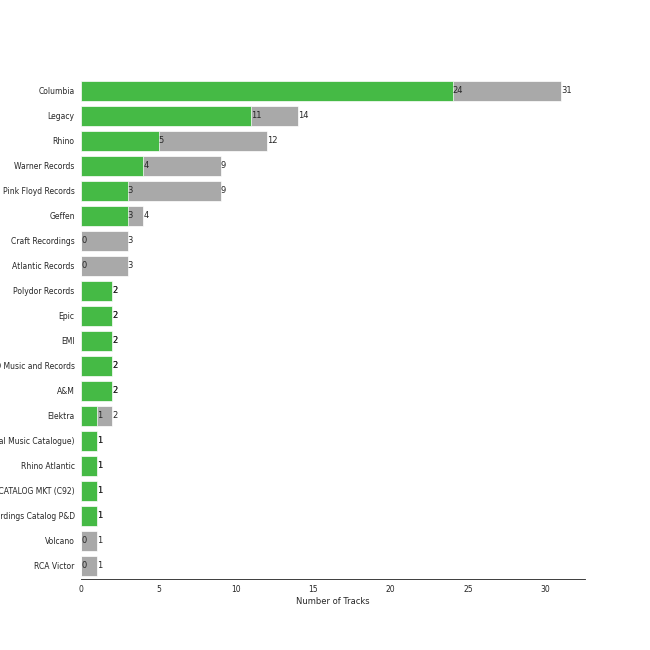

# album rock

[61 songs](tracks.md)

## Top Artists

| Art | Tracks | 💚 | Artist | 🔗 |
|:---|---:|---:|:---|:---|
|  | 23 | 15 | [Billy Joel](../../artists/billy_joel/overview.md) | [🔗](https://open.spotify.com/artist/6zFYqv1mOsgBRQbae3JJ9e) |
|  | 6 | 6 | The Who | [🔗](https://open.spotify.com/artist/67ea9eGLXYMsO2eYQRui3w) |
|  | 6 | 2 | Fleetwood Mac | [🔗](https://open.spotify.com/artist/08GQAI4eElDnROBrJRGE0X) |
|  | 2 | 2 | Styx | [🔗](https://open.spotify.com/artist/4salDzkGmfycRqNUbyBphh) |
|  | 2 | 2 | The Rolling Stones | [🔗](https://open.spotify.com/artist/22bE4uQ6baNwSHPVcDxLCe) |
|  | 3 | 1 | Journey | [🔗](https://open.spotify.com/artist/0rvjqX7ttXeg3mTy8Xscbt) |
|  | 2 | 1 | Aerosmith | [🔗](https://open.spotify.com/artist/7Ey4PD4MYsKc5I2dolUwbH) |
|  | 2 | 1 | Black Sabbath | [🔗](https://open.spotify.com/artist/5M52tdBnJaKSvOpJGz8mfZ) |
|  | 2 | 1 | The Monkees | [🔗](https://open.spotify.com/artist/320EPCSEezHt1rtbfwH6Ck) |
|  | 2 | 1 | Kansas | [🔗](https://open.spotify.com/artist/2hl0xAkS2AIRAu23TVMBG1) |

See all 19 artists

| Art | Tracks | 💚 | Artist | 🔗 |
|:---|---:|---:|:---|:---|
|  | 2 | 1 | Eagles | [🔗](https://open.spotify.com/artist/0ECwFtbIWEVNwjlrfc6xoL) |
|  | 1 | 1 | Steve Miller Band | [🔗](https://open.spotify.com/artist/6QtGlUje9TIkLrgPZrESuk) |
|  | 1 | 1 | Foreigner | [🔗](https://open.spotify.com/artist/6IRouO5mvvfcyxtPDKMYFN) |
|  | 1 | 1 | The Black Crowes | [🔗](https://open.spotify.com/artist/5krkohEVJYw0qoB5VWwxaC) |
|  | 1 | 1 | Chicago | [🔗](https://open.spotify.com/artist/3iDD7bnsjL9J4fO298r0L0) |
|  | 3 | 0 | Led Zeppelin | [🔗](https://open.spotify.com/artist/36QJpDe2go2KgaRleHCDTp) |
|  | 1 | 0 | The King's Singers | [🔗](https://open.spotify.com/artist/5lR7yDVN4z9kahOiUSlMhe) |
|  | 1 | 0 | Deep Purple | [🔗](https://open.spotify.com/artist/568ZhdwyaiCyOGJRtNYhWf) |
|  | 1 | 0 | Survivor | [🔗](https://open.spotify.com/artist/26bcq2nyj5GB7uRr558iQg) |

## Top Albums

| Art | Tracks | 💚 | Album | Release Date | 🔗 |
|:---|---:|---:|:---|:---|:---|
|  | 7 | 6 | The Stranger | 1977-09-29 | [🔗](https://open.spotify.com/album/3IILMjMMnoN2sKzgesX8KV) |
|  | 3 | 0 | Rumours (Super Deluxe) | 1977-02-04 | [🔗](https://open.spotify.com/album/0BwWUstDMUbgq2NYONRqlu) |
|  | 2 | 2 | Who's Next (Deluxe Edition) | 1971-08-14 | [🔗](https://open.spotify.com/album/5MqyhhHbT13zsloD3uHhlQ) |
|  | 2 | 2 | Piano Man | 1973-11-09 | [🔗](https://open.spotify.com/album/77ErLrVvYETIlQJHAwhfIH) |
|  | 2 | 2 | Fleetwood Mac | 1975-07-11 | [🔗](https://open.spotify.com/album/5VIQ3VaAoRKOEpJ0fewdvo) |
|  | 2 | 2 | An Innocent Man | 1983-08-08 | [🔗](https://open.spotify.com/album/3R3x4zIabsvpD3yxqLaUpc) |
|  | 2 | 1 | Storm Front | 1989-10-17 | [🔗](https://open.spotify.com/album/1Vw2uoVkLAJFVViJ1QyK1D) |
|  | 2 | 1 | River Of Dreams | 1993-08-10 | [🔗](https://open.spotify.com/album/4HPnwQJAEvTY910q4RNeOu) |
|  | 2 | 1 | 52nd Street | 1978-10-13 | [🔗](https://open.spotify.com/album/1HmCO8VK98AU6EXPOjGYyI) |
|  | 2 | 0 | Led Zeppelin IV (Deluxe Edition) | 1971-11-08 | [🔗](https://open.spotify.com/album/44Ig8dzqOkvkGDzaUof9lK) |

See all 45 albums

| Art | Tracks | 💚 | Album | Release Date | 🔗 |
|:---|---:|---:|:---|:---|:---|
|  | 1 | 1 | Who's Next (Expanded Edition) | 1971-08-14 | [🔗](https://open.spotify.com/album/53PBYiedQrASAs5sy63JqT) |
|  | 1 | 1 | Who Are You | 1978-08-18 | [🔗](https://open.spotify.com/album/7at3CV9Y9P57wsEXkfU0q8) |
|  | 1 | 1 | Turnstiles | 1976-05-19 | [🔗](https://open.spotify.com/album/7GiLfxL1su3MSqz7pmKMZi) |
|  | 1 | 1 | Tommy | 1969-05-23 | [🔗](https://open.spotify.com/album/5cT7ee1sy2oEbFalP4asS4) |
|  | 1 | 1 | The Ultimate Collection | 2017-02-03 | [🔗](https://open.spotify.com/album/6TcPqftScGmR0aEgIb43Vv) |
|  | 1 | 1 | The Joker | 1973-01-01 | [🔗](https://open.spotify.com/album/5uYNj1HkZrWKAkhEYcGmJr) |
|  | 1 | 1 | The Grand Illusion | 1977-01-01 | [🔗](https://open.spotify.com/album/6MFIBPVrZjHjP0pPkVF3IU) |
|  | 1 | 1 | The Bridge | 1986-07-28 | [🔗](https://open.spotify.com/album/2fRxSC6FtiAkhEDVZr2seH) |
|  | 1 | 1 | Shake Your Money Maker | 1990-02-13 | [🔗](https://open.spotify.com/album/2NRRQLuW6j3EsoWpIl2MR3) |
|  | 1 | 1 | Point Of Know Return (Expanded Edition) | 1977 | [🔗](https://open.spotify.com/album/6oU298pdPTCQnMx1PYwyUA) |
|  | 1 | 1 | Pieces Of Eight | 1978-01-01 | [🔗](https://open.spotify.com/album/294yFGYq9SBXWR4g6dK63D) |
|  | 1 | 1 | Out Of Our Heads | 1965-07-30 | [🔗](https://open.spotify.com/album/2Q5MwpTmtjscaS34mJFXQQ) |
|  | 1 | 1 | My Generation (Stereo Version) | 1965-12-03 | [🔗](https://open.spotify.com/album/6Oc6Ok1Oawu8lRkjmD4mXy) |
|  | 1 | 1 | More of The Monkees (Deluxe Edition) | 1967-01-09 | [🔗](https://open.spotify.com/album/50zHjIiTOZM232gnWvOydX) |
|  | 1 | 1 | Infinity | 1978 | [🔗](https://open.spotify.com/album/7K4Nk5fHkCuzNm5A6mdo2U) |
|  | 1 | 1 | Foreigner (Expanded) | 1977-03-08 | [🔗](https://open.spotify.com/album/1OU7zJvUfgxxPHgkTClt1M) |
|  | 1 | 1 | Desperado (2013 Remaster) | 1973 | [🔗](https://open.spotify.com/album/09WBxbis5Sixt01FVMs8UM) |
|  | 1 | 1 | Chicago IX: Chicago's Greatest Hits | 1975-11-10 | [🔗](https://open.spotify.com/album/5qWGV0fd7hpdptJYI4G9Dd) |
|  | 1 | 1 | Aftermath | 1966-04-15 | [🔗](https://open.spotify.com/album/72qrnM4yUNMDDlWiqKc8iY) |
|  | 1 | 1 | Aerosmith | 1973-01-05 | [🔗](https://open.spotify.com/album/19lEZSnCCbVEkKchoPQWDZ) |
|  | 1 | 0 | Tusk (2015 Remaster) | 1979-10-12 | [🔗](https://open.spotify.com/album/5FIN8pyPVx8ggNs5jQ86Re) |
|  | 1 | 0 | Toys In The Attic | 1975-04-08 | [🔗](https://open.spotify.com/album/36IxIOGEBAXVozDSiVs09B) |
|  | 1 | 0 | The Nylon Curtain | 1982-06-23 | [🔗](https://open.spotify.com/album/50bajZpetfL5T0iRCOR74J) |
|  | 1 | 0 | The Birds, The Bees, & The Monkees | 1968-04-22 | [🔗](https://open.spotify.com/album/2Ov6zb7NfgDh3EXSIIWrb2) |
|  | 1 | 0 | Rocky IV | 1985 | [🔗](https://open.spotify.com/album/3t3BbpFJiGcXl4jI5CRLLA) |
|  | 1 | 0 | Paranoid (Remaster) | 1970-09-18 | [🔗](https://open.spotify.com/album/6r7LZXAVueS5DqdrvXJJK7) |
|  | 1 | 0 | Machine Head | 1972-03-25 | [🔗](https://open.spotify.com/album/1EK3a0Yctg4d3nGQzE4Uty) |
|  | 1 | 0 | Leftoverture (Expanded Edition) | 1976 | [🔗](https://open.spotify.com/album/7MejfRSNnrpcLZIxkeZDqR) |
|  | 1 | 0 | Led Zeppelin III (Remaster) | 1970 | [🔗](https://open.spotify.com/album/6P5QHz4XtxOmS5EuiGIPut) |
|  | 1 | 0 | Hotel California (2013 Remaster) | 1976-12-08 | [🔗](https://open.spotify.com/album/2widuo17g5CEC66IbzveRu) |
|  | 1 | 0 | Good Vibrations | 1993 | [🔗](https://open.spotify.com/album/10IUKCLZPs9onPwXfQVxfv) |
|  | 1 | 0 | Glass Houses | 1980-03-12 | [🔗](https://open.spotify.com/album/5sztejERqpktXEdemlUvU5) |
|  | 1 | 0 | Escape (Bonus Track Version) | 1981 | [🔗](https://open.spotify.com/album/43wpzak9OmQfrjyksuGwp0) |
|  | 1 | 0 | Departure | 1980 | [🔗](https://open.spotify.com/album/2OyVtIEp7O7a6o82DF4Ba5) |
|  | 1 | 0 | Cold Spring Harbor | 1971-11-01 | [🔗](https://open.spotify.com/album/274rMlKrr22086ohmwAJZA) |

## Top Record Labels

| Tracks | 💚 | Label |
|---:|---:|:---|
| 27 | 17 | [Columbia](../../labels/columbia/overview.md) |
| 12 | 4 | [Rhino](../../labels/rhino/overview.md) |
| 9 | 3 | [Warner Records](../../labels/warner_records/overview.md) |
| 3 | 3 | [Geffen](../../labels/geffen/overview.md) |
| 5 | 2 | [Legacy](../../labels/legacy/overview.md) |
| 2 | 2 | [Polydor Records](../../labels/polydor_records/overview.md) |
| 2 | 2 | ABKCO Music and Records |
| 2 | 2 | A&M |
| 2 | 1 | [Epic](../../labels/epic/overview.md) |
| 2 | 1 | Elektra |

See all 17 labels

| Tracks | 💚 | Label |
|---:|---:|:---|
| 1 | 1 | [UMC (Universal Music Catalogue)](../../labels/umc__universal_music_catalogue_/overview.md) |
| 1 | 1 | Rhino Atlantic |
| 1 | 1 | CAPITOL CATALOG MKT (C92) |
| 1 | 1 | American Recordings Catalog P&D |
| 3 | 0 | [Atlantic Records](../../labels/atlantic_records/overview.md) |
| 1 | 0 | Volcano |
| 1 | 0 | RCA Victor |

## Years

| 10 newest albums | 10 oldest albums |
|:---|:---|
| 
 The Ultimate Collection (2017-02-03)
 | 
 Out Of Our Heads (1965-07-30)
 |
| 
 River Of Dreams (1993-08-10)
 | 
 My Generation (Stereo Version) (1965-12-03)
 |
| 
 Good Vibrations (1993)
 | 
 Aftermath (1966-04-15)
 |
| 
 Shake Your Money Maker (1990-02-13)
 | 
 More of The Monkees (Deluxe Edition) (1967-01-09)
 |
| 
 Storm Front (1989-10-17)
 | 
 The Birds, The Bees, & The Monkees (1968-04-22)
 |
| 
 The Bridge (1986-07-28)
 | 
 Tommy (1969-05-23)
 |
| 
 Rocky IV (1985)
 | 
 Led Zeppelin III (Remaster) (1970)
 |
| 
 An Innocent Man (1983-08-08)
 | 
 Paranoid (Remaster) (1970-09-18)
 |
| 
 The Nylon Curtain (1982-06-23)
 | 
 Who's Next (Deluxe Edition) (1971-08-14)
 |
| 
 Escape (Bonus Track Version) (1981)
 | 
 Who's Next (Expanded Edition) (1971-08-14)
 |
## Audio Features

| 10 most Danceable tracks | 10 least Danceable tracks |
|:---|:---|
| Dreams - 2004 Remaster (0.828) | Lights (0.193) |
| Eye of the Tiger (0.817) | Desperado - 2013 Remaster (0.228) |
| Sara - 2015 Remaster (0.743) | She's Always a Woman (0.292) |
| My Life (0.741) | Dream On (0.307) |
| A Matter of Trust (0.738) | Come Sail Away (0.324) |
| (I Can't Get No) Satisfaction - Mono Version (0.723) | Iron Man (0.332) |
| Rhiannon (0.723) | Piano Man (0.334) |
| We Didn't Start the Fire (0.712) | Stairway to Heaven - Remaster (0.338) |
| Won't Get Fooled Again - Remix (0.702) | And So It Goes (0.351) |
| Uptown Girl (0.701) | Captain Jack (0.392) |

| 10 most Energetic tracks | 10 least Energetic tracks |
|:---|:---|
| We Didn't Start the Fire (0.967) | And So It Goes (0.0387) |
| Uptown Girl (0.944) | And So It Goes (0.0871) |
| Go Your Own Way - 2004 Remaster (0.941) | She's Got a Way (0.142) |
| Immigrant Song - Remaster (0.932) | Lullabye (Goodnight, My Angel) (0.157) |
| Any Way You Want It (0.932) | Landslide (0.161) |
| Scenes from an Italian Restaurant (0.931) | Desperado - 2013 Remaster (0.224) |
| Movin' Out (Anthony's Song) (0.88) | Dust in the Wind (0.322) |
| The Stranger (0.878) | She's Always a Woman (0.324) |
| Only the Good Die Young (0.872) | The Longest Time (0.333) |
| 25 or 6 to 4 (0.869) | Come Sail Away (0.335) |

| 10 most Speechy tracks | 10 least Speechy tracks |
|:---|:---|
| Only the Good Die Young (0.159) | The Longest Time (0.0262) |
| Scenes from an Italian Restaurant (0.126) | A Matter of Trust (0.0268) |
| Big Shot (0.0972) | Hotel California - 2013 Remaster (0.027) |
| Paint It, Black (0.0926) | Cold as Ice (0.0271) |
| Black Dog - Remaster (0.0904) | Dreams - 2004 Remaster (0.0276) |
| The Stranger (0.0837) | Piano Man (0.0276) |
| Iron Man (0.0765) | Dust in the Wind (0.0283) |
| Paranoid - 2012 - Remaster (0.0708) | Smoke on the Water (0.0284) |
| My Generation - Stereo Version (0.058) | Dream On (0.029) |
| The River of Dreams (0.0576) | Rhiannon (0.0296) |

| 10 most Acoustic tracks | 10 least Acoustic tracks |
|:---|:---|
| She's Got a Way (0.97) | Paranoid - 2012 - Remaster (4.52e-05) |
| Lullabye (Goodnight, My Angel) (0.948) | Any Way You Want It (0.00251) |
| Desperado - 2013 Remaster (0.946) | Hard To Handle (0.00257) |
| And So It Goes (0.941) | Carry on Wayward Son (0.00321) |
| And So It Goes (0.91) | Iron Man (0.00367) |
| Landslide (0.883) | Hotel California - 2013 Remaster (0.00574) |
| She's Always a Woman (0.797) | The Chain - 2004 Remaster (0.009) |
| I'm a Believer - 2006 Remaster (0.707) | Walk This Way (0.0114) |
| Just the Way You Are (0.703) | Immigrant Song - Remaster (0.013) |
| Vienna (0.659) | Pressure (0.0148) |

| 10 most Instrumental tracks | 10 least Instrumental tracks |
|:---|:---|
| Smoke on the Water (0.581) | And So It Goes (0.0) |
| Won't Get Fooled Again - Remix (0.235) | Only the Good Die Young (0.0) |
| Baba O'Riley (0.185) | We Didn't Start the Fire (0.0) |
| Immigrant Song - Remaster (0.169) | Don't Stop Believin' (0.0) |
| Rhiannon (0.0946) | Lullabye (Goodnight, My Angel) (0.0) |
| 25 or 6 to 4 (0.0367) | The Longest Time (0.0) |
| (I Can't Get No) Satisfaction - Mono Version (0.0317) | Uptown Girl (0.0) |
| Black Dog - Remaster (0.0314) | Pinball Wizard (0.0) |
| Sara - 2015 Remaster (0.0208) | Don't Ask Me Why (0.0) |
| My Generation - Stereo Version (0.00822) | Vienna (0.0) |

| 10 most Live tracks | 10 least Live tracks |
|:---|:---|
| Uptown Girl (0.601) | Iron Man (0.0372) |
| Don't Stop Believin' (0.447) | The Chain - 2004 Remaster (0.0451) |
| Carry on Wayward Son (0.446) | Smoke on the Water (0.0535) |
| Paint It, Black (0.399) | My Life (0.0555) |
| Captain Jack (0.374) | Hotel California - 2013 Remaster (0.0575) |
| We Didn't Start the Fire (0.356) | Won't Get Fooled Again - Remix (0.0584) |
| Immigrant Song - Remaster (0.349) | Movin' Out (Anthony's Song) (0.0591) |
| Lights (0.332) | Who Are You (0.0655) |
| Dream On (0.332) | The River of Dreams (0.0667) |
| New York State of Mind (0.323) | Go Your Own Way - 2004 Remaster (0.068) |

| 10 most Happy tracks | 10 least Happy tracks |
|:---|:---|
| I'm a Believer - 2006 Remaster (0.962) | Come Sail Away (0.141) |
| Hard To Handle (0.961) | Baba O'Riley (0.15) |
| (I Can't Get No) Satisfaction - Mono Version (0.931) | Desperado - 2013 Remaster (0.18) |
| Movin' Out (Anthony's Song) (0.895) | New York State of Mind (0.194) |
| We Didn't Start the Fire (0.895) | She's Got a Way (0.196) |
| Walk This Way (0.894) | Stairway to Heaven - Remaster (0.197) |
| Smoke on the Water (0.89) | Lullabye (Goodnight, My Angel) (0.22) |
| A Matter of Trust (0.88) | The Stranger (0.222) |
| Don't Ask Me Why (0.868) | Dream On (0.224) |
| Pressure (0.851) | And So It Goes (0.24) |
