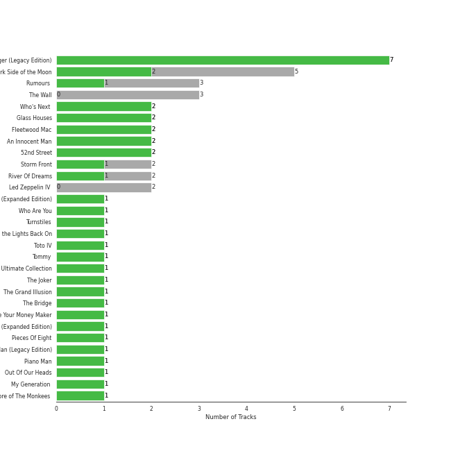
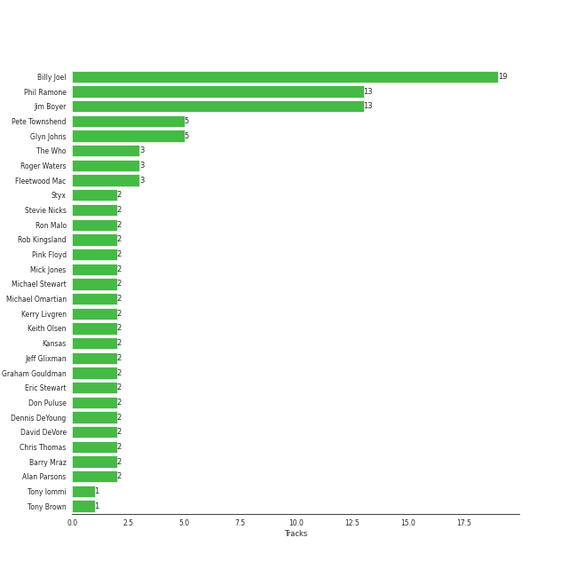
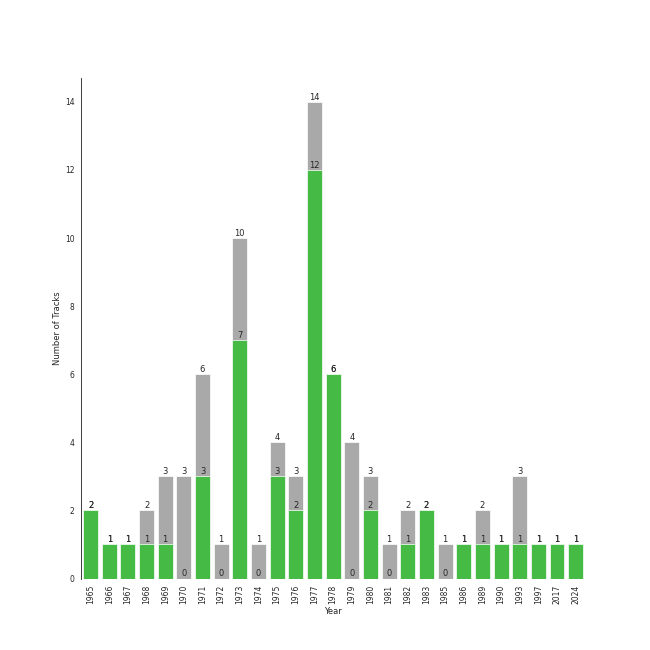

# album rock

80 songs

[See Track Features](audio_features.md)

[See Clusters](clusters/overview.md)

## Top Artists

| Art | Rank | Tracks | 💚 | Artist | 🔗 |
|:---|---:|---:|---:|:---|:---|
|  | 53 | 26 | 21 | [Billy Joel](../../artists/billy_joel/overview.md) | [🔗](https://open.spotify.com/artist/6zFYqv1mOsgBRQbae3JJ9e) |
|  | 324 | 6 | 6 | [The Who](../../artists/the_who/overview.md) | [🔗](https://open.spotify.com/artist/67ea9eGLXYMsO2eYQRui3w) |
|  | 104 | 9 | 3 | Pink Floyd | [🔗](https://open.spotify.com/artist/0k17h0D3J5VfsdmQ1iZtE9) |
|  | 414 | 6 | 3 | Fleetwood Mac | [🔗](https://open.spotify.com/artist/08GQAI4eElDnROBrJRGE0X) |
|  | 272 | 2 | 2 | 10cc | [🔗](https://open.spotify.com/artist/6i6WlGzQtXtz7GcC5H5st5) |
|  | 309 | 2 | 2 | Styx | [🔗](https://open.spotify.com/artist/4salDzkGmfycRqNUbyBphh) |
|  | 414 | 2 | 2 | Kansas | [🔗](https://open.spotify.com/artist/2hl0xAkS2AIRAu23TVMBG1) |
|  | 414 | 2 | 2 | The Rolling Stones | [🔗](https://open.spotify.com/artist/22bE4uQ6baNwSHPVcDxLCe) |
|  | 414 | 3 | 1 | Journey | [🔗](https://open.spotify.com/artist/0rvjqX7ttXeg3mTy8Xscbt) |
|  | 414 | 2 | 1 | Aerosmith | [🔗](https://open.spotify.com/artist/7Ey4PD4MYsKc5I2dolUwbH) |

See all 24 artists

| Art | Rank | Tracks | 💚 | Artist | 🔗 |
|:---|---:|---:|---:|:---|:---|
|  | 414 | 2 | 1 | Black Sabbath | [🔗](https://open.spotify.com/artist/5M52tdBnJaKSvOpJGz8mfZ) |
|  | 414 | 2 | 1 | The Monkees | [🔗](https://open.spotify.com/artist/320EPCSEezHt1rtbfwH6Ck) |
|  | 381 | 2 | 1 | Eagles | [🔗](https://open.spotify.com/artist/0ECwFtbIWEVNwjlrfc6xoL) |
|  | 414 | 1 | 1 | Steve Miller Band | [🔗](https://open.spotify.com/artist/6QtGlUje9TIkLrgPZrESuk) |
|  | 414 | 1 | 1 | Foreigner | [🔗](https://open.spotify.com/artist/6IRouO5mvvfcyxtPDKMYFN) |
|  | 414 | 1 | 1 | The Black Crowes | [🔗](https://open.spotify.com/artist/5krkohEVJYw0qoB5VWwxaC) |
|  | 386 | 1 | 1 | Chicago | [🔗](https://open.spotify.com/artist/3iDD7bnsjL9J4fO298r0L0) |
|  | 230 | 1 | 1 | TOTO | [🔗](https://open.spotify.com/artist/0PFtn5NtBbbUNbU9EAmIWF) |
|  | 414 | 3 | 0 | Creedence Clearwater Revival | [🔗](https://open.spotify.com/artist/3IYUhFvPQItj6xySrBmZkd) |
|  | 414 | 3 | 0 | Led Zeppelin | [🔗](https://open.spotify.com/artist/36QJpDe2go2KgaRleHCDTp) |
|  | 414 | 1 | 0 | The King's Singers | [🔗](https://open.spotify.com/artist/5lR7yDVN4z9kahOiUSlMhe) |
|  | 414 | 1 | 0 | Deep Purple | [🔗](https://open.spotify.com/artist/568ZhdwyaiCyOGJRtNYhWf) |
|  | 414 | 1 | 0 | Lynyrd Skynyrd | [🔗](https://open.spotify.com/artist/4MVyzYMgTwdP7Z49wAZHx0) |
|  | 414 | 1 | 0 | Survivor | [🔗](https://open.spotify.com/artist/26bcq2nyj5GB7uRr558iQg) |

## Most and least listened tracks
| Rank | ​ | Most listened tracks | Rank | ​​ | Least listened tracks |
|---:|:---|:---|---:|:---|:---|
| 286 |  | [Vienna](../../artists/billy_joel/overview.md) | 921 |  | Cold as Ice |
| 370 |  | Africa | 921 |  | Daydream Believer |
| 393 |  | [Movin' Out (Anthony's Song)](../../artists/billy_joel/overview.md) | 921 |  | Sweet Home Alabama |
| 513 |  | [Only the Good Die Young](../../artists/billy_joel/overview.md) | 921 |  | Hey You |
| 588 |  | Renegade | 921 |  | Lights |
| 626 |  | [Who Are You](../../artists/the_who/overview.md) | 921 |  | Immigrant Song - Remaster |
| 667 |  | [A Matter of Trust](../../artists/billy_joel/overview.md) | 921 |  | Any Way You Want It |
| 801 |  | The Great Gig in the Sky | 921 |  | Dust in the Wind |
| 830 |  | Desperado - 2013 Remaster | 921 |  | [New York State of Mind](../../artists/billy_joel/overview.md) |
| 837 |  | 25 or 6 to 4 | 921 |  | Proud Mary |

## Top Albums

| Art | Rank | Tracks | 💚 | Album | Release Date | 🔗 |
|:---|---:|---:|---:|:---|:---|:---|
|  | 174 | 7 | 7 | The Stranger (Legacy Edition) | 1977 | [🔗](https://open.spotify.com/album/1Mhn9VosyjtWn4dMPFlna6) |
|  | 534 | 5 | 2 | The Dark Side of the Moon | 1973-03-01 | [🔗](https://open.spotify.com/album/4LH4d3cOWNNsVw41Gqt2kv) |
|  | 612 | 3 | 1 | Rumours (Super Deluxe) | 1977-02-04 | [🔗](https://open.spotify.com/album/0BwWUstDMUbgq2NYONRqlu) |
|  | 612 | 3 | 0 | The Wall | 1979-11-30 | [🔗](https://open.spotify.com/album/5Dbax7G8SWrP9xyzkOvy2F) |
|  | 612 | 2 | 2 | Who's Next (Deluxe Edition) | 1971-08-14 | [🔗](https://open.spotify.com/album/5MqyhhHbT13zsloD3uHhlQ) |
|  | 612 | 2 | 2 | Glass Houses | 1980-03-12 | [🔗](https://open.spotify.com/album/5sztejERqpktXEdemlUvU5) |
|  | 612 | 2 | 2 | Fleetwood Mac | 1975-07-11 | [🔗](https://open.spotify.com/album/5VIQ3VaAoRKOEpJ0fewdvo) |
|  | 607 | 2 | 2 | An Innocent Man | 1983-08-08 | [🔗](https://open.spotify.com/album/3R3x4zIabsvpD3yxqLaUpc) |
|  | 612 | 2 | 2 | 52nd Street | 1978-10-13 | [🔗](https://open.spotify.com/album/1HmCO8VK98AU6EXPOjGYyI) |
|  | 612 | 2 | 1 | Storm Front | 1989-10-17 | [🔗](https://open.spotify.com/album/1Vw2uoVkLAJFVViJ1QyK1D) |

See all 58 albums

| Art | Rank | Tracks | 💚 | Album | Release Date | 🔗 |
|:---|---:|---:|---:|:---|:---|:---|
|  | 612 | 2 | 1 | River Of Dreams | 1993-08-10 | [🔗](https://open.spotify.com/album/4HPnwQJAEvTY910q4RNeOu) |
|  | 612 | 2 | 0 | Led Zeppelin IV (Deluxe Edition) | 1971-11-08 | [🔗](https://open.spotify.com/album/44Ig8dzqOkvkGDzaUof9lK) |
|  | 612 | 1 | 1 | Who's Next (Expanded Edition) | 1971-08-14 | [🔗](https://open.spotify.com/album/53PBYiedQrASAs5sy63JqT) |
|  | 422 | 1 | 1 | Who Are You | 1978-08-18 | [🔗](https://open.spotify.com/album/7at3CV9Y9P57wsEXkfU0q8) |
|  | 612 | 1 | 1 | Turnstiles | 1976-05-19 | [🔗](https://open.spotify.com/album/7GiLfxL1su3MSqz7pmKMZi) |
|  | 612 | 1 | 1 | Turn the Lights Back On | 2024-02-01 | [🔗](https://open.spotify.com/album/4csPGLYTb7kt85U377UCuC) |
|  | 265 | 1 | 1 | Toto IV | 1982-04-08 | [🔗](https://open.spotify.com/album/62U7xIHcID94o20Of5ea4D) |
|  | 612 | 1 | 1 | Tommy | 1969-05-23 | [🔗](https://open.spotify.com/album/5cT7ee1sy2oEbFalP4asS4) |
|  | 612 | 1 | 1 | The Ultimate Collection | 2017-02-03 | [🔗](https://open.spotify.com/album/6TcPqftScGmR0aEgIb43Vv) |
|  | 612 | 1 | 1 | The Joker | 1973-01-01 | [🔗](https://open.spotify.com/album/5uYNj1HkZrWKAkhEYcGmJr) |
|  | 612 | 1 | 1 | The Grand Illusion | 1977-01-01 | [🔗](https://open.spotify.com/album/6MFIBPVrZjHjP0pPkVF3IU) |
|  | 451 | 1 | 1 | The Bridge | 1986-07-28 | [🔗](https://open.spotify.com/album/2fRxSC6FtiAkhEDVZr2seH) |
|  | 612 | 1 | 1 | Shake Your Money Maker | 1990-02-13 | [🔗](https://open.spotify.com/album/2NRRQLuW6j3EsoWpIl2MR3) |
|  | 612 | 1 | 1 | Point Of Know Return (Expanded Edition) | 1977 | [🔗](https://open.spotify.com/album/6oU298pdPTCQnMx1PYwyUA) |
|  | 396 | 1 | 1 | Pieces Of Eight | 1978-01-01 | [🔗](https://open.spotify.com/album/294yFGYq9SBXWR4g6dK63D) |
|  | 583 | 1 | 1 | Piano Man (Legacy Edition) | 1973-11-07 | [🔗](https://open.spotify.com/album/69wjSAZXZiD2EBia3b3gxL) |
|  | 612 | 1 | 1 | Piano Man | 1973-11-09 | [🔗](https://open.spotify.com/album/77ErLrVvYETIlQJHAwhfIH) |
|  | 612 | 1 | 1 | Out Of Our Heads | 1965-07-30 | [🔗](https://open.spotify.com/album/2Q5MwpTmtjscaS34mJFXQQ) |
|  | 612 | 1 | 1 | My Generation (Stereo Version) | 1965-12-03 | [🔗](https://open.spotify.com/album/6Oc6Ok1Oawu8lRkjmD4mXy) |
|  | 612 | 1 | 1 | More of The Monkees (Deluxe Edition) | 1967-01-09 | [🔗](https://open.spotify.com/album/50zHjIiTOZM232gnWvOydX) |
|  | 612 | 1 | 1 | Leftoverture (Expanded Edition) | 1976 | [🔗](https://open.spotify.com/album/7MejfRSNnrpcLZIxkeZDqR) |
|  | 612 | 1 | 1 | Infinity | 1978 | [🔗](https://open.spotify.com/album/7K4Nk5fHkCuzNm5A6mdo2U) |
|  | 612 | 1 | 1 | Greatest Hits Vol. III | 1997-06-13 | [🔗](https://open.spotify.com/album/3cJ6ZymbUcNGe1T8YZtGyE) |
|  | 612 | 1 | 1 | Foreigner (Expanded) | 1977-03-08 | [🔗](https://open.spotify.com/album/1OU7zJvUfgxxPHgkTClt1M) |
|  | 555 | 1 | 1 | Desperado (2013 Remaster) | 1973-04-17 | [🔗](https://open.spotify.com/album/09WBxbis5Sixt01FVMs8UM) |
|  | 612 | 1 | 1 | Deceptive Bends | 1977 | [🔗](https://open.spotify.com/album/6D3RQD5AQZ4P2aDzsZmBI4) |
|  | 561 | 1 | 1 | Chicago IX: Chicago's Greatest Hits | 1975-11-10 | [🔗](https://open.spotify.com/album/5qWGV0fd7hpdptJYI4G9Dd) |
|  | 612 | 1 | 1 | Bloody Tourists | 1978 | [🔗](https://open.spotify.com/album/3MecVG0PeBObAhjwEAczFG) |
|  | 612 | 1 | 1 | Aftermath | 1966-04-15 | [🔗](https://open.spotify.com/album/72qrnM4yUNMDDlWiqKc8iY) |
|  | 612 | 1 | 1 | Aerosmith | 1973-01-05 | [🔗](https://open.spotify.com/album/19lEZSnCCbVEkKchoPQWDZ) |
|  | 612 | 1 | 1 | A Saucerful of Secrets | 1968-06-29 | [🔗](https://open.spotify.com/album/2vnJKtGjZXRUg0mYPZ3HGH) |
|  | 612 | 1 | 0 | Willy And The Poor Boys (Expanded Edition) | 1969-11-02 | [🔗](https://open.spotify.com/album/31q47gQszFt0CddSyMksgO) |
|  | 612 | 1 | 0 | Tusk (2015 Remaster) | 1979-10-12 | [🔗](https://open.spotify.com/album/5FIN8pyPVx8ggNs5jQ86Re) |
|  | 612 | 1 | 0 | Toys In The Attic | 1975-04-08 | [🔗](https://open.spotify.com/album/36IxIOGEBAXVozDSiVs09B) |
|  | 612 | 1 | 0 | The Nylon Curtain | 1982-06-23 | [🔗](https://open.spotify.com/album/50bajZpetfL5T0iRCOR74J) |
|  | 612 | 1 | 0 | The Birds, The Bees, & The Monkees | 1968-04-22 | [🔗](https://open.spotify.com/album/2Ov6zb7NfgDh3EXSIIWrb2) |
|  | 612 | 1 | 0 | Second Helping (Expanded Edition) | 1974-04-15 | [🔗](https://open.spotify.com/album/54V1ljNtyzAm053oJqi0SH) |
|  | 612 | 1 | 0 | Rocky IV | 1985 | [🔗](https://open.spotify.com/album/3t3BbpFJiGcXl4jI5CRLLA) |
|  | 612 | 1 | 0 | Pendulum (Expanded Edition) | 1970-12-07 | [🔗](https://open.spotify.com/album/372cMadhAGlNuDnc8TssqF) |
|  | 612 | 1 | 0 | Paranoid (Remaster) | 1970-09-18 | [🔗](https://open.spotify.com/album/6r7LZXAVueS5DqdrvXJJK7) |
|  | 612 | 1 | 0 | Machine Head | 1972-03-25 | [🔗](https://open.spotify.com/album/1EK3a0Yctg4d3nGQzE4Uty) |
|  | 612 | 1 | 0 | Led Zeppelin III (Remaster) | 1970 | [🔗](https://open.spotify.com/album/6P5QHz4XtxOmS5EuiGIPut) |
|  | 612 | 1 | 0 | Hotel California (2013 Remaster) | 1976-12-08 | [🔗](https://open.spotify.com/album/2widuo17g5CEC66IbzveRu) |
|  | 612 | 1 | 0 | Good Vibrations | 1993 | [🔗](https://open.spotify.com/album/10IUKCLZPs9onPwXfQVxfv) |
|  | 612 | 1 | 0 | Escape (2022 Remaster) | 1981-07-17 | [🔗](https://open.spotify.com/album/4guAwaniEAEQSW0NCpo4gm) |
|  | 612 | 1 | 0 | Departure | 1980 | [🔗](https://open.spotify.com/album/2OyVtIEp7O7a6o82DF4Ba5) |
|  | 612 | 1 | 0 | Cold Spring Harbor | 1971-11-01 | [🔗](https://open.spotify.com/album/274rMlKrr22086ohmwAJZA) |
|  | 612 | 1 | 0 | Bayou Country (Expanded Edition) | 1969-01-05 | [🔗](https://open.spotify.com/album/5pCRW9AT4BgoMOS52pRoJq) |

## Top Record Labels

| Tracks | 💚 | Label |
|---:|---:|:---|
| 31 | 24 | [Columbia](../../labels/columbia/overview.md) |
| 14 | 11 | [Legacy](../../labels/legacy/overview.md) |
| 12 | 5 | [Rhino](../../labels/rhino/overview.md) |
| 9 | 4 | [Warner Records](../../labels/warner_records/overview.md) |
| 9 | 3 | Pink Floyd Records |
| 4 | 3 | [Geffen](../../labels/geffen/overview.md) |
| 2 | 2 | [Polydor Records](../../labels/polydor_records/overview.md) |
| 2 | 2 | [Epic](../../labels/epic/overview.md) |
| 2 | 2 | [EMI](../../labels/emi/overview.md) |
| 2 | 2 | ABKCO Music and Records |

See all 20 labels

| Tracks | 💚 | Label |
|---:|---:|:---|
| 2 | 2 | A&M |
| 2 | 1 | Elektra |
| 1 | 1 | [UMC (Universal Music Catalogue)](../../labels/umc_(universal_music_catalogue)/overview.md) |
| 1 | 1 | Rhino Atlantic |
| 1 | 1 | CAPITOL CATALOG MKT (C92) |
| 1 | 1 | American Recordings Catalog P&D |
| 3 | 0 | [Craft Recordings](../../labels/craft_recordings/overview.md) |
| 3 | 0 | [Atlantic Records](../../labels/atlantic_records/overview.md) |
| 1 | 0 | Volcano |
| 1 | 0 | RCA Victor |

## Top Producers

| Art | Producer | Tracks | Credit Types |
|:---|:---|---:|:---|
|  | [Billy Joel](../../artists/billy_joel/overview.md) | 19 | Lyricist, Producer, Songwriter, Arranger |
| | [Jim Boyer](../../producers/jim_boyer/overview.md) | 13 | Producer |
| | [Phil Ramone](../../producers/phil_ramone/overview.md) | 13 | Producer |
| | Pete Townshend | 5 | Lyricist, Songwriter |
| | Glyn Johns | 5 | Producer |
|  | Fleetwood Mac | 3 | Producer |
| | Roger Waters | 3 | Lyricist, Songwriter |
|  | [The Who](../../artists/the_who/overview.md) | 3 | Producer |
| | Keith Olsen | 2 | Producer |
| | Chris Thomas | 2 | Producer |

View all

| Art | Producer | Tracks | Credit Types |
|:---|:---|---:|:---|
| | Michael Omartian | 2 | Arranger |
| | Mick Jones | 2 | Producer, Songwriter |
| | Dennis DeYoung | 2 | Lyricist, Songwriter, Producer |
| | Ron Malo | 2 | Producer |
| | Kerry Livgren | 2 | Lyricist, Songwriter |
| | Alan Parsons | 2 | Producer |
| | Stevie Nicks | 2 | Lyricist, Songwriter |
|  | Styx | 2 | Producer |
|  | Pink Floyd | 2 | Producer |
| | Jeff Glixman | 2 | Producer |
| | David DeVore | 2 | Producer |
| | Graham Gouldman | 2 | Producer, Songwriter |
| | Eric Stewart | 2 | Producer, Songwriter |
|  | Kansas | 2 | Arranger |
| | Barry Mraz | 2 | Producer |
| | Don Puluse | 2 | Producer |
| | Michael Stewart | 2 | Producer |
| | Rob Kingsland | 2 | Producer |
| | Tony Iommi | 1 | Songwriter |
| | Jon Astley | 1 | Producer |
| | Robert Lamm | 1 | Lyricist, Songwriter |
| | Keith Richards | 1 | Songwriter |
| | John Sinclair | 1 | Producer |
| | Liberty DeVitto | 1 | Arranger |
| | Ahmet Ertegun | 1 | Songwriter |
| | Jim Ed Norman | 1 | Arranger |
| | Doug Stegmeyer | 1 | Arranger |
| | Bill Ward | 1 | Songwriter |
| | Kit Lambert | 1 | Producer |
| | Ian McDonald | 1 | Producer |
|  | 10cc | 1 | Producer |
| | Bruce Botnick | 1 | Producer |
| | Caryl Weinstock | 1 | Producer |
| | Tommy Shaw | 1 | Lyricist, Songwriter |
| | Terry Becker | 1 | Producer |
| | Aynsley Dunbar | 1 | Producer |
| | Keith Moon | 1 | Producer |
| | Tony Brown | 1 | Producer |
| | Rodger Bain | 1 | Producer |
| | Jimmy Douglass | 1 | Producer |
| | John Hendrickson | 1 | Producer |
| | Mick Jagger | 1 | Songwriter |
| | Steve Lindsey | 1 | Arranger, Producer |
| | Richard Dashut | 1 | Producer |
| | Don Henley | 1 | Songwriter |
| | Leanne Ungar | 1 | Producer |
| | Ozzy Osbourne | 1 | Songwriter |
| | Ray Colcord | 1 | Producer |
| | Alvertis Isbell | 1 | Songwriter |
| | Glenn Frey | 1 | Songwriter |
| | Fred Tenny | 1 | Producer |
| | Justin Niebank | 1 | Producer |
| | Steve Miller | 1 | Producer, Songwriter |
| | Neil Diamond | 1 | Lyricist, Songwriter |
| | George Drakoulias | 1 | Producer |
| | Ken Caillat | 1 | Producer |
|  | The Rolling Stones | 1 | Arranger |
| | Rick Rubin | 1 | Producer |
| | Peter Bown | 1 | Producer |
| | Steve Boyer | 1 | Producer |
| | John Bradley | 1 | Producer |
| | Brendan O'Brien | 1 | Producer |
| | David Hassinger | 1 | Producer |
| | David Dickson | 1 | Producer |
| | Robert Charles | 1 | Producer |
| | Damon Lyon-Shaw | 1 | Producer |
| | Brian Ross-Myring | 1 | Producer |
| | Lou Waxman | 1 | Producer |
| | David Gilmour | 1 | Songwriter |
| | Ed Walsh | 1 | Producer |
| | Tom Allom | 1 | Producer |
| | Gregg Rolie | 1 | Producer |
| | Randy Mason | 1 | Producer |
| | Lou Gramm | 1 | Songwriter |
| | Geezer Butler | 1 | Lyricist, Songwriter |
| | Gary Lyons | 1 | Producer |
| | Jim Tomlinson | 1 | Arranger |
| | Kevin Herron | 1 | Producer |
| | Eddie Curtis | 1 | Songwriter |
| | Ross Valory | 1 | Producer |
| | Ira Newborn | 1 | Arranger |
| | Kenny Ascher | 1 | Arranger |
| | Bill Schnee | 1 | Producer |
| | James William Guercio | 1 | Producer |
| | Steve Perry | 1 | Songwriter |
| | Lindsey Buckingham | 1 | Lyricist, Songwriter |
| | Jim Horn | 1 | Arranger |
| | Brian Humphries | 1 | Producer |
| | Steven Tyler | 1 | Lyricist, Songwriter |
| | Chris Stamp | 1 | Producer |

## Years

| ​ | 10 newest albums | ​​ | 10 oldest albums |
|:---|:---|:---|:---|
|  | Turn the Lights Back On (2024-02-01) |  | Out Of Our Heads (1965-07-30) |
|  | The Ultimate Collection (2017-02-03) |  | My Generation (Stereo Version) (1965-12-03) |
|  | Greatest Hits Vol. III (1997-06-13) |  | Aftermath (1966-04-15) |
|  | River Of Dreams (1993-08-10) |  | More of The Monkees (Deluxe Edition) (1967-01-09) |
|  | Good Vibrations (1993) |  | The Birds, The Bees, & The Monkees (1968-04-22) |
|  | Shake Your Money Maker (1990-02-13) |  | A Saucerful of Secrets (1968-06-29) |
|  | Storm Front (1989-10-17) |  | Bayou Country (Expanded Edition) (1969-01-05) |
|  | The Bridge (1986-07-28) |  | Tommy (1969-05-23) |
|  | Rocky IV (1985) |  | Willy And The Poor Boys (Expanded Edition) (1969-11-02) |
|  | An Innocent Man (1983-08-08) |  | Led Zeppelin III (Remaster) (1970) |

