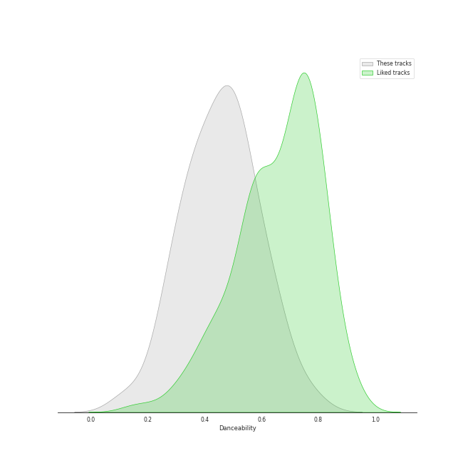
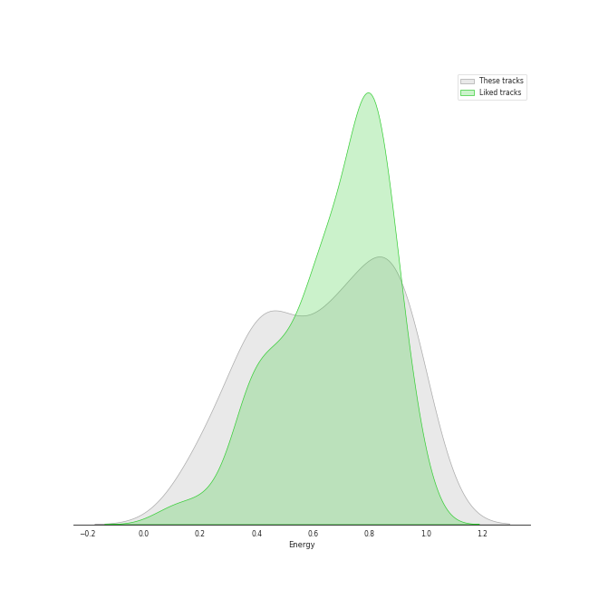
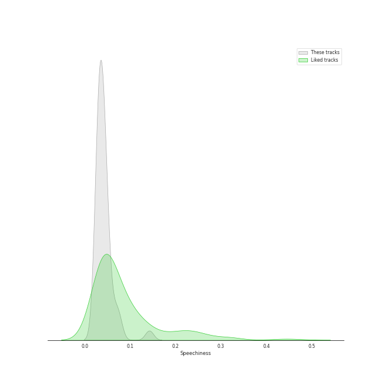
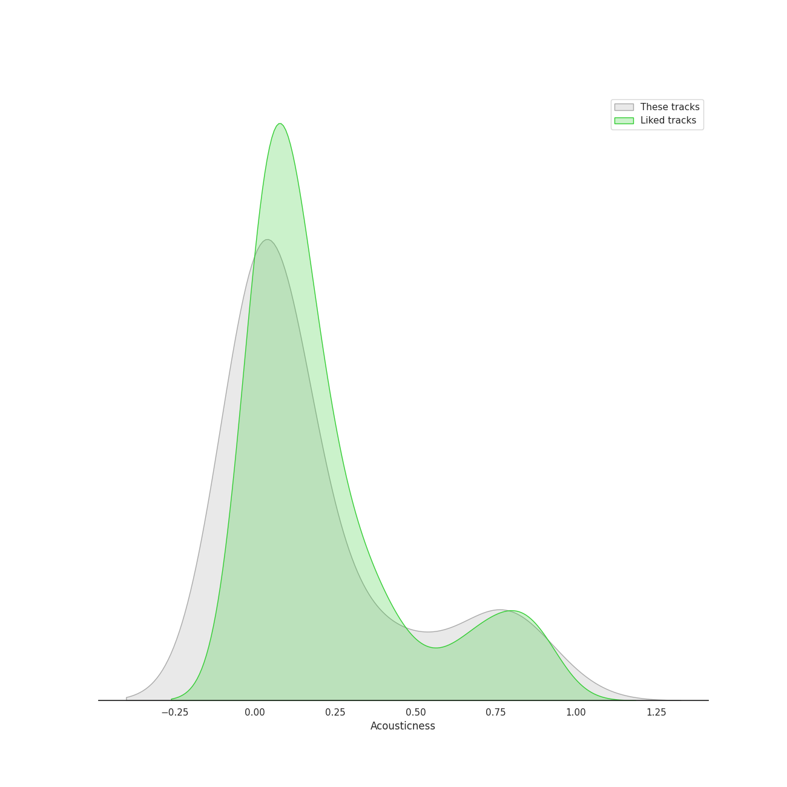
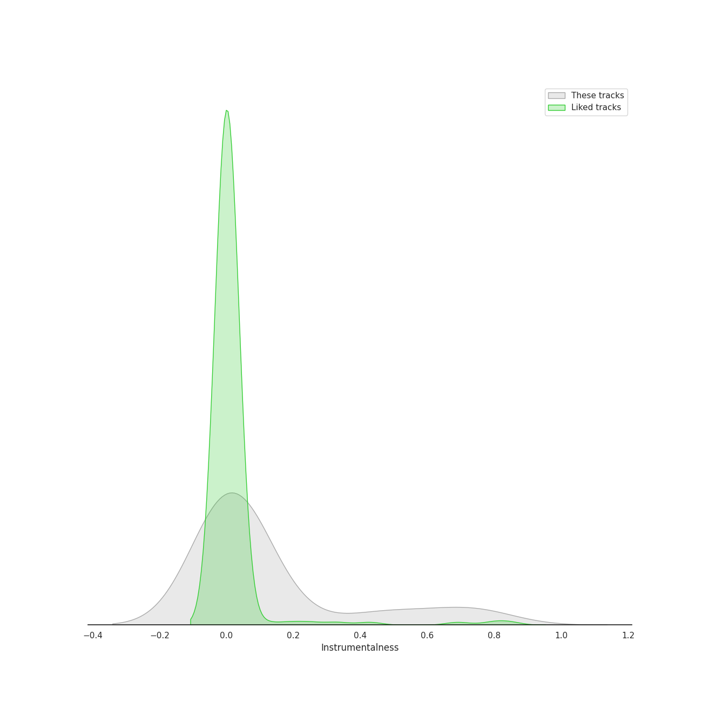
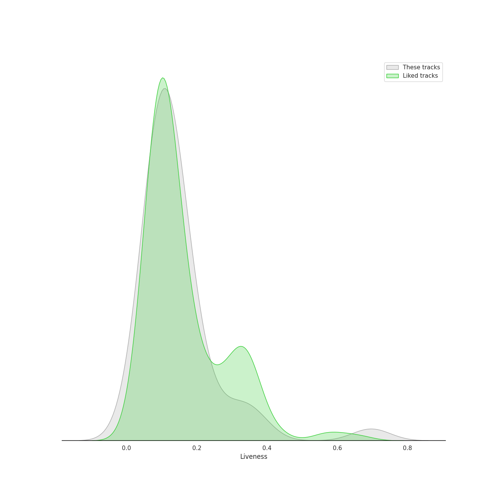
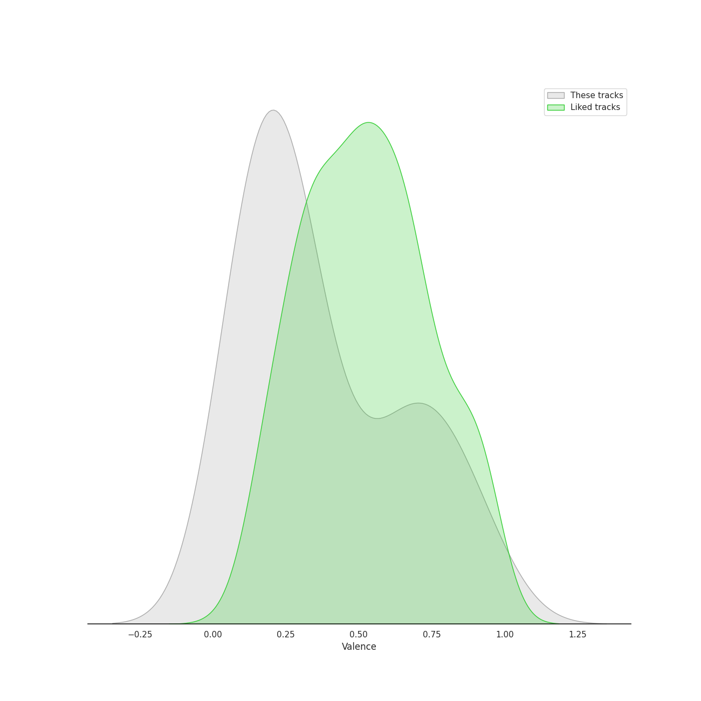
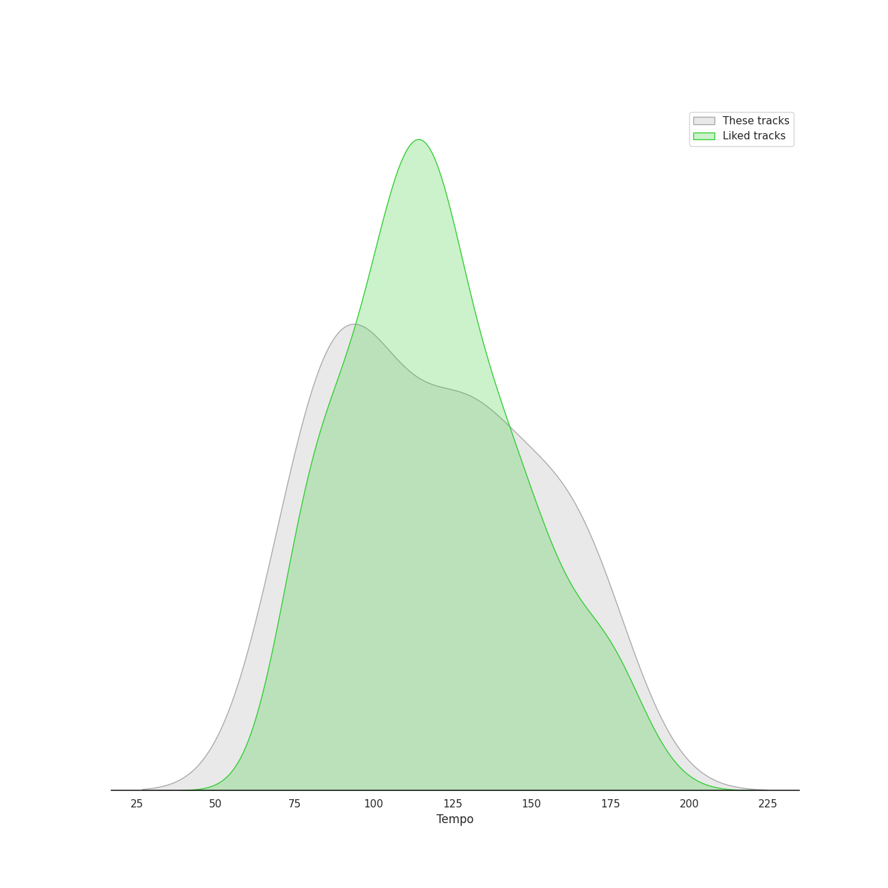

# Track Features for alternative rock

## Danceability

| ​ | 10 most Danceable tracks | ​​ | 10 least Danceable tracks |
|:---|:---|:---|:---|
|  | 1979 - Remastered 2012 (0.767) |  | Pyramid Song (0.127) |
|  | All I Need (0.67) |  | Paranoid Android (0.251) |
|  | Can't Stop (0.618) |  | No Surprises (0.255) |
|  | There, There (0.614) |  | In the Aeroplane Over the Sea (0.271) |
|  | The Adults Are Talking (0.593) |  | Exit Music (For A Film) (0.293) |
|  | Californication (0.592) |  | Everything In Its Right Place (0.296) |
|  | Dani California (0.556) |  | Let Down (0.351) |
|  | Someday (0.539) |  | Mr. Brightside (0.352) |
|  | All These Things That I've Done (0.539) |  | Karma Police (0.36) |
|  | Weird Fishes/ Arpeggi (0.531) |  | Best of You (0.366) |

## Energy

| ​ | 10 most Energetic tracks | ​​ | 10 least Energetic tracks |
|:---|:---|:---|:---|
|  | The Pretender (0.959) |  | Hurt (0.158) |
|  | Best of You (0.94) |  | I Will Follow You into the Dark (0.206) |
|  | Can't Stop (0.938) |  | Fake Plastic Trees (0.229) |
|  | Learn to Fly (0.919) |  | Exit Music (For A Film) (0.276) |
|  | Dani California (0.913) |  | Pyramid Song (0.335) |
|  | Mr. Brightside (0.911) |  | Slow Cheetah (0.344) |
|  | Snow (Hey Oh) (0.9) |  | High and Dry (0.383) |
|  | Everlong (0.881) |  | No Surprises (0.393) |
|  | Paranoid Android (0.848) |  | Creep (0.43) |
|  | Jigsaw Falling Into Place (0.832) |  | What Sarah Said (0.439) |

## Speechiness

| ​ | 10 most Speechy tracks | ​​ | 10 least Speechy tracks |
|:---|:---|:---|:---|
|  | Mr. Brightside (0.0747) |  | High and Dry (0.0256) |
|  | Best of You (0.0696) |  | Karma Police (0.0258) |
|  | Paranoid Android (0.0579) |  | Reckoner (0.0262) |
|  | Snow (Hey Oh) (0.0499) |  | What Sarah Said (0.0268) |
|  | Jigsaw Falling Into Place (0.0479) |  | Californication (0.027) |
|  | The Adults Are Talking (0.0475) |  | No Surprises (0.0278) |
|  | Can't Stop (0.0456) |  | Fake Plastic Trees (0.0297) |
|  | Everything In Its Right Place (0.0449) |  | Someday (0.0299) |
|  | Dani California (0.0437) |  | Street Spirit (Fade Out) (0.0304) |
|  | All These Things That I've Done (0.0436) |  | Let Down (0.0313) |

## Acousticness

| ​ | 10 most Acoustic tracks | ​​ | 10 least Acoustic tracks |
|:---|:---|:---|:---|
|  | I Will Follow You into the Dark (0.924) |  | Learn to Fly (1.83e-05) |
|  | What Sarah Said (0.801) |  | Everlong (5.99e-05) |
|  | Pyramid Song (0.786) |  | Let Down (0.000121) |
|  | Hurt (0.773) |  | Reptilia (0.000603) |
|  | Weird Fishes/ Arpeggi (0.772) |  | Best of You (0.000769) |
|  | Everything In Its Right Place (0.705) |  | The Pretender (0.000917) |
|  | All I Need (0.531) |  | Mr. Brightside (0.00121) |
|  | Reckoner (0.511) |  | Californication (0.0021) |
|  | In the Aeroplane Over the Sea (0.392) |  | All These Things That I've Done (0.00245) |
|  | Street Spirit (Fade Out) (0.317) |  | Someday (0.00425) |

## Instrumentalness

| ​ | 10 most Instrumental tracks | ​​ | 10 least Instrumental tracks |
|:---|:---|:---|:---|
|  | Weird Fishes/ Arpeggi (0.756) |  | Mr. Brightside (0.0) |
|  | Reptilia (0.713) |  | Can't Stop (0.0) |
|  | Street Spirit (Fade Out) (0.694) |  | I Will Follow You into the Dark (0.0) |
|  | 1979 - Remastered 2012 (0.583) |  | In the Aeroplane Over the Sea (0.0) |
|  | There, There (0.52) |  | Someday (0.0) |
|  | All I Need (0.428) |  | The Pretender (0.0) |
|  | Pyramid Song (0.427) |  | Dani California (8.59e-06) |
|  | Reckoner (0.16) |  | Snow (Hey Oh) (1.75e-05) |
|  | Exit Music (For A Film) (0.122) |  | Learn to Fly (2.07e-05) |
|  | Let Down (0.113) |  | All These Things That I've Done (2.37e-05) |

## Liveness

| ​ | 10 most Live tracks | ​​ | 10 least Live tracks |
|:---|:---|:---|:---|
|  | Someday (0.367) |  | The Pretender (0.028) |
|  | Dani California (0.346) |  | 1979 - Remastered 2012 (0.0513) |
|  | The Adults Are Talking (0.314) |  | Paranoid Android (0.0545) |
|  | Learn to Fly (0.262) |  | Reckoner (0.0679) |
|  | Fake Plastic Trees (0.202) |  | Slow Cheetah (0.0715) |
|  | Best of You (0.188) |  | Jigsaw Falling Into Place (0.0741) |
|  | Let Down (0.18) |  | Everlong (0.0805) |
|  | Street Spirit (Fade Out) (0.179) |  | High and Dry (0.0896) |
|  | Karma Police (0.172) |  | Weird Fishes/ Arpeggi (0.0908) |
|  | Can't Stop (0.167) |  | Everything In Its Right Place (0.0954) |

## Valence

| ​ | 10 most Happy tracks | ​​ | 10 least Happy tracks |
|:---|:---|:---|:---|
|  | 1979 - Remastered 2012 (0.964) |  | What Sarah Said (0.0401) |
|  | Can't Stop (0.875) |  | Everything In Its Right Place (0.0629) |
|  | Jigsaw Falling Into Place (0.807) |  | Pyramid Song (0.0686) |
|  | Reptilia (0.77) |  | Hurt (0.0826) |
|  | Dani California (0.73) |  | All I Need (0.0997) |
|  | There, There (0.716) |  | Creep (0.104) |
|  | Someday (0.679) |  | No Surprises (0.118) |
|  | The Adults Are Talking (0.649) |  | Street Spirit (Fade Out) (0.131) |
|  | Snow (Hey Oh) (0.599) |  | Fake Plastic Trees (0.135) |
|  | Learn to Fly (0.537) |  | Let Down (0.143) |

## Tempo

| ​ | 10 most Fast tracks | ​​ | 10 least Fast tracks |
|:---|:---|:---|:---|
|  | Slow Cheetah (178.102) |  | Fake Plastic Trees (73.543) |
|  | The Pretender (172.984) |  | Karma Police (74.807) |
|  | Jigsaw Falling Into Place (165.653) |  | No Surprises (76.426) |
|  | The Adults Are Talking (164.959) |  | Pyramid Song (77.078) |
|  | Paranoid Android (163.709) |  | Hurt (79.833) |
|  | Everlong (158.066) |  | I Will Follow You into the Dark (80.401) |
|  | Reptilia (158.009) |  | High and Dry (87.568) |
|  | Weird Fishes/ Arpeggi (152.958) |  | All I Need (88.014) |
|  | Mr. Brightside (148.033) |  | Can't Stop (91.455) |
|  | Street Spirit (Fade Out) (138.076) |  | Creep (91.844) |
