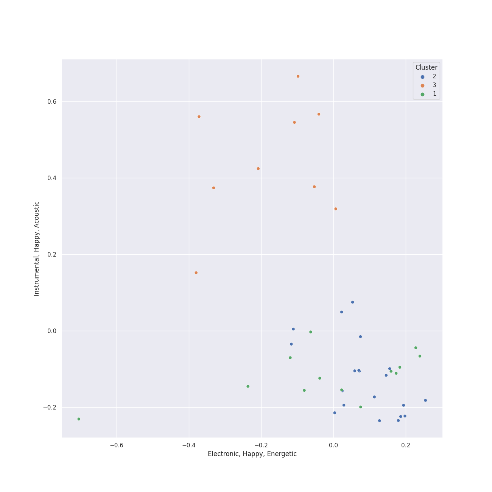

# Clusters in alternative rock

## Cluster #1

21 tracks

| Art | Track | Album | Artists | Label | Score | 💚 | 🔗 |
|:---|:---|:---|:---|:---|---:|:---|:---|
|  | All These Things That I've Done | Hot Fuss | The Killers | [Island Records](../../../../labels/island_records) | 0 | | [🔗](https://open.spotify.com/track/5vollujufHY0jMZxx77VWr) |
|  | No Surprises | OK Computer | [Radiohead](../../../../artists/radiohead/overview.md) | [XL Recordings](../../../../labels/xl_recordings) | 0 | 💚 | [🔗](https://open.spotify.com/track/10nyNJ6zNy2YVYLrcwLccB) |
|  | Subterranean Homesick Alien | OK Computer | [Radiohead](../../../../artists/radiohead/overview.md) | [XL Recordings](../../../../labels/xl_recordings) | 0 | 💚 | [🔗](https://open.spotify.com/track/2CVV8PtUYYsux8XOzWkCP0) |
|  | Let Down | OK Computer | [Radiohead](../../../../artists/radiohead/overview.md) | [XL Recordings](../../../../labels/xl_recordings) | 0 | 💚 | [🔗](https://open.spotify.com/track/2fuYa3Lx06QQJAm0MjztKr) |
|  | Karma Police | OK Computer | [Radiohead](../../../../artists/radiohead/overview.md) | [XL Recordings](../../../../labels/xl_recordings) | 0 | 💚 | [🔗](https://open.spotify.com/track/63OQupATfueTdZMWTxW03A) |
|  | High and Dry | The Bends | [Radiohead](../../../../artists/radiohead/overview.md) | [XL Recordings](../../../../labels/xl_recordings) | 0 | 💚 | [🔗](https://open.spotify.com/track/2a1iMaoWQ5MnvLFBDv4qkf) |
|  | Strip My Mind | Stadium Arcadium | Red Hot Chili Peppers | [Warner Records](../../../../labels/warner_records) | 0 | | [🔗](https://open.spotify.com/track/0J3ytriezGZ3KCREfHKDOI) |
|  | Californication | Californication (Deluxe Edition) | Red Hot Chili Peppers | [Warner Records](../../../../labels/warner_records) | 0 | | [🔗](https://open.spotify.com/track/48UPSzbZjgc449aqz8bxox) |
|  | Madness | The 2nd Law | Muse | [Warner Records](../../../../labels/warner_records) | 74 | 💚 | [🔗](https://open.spotify.com/track/0c4IEciLCDdXEhhKxj4ThA) |
|  | Feeling Good | Origin of Symmetry | Muse | [Warner Records](../../../../labels/warner_records) | 0 | 💚 | [🔗](https://open.spotify.com/track/5Yj4AP0JGQWierBFKdKVyS) |
## Cluster #2

9 tracks

| Art | Track | Album | Artists | Label | Score | 💚 | 🔗 |
|:---|:---|:---|:---|:---|---:|:---|:---|
|  | Reckoner | In Rainbows | [Radiohead](../../../../artists/radiohead/overview.md) | [XL Recordings](../../../../labels/xl_recordings) | 0 | 💚 | [🔗](https://open.spotify.com/track/02ppMPbg1OtEdHgoPqoqju) |
|  | Weird Fishes/ Arpeggi | In Rainbows | [Radiohead](../../../../artists/radiohead/overview.md) | [XL Recordings](../../../../labels/xl_recordings) | 0 | | [🔗](https://open.spotify.com/track/4wajJ1o7jWIg62YqpkHC7S) |
|  | All I Need | In Rainbows | [Radiohead](../../../../artists/radiohead/overview.md) | [XL Recordings](../../../../labels/xl_recordings) | 0 | | [🔗](https://open.spotify.com/track/5Qv2Nby1xTr9pQyjkrc94J) |
|  | Street Spirit (Fade Out) | The Bends | [Radiohead](../../../../artists/radiohead/overview.md) | [XL Recordings](../../../../labels/xl_recordings) | 54 | 💚 | [🔗](https://open.spotify.com/track/2QwObYJWyJTiozvs0RI7CF) |
|  | Everything In Its Right Place | Kid A | [Radiohead](../../../../artists/radiohead/overview.md) | [XL Recordings](../../../../labels/xl_recordings) | 0 | 💚 | [🔗](https://open.spotify.com/track/2kRFrWaLWiKq48YYVdGcm8) |
|  | Pyramid Song | Amnesiac | [Radiohead](../../../../artists/radiohead/overview.md) | [XL Recordings](../../../../labels/xl_recordings) | 0 | 💚 | [🔗](https://open.spotify.com/track/3A9vIxzGBjEfqmDK7H9exS) |
|  | Hurt | The Downward Spiral | Nine Inch Nails | TVT Records | 0 | 💚 | [🔗](https://open.spotify.com/track/1lo9k4PrxFd5Np4cAxXoKo) |
|  | What Sarah Said | Plans | Death Cab for Cutie | [Atlantic Records](../../../../labels/atlantic_records) | 0 | 💚 | [🔗](https://open.spotify.com/track/2JFrlsJBH4IDt3Suot97dP) |
|  | I Will Follow You into the Dark | Plans | Death Cab for Cutie | [Atlantic Records](../../../../labels/atlantic_records) | 0 | 💚 | [🔗](https://open.spotify.com/track/3kZC0ZmFWrEHdUCmUqlvgZ) |
## Cluster #3

14 tracks

| Art | Track | Album | Artists | Label | Score | 💚 | 🔗 |
|:---|:---|:---|:---|:---|---:|:---|:---|
|  | Jigsaw Falling Into Place | In Rainbows | [Radiohead](../../../../artists/radiohead/overview.md) | [XL Recordings](../../../../labels/xl_recordings) | 86 | 💚 | [🔗](https://open.spotify.com/track/0YJ9FWWHn9EfnN0lHwbzvV) |
|  | There, There | Hail To the Thief | [Radiohead](../../../../artists/radiohead/overview.md) | [XL Recordings](../../../../labels/xl_recordings) | 0 | 💚 | [🔗](https://open.spotify.com/track/5h4y42RUKwYKYWgutNwvKP) |
|  | Dani California | Stadium Arcadium | Red Hot Chili Peppers | [Warner Records](../../../../labels/warner_records) | 0 | | [🔗](https://open.spotify.com/track/10Nmj3JCNoMeBQ87uw5j8k) |
|  | Snow (Hey Oh) | Stadium Arcadium | Red Hot Chili Peppers | [Warner Records](../../../../labels/warner_records) | 0 | 💚 | [🔗](https://open.spotify.com/track/2aibwv5hGXSgw7Yru8IYTO) |
|  | Can't Stop | By the Way (Deluxe Edition) | Red Hot Chili Peppers | [Warner Records](../../../../labels/warner_records) | 0 | | [🔗](https://open.spotify.com/track/3ZOEytgrvLwQaqXreDs2Jx) |
|  | Supermassive Black Hole | Black Holes and Revelations | Muse | [Warner Records](../../../../labels/warner_records) | 0 | 💚 | [🔗](https://open.spotify.com/track/3lPr8ghNDBLc2uZovNyLs9) |
|  | Losing My Religion | Out Of Time (25th Anniversary Edition) | R.E.M. | Concord Records | 0 | | [🔗](https://open.spotify.com/track/31AOj9sFz2gM0O3hMARRBx) |
|  | The Adults Are Talking | The New Abnormal | The Strokes | [Cult Records/RCA Records](../../../../labels/rca_records_label) | 0 | 💚 | [🔗](https://open.spotify.com/track/5ruzrDWcT0vuJIOMW7gMnW) |
|  | Someday | Is This It | The Strokes | [RCA Records Label](../../../../labels/rca_records_label) | 0 | | [🔗](https://open.spotify.com/track/7hm4HTk9encxT0LYC0J6oI) |
|  | 1979 - Remastered 2012 | Mellon Collie And The Infinite Sadness (Deluxe Edition) | The Smashing Pumpkins | [Virgin Records](../../../../labels/virgin_records) | 0 | | [🔗](https://open.spotify.com/track/5QLHGv0DfpeXLNFo7SFEy1) |