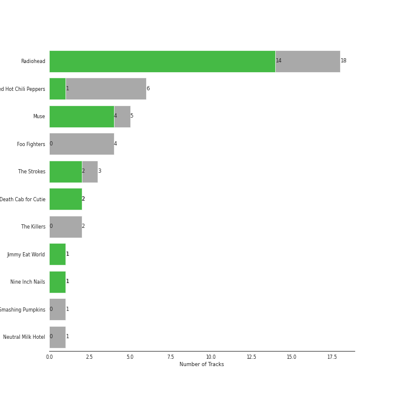
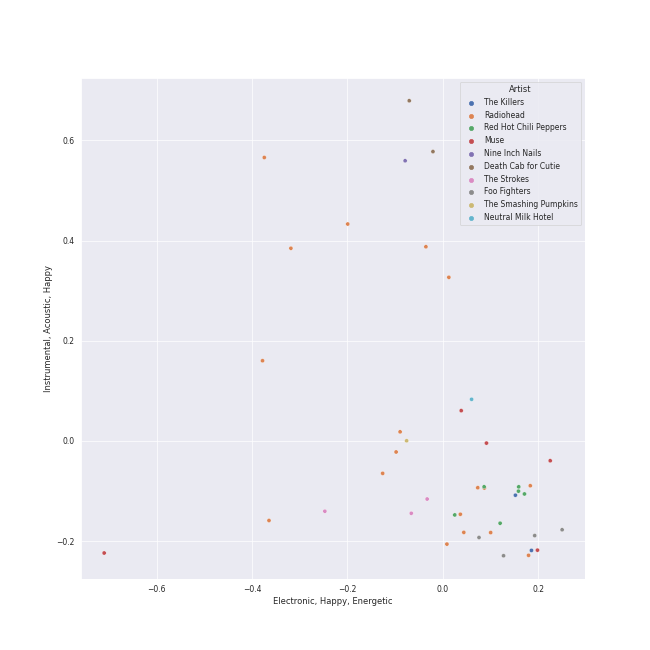
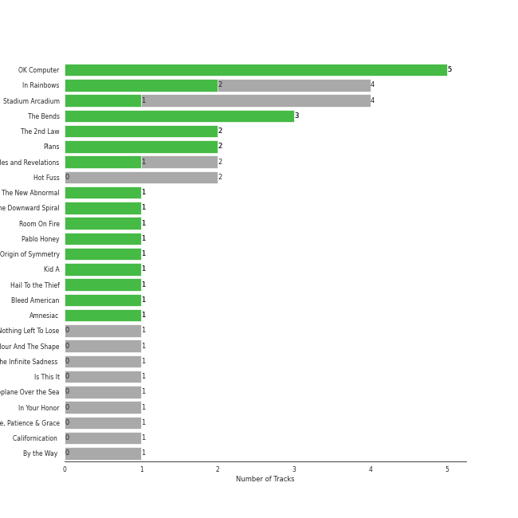
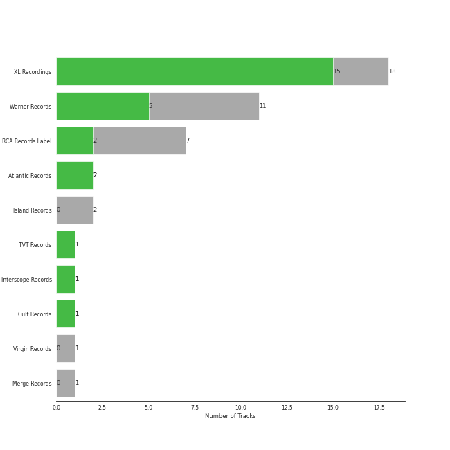
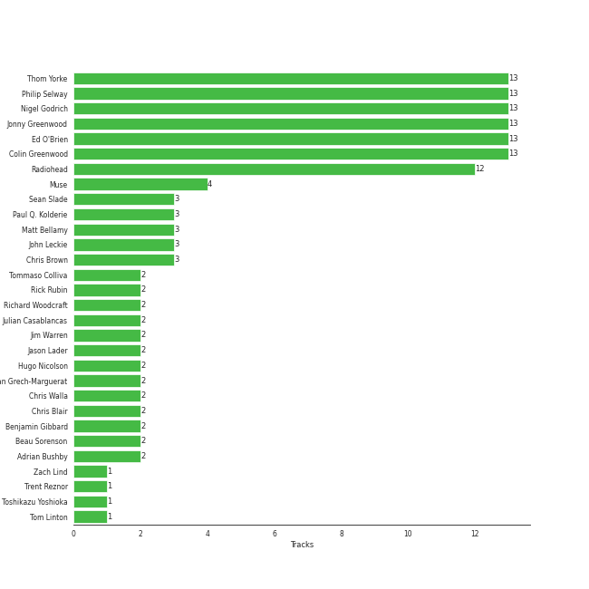
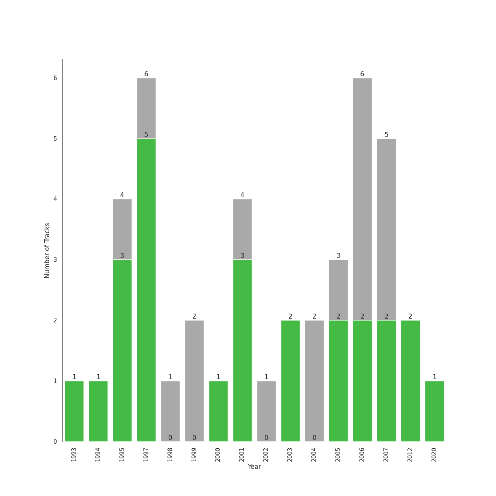

# alternative rock

44 songs

[See Track Features](audio_features.md)

[See Clusters](clusters/overview.md)

## Top Artists

| Art | Tracks | 💚 | Artist | 🔗 |
|:---|---:|---:|:---|:---|
|  | 17 | 15 | [Radiohead](../../artists/radiohead/overview.md) | [🔗](https://open.spotify.com/artist/4Z8W4fKeB5YxbusRsdQVPb) |
|  | 5 | 4 | Muse | [🔗](https://open.spotify.com/artist/12Chz98pHFMPJEknJQMWvI) |
|  | 3 | 2 | The Strokes | [🔗](https://open.spotify.com/artist/0epOFNiUfyON9EYx7Tpr6V) |
|  | 2 | 2 | Death Cab for Cutie | [🔗](https://open.spotify.com/artist/0YrtvWJMgSdVrk3SfNjTbx) |
|  | 6 | 1 | Red Hot Chili Peppers | [🔗](https://open.spotify.com/artist/0L8ExT028jH3ddEcZwqJJ5) |
|  | 1 | 1 | Jimmy Eat World | [🔗](https://open.spotify.com/artist/3Ayl7mCk0nScecqOzvNp6s) |
|  | 1 | 1 | Nine Inch Nails | [🔗](https://open.spotify.com/artist/0X380XXQSNBYuleKzav5UO) |
|  | 4 | 0 | Foo Fighters | [🔗](https://open.spotify.com/artist/7jy3rLJdDQY21OgRLCZ9sD) |
|  | 2 | 0 | The Killers | [🔗](https://open.spotify.com/artist/0C0XlULifJtAgn6ZNCW2eu) |
|  | 1 | 0 | R.E.M. | [🔗](https://open.spotify.com/artist/4KWTAlx2RvbpseOGMEmROg) |

See all 12 artists

| Art | Tracks | 💚 | Artist | 🔗 |
|:---|---:|---:|:---|:---|
|  | 1 | 0 | The Smashing Pumpkins | [🔗](https://open.spotify.com/artist/40Yq4vzPs9VNUrIBG5Jr2i) |
|  | 1 | 0 | Neutral Milk Hotel | [🔗](https://open.spotify.com/artist/2ooIqOf4X2uz4mMptXCtie) |

## Most and least listened tracks
| ​ | Most listened tracks | Rank | ​​ | Least listened tracks | Rank |
|:---|:---|---:|:---|:---|---:|
|  | The Middle | 223 |  | Mr. Brightside | nan |
|  | [Exit Music (For A Film)](../../artists/radiohead/overview.md) | 307 |  | [Reckoner](../../artists/radiohead/overview.md) | nan |
|  | [Paranoid Android](../../artists/radiohead/overview.md) | 321 |  | Slow Cheetah | nan |
|  | [Fake Plastic Trees](../../artists/radiohead/overview.md) | 423 |  | Strip My Mind | nan |
|  | [Creep](../../artists/radiohead/overview.md) | 454 |  | Dani California | nan |
|  | [Jigsaw Falling Into Place](../../artists/radiohead/overview.md) | 490 |  | [No Surprises](../../artists/radiohead/overview.md) | nan |
|  | Madness | 505 |  | Hurt | nan |
|  | [Street Spirit (Fade Out)](../../artists/radiohead/overview.md) | 544 |  | [Subterranean Homesick Alien](../../artists/radiohead/overview.md) | nan |
|  | [Karma Police](../../artists/radiohead/overview.md) | 554 |  | What Sarah Said | nan |
|  | The Pretender | nan |  | [High and Dry](../../artists/radiohead/overview.md) | nan |

## Top Albums

| Art | Tracks | 💚 | Album | Release Date | 🔗 |
|:---|---:|---:|:---|:---|:---|
|  | 6 | 6 | OK Computer | 1997-05-28 | [🔗](https://open.spotify.com/album/6dVIqQ8qmQ5GBnJ9shOYGE) |
|  | 4 | 2 | In Rainbows | 2007-12-28 | [🔗](https://open.spotify.com/album/5vkqYmiPBYLaalcmjujWxK) |
|  | 4 | 1 | Stadium Arcadium | 2006-05-09 | [🔗](https://open.spotify.com/album/7xl50xr9NDkd3i2kBbzsNZ) |
|  | 3 | 3 | The Bends | 1995-03-13 | [🔗](https://open.spotify.com/album/35UJLpClj5EDrhpNIi4DFg) |
|  | 2 | 2 | The 2nd Law | 2012-09-24 | [🔗](https://open.spotify.com/album/3KuXEGcqLcnEYWnn3OEGy0) |
|  | 2 | 2 | Plans | 2005-08-29 | [🔗](https://open.spotify.com/album/1NFGnxmeIEBakre4DvLaJq) |
|  | 2 | 1 | Black Holes and Revelations | 2006-06-19 | [🔗](https://open.spotify.com/album/0lw68yx3MhKflWFqCsGkIs) |
|  | 2 | 0 | Hot Fuss | 2004 | [🔗](https://open.spotify.com/album/4piJq7R3gjUOxnYs6lDCTg) |
|  | 1 | 1 | The New Abnormal | 2020-04-10 | [🔗](https://open.spotify.com/album/2xkZV2Hl1Omi8rk2D7t5lN) |
|  | 1 | 1 | The Downward Spiral | 1994-03-08 | [🔗](https://open.spotify.com/album/3nJnyDV8fwFpffo0EyHQto) |

See all 27 albums

| Art | Tracks | 💚 | Album | Release Date | 🔗 |
|:---|---:|---:|:---|:---|:---|
|  | 1 | 1 | Room On Fire | 2003-10-28 | [🔗](https://open.spotify.com/album/3HFbH1loOUbqCyPsLuHLLh) |
|  | 1 | 1 | Pablo Honey | 1993-02-22 | [🔗](https://open.spotify.com/album/3gBVdu4a1MMJVMy6vwPEb8) |
|  | 1 | 1 | Origin of Symmetry | 2001 | [🔗](https://open.spotify.com/album/1AP6uGYHdakRgwuWQsP5pK) |
|  | 1 | 1 | Kid A | 2000-10-02 | [🔗](https://open.spotify.com/album/6GjwtEZcfenmOf6l18N7T7) |
|  | 1 | 1 | Hail To the Thief | 2003-06-09 | [🔗](https://open.spotify.com/album/5mzoI3VH0ZWk1pLFR6RoYy) |
|  | 1 | 1 | Bleed American | 2001-07-17 | [🔗](https://open.spotify.com/album/0UJhhj5bn5AGAjryFnhueP) |
|  | 1 | 1 | Amnesiac | 2001-03-12 | [🔗](https://open.spotify.com/album/6V9YnBmFjWmXCBaUVRCVXP) |
|  | 1 | 0 | There Is Nothing Left To Lose | 1999-11-02 | [🔗](https://open.spotify.com/album/28q2N44ocJECgf8sbHEDfY) |
|  | 1 | 0 | The Colour And The Shape | 1997-05-20 | [🔗](https://open.spotify.com/album/30ly6F6Xl0TKmyBCU50Khv) |
|  | 1 | 0 | Out Of Time (25th Anniversary Edition) | 1991-03-12 | [🔗](https://open.spotify.com/album/6yEuIwTQpciH1qtj7mP5GK) |
|  | 1 | 0 | Mellon Collie And The Infinite Sadness (Deluxe Edition) | 1995 | [🔗](https://open.spotify.com/album/55RhFRyQFihIyGf61MgcfV) |
|  | 1 | 0 | Is This It | 2001-07-30 | [🔗](https://open.spotify.com/album/2k8KgmDp9oHrmu0MIj4XDE) |
|  | 1 | 0 | In the Aeroplane Over the Sea | 1998-02-20 | [🔗](https://open.spotify.com/album/0vVekV45lOaVKs6RZQQNob) |
|  | 1 | 0 | In Your Honor | 2005-06-14 | [🔗](https://open.spotify.com/album/2eprpJCYbCbPZRKVGIEJxZ) |
|  | 1 | 0 | Echoes, Silence, Patience & Grace | 2007-09-25 | [🔗](https://open.spotify.com/album/3ilXDEG0xiajK8AbqboeJz) |
|  | 1 | 0 | Californication (Deluxe Edition) | 1999-06-08 | [🔗](https://open.spotify.com/album/2Y9IRtehByVkegoD7TcLfi) |
|  | 1 | 0 | By the Way (Deluxe Edition) | 2002-07-09 | [🔗](https://open.spotify.com/album/6deiaArbeoqp1xPEGdEKp1) |

## Top Record Labels

| Tracks | 💚 | Label |
|---:|---:|:---|
| 17 | 15 | [XL Recordings](../../labels/xl_recordings/overview.md) |
| 11 | 5 | [Warner Records](../../labels/warner_records/overview.md) |
| 7 | 2 | [RCA Records Label](../../labels/rca_records_label/overview.md) |
| 2 | 2 | [Atlantic Records](../../labels/atlantic_records/overview.md) |
| 1 | 1 | TVT Records |
| 1 | 1 | [Interscope Records](../../labels/interscope_records/overview.md) |
| 1 | 1 | Cult Records |
| 2 | 0 | [Island Records](../../labels/island_records/overview.md) |
| 1 | 0 | [Virgin Records](../../labels/virgin_records/overview.md) |
| 1 | 0 | Merge Records |

See all 11 labels

| Tracks | 💚 | Label |
|---:|---:|:---|
| 1 | 0 | Concord Records |

## Top Producers

| Art | Producer | Tracks | Credit Types |
|:---|:---|---:|:---|
| | [Jonny Greenwood](../../producers/jonny_greenwood/overview.md) | 13 | Songwriter, Arranger, Producer |
| | [Colin Greenwood](../../producers/colin_greenwood/overview.md) | 13 | Songwriter |
| | [Thom Yorke](../../producers/thom_yorke/overview.md) | 13 | Lyricist, Producer, Songwriter, Arranger |
| | [Ed O'Brien](../../producers/ed_o_brien/overview.md) | 13 | Songwriter |
| | [Nigel Godrich](../../producers/nigel_godrich/overview.md) | 13 | Producer |
| | [Philip Selway](../../producers/philip_selway/overview.md) | 13 | Songwriter |
|  | [Radiohead](../../artists/radiohead/overview.md) | 12 | Arranger, Producer, Lyricist, Songwriter |
|  | Muse | 4 | Producer |
| | Matt Bellamy | 3 | Lyricist, Songwriter |
| | Sean Slade | 3 | Producer |

View all

| Art | Producer | Tracks | Credit Types |
|:---|:---|---:|:---|
|  | Chris Brown | 3 | Producer |
| | John Leckie | 3 | Producer |
| | Paul Q. Kolderie | 3 | Producer |
| | Jim Warren | 2 | Producer |
| | Beau Sorenson | 2 | Producer |
| | Benjamin Gibbard | 2 | Lyricist, Songwriter |
| | Rick Rubin | 2 | Producer |
| | Hugo Nicolson | 2 | Producer |
| | Chris Blair | 2 | Producer |
|  | Julian Casablancas | 2 | Lyricist, Songwriter |
| | Jason Lader | 2 | Producer |
| | Tommaso Colliva | 2 | Producer |
| | Dan Grech-Marguerat | 2 | Producer |
| | Richard Woodcraft | 2 | Producer |
| | Chris Walla | 2 | Producer |
| | Adrian Bushby | 2 | Producer |
| | John Frusciante | 1 | Songwriter |
| | Fabrizio Moretti | 1 | Songwriter |
|  | Jimmy Eat World | 1 | Producer |
| | Graeme Stewart | 1 | Producer |
| | Chad Smith | 1 | Songwriter |
| | Trent Reznor | 1 | Arranger, Lyricist, Producer, Songwriter |
| | Andrew Scheps | 1 | Producer |
| | Jim Adkins | 1 | Songwriter |
| | Rich Costey | 1 | Producer |
| | Ryan Hewitt | 1 | Producer |
| | Gordon Raphael | 1 | Producer |
|  | The Strokes | 1 | Arranger |
| | Chris Holmes | 1 | Producer |
| | Ben Baptie | 1 | Producer |
| | Gerard Navarro | 1 | Producer |
| | Anthony Newley | 1 | Songwriter |
| | Nikolai Fraiture | 1 | Songwriter |
| | Pete Min | 1 | Producer |
| | [Mark "Spike" Stent](../../producers/mark__spike__stent/overview.md) | 1 | Producer |
| | Leslie Bricusse | 1 | Songwriter |
| | Flea | 1 | Songwriter |
| | Albert Hammond | 1 | Songwriter |
| | Nick Valensi | 1 | Songwriter |
| | Nick Harmer | 1 | Songwriter |
| | Ric Peet | 1 | Producer |
| | Rick Burch | 1 | Songwriter |
| | Chris Lord-Alge | 1 | Producer |
| | Toshikazu Yoshioka | 1 | Producer |
| | John Cornfield | 1 | Producer |
| | Mark Trombino | 1 | Producer |
| | Anthony Kiedis | 1 | Songwriter |
| | Darrell Thorp | 1 | Producer |
| | Dana Nielsen | 1 | Producer |
| | Tom Linton | 1 | Songwriter |
| | Claudius Mittendorfer | 1 | Producer |
| | Mike Hazlewood | 1 | Songwriter |
| | Zach Lind | 1 | Songwriter |
| | Albert Hammond, Jr. | 1 | Songwriter |
| | Mark Linett | 1 | Producer |

## Years

| ​ | 10 newest albums | ​​ | 10 oldest albums |
|:---|:---|:---|:---|
|  | The New Abnormal (2020-04-10) |  | Out Of Time (25th Anniversary Edition) (1991-03-12) |
|  | The 2nd Law (2012-09-24) |  | Pablo Honey (1993-02-22) |
|  | In Rainbows (2007-12-28) |  | The Downward Spiral (1994-03-08) |
|  | Echoes, Silence, Patience & Grace (2007-09-25) |  | Mellon Collie And The Infinite Sadness (Deluxe Edition) (1995) |
|  | Black Holes and Revelations (2006-06-19) |  | The Bends (1995-03-13) |
|  | Stadium Arcadium (2006-05-09) |  | The Colour And The Shape (1997-05-20) |
|  | Plans (2005-08-29) |  | OK Computer (1997-05-28) |
|  | In Your Honor (2005-06-14) |  | In the Aeroplane Over the Sea (1998-02-20) |
|  | Hot Fuss (2004) |  | Californication (Deluxe Edition) (1999-06-08) |
|  | Room On Fire (2003-10-28) |  | There Is Nothing Left To Lose (1999-11-02) |

