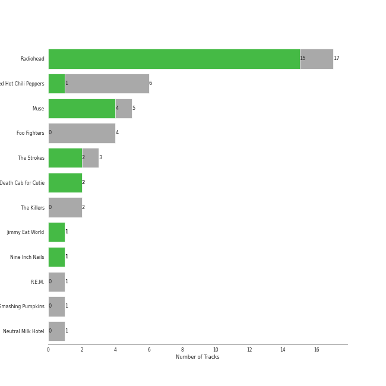
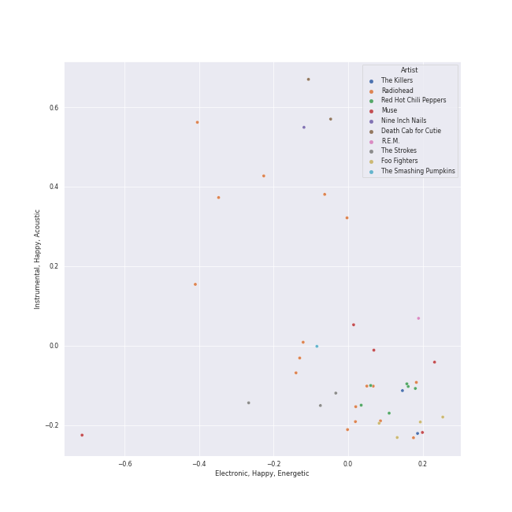
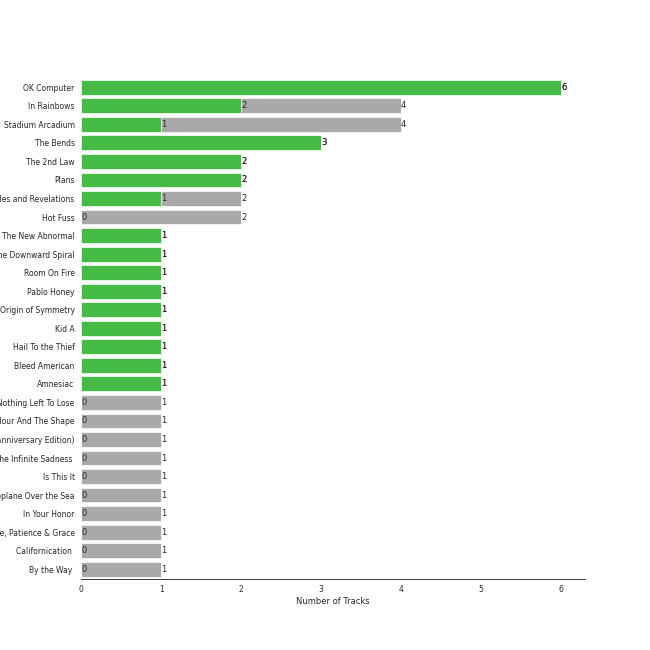
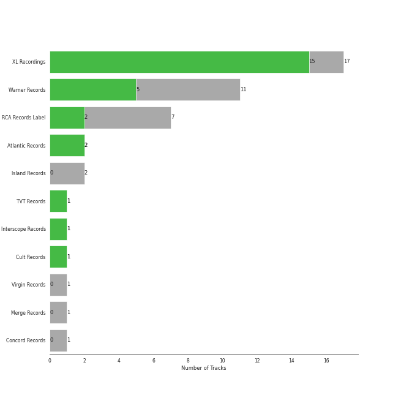
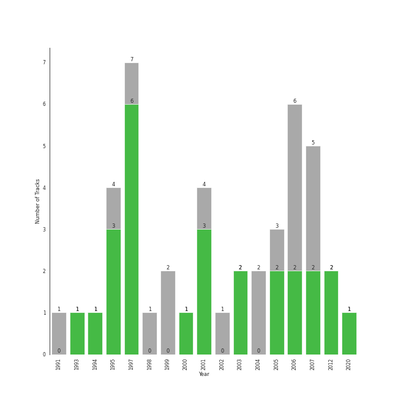

# alternative rock

[42 songs](tracks.md)

[See Track Features](audio_features.md)

[See Clusters](clusters/overview.md)

## Top Artists

| Art | Tracks | 💚 | Artist | 🔗 |
|:---|---:|---:|:---|:---|
|  | 16 | 14 | [Radiohead](../../artists/radiohead/overview.md) | [🔗](https://open.spotify.com/artist/4Z8W4fKeB5YxbusRsdQVPb) |
|  | 5 | 4 | Muse | [🔗](https://open.spotify.com/artist/12Chz98pHFMPJEknJQMWvI) |
|  | 3 | 2 | The Strokes | [🔗](https://open.spotify.com/artist/0epOFNiUfyON9EYx7Tpr6V) |
|  | 2 | 2 | Death Cab for Cutie | [🔗](https://open.spotify.com/artist/0YrtvWJMgSdVrk3SfNjTbx) |
|  | 6 | 1 | Red Hot Chili Peppers | [🔗](https://open.spotify.com/artist/0L8ExT028jH3ddEcZwqJJ5) |
|  | 1 | 1 | Jimmy Eat World | [🔗](https://open.spotify.com/artist/3Ayl7mCk0nScecqOzvNp6s) |
|  | 1 | 1 | Nine Inch Nails | [🔗](https://open.spotify.com/artist/0X380XXQSNBYuleKzav5UO) |
|  | 4 | 0 | Foo Fighters | [🔗](https://open.spotify.com/artist/7jy3rLJdDQY21OgRLCZ9sD) |
|  | 2 | 0 | The Killers | [🔗](https://open.spotify.com/artist/0C0XlULifJtAgn6ZNCW2eu) |
|  | 1 | 0 | The Smashing Pumpkins | [🔗](https://open.spotify.com/artist/40Yq4vzPs9VNUrIBG5Jr2i) |

See all 11 artists

| Art | Tracks | 💚 | Artist | 🔗 |
|:---|---:|---:|:---|:---|
|  | 1 | 0 | Neutral Milk Hotel | [🔗](https://open.spotify.com/artist/2ooIqOf4X2uz4mMptXCtie) |

## Top Albums

| Art | Tracks | 💚 | Album | Release Date | 🔗 |
|:---|---:|---:|:---|:---|:---|
|  | 5 | 5 | OK Computer | 1997-05-28 | [🔗](https://open.spotify.com/album/6dVIqQ8qmQ5GBnJ9shOYGE) |
|  | 4 | 2 | In Rainbows | 2007-12-28 | [🔗](https://open.spotify.com/album/5vkqYmiPBYLaalcmjujWxK) |
|  | 4 | 1 | Stadium Arcadium | 2006-05-09 | [🔗](https://open.spotify.com/album/7xl50xr9NDkd3i2kBbzsNZ) |
|  | 3 | 3 | The Bends | 1995-03-13 | [🔗](https://open.spotify.com/album/35UJLpClj5EDrhpNIi4DFg) |
|  | 2 | 2 | The 2nd Law | 2012-09-24 | [🔗](https://open.spotify.com/album/3KuXEGcqLcnEYWnn3OEGy0) |
|  | 2 | 2 | Plans | 2005-08-29 | [🔗](https://open.spotify.com/album/1NFGnxmeIEBakre4DvLaJq) |
|  | 2 | 1 | Black Holes and Revelations | 2006-06-19 | [🔗](https://open.spotify.com/album/0lw68yx3MhKflWFqCsGkIs) |
|  | 2 | 0 | Hot Fuss | 2004 | [🔗](https://open.spotify.com/album/4piJq7R3gjUOxnYs6lDCTg) |
|  | 1 | 1 | The New Abnormal | 2020-04-10 | [🔗](https://open.spotify.com/album/2xkZV2Hl1Omi8rk2D7t5lN) |
|  | 1 | 1 | The Downward Spiral | 1994-03-08 | [🔗](https://open.spotify.com/album/3nJnyDV8fwFpffo0EyHQto) |

See all 26 albums

| Art | Tracks | 💚 | Album | Release Date | 🔗 |
|:---|---:|---:|:---|:---|:---|
|  | 1 | 1 | Room On Fire | 2003-10-28 | [🔗](https://open.spotify.com/album/3HFbH1loOUbqCyPsLuHLLh) |
|  | 1 | 1 | Pablo Honey | 1993-02-22 | [🔗](https://open.spotify.com/album/3gBVdu4a1MMJVMy6vwPEb8) |
|  | 1 | 1 | Origin of Symmetry | 2001 | [🔗](https://open.spotify.com/album/1AP6uGYHdakRgwuWQsP5pK) |
|  | 1 | 1 | Kid A | 2000-10-02 | [🔗](https://open.spotify.com/album/6GjwtEZcfenmOf6l18N7T7) |
|  | 1 | 1 | Hail To the Thief | 2003-06-09 | [🔗](https://open.spotify.com/album/5mzoI3VH0ZWk1pLFR6RoYy) |
|  | 1 | 1 | Bleed American | 2001-07-17 | [🔗](https://open.spotify.com/album/0UJhhj5bn5AGAjryFnhueP) |
|  | 1 | 1 | Amnesiac | 2001-03-12 | [🔗](https://open.spotify.com/album/6V9YnBmFjWmXCBaUVRCVXP) |
|  | 1 | 0 | There Is Nothing Left To Lose | 1999-11-02 | [🔗](https://open.spotify.com/album/28q2N44ocJECgf8sbHEDfY) |
|  | 1 | 0 | The Colour And The Shape | 1997-05-20 | [🔗](https://open.spotify.com/album/30ly6F6Xl0TKmyBCU50Khv) |
|  | 1 | 0 | Mellon Collie And The Infinite Sadness (Deluxe Edition) | 1995 | [🔗](https://open.spotify.com/album/55RhFRyQFihIyGf61MgcfV) |
|  | 1 | 0 | Is This It | 2001-07-30 | [🔗](https://open.spotify.com/album/2k8KgmDp9oHrmu0MIj4XDE) |
|  | 1 | 0 | In the Aeroplane Over the Sea | 1998-02-20 | [🔗](https://open.spotify.com/album/0vVekV45lOaVKs6RZQQNob) |
|  | 1 | 0 | In Your Honor | 2005-06-14 | [🔗](https://open.spotify.com/album/2eprpJCYbCbPZRKVGIEJxZ) |
|  | 1 | 0 | Echoes, Silence, Patience & Grace | 2007-09-25 | [🔗](https://open.spotify.com/album/3ilXDEG0xiajK8AbqboeJz) |
|  | 1 | 0 | Californication (Deluxe Edition) | 1999-06-08 | [🔗](https://open.spotify.com/album/2Y9IRtehByVkegoD7TcLfi) |
|  | 1 | 0 | By the Way (Deluxe Edition) | 2002-07-09 | [🔗](https://open.spotify.com/album/6deiaArbeoqp1xPEGdEKp1) |

## Top Record Labels

| Tracks | 💚 | Label |
|---:|---:|:---|
| 16 | 14 | [XL Recordings](../../labels/xl_recordings/overview.md) |
| 11 | 5 | [Warner Records](../../labels/warner_records/overview.md) |
| 7 | 2 | [RCA Records Label](../../labels/rca_records_label/overview.md) |
| 2 | 2 | [Atlantic Records](../../labels/atlantic_records/overview.md) |
| 1 | 1 | TVT Records |
| 1 | 1 | [Interscope Records](../../labels/interscope_records/overview.md) |
| 1 | 1 | Cult Records |
| 2 | 0 | [Island Records](../../labels/island_records/overview.md) |
| 1 | 0 | [Virgin Records](../../labels/virgin_records/overview.md) |
| 1 | 0 | Merge Records |

## Years

| ​ | 10 newest albums | ​​ | 10 oldest albums |
|:---|:---|:---|:---|
|  | The New Abnormal (2020-04-10) |  | Pablo Honey (1993-02-22) |
|  | The 2nd Law (2012-09-24) |  | The Downward Spiral (1994-03-08) |
|  | In Rainbows (2007-12-28) |  | Mellon Collie And The Infinite Sadness (Deluxe Edition) (1995) |
|  | Echoes, Silence, Patience & Grace (2007-09-25) |  | The Bends (1995-03-13) |
|  | Black Holes and Revelations (2006-06-19) |  | The Colour And The Shape (1997-05-20) |
|  | Stadium Arcadium (2006-05-09) |  | OK Computer (1997-05-28) |
|  | Plans (2005-08-29) |  | In the Aeroplane Over the Sea (1998-02-20) |
|  | In Your Honor (2005-06-14) |  | Californication (Deluxe Edition) (1999-06-08) |
|  | Hot Fuss (2004) |  | There Is Nothing Left To Lose (1999-11-02) |
|  | Room On Fire (2003-10-28) |  | Kid A (2000-10-02) |