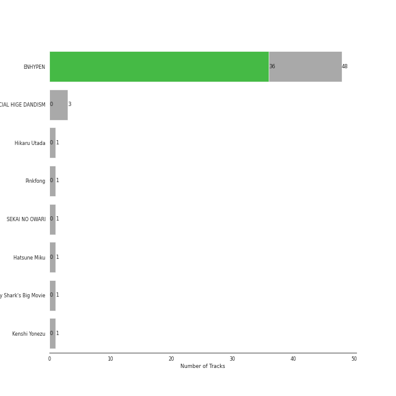
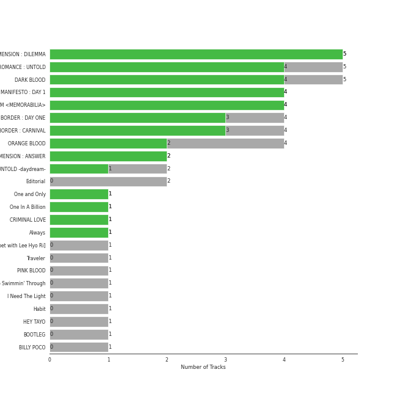
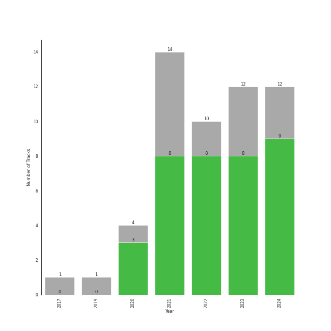

# anime

53 songs

[See Track Features](audio_features.md)

[See Clusters](clusters/overview.md)

## Top Artists

| Art | Rank | Tracks | 💚 | Artist | 🔗 |
|:---|---:|---:|---:|:---|:---|
|  | 7 | 47 | 36 | [ENHYPEN](../../artists/enhypen/overview.md) | [🔗](https://open.spotify.com/artist/5t5FqBwTcgKTaWmfEbwQY9) |
|  | 413 | 3 | 0 | OFFICIAL HIGE DANDISM | [🔗](https://open.spotify.com/artist/5Vo1hnCRmCM6M4thZCInCj) |
|  | 413 | 1 | 0 | Hikaru Utada | [🔗](https://open.spotify.com/artist/7lbSsjYACZHn1MSDXPxNF2) |
|  | 413 | 1 | 0 | Pinkfong | [🔗](https://open.spotify.com/artist/7cTXfwpe9peK0UE1bZyIWZ) |
|  | 413 | 1 | 0 | SEKAI NO OWARI | [🔗](https://open.spotify.com/artist/7HwzlRPa9Ad0I8rK0FPzzK) |
|  | 284 | 1 | 0 | Hatsune Miku | [🔗](https://open.spotify.com/artist/6pNgnvzBa6Bthsv8SrZJYl) |
|  | 413 | 1 | 0 | The Cast of Baby Shark's Big Movie | [🔗](https://open.spotify.com/artist/2qlOwH6ICaEw63LMC3bBVR) |
|  | 413 | 1 | 0 | Kenshi Yonezu | [🔗](https://open.spotify.com/artist/1snhtMLeb2DYoMOcVbb8iB) |

## Most and least listened tracks
| Rank | ​ | Most listened tracks | Rank | ​​ | Least listened tracks |
|---:|:---|:---|---:|:---|:---|
| 20 |  | [ParadoXXX Invasion](../../artists/enhypen/overview.md) | 917 |  | Cry Baby |
| 48 |  | [Sweet Venom](../../artists/enhypen/overview.md) | 917 |  | [Blessed-Cursed](../../artists/enhypen/overview.md) |
| 58 |  | [Sacrifice (Eat Me Up)](../../artists/enhypen/overview.md) | 917 |  | [Lucifer](../../artists/enhypen/overview.md) |
| 87 |  | [Bills](../../artists/enhypen/overview.md) | 917 |  | [Still Monster](../../artists/enhypen/overview.md) |
| 106 |  | [Bite Me](../../artists/enhypen/overview.md) | 917 |  | [Mixed Up](../../artists/enhypen/overview.md) |
| 133 |  | [CRIMINAL LOVE](../../artists/enhypen/overview.md) | 917 |  | [Future Perfect (Pass the MIC)](../../artists/enhypen/overview.md) |
| 150 |  | [Just A Little Bit](../../artists/enhypen/overview.md) | 917 |  | [I Need The Light](../../artists/enhypen/overview.md) |
| 152 |  | [Polaroid Love](../../artists/enhypen/overview.md) | 917 |  | [One In A Billion](../../artists/enhypen/overview.md) |
| 190 |  | [Fatal Trouble](../../artists/enhypen/overview.md) | 917 |  | [SHOUT OUT](../../artists/enhypen/overview.md) |
| 216 |  | [Scream](../../artists/enhypen/overview.md) | 917 |  | [Orange Flower (You Complete Me)](../../artists/enhypen/overview.md) |

## Top Albums

| Art | Rank | Tracks | 💚 | Album | Release Date | 🔗 |
|:---|---:|---:|---:|:---|:---|:---|
|  | 215 | 6 | 5 | ROMANCE : UNTOLD | 2024-07-12 | [🔗](https://open.spotify.com/album/05I8FltCMnGa3kE38mpOkL) |
|  | 113 | 5 | 5 | DIMENSION : DILEMMA | 2021-10-12 | [🔗](https://open.spotify.com/album/5jGRqioNCSWZGBl3QmyuFI) |
|  | 21 | 5 | 4 | DARK BLOOD | 2023-05-22 | [🔗](https://open.spotify.com/album/7q65W5gVANjh1j1KXLeU0f) |
|  | 22 | 4 | 4 | MANIFESTO : DAY 1 | 2022-07-04 | [🔗](https://open.spotify.com/album/5J8MNLLViH5zqM6VoGErz8) |
|  | 124 | 4 | 4 | DARK MOON SPECIAL ALBUM <MEMORABILIA> | 2024-05-13 | [🔗](https://open.spotify.com/album/0OhJwEzXbK9Km6GQSPdmPU) |
|  | 439 | 4 | 3 | BORDER : DAY ONE | 2020-11-30 | [🔗](https://open.spotify.com/album/3YxF7jTnpdNepWbO42f8lH) |
|  | 159 | 4 | 3 | BORDER : CARNIVAL | 2021-04-26 | [🔗](https://open.spotify.com/album/4LGYBcRsteiXjcPD4QQvxv) |
|  | 47 | 4 | 2 | ORANGE BLOOD | 2023-11-17 | [🔗](https://open.spotify.com/album/7dsAlxH9cMgyREm8OLdWWT) |
|  | 121 | 2 | 2 | DIMENSION : ANSWER | 2022-01-10 | [🔗](https://open.spotify.com/album/3nOj9hsnptBEDt9ie2lra5) |
|  | 610 | 2 | 0 | Editorial | 2021-08-18 | [🔗](https://open.spotify.com/album/22nXr9DqkTAp1Y0GT1ialu) |

See all 23 albums

| Art | Rank | Tracks | 💚 | Album | Release Date | 🔗 |
|:---|---:|---:|---:|:---|:---|:---|
|  | 265 | 1 | 1 | One and Only | 2023-07-11 | [🔗](https://open.spotify.com/album/5LGe47qZJTNwtM8gUfT7Mx) |
|  | 610 | 1 | 1 | One In A Billion | 2022-09-06 | [🔗](https://open.spotify.com/album/19Jm8Jk0zQYs6zMaxhYJFd) |
|  | 104 | 1 | 1 | CRIMINAL LOVE | 2023-07-31 | [🔗](https://open.spotify.com/album/6S8BCiVrtzm5TEOnjyyCfJ) |
|  | 425 | 1 | 1 | Always | 2022-02-21 | [🔗](https://open.spotify.com/album/0kwAgLzLnzQxaKcdubyaMh) |
|  | 610 | 1 | 0 | What Makes You Beautiful [THE SEASONS: Red Carpet with Lee Hyo Ri] | 2024-02-23 | [🔗](https://open.spotify.com/album/3RvguzRz56wqZ9fNldExgn) |
|  | 610 | 1 | 0 | Traveler | 2019-08-31 | [🔗](https://open.spotify.com/album/17gzvH2FPpVhpuqalLFi9j) |
|  | 610 | 1 | 0 | PINK BLOOD | 2021-06-02 | [🔗](https://open.spotify.com/album/4eQs3mcSejRAVTWmaYXNYl) |
|  | 610 | 1 | 0 | Keep Swimmin' Through | 2023-11-03 | [🔗](https://open.spotify.com/album/3DuL4EFBmwfcEle2TTQNY2) |
|  | 610 | 1 | 0 | I Need The Light | 2022-08-12 | [🔗](https://open.spotify.com/album/4RAx28on33NHM5FQiFhyvZ) |
|  | 610 | 1 | 0 | Habit | 2022-04-28 | [🔗](https://open.spotify.com/album/690rpRAbQW5LNPrbP27M9U) |
|  | 610 | 1 | 0 | HEY TAYO | 2021-07-29 | [🔗](https://open.spotify.com/album/2i0irlNjTfYPohsFPIK8J0) |
|  | 610 | 1 | 0 | BOOTLEG | 2017-11-01 | [🔗](https://open.spotify.com/album/1mvoieMR8Dwiy7S052ihoC) |
|  | 610 | 1 | 0 | BILLY POCO | 2021-08-11 | [🔗](https://open.spotify.com/album/053egZ9MnXOGmLMQUiFPfZ) |

## Top Record Labels

| Tracks | 💚 | Label |
|---:|---:|:---|
| 40 | 34 | [BELIFT LAB](../../labels/belift_lab/overview.md) |
| 3 | 2 | [Universal Music LLC](../../labels/universal_music_llc/overview.md) |
| 2 | 0 | [Stone Music Entertainment](../../labels/stone_music_entertainment/overview.md) |
| 2 | 0 | [Sony Music Labels Inc.](../../labels/sony_music_labels_inc_/overview.md) |
| 2 | 0 | IRORI Records |
| 2 | 0 | ICONIX CO. |
| 2 | 0 | [Genie Music Corporation](../../labels/genie_music_corporation/overview.md) |
| 1 | 0 | Pinkfong |
| 1 | 0 | PONY CANYON INC. |

## Years

| ​ | 10 newest albums | ​​ | 10 oldest albums |
|:---|:---|:---|:---|
|  | ROMANCE : UNTOLD (2024-07-12) |  | BOOTLEG (2017-11-01) |
|  | DARK MOON SPECIAL ALBUM <MEMORABILIA> (2024-05-13) |  | Traveler (2019-08-31) |
|  | What Makes You Beautiful [THE SEASONS: Red Carpet with Lee Hyo Ri] (2024-02-23) |  | BORDER : DAY ONE (2020-11-30) |
|  | ORANGE BLOOD (2023-11-17) |  | BORDER : CARNIVAL (2021-04-26) |
|  | Keep Swimmin' Through (2023-11-03) |  | PINK BLOOD (2021-06-02) |
|  | CRIMINAL LOVE (2023-07-31) |  | HEY TAYO (2021-07-29) |
|  | One and Only (2023-07-11) |  | BILLY POCO (2021-08-11) |
|  | DARK BLOOD (2023-05-22) |  | Editorial (2021-08-18) |
|  | One In A Billion (2022-09-06) |  | DIMENSION : DILEMMA (2021-10-12) |
|  | I Need The Light (2022-08-12) |  | DIMENSION : ANSWER (2022-01-10) |

