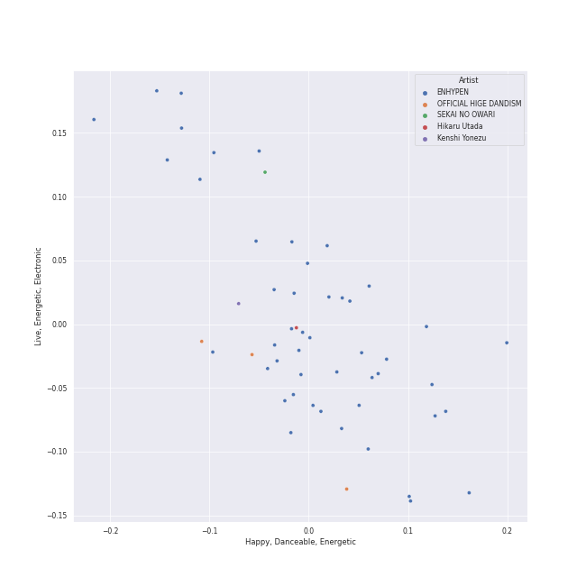
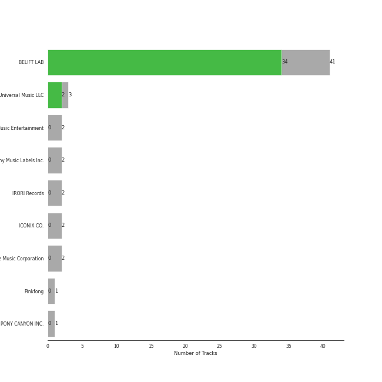

# anime

[36 songs](tracks.md)

[See Track Features](audio_features.md)

[See Clusters](clusters/overview.md)

## Top Artists

| Art | Tracks | 💚 | Artist | 🔗 |
|:---|---:|---:|:---|:---|
|  | 29 | 23 | [ENHYPEN](../../artists/enhypen/overview.md) | [🔗](https://open.spotify.com/artist/5t5FqBwTcgKTaWmfEbwQY9) |
|  | 3 | 0 | OFFICIAL HIGE DANDISM | [🔗](https://open.spotify.com/artist/5Vo1hnCRmCM6M4thZCInCj) |
|  | 1 | 0 | Hikaru Utada | [🔗](https://open.spotify.com/artist/7lbSsjYACZHn1MSDXPxNF2) |
|  | 1 | 0 | SEKAI NO OWARI | [🔗](https://open.spotify.com/artist/7HwzlRPa9Ad0I8rK0FPzzK) |
|  | 1 | 0 | Hatsune Miku | [🔗](https://open.spotify.com/artist/6pNgnvzBa6Bthsv8SrZJYl) |
|  | 1 | 0 | Kenshi Yonezu | [🔗](https://open.spotify.com/artist/1snhtMLeb2DYoMOcVbb8iB) |
|  | 1 | 0 | LiSA | [🔗](https://open.spotify.com/artist/0blbVefuxOGltDBa00dspv) |

## Top Albums

| Art | Tracks | 💚 | Album | Release Date | 🔗 |
|:---|---:|---:|:---|:---|:---|
|  | 5 | 5 | DIMENSION : DILEMMA | 2021-10-12 | [🔗](https://open.spotify.com/album/5jGRqioNCSWZGBl3QmyuFI) |
|  | 4 | 4 | MANIFESTO : DAY 1 | 2022-07-04 | [🔗](https://open.spotify.com/album/5J8MNLLViH5zqM6VoGErz8) |
|  | 4 | 3 | DARK BLOOD | 2023-05-22 | [🔗](https://open.spotify.com/album/7q65W5gVANjh1j1KXLeU0f) |
|  | 4 | 3 | BORDER : DAY ONE | 2020-11-30 | [🔗](https://open.spotify.com/album/3YxF7jTnpdNepWbO42f8lH) |
|  | 4 | 3 | BORDER : CARNIVAL | 2021-04-26 | [🔗](https://open.spotify.com/album/4LGYBcRsteiXjcPD4QQvxv) |
|  | 2 | 2 | DIMENSION : ANSWER | 2022-01-10 | [🔗](https://open.spotify.com/album/3nOj9hsnptBEDt9ie2lra5) |
|  | 2 | 0 | Editorial | 2021-08-18 | [🔗](https://open.spotify.com/album/22nXr9DqkTAp1Y0GT1ialu) |
|  | 1 | 1 | One and Only | 2023-07-11 | [🔗](https://open.spotify.com/album/5LGe47qZJTNwtM8gUfT7Mx) |
|  | 1 | 1 | One In A Billion | 2022-09-06 | [🔗](https://open.spotify.com/album/19Jm8Jk0zQYs6zMaxhYJFd) |
|  | 1 | 1 | Always | 2022-02-21 | [🔗](https://open.spotify.com/album/0kwAgLzLnzQxaKcdubyaMh) |

See all 18 albums

| Art | Tracks | 💚 | Album | Release Date | 🔗 |
|:---|---:|---:|:---|:---|:---|
|  | 1 | 0 | 炎 | 2020-10-12 | [🔗](https://open.spotify.com/album/1KmL1EZ0Pg9Vj3rPYMDqHY) |
|  | 1 | 0 | Traveler | 2019-08-31 | [🔗](https://open.spotify.com/album/17gzvH2FPpVhpuqalLFi9j) |
|  | 1 | 0 | PINK BLOOD | 2021-06-02 | [🔗](https://open.spotify.com/album/4eQs3mcSejRAVTWmaYXNYl) |
|  | 1 | 0 | I Need The Light | 2022-08-12 | [🔗](https://open.spotify.com/album/4RAx28on33NHM5FQiFhyvZ) |
|  | 1 | 0 | Habit | 2022-04-28 | [🔗](https://open.spotify.com/album/690rpRAbQW5LNPrbP27M9U) |
|  | 1 | 0 | HEY TAYO | 2021-07-29 | [🔗](https://open.spotify.com/album/2i0irlNjTfYPohsFPIK8J0) |
|  | 1 | 0 | BOOTLEG | 2017-11-01 | [🔗](https://open.spotify.com/album/1mvoieMR8Dwiy7S052ihoC) |
|  | 1 | 0 | BILLY POCO | 2021-08-11 | [🔗](https://open.spotify.com/album/053egZ9MnXOGmLMQUiFPfZ) |

## Top Record Labels

| Tracks | 💚 | Label |
|---:|---:|:---|
| 24 | 21 | [BELIFT LAB](../../labels/belift_lab/overview.md) |
| 3 | 2 | [Universal Music LLC](../../labels/universal_music_llc/overview.md) |
| 3 | 0 | [Sony Music Labels Inc.](../../labels/sony_music_labels_inc_/overview.md) |
| 2 | 0 | IRORI Records |
| 2 | 0 | ICONIX CO. |
| 1 | 0 | [Stone Music Entertainment](../../labels/stone_music_entertainment/overview.md) |
| 1 | 0 | PONY CANYON INC. |
| 1 | 0 | [Genie Music Corporation](../../labels/genie_music_corporation/overview.md) |

## Years

| ​ | 10 newest albums | ​​ | 10 oldest albums |
|:---|:---|:---|:---|
|  | One and Only (2023-07-11) |  | BOOTLEG (2017-11-01) |
|  | DARK BLOOD (2023-05-22) |  | Traveler (2019-08-31) |
|  | One In A Billion (2022-09-06) |  | 炎 (2020-10-12) |
|  | I Need The Light (2022-08-12) |  | BORDER : DAY ONE (2020-11-30) |
|  | MANIFESTO : DAY 1 (2022-07-04) |  | BORDER : CARNIVAL (2021-04-26) |
|  | Habit (2022-04-28) |  | PINK BLOOD (2021-06-02) |
|  | Always (2022-02-21) |  | HEY TAYO (2021-07-29) |
|  | DIMENSION : ANSWER (2022-01-10) |  | BILLY POCO (2021-08-11) |
|  | DIMENSION : DILEMMA (2021-10-12) |  | Editorial (2021-08-18) |
|  | Editorial (2021-08-18) |  | DIMENSION : DILEMMA (2021-10-12) |