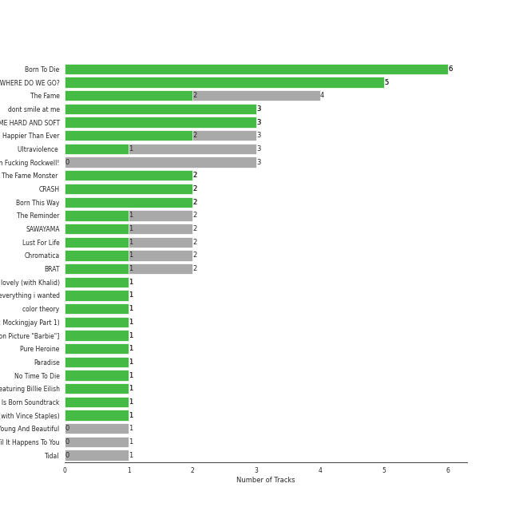

# art pop

[46 songs](art_pop_tracks.md)

## Top Artists

See all 15 artists

|   Number of Tracks | Art                                                                                              | Artist                                       | 🔗                                                           |
|-------------------:|:-------------------------------------------------------------------------------------------------|:---------------------------------------------|:------------------------------------------------------------|
|                 17 |  | [Lana Del Rey](../artists/lana_del_rey.md)   | [🔗](https://open.spotify.com/artist/00FQb4jTyendYWaN8pK0wa) |
|                 13 |  | [Lady Gaga](../artists/lady_gaga.md)         | [🔗](https://open.spotify.com/artist/1HY2Jd0NmPuamShAr6KMms) |
|                 10 |  | [Billie Eilish](../artists/billie_eilish.md) | [🔗](https://open.spotify.com/artist/6qqNVTkY8uBg9cP3Jd7DAH) |
|                  2 |  | A. G. Cook                                   | [🔗](https://open.spotify.com/artist/335TWGWGFan4vaacJzSiU8) |
|                  2 |  | Charli XCX                                   | [🔗](https://open.spotify.com/artist/25uiPmTg16RbhZWAqwLBy5) |
|                  2 |  | Lorde                                        | [🔗](https://open.spotify.com/artist/163tK9Wjr9P9DmM0AVK7lm) |
|                  1 |  | Colby O'Donis                                | [🔗](https://open.spotify.com/artist/7fObcBw9VM3x7ntWKCYl0z) |
|                  1 |  | [Beyoncé](../artists/beyonc_.md)             | [🔗](https://open.spotify.com/artist/6vWDO969PvNqNYHIOW5v0m) |
|                  1 |  | Khalid                                       | [🔗](https://open.spotify.com/artist/6LuN9FCkKOj5PcnpouEgny) |
|                  1 |  | [Ariana Grande](../artists/ariana_grande.md) | [🔗](https://open.spotify.com/artist/66CXWjxzNUsdJxJ2JdwvnR) |
|                  1 |  | [BLACKPINK](../artists/blackpink.md)         | [🔗](https://open.spotify.com/artist/41MozSoPIsD1dJM0CLPjZF) |
|                  1 |  | Fiona Apple                                  | [🔗](https://open.spotify.com/artist/3g2kUQ6tHLLbmkV7T4GPtL) |
|                  1 |  | VERNON                                       | [🔗](https://open.spotify.com/artist/2Y34b9AOK30zXgL7cAH4NG) |
|                  1 |  | Rina Sawayama                                | [🔗](https://open.spotify.com/artist/2KEqzdPS7M5YwGmiuPTdr5) |
|                  1 |  | Cecile Believe                               | [🔗](https://open.spotify.com/artist/0nZHjqvdLoBy50ZzUH5FNU) |

## Top Albums

See all 26 albums

|   Number of Tracks | Art                                                                                              | Album                                                                      | 🔗                                                          |
|-------------------:|:-------------------------------------------------------------------------------------------------|:---------------------------------------------------------------------------|:-----------------------------------------------------------|
|                  6 |  | Born To Die                                                                | [🔗](https://open.spotify.com/album/4X8hAqIWpQyQks2yRhyqs4) |
|                  5 |  | WHEN WE ALL FALL ASLEEP, WHERE DO WE GO?                                   | [🔗](https://open.spotify.com/album/0S0KGZnfBGSIssfF54WSJh) |
|                  4 |  | The Fame                                                                   | [🔗](https://open.spotify.com/album/1jpUMnKpRlng1OJN7LJauV) |
|                  3 |  | Ultraviolence (Deluxe)                                                     | [🔗](https://open.spotify.com/album/1ORxRsK3MrSLvh7VQTF01F) |
|                  3 |  | Norman Fucking Rockwell!                                                   | [🔗](https://open.spotify.com/album/5XpEKORZ4y6OrCZSKsi46A) |
|                  2 |  | The Fame Monster (Deluxe Edition)                                          | [🔗](https://open.spotify.com/album/6rePArBMb5nLWEaY9aQqL4) |
|                  2 |  | Lust For Life                                                              | [🔗](https://open.spotify.com/album/7xYiTrbTL57QO0bb4hXIKo) |
|                  2 |  | Chromatica                                                                 | [🔗](https://open.spotify.com/album/05c49JgPmL4Uz2ZeqRx5SP) |
|                  2 |  | A Star Is Born Soundtrack                                                  | [🔗](https://open.spotify.com/album/4sLtOBOzn4s3GDUv3c5oJD) |
|                  1 |  | lovely (with Khalid)                                                       | [🔗](https://open.spotify.com/album/2sBB17RXTamvj7Ncps15AK) |
|                  1 |  | everything i wanted                                                        | [🔗](https://open.spotify.com/album/4i3rAwPw7Ln2YrKDusaWyT) |
|                  1 |  | dont smile at me                                                           | [🔗](https://open.spotify.com/album/7fRrTyKvE4Skh93v97gtcU) |
|                  1 |  | Young And Beautiful                                                        | [🔗](https://open.spotify.com/album/1D92WOHWUI2AGQCCdplcXL) |
|                  1 |  | Yellow Flicker Beat (From The Hunger Games: Mockingjay Part 1)             | [🔗](https://open.spotify.com/album/7sg5iqMiDrM2aJqLAmv83V) |
|                  1 |  | Til It Happens To You                                                      | [🔗](https://open.spotify.com/album/00qjYaNSNpQCZHhCpAlH60) |
|                  1 |  | Tidal                                                                      | [🔗](https://open.spotify.com/album/5gVBXH8MT6zfdRkjp7qT18) |
|                  1 |  | Pure Heroine                                                               | [🔗](https://open.spotify.com/album/0rmhjUgoVa17LZuS8xWQ3v) |
|                  1 |  | Paradise                                                                   | [🔗](https://open.spotify.com/album/1JnjcAIKQ9TSJFVFierTB8) |
|                  1 |  | No Time To Die                                                             | [🔗](https://open.spotify.com/album/5sXSHscDjBez8VF20cSyad) |
|                  1 |  | Joanne (Deluxe)                                                            | [🔗](https://open.spotify.com/album/2ZUwFxlWo0gwTsvZ6L4Meh) |
|                  1 |  | Honeymoon                                                                  | [🔗](https://open.spotify.com/album/2DpEBrjCur1ythIZ10gJWw) |
|                  1 |  | Happier Than Ever                                                          | [🔗](https://open.spotify.com/album/0JGOiO34nwfUdDrD612dOp) |
|                  1 |  | CRASH                                                                      | [🔗](https://open.spotify.com/album/1QqipMXWzJhr6yfcNKTp8B) |
|                  1 |  | Born This Way                                                              | [🔗](https://open.spotify.com/album/2KkMVsxymoNR7hRmBcMttd) |
|                  1 |  | Beg For You (A. G. Cook & VERNON OF SEVENTEEN Remix) [feat. Rina Sawayama] | [🔗](https://open.spotify.com/album/6snPKZGUbpydW2XJu9ievq) |
|                  1 |  | 7G                                                                         | [🔗](https://open.spotify.com/album/16NHNs15w1bpkFiBOUgDaB) |

## Top Record Labels

See all 12 labels

|   Number of Tracks | Label                                                                                   |
|-------------------:|:----------------------------------------------------------------------------------------|
|                 19 | [Interscope](../labels/interscope.md)                                                   |
|                 17 | [Polydor Records](../labels/polydor_records.md)                                         |
|                 10 | [Darkroom](../labels/darkroom.md)                                                       |
|                  2 | [A Star is Born OST](../labels/a_star_is_born_ost.md)                                   |
|                  1 | [Work](../labels/work.md)                                                               |
|                  1 | [Universal Music New Zealand Limited](../labels/universal_music_new_zealand_limited.md) |
|                  1 | [PC Music](../labels/pc_music.md)                                                       |
|                  1 | [Mockingjay](../labels/mockingjay.md)                                                   |
|                  1 | [Hunger Games 3](../labels/hunger_games_3.md)                                           |
|                  1 | [Clean Slate](../labels/clean_slate.md)                                                 |
|                  1 | [Atlantic Records UK](../labels/atlantic_records_uk.md)                                 |
|                  1 | [Atlantic Records](../labels/atlantic_records.md)                                       |

## Audio Features

| 10 most Danceable tracks   | 10 least Danceable tracks   |
|:---------------------------|:----------------------------|
| bury a friend              | lovely (with Khalid)        |
| LoveGame                   | Bel Air                     |
| Therefore I Am             | Swan Song                   |
| Poker Face                 | Young And Beautiful         |
| Look What I Found          | Radio                       |
| Telephone                  | Shadowboxer                 |
| Just Dance                 | La Vie En Rose              |
| Good Ones                  | Shades Of Cool              |
| Paparazzi                  | Norman fucking Rockwell     |
| Show Me What               | Born To Die                 |

| 10 most Energetic tracks                                                   | 10 least Energetic tracks   |
|:---------------------------------------------------------------------------|:----------------------------|
| Bad Romance                                                                | Therefore I Am              |
| Sour Candy (with BLACKPINK)                                                | ocean eyes                  |
| Rain On Me (with Ariana Grande)                                            | Swan Song                   |
| Radio                                                                      | lovely (with Khalid)        |
| Telephone                                                                  | Video Games                 |
| Poker Face                                                                 | everything i wanted         |
| Just Dance                                                                 | No Time To Die              |
| Off To The Races                                                           | Norman fucking Rockwell     |
| Yoü And I                                                                  | xanny                       |
| Beg For You (A. G. Cook & VERNON OF SEVENTEEN Remix) [feat. Rina Sawayama] | when the party's over       |

| 10 most Speechy tracks       | 10 least Speechy tracks   |
|:-----------------------------|:--------------------------|
| bad guy                      | lovely (with Khalid)      |
| bury a friend                | La Vie En Rose            |
| Show Me What                 | Just Dance                |
| xanny                        | Shadowboxer               |
| you should see me in a crown | Shades Of Cool            |
| Royals                       | Video Games               |
| everything i wanted          | Bel Air                   |
| when the party's over        | Swan Song                 |
| Therefore I Am               | Good Ones                 |
| Radio                        | Love                      |

| 10 most Acoustic tracks   | 10 least Acoustic tracks        |
|:--------------------------|:--------------------------------|
| when the party's over     | Good Ones                       |
| Norman fucking Rockwell   | Off To The Races                |
| lovely (with Khalid)      | Sour Candy (with BLACKPINK)     |
| No Time To Die            | Cherry                          |
| everything i wanted       | Summertime Sadness              |
| Fuck it I love you        | Just Dance                      |
| Bel Air                   | Rain On Me (with Ariana Grande) |
| ocean eyes                | LoveGame                        |
| Video Games               | Telephone                       |
| La Vie En Rose            | Bad Romance                     |

| 10 most Instrumental tracks   | 10 least Instrumental tracks   |
|:------------------------------|:-------------------------------|
| everything i wanted           | Yoü And I                      |
| Swan Song                     | Til It Happens To You          |
| you should see me in a crown  | Summertime Sadness             |
| bury a friend                 | Paparazzi                      |
| Therefore I Am                | Shadowboxer                    |
| bad guy                       | Dark Paradise                  |
| Bel Air                       | Show Me What                   |
| Norman fucking Rockwell       | lovely (with Khalid)           |
| ocean eyes                    | Royals                         |
| West Coast                    | Million Reasons                |

| 10 most Live tracks             | 10 least Live tracks                                                       |
|:--------------------------------|:---------------------------------------------------------------------------|
| Bel Air                         | Show Me What                                                               |
| La Vie En Rose                  | when the party's over                                                      |
| Sour Candy (with BLACKPINK)     | Video Games                                                                |
| Off To The Races                | Radio                                                                      |
| Cherry                          | Bad Romance                                                                |
| Rain On Me (with Ariana Grande) | ocean eyes                                                                 |
| LoveGame                        | No Time To Die                                                             |
| xanny                           | Good Ones                                                                  |
| Swan Song                       | Beg For You (A. G. Cook & VERNON OF SEVENTEEN Remix) [feat. Rina Sawayama] |
| Shades Of Cool                  | Therefore I Am                                                             |

| 10 most Happy tracks                                                       | 10 least Happy tracks   |
|:---------------------------------------------------------------------------|:------------------------|
| LoveGame                                                                   | Til It Happens To You   |
| Beg For You (A. G. Cook & VERNON OF SEVENTEEN Remix) [feat. Rina Sawayama] | Norman fucking Rockwell |
| Good Ones                                                                  | Off To The Races        |
| Poker Face                                                                 | lovely (with Khalid)    |
| Sour Candy (with BLACKPINK)                                                | Brooklyn Baby           |
| Just Dance                                                                 | Shades Of Cool          |
| Telephone                                                                  | Yellow Flicker Beat     |
| Bad Romance                                                                | xanny                   |
| Therefore I Am                                                             | No Time To Die          |
| Rain On Me (with Ariana Grande)                                            | Swan Song               |
