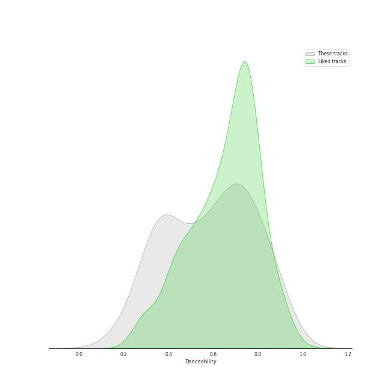
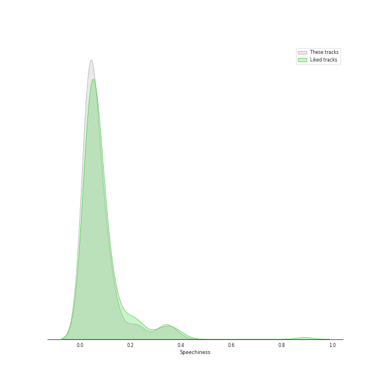
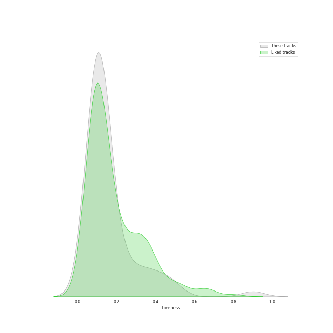
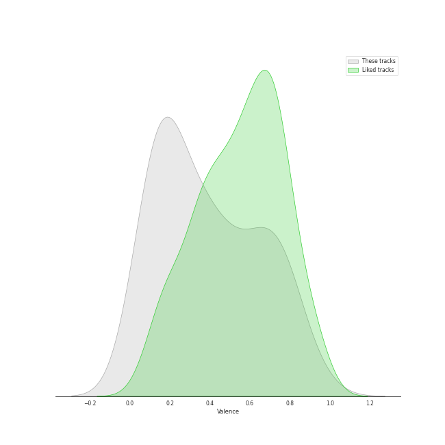

# Track Features for art pop

## Danceability

| ​ | 10 most Danceable tracks | ​​ | 10 least Danceable tracks |
|:---|:---|:---|:---|
|  | bury a friend (0.905) |  | Born To Die (0.18) |
|  | LoveGame (0.894) |  | Norman fucking Rockwell (0.215) |
|  | Therefore I Am (0.879) |  | Shades Of Cool (0.262) |
|  | Poker Face (0.851) |  | La Vie En Rose (0.276) |
|  | Look What I Found (0.849) |  | Shadowboxer (0.298) |
|  | Telephone (0.824) |  | Radio (0.312) |
|  | Just Dance (0.822) |  | Young And Beautiful (0.324) |
|  | Good Ones (0.764) |  | Happier Than Ever (0.332) |
|  | Paparazzi (0.762) |  | Swan Song (0.34) |
|  | Sour Candy (with BLACKPINK) (0.752) |  | Bel Air (0.346) |

## Energy

| ​ | 10 most Energetic tracks | ​​ | 10 least Energetic tracks |
|:---|:---|:---|:---|
|  | Judas (0.937) |  | What Was I Made For? [From The Motion Picture "Barbie"] (0.0911) |
|  | Bad Romance (0.921) |  | when the party's over (0.111) |
|  | Sour Candy (with BLACKPINK) (0.87) |  | xanny (0.125) |
|  | Rain On Me (with Ariana Grande) (0.855) |  | Norman fucking Rockwell (0.203) |
|  | Radio (0.841) |  | No Time To Die (0.219) |
|  | Telephone (0.836) |  | everything i wanted (0.225) |
|  | Poker Face (0.806) |  | Happier Than Ever (0.225) |
|  | Just Dance (0.739) |  | TV (0.236) |
|  | Off To The Races (0.722) |  | Video Games (0.255) |
|  | Green Light (0.721) |  | lovely (with Khalid) (0.296) |

## Speechiness

| ​ | 10 most Speechy tracks | ​​ | 10 least Speechy tracks |
|:---|:---|:---|:---|
|  | bad guy (0.375) |  | yellow is the color of her eyes (0.0276) |
|  | bury a friend (0.332) |  | Love (0.0277) |
|  | xanny (0.239) |  | Good Ones (0.0293) |
|  | watch (0.225) |  | Swan Song (0.0294) |
|  | you should see me in a crown (0.186) |  | Bel Air (0.0298) |
|  | GOLDWING (0.126) |  | Video Games (0.0299) |
|  | Royals (0.122) |  | Shades Of Cool (0.0302) |
|  | everything i wanted (0.0994) |  | Shadowboxer (0.0303) |
|  | when the party's over (0.0972) |  | What Was I Made For? [From The Motion Picture "Barbie"] (0.0307) |
|  | Green Light (0.0957) |  | Just Dance (0.0311) |

## Acousticness

| ​ | 10 most Acoustic tracks | ​​ | 10 least Acoustic tracks |
|:---|:---|:---|:---|
|  | when the party's over (0.978) |  | Judas (0.000967) |
|  | Norman fucking Rockwell (0.968) |  | Bad Romance (0.00314) |
|  | What Was I Made For? [From The Motion Picture "Barbie"] (0.959) |  | Telephone (0.00521) |
|  | lovely (with Khalid) (0.934) |  | LoveGame (0.00569) |
|  | No Time To Die (0.917) |  | Green Light (0.0209) |
|  | everything i wanted (0.902) |  | Rain On Me (with Ariana Grande) (0.021) |
|  | Fuck it I love you (0.895) |  | Just Dance (0.0264) |
|  | Bel Air (0.864) |  | Summertime Sadness (0.0456) |
|  | TV (0.83) |  | Cherry (0.048) |
|  | ocean eyes (0.816) |  | Sour Candy (with BLACKPINK) (0.0604) |

## Instrumentalness

| ​ | 10 most Instrumental tracks | ​​ | 10 least Instrumental tracks |
|:---|:---|:---|:---|
|  | everything i wanted (0.657) |  | Shadowboxer (0.0) |
|  | Swan Song (0.421) |  | Til It Happens To You (0.0) |
|  | you should see me in a crown (0.219) |  | Dark Paradise (0.0) |
|  | bury a friend (0.162) |  | lovely (with Khalid) (0.0) |
|  | GOLDWING (0.159) |  | Royals (0.0) |
|  | Therefore I Am (0.135) |  | La Vie En Rose (0.0) |
|  | bad guy (0.13) |  | Summertime Sadness (0.0) |
|  | yellow is the color of her eyes (0.125) |  | Yoü And I (0.0) |
|  | Bel Air (0.0875) |  | Paparazzi (0.0) |
|  | Norman fucking Rockwell (0.0585) |  | Million Reasons (0.0) |

## Liveness

| ​ | 10 most Live tracks | ​​ | 10 least Live tracks |
|:---|:---|:---|:---|
|  | Bel Air (0.901) |  | Therefore I Am (0.0583) |
|  | La Vie En Rose (0.706) |  | Beg for You (feat. Rina Sawayama) - A. G. Cook & VERNON OF SEVENTEEN Remix (0.0585) |
|  | Sour Candy (with BLACKPINK) (0.489) |  | Good Ones (0.0806) |
|  | Off To The Races (0.4) |  | No Time To Die (0.0827) |
|  | Cherry (0.384) |  | ocean eyes (0.084) |
|  | Judas (0.355) |  | Bad Romance (0.0842) |
|  | Rain On Me (with Ariana Grande) (0.323) |  | Radio (0.0876) |
|  | LoveGame (0.317) |  | Green Light (0.0879) |
|  | xanny (0.265) |  | Video Games (0.0887) |
|  | Swan Song (0.259) |  | when the party's over (0.0897) |

## Valence

| ​ | 10 most Happy tracks | ​​ | 10 least Happy tracks |
|:---|:---|:---|:---|
|  | LoveGame (0.844) |  | Swan Song (0.0392) |
|  | Beg for You (feat. Rina Sawayama) - A. G. Cook & VERNON OF SEVENTEEN Remix (0.824) |  | No Time To Die (0.0517) |
|  | Good Ones (0.789) |  | xanny (0.0528) |
|  | Poker Face (0.787) |  | Yellow Flicker Beat (0.0597) |
|  | Sour Candy (with BLACKPINK) (0.784) |  | Shades Of Cool (0.0878) |
|  | Just Dance (0.745) |  | Brooklyn Baby (0.0949) |
|  | Telephone (0.716) |  | TV (0.119) |
|  | Bad Romance (0.714) |  | lovely (with Khalid) (0.12) |
|  | I Want You To Love Me (0.712) |  | Off To The Races (0.136) |
|  | I Feel It All (0.683) |  | What Was I Made For? [From The Motion Picture "Barbie"] (0.142) |

## Tempo

| ​ | 10 most Fast tracks | ​​ | 10 least Fast tracks |
|:---|:---|:---|:---|
|  | I Feel It All (172.046) |  | No Time To Die (73.537) |
|  | watch (165.212) |  | Shadowboxer (74.131) |
|  | yellow is the color of her eyes (161.006) |  | Radio (75.112) |
|  | GOLDWING (160.095) |  | Born To Die (75.632) |
|  | Off To The Races (160.065) |  | La Vie En Rose (76.18) |
|  | you should see me in a crown (150.455) |  | Norman fucking Rockwell (78.287) |
|  | Doin' Time (144.982) |  | What Was I Made For? [From The Motion Picture "Barbie"] (78.403) |
|  | ocean eyes (144.892) |  | Happier Than Ever (81.055) |
|  | I Want You To Love Me (141.369) |  | Swan Song (81.765) |
|  | TV (140.214) |  | when the party's over (82.642) |
