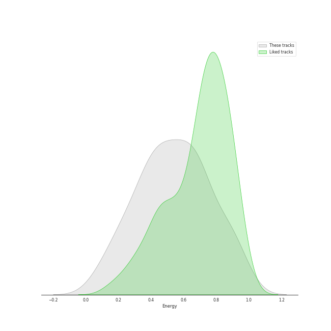
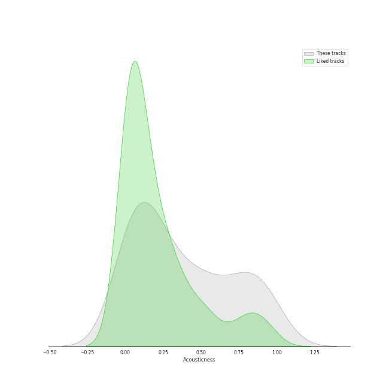
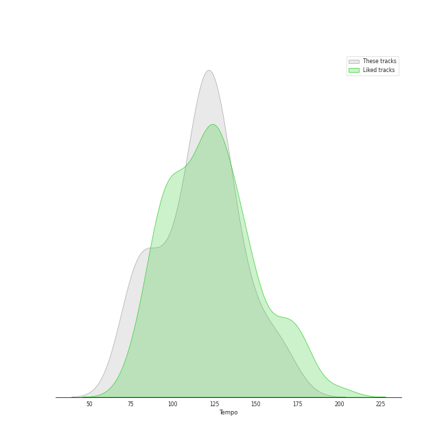

# Audio Features for art pop

## Danceability

| 10 most Danceable tracks | 10 least Danceable tracks |
|:---|:---|
| bury a friend (0.905) | Born To Die (0.18) |
| LoveGame (0.894) | Norman fucking Rockwell (0.215) |
| Therefore I Am (0.879) | Shades Of Cool (0.262) |
| Poker Face (0.851) | La Vie En Rose (0.276) |
| Look What I Found (0.849) | Shadowboxer (0.298) |
| Telephone (0.824) | Radio (0.312) |
| Just Dance (0.822) | Young And Beautiful (0.324) |
| Good Ones (0.764) | Happier Than Ever (0.332) |
| Paparazzi (0.762) | Swan Song (0.34) |
| Sour Candy (with BLACKPINK) (0.752) | Bel Air (0.346) |

## Energy

| 10 most Energetic tracks | 10 least Energetic tracks |
|:---|:---|
| Bad Romance (0.921) | when the party's over (0.111) |
| Sour Candy (with BLACKPINK) (0.87) | xanny (0.125) |
| Rain On Me (with Ariana Grande) (0.855) | Norman fucking Rockwell (0.203) |
| Radio (0.841) | No Time To Die (0.219) |
| Telephone (0.836) | everything i wanted (0.225) |
| Poker Face (0.806) | Happier Than Ever (0.225) |
| Just Dance (0.739) | TV (0.236) |
| Off To The Races (0.722) | Video Games (0.255) |
| Yoü And I (0.709) | lovely (with Khalid) (0.296) |
| Beg for You (feat. Rina Sawayama) - A. G. Cook & VERNON OF SEVENTEEN Remix (0.704) | GOLDWING (0.303) |

## Speechiness

| 10 most Speechy tracks | 10 least Speechy tracks |
|:---|:---|
| bad guy (0.375) | Love (0.0277) |
| bury a friend (0.332) | Good Ones (0.0293) |
| xanny (0.239) | Swan Song (0.0294) |
| you should see me in a crown (0.186) | Bel Air (0.0298) |
| GOLDWING (0.126) | Video Games (0.0299) |
| Royals (0.122) | Shades Of Cool (0.0302) |
| everything i wanted (0.0994) | Shadowboxer (0.0303) |
| when the party's over (0.0972) | Just Dance (0.0311) |
| Therefore I Am (0.0924) | La Vie En Rose (0.0329) |
| Billions (0.0921) | lovely (with Khalid) (0.0333) |

## Acousticness

| 10 most Acoustic tracks | 10 least Acoustic tracks |
|:---|:---|
| when the party's over (0.978) | Bad Romance (0.00314) |
| Norman fucking Rockwell (0.968) | Telephone (0.00521) |
| lovely (with Khalid) (0.934) | LoveGame (0.00569) |
| No Time To Die (0.917) | Rain On Me (with Ariana Grande) (0.021) |
| everything i wanted (0.902) | Just Dance (0.0264) |
| Fuck it I love you (0.895) | Summertime Sadness (0.0456) |
| Bel Air (0.864) | Cherry (0.048) |
| TV (0.83) | Sour Candy (with BLACKPINK) (0.0604) |
| ocean eyes (0.816) | Off To The Races (0.061) |
| Video Games (0.806) | Good Ones (0.072) |

## Instrumentalness

| 10 most Instrumental tracks | 10 least Instrumental tracks |
|:---|:---|
| everything i wanted (0.657) | Shadowboxer (0.0) |
| Swan Song (0.421) | Til It Happens To You (0.0) |
| you should see me in a crown (0.219) | Dark Paradise (0.0) |
| bury a friend (0.162) | lovely (with Khalid) (0.0) |
| GOLDWING (0.159) | Royals (0.0) |
| Therefore I Am (0.135) | La Vie En Rose (0.0) |
| bad guy (0.13) | Summertime Sadness (0.0) |
| Bel Air (0.0875) | Yoü And I (0.0) |
| Norman fucking Rockwell (0.0585) | Paparazzi (0.0) |
| ocean eyes (0.0317) | Million Reasons (0.0) |

## Liveness

| 10 most Live tracks | 10 least Live tracks |
|:---|:---|
| Bel Air (0.901) | Therefore I Am (0.0583) |
| La Vie En Rose (0.706) | Beg for You (feat. Rina Sawayama) - A. G. Cook & VERNON OF SEVENTEEN Remix (0.0585) |
| Sour Candy (with BLACKPINK) (0.489) | Good Ones (0.0806) |
| Off To The Races (0.4) | No Time To Die (0.0827) |
| Cherry (0.384) | ocean eyes (0.084) |
| Billions (0.374) | Bad Romance (0.0842) |
| Rain On Me (with Ariana Grande) (0.323) | Radio (0.0876) |
| LoveGame (0.317) | Video Games (0.0887) |
| xanny (0.265) | when the party's over (0.0897) |
| Swan Song (0.259) | West Coast (0.0907) |

## Valence

| 10 most Happy tracks | 10 least Happy tracks |
|:---|:---|
| LoveGame (0.844) | Swan Song (0.0392) |
| Beg for You (feat. Rina Sawayama) - A. G. Cook & VERNON OF SEVENTEEN Remix (0.824) | No Time To Die (0.0517) |
| Good Ones (0.789) | xanny (0.0528) |
| Poker Face (0.787) | Yellow Flicker Beat (0.0597) |
| Sour Candy (with BLACKPINK) (0.784) | Shades Of Cool (0.0878) |
| Just Dance (0.745) | Brooklyn Baby (0.0949) |
| Telephone (0.716) | TV (0.119) |
| Bad Romance (0.714) | lovely (with Khalid) (0.12) |
| I Feel It All (0.683) | Off To The Races (0.136) |
| Therefore I Am (0.663) | Norman fucking Rockwell (0.143) |

## Tempo

| 10 most Fast tracks | 10 least Fast tracks |
|:---|:---|
| I Feel It All (172.046) | No Time To Die (73.537) |
| GOLDWING (160.095) | Shadowboxer (74.131) |
| Off To The Races (160.065) | Radio (75.112) |
| you should see me in a crown (150.455) | Born To Die (75.632) |
| Doin' Time (144.982) | La Vie En Rose (76.18) |
| ocean eyes (144.892) | Norman fucking Rockwell (78.287) |
| TV (140.214) | Happier Than Ever (81.055) |
| Billions (139.941) | Swan Song (81.765) |
| Shades Of Cool (137.918) | when the party's over (82.642) |
| bad guy (135.128) | Bel Air (83.56) |
