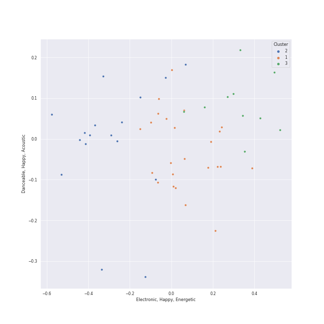

# Clusters in art pop

## Cluster #1

11 tracks

| Art | Track | Album | Artists | Label | Score | 💚 | 🔗 |
|:---|:---|:---|:---|:---|---:|:---|:---|
|  | Judas | Born This Way | [Lady Gaga](../../../../artists/lady_gaga/overview.md) | [Interscope](../../../../labels/interscope_records) | 0 | 💚 | [🔗](https://open.spotify.com/track/0QkWikH5Z3U0f79T9iuF6c) |
|  | Bad Romance | The Fame Monster (Deluxe Edition) | [Lady Gaga](../../../../artists/lady_gaga/overview.md) | [Interscope](../../../../labels/interscope_records) | 0 | 💚 | [🔗](https://open.spotify.com/track/0SiywuOBRcynK0uKGWdCnn) |
|  | Telephone | The Fame Monster (Deluxe Edition) | [Lady Gaga](../../../../artists/lady_gaga/overview.md), [Beyoncé](../../../../artists/beyoncé/overview.md) | [Interscope](../../../../labels/interscope_records) | 0 | 💚 | [🔗](https://open.spotify.com/track/4TCL0qqKyqsMZml0G3M9IM) |
|  | LoveGame | The Fame | [Lady Gaga](../../../../artists/lady_gaga/overview.md) | [Interscope](../../../../labels/interscope_records) | 0 | 💚 | [🔗](https://open.spotify.com/track/0TcJ7QWpggdSg8t0fHThHm) |
|  | Just Dance | The Fame | [Lady Gaga](../../../../artists/lady_gaga/overview.md), Colby O'Donis | [Interscope](../../../../labels/interscope_records) | 0 | | [🔗](https://open.spotify.com/track/2x7MyWybabEz6Y6wvHuwGE) |
|  | Poker Face | The Fame | [Lady Gaga](../../../../artists/lady_gaga/overview.md) | [Interscope](../../../../labels/interscope_records) | 0 | 💚 | [🔗](https://open.spotify.com/track/5R8dQOPq8haW94K7mgERlO) |
|  | Sour Candy (with BLACKPINK) | Chromatica | [Lady Gaga](../../../../artists/lady_gaga/overview.md), [BLACKPINK](../../../../artists/blackpink/overview.md) | [Interscope](../../../../labels/interscope_records) | 52 | 💚 | [🔗](https://open.spotify.com/track/1IWNylpZ477gIVUDpJL66u) |
|  | Rain On Me (with Ariana Grande) | Chromatica | [Lady Gaga](../../../../artists/lady_gaga/overview.md), [Ariana Grande](../../../../artists/ariana_grande/overview.md) | [Interscope](../../../../labels/interscope_records) | 0 | | [🔗](https://open.spotify.com/track/7ju97lgwC2rKQ6wwsf9no9) |
|  | Good Ones | CRASH | Charli XCX | [Atlantic Records](../../../../labels/atlantic_records) | 0 | 💚 | [🔗](https://open.spotify.com/track/2grSOc6HNTXQQXNoRKt9UM) |
|  | Beg for You (feat. Rina Sawayama) - A. G. Cook & VERNON OF SEVENTEEN Remix | Beg For You (A. G. Cook & VERNON OF SEVENTEEN Remix) [feat. Rina Sawayama] | Charli XCX, A. G. Cook, VERNON, Rina Sawayama | Atlantic Records UK | 0 | | [🔗](https://open.spotify.com/track/3teT4GffWtZUYQVmUwL14d) |
## Cluster #2

21 tracks

| Art | Track | Album | Artists | Label | Score | 💚 | 🔗 |
|:---|:---|:---|:---|:---|---:|:---|:---|
|  | GOLDWING | Happier Than Ever | [Billie Eilish](../../../../artists/billie_eilish/overview.md) | [Darkroom](../../../../labels/darkroom), [Interscope Records](../../../../labels/interscope_records) | 39 | 💚 | [🔗](https://open.spotify.com/track/0FfqyjhB6Kspvit1oOo7ax) |
|  | Happier Than Ever | Happier Than Ever | [Billie Eilish](../../../../artists/billie_eilish/overview.md) | [Darkroom](../../../../labels/darkroom), [Interscope Records](../../../../labels/interscope_records) | 0 | | [🔗](https://open.spotify.com/track/4RVwu0g32PAqgUiJoXsdF8) |
|  | lovely (with Khalid) | lovely (with Khalid) | [Billie Eilish](../../../../artists/billie_eilish/overview.md), Khalid | [Darkroom](../../../../labels/darkroom) | 0 | 💚 | [🔗](https://open.spotify.com/track/0u2P5u6lvoDfwTYjAADbn4) |
|  | xanny | WHEN WE ALL FALL ASLEEP, WHERE DO WE GO? | [Billie Eilish](../../../../artists/billie_eilish/overview.md) | [Darkroom](../../../../labels/darkroom), [Interscope Records](../../../../labels/interscope_records) | 1 | 💚 | [🔗](https://open.spotify.com/track/4QIo4oxwzzafcBWkKjDpXY) |
|  | TV | Guitar Songs | [Billie Eilish](../../../../artists/billie_eilish/overview.md) | [Darkroom](../../../../labels/darkroom), [Interscope Records](../../../../labels/interscope_records) | 0 | | [🔗](https://open.spotify.com/track/3GYlZ7tbxLOxe6ewMNVTkw) |
|  | No Time To Die | No Time To Die | [Billie Eilish](../../../../artists/billie_eilish/overview.md) | [Darkroom](../../../../labels/darkroom), [Interscope Records](../../../../labels/interscope_records) | 363 | 💚 | [🔗](https://open.spotify.com/track/73SpzrcaHk0RQPFP73vqVR) |
|  | ocean eyes | dont smile at me | [Billie Eilish](../../../../artists/billie_eilish/overview.md) | [Darkroom](../../../../labels/darkroom) | 0 | 💚 | [🔗](https://open.spotify.com/track/7hDVYcQq6MxkdJGweuCtl9) |
|  | Fuck it I love you | Norman Fucking Rockwell! | [Lana Del Rey](../../../../artists/lana_del_rey/overview.md) | [Polydor Records](../../../../labels/polydor_records) | 0 | | [🔗](https://open.spotify.com/track/7MtVPRGtZl6rPjMfLoI3Lh) |
|  | Video Games | Born To Die | [Lana Del Rey](../../../../artists/lana_del_rey/overview.md) | [Polydor Records](../../../../labels/polydor_records) | 0 | 💚 | [🔗](https://open.spotify.com/track/5by7gtiDrxe4n2qQQunL8S) |
|  | yellow is the color of her eyes | color theory | Soccer Mommy | Loma Vista Recordings | 0 | 💚 | [🔗](https://open.spotify.com/track/5EDBVVqd2ogoG89XVQOvsn) |
## Cluster #3

23 tracks

| Art | Track | Album | Artists | Label | Score | 💚 | 🔗 |
|:---|:---|:---|:---|:---|---:|:---|:---|
|  | watch | dont smile at me | [Billie Eilish](../../../../artists/billie_eilish/overview.md) | [Darkroom](../../../../labels/darkroom) | 0 | 💚 | [🔗](https://open.spotify.com/track/7eB1V5LvAdxCc7brfGhRRo) |
|  | Royals | Pure Heroine | Lorde | Universal Music New Zealand Limited | 0 | 💚 | [🔗](https://open.spotify.com/track/2dLLR6qlu5UJ5gk0dKz0h3) |
|  | Green Light | Melodrama | Lorde | Universal Music New Zealand Limited | 200 | | [🔗](https://open.spotify.com/track/6ie2Bw3xLj2JcGowOlcMhb) |
|  | Doin' Time | Norman Fucking Rockwell! | [Lana Del Rey](../../../../artists/lana_del_rey/overview.md) | [Polydor Records](../../../../labels/polydor_records) | 0 | | [🔗](https://open.spotify.com/track/0Oqc0kKFsQ6MhFOLBNZIGX) |
|  | Dark Paradise | Born To Die | [Lana Del Rey](../../../../artists/lana_del_rey/overview.md) | [Polydor Records](../../../../labels/polydor_records) | 0 | 💚 | [🔗](https://open.spotify.com/track/0rbuGVyW18IpX0bhA3P4Oh) |
|  | Summertime Sadness | Born To Die | [Lana Del Rey](../../../../artists/lana_del_rey/overview.md) | [Polydor Records](../../../../labels/polydor_records) | 0 | 💚 | [🔗](https://open.spotify.com/track/4cKtn8Shw999egpwBmWQmp) |
|  | West Coast | Ultraviolence (Deluxe) | [Lana Del Rey](../../../../artists/lana_del_rey/overview.md) | [Polydor Records](../../../../labels/polydor_records) | 0 | | [🔗](https://open.spotify.com/track/5Y6nVaayzitvsD5F7nr3DV) |
|  | Young And Beautiful | Young And Beautiful | [Lana Del Rey](../../../../artists/lana_del_rey/overview.md) | [Polydor Records](../../../../labels/polydor_records) | 0 | | [🔗](https://open.spotify.com/track/2nMeu6UenVvwUktBCpLMK9) |
|  | Yoü And I | Born This Way | [Lady Gaga](../../../../artists/lady_gaga/overview.md) | [Interscope](../../../../labels/interscope_records) | 0 | 💚 | [🔗](https://open.spotify.com/track/6rkAY9rk1NTFB94QxG3LJR) |
|  | Shadowboxer | Tidal | Fiona Apple | Clean Slate/Work | 0 | | [🔗](https://open.spotify.com/track/0XMzFZgFvEqH2nEa3iwNUD) |