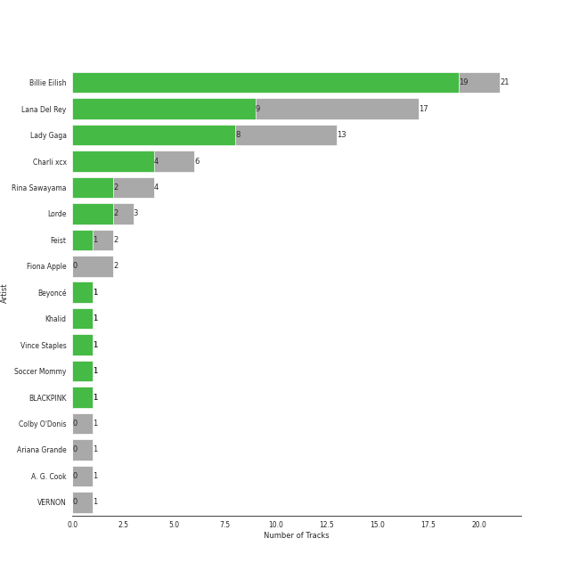
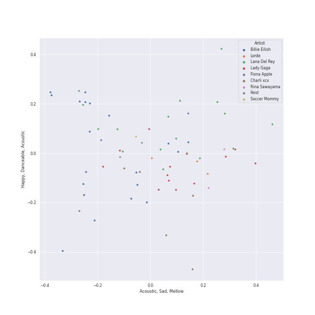
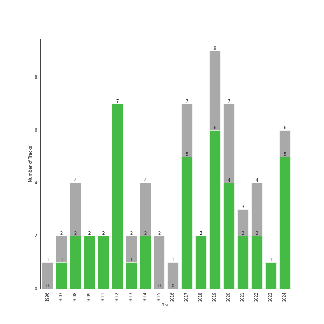

# art pop

[50 songs](tracks.md)

## Top Artists

| Art | Tracks | 💚 | Artist | 🔗 |
|:---|---:|---:|:---|:---|
|  | 13 | 11 | [Billie Eilish](../../artists/billie_eilish/overview.md) | [🔗](https://open.spotify.com/artist/6qqNVTkY8uBg9cP3Jd7DAH) |
|  | 17 | 9 | [Lana Del Rey](../../artists/lana_del_rey/overview.md) | [🔗](https://open.spotify.com/artist/00FQb4jTyendYWaN8pK0wa) |
|  | 13 | 9 | [Lady Gaga](../../artists/lady_gaga/overview.md) | [🔗](https://open.spotify.com/artist/1HY2Jd0NmPuamShAr6KMms) |
|  | 2 | 2 | Lorde | [🔗](https://open.spotify.com/artist/163tK9Wjr9P9DmM0AVK7lm) |
|  | 2 | 1 | Charli XCX | [🔗](https://open.spotify.com/artist/25uiPmTg16RbhZWAqwLBy5) |
|  | 1 | 1 | Colby O'Donis | [🔗](https://open.spotify.com/artist/7fObcBw9VM3x7ntWKCYl0z) |
|  | 1 | 1 | [Beyoncé](../../artists/beyonc_/overview.md) | [🔗](https://open.spotify.com/artist/6vWDO969PvNqNYHIOW5v0m) |
|  | 1 | 1 | Khalid | [🔗](https://open.spotify.com/artist/6LuN9FCkKOj5PcnpouEgny) |
|  | 1 | 1 | Caroline Polachek | [🔗](https://open.spotify.com/artist/4Ge8xMJNwt6EEXOzVXju9a) |
|  | 1 | 1 | [BLACKPINK](../../artists/blackpink/overview.md) | [🔗](https://open.spotify.com/artist/41MozSoPIsD1dJM0CLPjZF) |

See all 16 artists

| Art | Tracks | 💚 | Artist | 🔗 |
|:---|---:|---:|:---|:---|
|  | 1 | 0 | Feist | [🔗](https://open.spotify.com/artist/6CWTBjOJK75cTE8Xv8u1kj) |
|  | 1 | 0 | [Ariana Grande](../../artists/ariana_grande/overview.md) | [🔗](https://open.spotify.com/artist/66CXWjxzNUsdJxJ2JdwvnR) |
|  | 1 | 0 | Fiona Apple | [🔗](https://open.spotify.com/artist/3g2kUQ6tHLLbmkV7T4GPtL) |
|  | 1 | 0 | A. G. Cook | [🔗](https://open.spotify.com/artist/335TWGWGFan4vaacJzSiU8) |
|  | 1 | 0 | VERNON | [🔗](https://open.spotify.com/artist/2Y34b9AOK30zXgL7cAH4NG) |
|  | 1 | 0 | Rina Sawayama | [🔗](https://open.spotify.com/artist/2KEqzdPS7M5YwGmiuPTdr5) |

## Top Albums

| Art | Tracks | 💚 | Album | Release Date | 🔗 |
|:---|---:|---:|:---|:---|:---|
|  | 6 | 6 | Born To Die | 2012-01-30 | [🔗](https://open.spotify.com/album/4X8hAqIWpQyQks2yRhyqs4) |
|  | 5 | 5 | WHEN WE ALL FALL ASLEEP, WHERE DO WE GO? | 2019-03-29 | [🔗](https://open.spotify.com/album/0S0KGZnfBGSIssfF54WSJh) |
|  | 4 | 3 | The Fame | 2008-01-01 | [🔗](https://open.spotify.com/album/1jpUMnKpRlng1OJN7LJauV) |
|  | 3 | 2 | Happier Than Ever | 2021-07-30 | [🔗](https://open.spotify.com/album/0JGOiO34nwfUdDrD612dOp) |
|  | 3 | 1 | Ultraviolence (Deluxe) | 2014-01-01 | [🔗](https://open.spotify.com/album/1ORxRsK3MrSLvh7VQTF01F) |
|  | 3 | 0 | Norman Fucking Rockwell! | 2019-08-30 | [🔗](https://open.spotify.com/album/5XpEKORZ4y6OrCZSKsi46A) |
|  | 2 | 2 | The Fame Monster (Deluxe Edition) | 2009-11-05 | [🔗](https://open.spotify.com/album/6rePArBMb5nLWEaY9aQqL4) |
|  | 2 | 2 | A Star Is Born Soundtrack | 2018-10-05 | [🔗](https://open.spotify.com/album/4sLtOBOzn4s3GDUv3c5oJD) |
|  | 2 | 1 | Lust For Life | 2017-07-21 | [🔗](https://open.spotify.com/album/7xYiTrbTL57QO0bb4hXIKo) |
|  | 2 | 1 | Chromatica | 2020-05-29 | [🔗](https://open.spotify.com/album/05c49JgPmL4Uz2ZeqRx5SP) |

See all 28 albums

| Art | Tracks | 💚 | Album | Release Date | 🔗 |
|:---|---:|---:|:---|:---|:---|
|  | 1 | 1 | lovely (with Khalid) | 2018-04-19 | [🔗](https://open.spotify.com/album/2sBB17RXTamvj7Ncps15AK) |
|  | 1 | 1 | everything i wanted | 2019-11-13 | [🔗](https://open.spotify.com/album/4i3rAwPw7Ln2YrKDusaWyT) |
|  | 1 | 1 | dont smile at me | 2017-12-22 | [🔗](https://open.spotify.com/album/7fRrTyKvE4Skh93v97gtcU) |
|  | 1 | 1 | Yellow Flicker Beat (From The Hunger Games: Mockingjay Part 1) | 2014-09-30 | [🔗](https://open.spotify.com/album/7sg5iqMiDrM2aJqLAmv83V) |
|  | 1 | 1 | Pure Heroine | 2013-09-27 | [🔗](https://open.spotify.com/album/0rmhjUgoVa17LZuS8xWQ3v) |
|  | 1 | 1 | Paradise | 2012-11-09 | [🔗](https://open.spotify.com/album/1JnjcAIKQ9TSJFVFierTB8) |
|  | 1 | 1 | No Time To Die | 2020-02-13 | [🔗](https://open.spotify.com/album/5sXSHscDjBez8VF20cSyad) |
|  | 1 | 1 | CRASH | 2022-03-18 | [🔗](https://open.spotify.com/album/1QqipMXWzJhr6yfcNKTp8B) |
|  | 1 | 1 | Born This Way | 2011-01-01 | [🔗](https://open.spotify.com/album/2KkMVsxymoNR7hRmBcMttd) |
|  | 1 | 1 | Billions | 2022-02-09 | [🔗](https://open.spotify.com/album/4DpAPqdJ1jVhoWZrxWLRH5) |
|  | 1 | 0 | Young And Beautiful | 2013-01-01 | [🔗](https://open.spotify.com/album/1D92WOHWUI2AGQCCdplcXL) |
|  | 1 | 0 | Til It Happens To You | 2015-09-18 | [🔗](https://open.spotify.com/album/00qjYaNSNpQCZHhCpAlH60) |
|  | 1 | 0 | Tidal | 1996-07-23 | [🔗](https://open.spotify.com/album/5gVBXH8MT6zfdRkjp7qT18) |
|  | 1 | 0 | The Reminder | 2007-01-01 | [🔗](https://open.spotify.com/album/7bTdGfczXffzzNE9ssJj4Z) |
|  | 1 | 0 | Joanne (Deluxe) | 2016-10-21 | [🔗](https://open.spotify.com/album/2ZUwFxlWo0gwTsvZ6L4Meh) |
|  | 1 | 0 | Honeymoon | 2015-09-18 | [🔗](https://open.spotify.com/album/2DpEBrjCur1ythIZ10gJWw) |
|  | 1 | 0 | Guitar Songs | 2022-07-21 | [🔗](https://open.spotify.com/album/1YPWxMpQEC8kcOuefgXbhj) |
|  | 1 | 0 | Beg For You (A. G. Cook & VERNON OF SEVENTEEN Remix) [feat. Rina Sawayama] | 2022-02-25 | [🔗](https://open.spotify.com/album/6snPKZGUbpydW2XJu9ievq) |

## Top Record Labels

| Tracks | 💚 | Label |
|---:|---:|:---|
| 22 | 16 | [Interscope Records](../../labels/interscope_records/overview.md) |
| 13 | 11 | [Darkroom](../../labels/darkroom/overview.md) |
| 17 | 9 | [Polydor Records](../../labels/polydor_records/overview.md) |
| 2 | 2 | A Star is Born OST |
| 1 | 1 | Universal Music New Zealand Limited |
| 1 | 1 | Perpetual Novice |
| 1 | 1 | Mockingjay |
| 1 | 1 | Hunger Games 3 |
| 1 | 1 | [Atlantic Records](../../labels/atlantic_records/overview.md) |
| 1 | 0 | Work |

See all 13 labels

| Tracks | 💚 | Label |
|---:|---:|:---|
| 1 | 0 | Universal Music Division Polydor |
| 1 | 0 | Clean Slate |
| 1 | 0 | Atlantic Records UK |

## Years

| 10 newest albums | 10 oldest albums |
|:---|:---|
| 
 Guitar Songs (2022-07-21)
 | 
 Tidal (1996-07-23)
 |
| 
 CRASH (2022-03-18)
 | 
 The Reminder (2007-01-01)
 |
| 
 Beg For You (A. G. Cook & VERNON OF SEVENTEEN Remix) [feat. Rina Sawayama] (2022-02-25)
 | 
 The Fame (2008-01-01)
 |
| 
 Billions (2022-02-09)
 | 
 The Fame Monster (Deluxe Edition) (2009-11-05)
 |
| 
 Happier Than Ever (2021-07-30)
 | 
 Born This Way (2011-01-01)
 |
| 
 Chromatica (2020-05-29)
 | 
 Born To Die (2012-01-30)
 |
| 
 No Time To Die (2020-02-13)
 | 
 Paradise (2012-11-09)
 |
| 
 everything i wanted (2019-11-13)
 | 
 Young And Beautiful (2013-01-01)
 |
| 
 Norman Fucking Rockwell! (2019-08-30)
 | 
 Pure Heroine (2013-09-27)
 |
| 
 WHEN WE ALL FALL ASLEEP, WHERE DO WE GO? (2019-03-29)
 | 
 Ultraviolence (Deluxe) (2014-01-01)
 |
## Audio Features

| 10 most Danceable tracks | 10 least Danceable tracks |
|:---|:---|
| bury a friend (0.905) | Born To Die (0.18) |
| LoveGame (0.894) | Norman fucking Rockwell (0.215) |
| Therefore I Am (0.879) | Shades Of Cool (0.262) |
| Poker Face (0.851) | La Vie En Rose (0.276) |
| Look What I Found (0.849) | Shadowboxer (0.298) |
| Telephone (0.824) | Radio (0.312) |
| Just Dance (0.822) | Young And Beautiful (0.324) |
| Good Ones (0.764) | Happier Than Ever (0.332) |
| Paparazzi (0.762) | Swan Song (0.34) |
| Sour Candy (with BLACKPINK) (0.752) | Bel Air (0.346) |

| 10 most Energetic tracks | 10 least Energetic tracks |
|:---|:---|
| Bad Romance (0.921) | when the party's over (0.111) |
| Sour Candy (with BLACKPINK) (0.87) | xanny (0.125) |
| Rain On Me (with Ariana Grande) (0.855) | Norman fucking Rockwell (0.203) |
| Radio (0.841) | No Time To Die (0.219) |
| Telephone (0.836) | everything i wanted (0.225) |
| Poker Face (0.806) | Happier Than Ever (0.225) |
| Just Dance (0.739) | TV (0.236) |
| Off To The Races (0.722) | Video Games (0.255) |
| Yoü And I (0.709) | lovely (with Khalid) (0.296) |
| Beg For You (A. G. Cook & VERNON OF SEVENTEEN Remix) [feat. Rina Sawayama] (0.704) | GOLDWING (0.303) |

| 10 most Speechy tracks | 10 least Speechy tracks |
|:---|:---|
| bad guy (0.375) | Love (0.0277) |
| bury a friend (0.332) | Good Ones (0.0293) |
| xanny (0.239) | Swan Song (0.0294) |
| you should see me in a crown (0.186) | Bel Air (0.0298) |
| GOLDWING (0.126) | Video Games (0.0299) |
| Royals (0.122) | Shades Of Cool (0.0302) |
| everything i wanted (0.0994) | Shadowboxer (0.0303) |
| when the party's over (0.0972) | Just Dance (0.0311) |
| Therefore I Am (0.0924) | La Vie En Rose (0.0329) |
| Billions (0.0921) | lovely (with Khalid) (0.0333) |

| 10 most Acoustic tracks | 10 least Acoustic tracks |
|:---|:---|
| when the party's over (0.978) | Bad Romance (0.00314) |
| Norman fucking Rockwell (0.968) | Telephone (0.00521) |
| lovely (with Khalid) (0.934) | LoveGame (0.00569) |
| No Time To Die (0.917) | Rain On Me (with Ariana Grande) (0.021) |
| everything i wanted (0.902) | Just Dance (0.0264) |
| Fuck it I love you (0.895) | Summertime Sadness (0.0456) |
| Bel Air (0.864) | Cherry (0.048) |
| TV (0.83) | Sour Candy (with BLACKPINK) (0.0604) |
| ocean eyes (0.816) | Off To The Races (0.061) |
| Video Games (0.806) | Good Ones (0.072) |

| 10 most Instrumental tracks | 10 least Instrumental tracks |
|:---|:---|
| everything i wanted (0.657) | Shadowboxer (0.0) |
| Swan Song (0.421) | Til It Happens To You (0.0) |
| you should see me in a crown (0.219) | Dark Paradise (0.0) |
| bury a friend (0.162) | lovely (with Khalid) (0.0) |
| GOLDWING (0.159) | Royals (0.0) |
| Therefore I Am (0.135) | La Vie En Rose (0.0) |
| bad guy (0.13) | Summertime Sadness (0.0) |
| Bel Air (0.0875) | Yoü And I (0.0) |
| Norman fucking Rockwell (0.0585) | Paparazzi (0.0) |
| ocean eyes (0.0317) | Million Reasons (0.0) |

| 10 most Live tracks | 10 least Live tracks |
|:---|:---|
| Bel Air (0.901) | Therefore I Am (0.0583) |
| La Vie En Rose (0.706) | Beg For You (A. G. Cook & VERNON OF SEVENTEEN Remix) [feat. Rina Sawayama] (0.0585) |
| Sour Candy (with BLACKPINK) (0.489) | Good Ones (0.0806) |
| Off To The Races (0.4) | No Time To Die (0.0827) |
| Cherry (0.384) | ocean eyes (0.084) |
| Billions (0.374) | Bad Romance (0.0842) |
| Rain On Me (with Ariana Grande) (0.323) | Radio (0.0876) |
| LoveGame (0.317) | Video Games (0.0887) |
| xanny (0.265) | when the party's over (0.0897) |
| Swan Song (0.259) | West Coast (0.0907) |

| 10 most Happy tracks | 10 least Happy tracks |
|:---|:---|
| LoveGame (0.844) | Swan Song (0.0392) |
| Beg For You (A. G. Cook & VERNON OF SEVENTEEN Remix) [feat. Rina Sawayama] (0.824) | No Time To Die (0.0517) |
| Good Ones (0.789) | xanny (0.0528) |
| Poker Face (0.787) | Yellow Flicker Beat (0.0597) |
| Sour Candy (with BLACKPINK) (0.784) | Shades Of Cool (0.0878) |
| Just Dance (0.745) | Brooklyn Baby (0.0949) |
| Telephone (0.716) | TV (0.119) |
| Bad Romance (0.714) | lovely (with Khalid) (0.12) |
| I Feel It All (0.683) | Off To The Races (0.136) |
| Therefore I Am (0.663) | Norman fucking Rockwell (0.143) |
