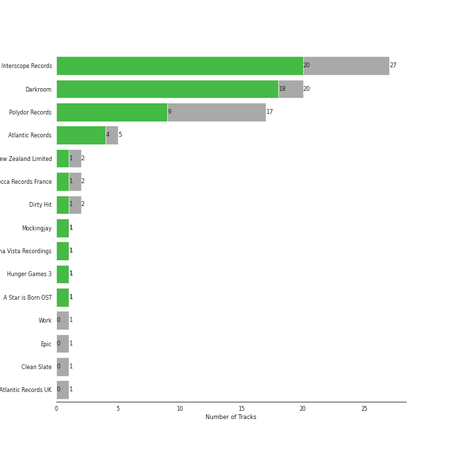
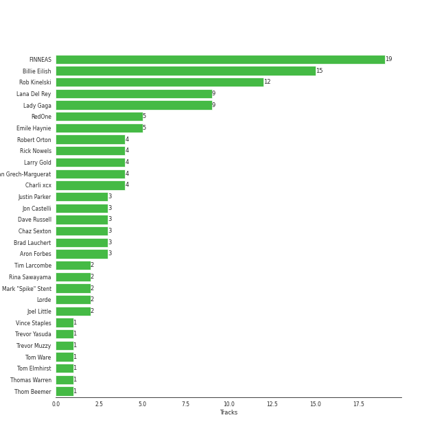

# art pop

60 songs

[See Track Features](audio_features.md)

[See Clusters](clusters/overview.md)

## Top Artists

| Art | Tracks | 💚 | Artist | 🔗 |
|:---|---:|---:|:---|:---|
|  | 16 | 14 | [Billie Eilish](../../artists/billie_eilish/overview.md) | [🔗](https://open.spotify.com/artist/6qqNVTkY8uBg9cP3Jd7DAH) |
|  | 17 | 9 | [Lana Del Rey](../../artists/lana_del_rey/overview.md) | [🔗](https://open.spotify.com/artist/00FQb4jTyendYWaN8pK0wa) |
|  | 14 | 9 | [Lady Gaga](../../artists/lady_gaga/overview.md) | [🔗](https://open.spotify.com/artist/1HY2Jd0NmPuamShAr6KMms) |
|  | 4 | 2 | Rina Sawayama | [🔗](https://open.spotify.com/artist/2KEqzdPS7M5YwGmiuPTdr5) |
|  | 3 | 2 | Charli XCX | [🔗](https://open.spotify.com/artist/25uiPmTg16RbhZWAqwLBy5) |
|  | 3 | 2 | Lorde | [🔗](https://open.spotify.com/artist/163tK9Wjr9P9DmM0AVK7lm) |
|  | 2 | 1 | Feist | [🔗](https://open.spotify.com/artist/6CWTBjOJK75cTE8Xv8u1kj) |
|  | 1 | 1 | [Beyoncé](../../artists/beyoncé/overview.md) | [🔗](https://open.spotify.com/artist/6vWDO969PvNqNYHIOW5v0m) |
|  | 1 | 1 | Khalid | [🔗](https://open.spotify.com/artist/6LuN9FCkKOj5PcnpouEgny) |
|  | 1 | 1 | Soccer Mommy | [🔗](https://open.spotify.com/artist/4wXchxfTTggLtzkoUhO86Q) |

See all 16 artists

| Art | Tracks | 💚 | Artist | 🔗 |
|:---|---:|---:|:---|:---|
|  | 1 | 1 | [BLACKPINK](../../artists/blackpink/overview.md) | [🔗](https://open.spotify.com/artist/41MozSoPIsD1dJM0CLPjZF) |
|  | 2 | 0 | Fiona Apple | [🔗](https://open.spotify.com/artist/3g2kUQ6tHLLbmkV7T4GPtL) |
|  | 1 | 0 | Colby O'Donis | [🔗](https://open.spotify.com/artist/7fObcBw9VM3x7ntWKCYl0z) |
|  | 1 | 0 | [Ariana Grande](../../artists/ariana_grande/overview.md) | [🔗](https://open.spotify.com/artist/66CXWjxzNUsdJxJ2JdwvnR) |
|  | 1 | 0 | A. G. Cook | [🔗](https://open.spotify.com/artist/335TWGWGFan4vaacJzSiU8) |
|  | 1 | 0 | VERNON | [🔗](https://open.spotify.com/artist/2Y34b9AOK30zXgL7cAH4NG) |

## Most and least listened tracks
| ​ | Most listened tracks | Rank | ​​ | Least listened tracks | Rank |
|:---|:---|---:|:---|:---|---:|
|  | [Sour Candy (with BLACKPINK)](../../artists/lady_gaga/overview.md) | 395 |  | yellow is the color of her eyes | 2599 |
|  | [you should see me in a crown](../../artists/billie_eilish/overview.md) | 437 |  | Comme Des Garçons (Like The Boys) | 2599 |
|  | [No Time To Die](../../artists/billie_eilish/overview.md) | 439 |  | Beg for You (feat. Rina Sawayama) - A. G. Cook & VERNON OF SEVENTEEN Remix | 2599 |
|  | [bury a friend](../../artists/billie_eilish/overview.md) | 444 |  | I Feel It All | 2599 |
|  | [GOLDWING](../../artists/billie_eilish/overview.md) | 447 |  | Good Ones | 2599 |
|  | [xanny](../../artists/billie_eilish/overview.md) | 449 |  | 1234 | 2599 |
|  | [Shades Of Cool](../../artists/lana_del_rey/overview.md) | 560 |  | XS | 2599 |
|  | [Off To The Races](../../artists/lana_del_rey/overview.md) | 566 |  | Beg for You (feat. Rina Sawayama) | 2599 |
|  | [Summertime Sadness](../../artists/lana_del_rey/overview.md) | 574 |  | [Rain On Me (with Ariana Grande)](../../artists/lady_gaga/overview.md) | 2550 |
|  | Green Light | 598 |  | [ocean eyes](../../artists/billie_eilish/overview.md) | 2537 |

## Top Albums

| Art | Tracks | 💚 | Album | Release Date | 🔗 |
|:---|---:|---:|:---|:---|:---|
|  | 6 | 6 | Born To Die | 2012-01-30 | [🔗](https://open.spotify.com/album/4X8hAqIWpQyQks2yRhyqs4) |
|  | 5 | 5 | WHEN WE ALL FALL ASLEEP, WHERE DO WE GO? | 2019-03-29 | [🔗](https://open.spotify.com/album/0S0KGZnfBGSIssfF54WSJh) |
|  | 4 | 2 | The Fame | 2008-01-01 | [🔗](https://open.spotify.com/album/1jpUMnKpRlng1OJN7LJauV) |
|  | 3 | 2 | Happier Than Ever | 2021-07-30 | [🔗](https://open.spotify.com/album/0JGOiO34nwfUdDrD612dOp) |
|  | 3 | 1 | Ultraviolence (Deluxe) | 2014-01-01 | [🔗](https://open.spotify.com/album/1ORxRsK3MrSLvh7VQTF01F) |
|  | 3 | 0 | Norman Fucking Rockwell! | 2019-08-30 | [🔗](https://open.spotify.com/album/5XpEKORZ4y6OrCZSKsi46A) |
|  | 2 | 2 | dont smile at me | 2017-12-22 | [🔗](https://open.spotify.com/album/7fRrTyKvE4Skh93v97gtcU) |
|  | 2 | 2 | The Fame Monster (Deluxe Edition) | 2009-11-05 | [🔗](https://open.spotify.com/album/6rePArBMb5nLWEaY9aQqL4) |
|  | 2 | 2 | CRASH | 2022-03-18 | [🔗](https://open.spotify.com/album/1QqipMXWzJhr6yfcNKTp8B) |
|  | 2 | 2 | Born This Way | 2011-01-01 | [🔗](https://open.spotify.com/album/2KkMVsxymoNR7hRmBcMttd) |

See all 33 albums

| Art | Tracks | 💚 | Album | Release Date | 🔗 |
|:---|---:|---:|:---|:---|:---|
|  | 2 | 2 | A Star Is Born Soundtrack | 2018-10-05 | [🔗](https://open.spotify.com/album/4sLtOBOzn4s3GDUv3c5oJD) |
|  | 2 | 1 | The Reminder | 2007-01-01 | [🔗](https://open.spotify.com/album/7bTdGfczXffzzNE9ssJj4Z) |
|  | 2 | 1 | SAWAYAMA | 2020-04-17 | [🔗](https://open.spotify.com/album/3stadz88XVpHcXnVYMHc4J) |
|  | 2 | 1 | Lust For Life | 2017-07-21 | [🔗](https://open.spotify.com/album/7xYiTrbTL57QO0bb4hXIKo) |
|  | 2 | 1 | Chromatica | 2020-05-29 | [🔗](https://open.spotify.com/album/05c49JgPmL4Uz2ZeqRx5SP) |
|  | 1 | 1 | lovely (with Khalid) | 2018-04-19 | [🔗](https://open.spotify.com/album/2sBB17RXTamvj7Ncps15AK) |
|  | 1 | 1 | everything i wanted | 2019-11-13 | [🔗](https://open.spotify.com/album/4i3rAwPw7Ln2YrKDusaWyT) |
|  | 1 | 1 | color theory | 2020-02-28 | [🔗](https://open.spotify.com/album/2CISL0rSGzbO0MbQMlqBez) |
|  | 1 | 1 | Yellow Flicker Beat (From The Hunger Games: Mockingjay Part 1) | 2014-09-30 | [🔗](https://open.spotify.com/album/7sg5iqMiDrM2aJqLAmv83V) |
|  | 1 | 1 | What Was I Made For? [From The Motion Picture "Barbie"] | 2023-07-13 | [🔗](https://open.spotify.com/album/3AafSrFIbJPH6BJHiJm1Cd) |
|  | 1 | 1 | Pure Heroine | 2013-09-27 | [🔗](https://open.spotify.com/album/0rmhjUgoVa17LZuS8xWQ3v) |
|  | 1 | 1 | Paradise | 2012-11-09 | [🔗](https://open.spotify.com/album/1JnjcAIKQ9TSJFVFierTB8) |
|  | 1 | 1 | No Time To Die | 2020-02-13 | [🔗](https://open.spotify.com/album/5sXSHscDjBez8VF20cSyad) |
|  | 1 | 1 | HIT ME HARD AND SOFT | 2024-05-17 | [🔗](https://open.spotify.com/album/7aJuG4TFXa2hmE4z1yxc3n) |
|  | 1 | 0 | Young And Beautiful | 2013-01-01 | [🔗](https://open.spotify.com/album/1D92WOHWUI2AGQCCdplcXL) |
|  | 1 | 0 | Til It Happens To You | 2015-09-18 | [🔗](https://open.spotify.com/album/00qjYaNSNpQCZHhCpAlH60) |
|  | 1 | 0 | Tidal | 1996-07-23 | [🔗](https://open.spotify.com/album/5gVBXH8MT6zfdRkjp7qT18) |
|  | 1 | 0 | Melodrama | 2017-06-16 | [🔗](https://open.spotify.com/album/2B87zXm9bOWvAJdkJBTpzF) |
|  | 1 | 0 | Joanne (Deluxe) | 2016-10-21 | [🔗](https://open.spotify.com/album/2ZUwFxlWo0gwTsvZ6L4Meh) |
|  | 1 | 0 | Honeymoon | 2015-09-18 | [🔗](https://open.spotify.com/album/2DpEBrjCur1ythIZ10gJWw) |
|  | 1 | 0 | Guitar Songs | 2022-07-21 | [🔗](https://open.spotify.com/album/1YPWxMpQEC8kcOuefgXbhj) |
|  | 1 | 0 | Fetch The Bolt Cutters | 2020-04-17 | [🔗](https://open.spotify.com/album/0fO1KemWL2uCCQmM22iKlj) |
|  | 1 | 0 | Beg For You (A. G. Cook & VERNON OF SEVENTEEN Remix) [feat. Rina Sawayama] | 2022-02-25 | [🔗](https://open.spotify.com/album/6snPKZGUbpydW2XJu9ievq) |

## Top Record Labels

| Tracks | 💚 | Label |
|---:|---:|:---|
| 25 | 18 | [Interscope Records](../../labels/interscope_records/overview.md) |
| 16 | 14 | [Darkroom](../../labels/darkroom/overview.md) |
| 17 | 9 | [Polydor Records](../../labels/polydor_records/overview.md) |
| 2 | 2 | [Atlantic Records](../../labels/atlantic_records/overview.md) |
| 2 | 2 | A Star is Born OST |
| 2 | 1 | Universal Music New Zealand Limited |
| 2 | 1 | Universal Music Division Decca Records France |
| 2 | 1 | Dirty Hit |
| 1 | 1 | Mockingjay |
| 1 | 1 | Loma Vista Recordings |

See all 15 labels

| Tracks | 💚 | Label |
|---:|---:|:---|
| 1 | 1 | Hunger Games 3 |
| 1 | 0 | Work |
| 1 | 0 | [Epic](../../labels/epic/overview.md) |
| 1 | 0 | Clean Slate |
| 1 | 0 | Atlantic Records UK |

## Top Producers

| Art | Producer | Tracks | Credit Types |
|:---|:---|---:|:---|
| | [FINNEAS](../../producers/finneas/overview.md) | 14 | Lyricist, Producer, Songwriter, Arranger |
|  | [Billie Eilish](../../artists/billie_eilish/overview.md) | 11 | Lyricist, Songwriter, Producer |
|  | [Lady Gaga](../../artists/lady_gaga/overview.md) | 10 | Songwriter, Producer, Arranger |
| | Rob Kinelski | 10 | Producer |
|  | [Lana Del Rey](../../artists/lana_del_rey/overview.md) | 9 | Songwriter, Lyricist, Producer |
| | Emile Haynie | 5 | Producer |
| | [RedOne](../../producers/redone/overview.md) | 5 | Producer, Songwriter, Arranger |
| | Rick Nowels | 4 | Producer, Songwriter, Lyricist |
| | Dan Grech-Marguerat | 4 | Producer |
| | Robert Orton | 4 | Producer |

View all

| Art | Producer | Tracks | Credit Types |
|:---|:---|---:|:---|
| | Larry Gold | 4 | Arranger |
| | Dave Russell | 3 | Producer |
| | Justin Parker | 3 | Producer, Songwriter |
| | Joel Little | 2 | Producer, Songwriter |
| | [Mark "Spike" Stent](../../producers/mark__spike__stent/overview.md) | 2 | Producer |
|  | Rina Sawayama | 2 | Songwriter |
| | Benjamin Rice | 2 | Producer |
| | Tim Larcombe | 2 | Songwriter, Producer |
| | Tom Elmhirst | 2 | Producer |
|  | Charli XCX | 2 | Songwriter |
|  | Lorde | 2 | Songwriter |
| | Rami | 1 | Songwriter |
| | Oscar Holter | 1 | Producer, Songwriter |
| | Nicole Morier | 1 | Songwriter |
| | Ben Hogarth | 1 | Producer |
| | Horace Ward | 1 | Producer |
| | Louiguy | 1 | Songwriter |
| | Paul Foley | 1 | Producer |
| | Renaud Letang | 1 | Producer |
| | Brent Kolatalo | 1 | Producer |
| | Alexander Soifer | 1 | Producer, Songwriter |
|  | Mark Ronson | 1 | Arranger, Producer |
|  | Feist | 1 | Producer, Songwriter |
| | Bram Inscore | 1 | Producer, Songwriter |
| | Lionel Crasta | 1 | Producer |
| | Aron Forbes | 1 | Producer |
| | Nick Monson | 1 | Arranger, Producer, Songwriter |
| | BloodPop® (BloodPop) | 1 | Producer, Songwriter |
| | Dan Auerbach | 1 | Producer |
| | Olle Romo | 1 | Producer |
| | DJ White Shadow | 1 | Producer, Songwriter |
| | Hans Zimmer | 1 | Arranger |
| | Digital Farm Animals | 1 | Producer, Songwriter |
| | Dae Bennett | 1 | Producer |
| | Noonie Bao | 1 | Songwriter |
| | BURNS | 1 | Producer, Songwriter |
| | Robopop | 1 | Producer |
| | Anoo Bhagavan | 1 | Songwriter |
| | Eli Heisler | 1 | Producer |
| | Madison Love | 1 | Songwriter |
| | Ben Mink | 1 | Producer |
| | Matt Dunkley | 1 | Arranger |
| | Thomas Warren | 1 | Producer |
| | Gabe Wax | 1 | Producer |
| | Brad Lauchert | 1 | Producer |
| | [Serban Ghenea](../../producers/serban_ghenea/overview.md) | 1 | Producer |
| | Lazonate Franklin | 1 | Songwriter |
| | Tom Ware | 1 | Producer |
| | Chilly Gonzales | 1 | Producer |
| | Jonathan Gilmore | 1 | Producer |
| | Chaz Sexton | 1 | Producer |
| | Jonas von der Burg | 1 | Songwriter |
| | Lukas Nelson | 1 | Songwriter |
| | SORANA | 1 | Songwriter |
| | Robin Fredriksson | 1 | Songwriter |
| | Kieron Menzies | 1 | Producer |
| | Roland Spreckley | 1 | Songwriter |
| | Sally Seltmann | 1 | Songwriter |
|  | Khalid | 1 | Lyricist, Songwriter |
| | Trevor Muzzy | 1 | Producer |
| | Casey Cuayo | 1 | Producer |
| | Chris Garcia | 1 | Producer |
| | Mark Nilan, Jr. | 1 | Arranger, Producer, Songwriter |
| | Aaron Raitiere | 1 | Songwriter |
| | Niclas von der Burg | 1 | Songwriter |
| | Akon | 1 | Songwriter |
| | Trevor Yasuda | 1 | Producer |
| | LaShawn Daniels | 1 | Songwriter |
| | Mattias Larsson | 1 | Songwriter |
| | Mike "Handz" Donaldson | 1 | Producer |
| | Édith Piaf (Piaf, Édith) | 1 | Lyricist, Songwriter |
| | Collin Dupuis | 1 | Producer |
| | Daniel Law Heath | 1 | Songwriter |
| | Matt Wiggins | 1 | Producer |
| | Brian Newman | 1 | Producer |
| | Carl Bagge | 1 | Arranger |
| | Stephen Lipson | 1 | Producer |
| | [John Hanes](../../producers/john_hanes/overview.md) | 1 | Producer |
|  | [Beyoncé](../../artists/beyoncé/overview.md) | 1 | Songwriter |
|  | Soccer Mommy | 1 | Songwriter |
| | Dean Reid | 1 | Producer |
| | Kevin Grainger | 1 | Producer |
| | Lars Stalfors | 1 | Producer |
| | Hisashi Mizoguchi | 1 | Producer |
| | Antonio Tucci Jr. | 1 | Producer |
| | Jon Castelli | 1 | Producer |
| | Andrew Wyatt | 1 | Arranger, Producer |
| | [Paul Epworth](../../producers/paul_epworth/overview.md) | 1 | Producer |
| | Robert John "Mutt" Lange | 1 | Producer |
| | Caroline Ailin | 1 | Songwriter |

## Years

| ​ | 10 newest albums | ​​ | 10 oldest albums |
|:---|:---|:---|:---|
|  | HIT ME HARD AND SOFT (2024-05-17) |  | Tidal (1996-07-23) |
|  | What Was I Made For? [From The Motion Picture "Barbie"] (2023-07-13) |  | The Reminder (2007-01-01) |
|  | Guitar Songs (2022-07-21) |  | The Fame (2008-01-01) |
|  | CRASH (2022-03-18) |  | The Fame Monster (Deluxe Edition) (2009-11-05) |
|  | Beg For You (A. G. Cook & VERNON OF SEVENTEEN Remix) [feat. Rina Sawayama] (2022-02-25) |  | Born This Way (2011-01-01) |
|  | Happier Than Ever (2021-07-30) |  | Born To Die (2012-01-30) |
|  | Chromatica (2020-05-29) |  | Paradise (2012-11-09) |
|  | Fetch The Bolt Cutters (2020-04-17) |  | Young And Beautiful (2013-01-01) |
|  | SAWAYAMA (2020-04-17) |  | Pure Heroine (2013-09-27) |
|  | color theory (2020-02-28) |  | Ultraviolence (Deluxe) (2014-01-01) |

