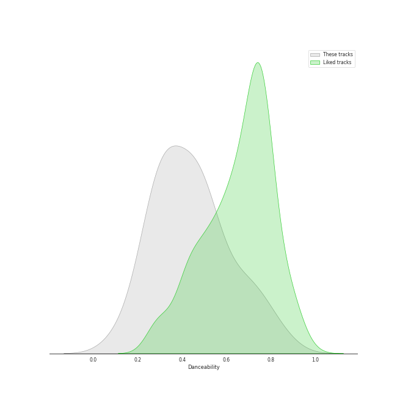
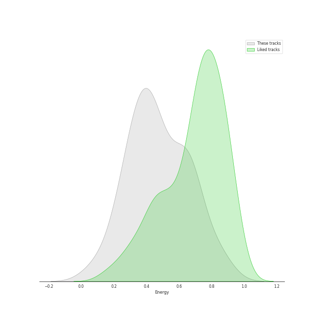
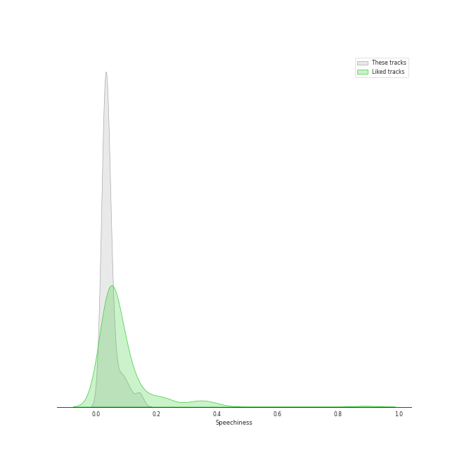
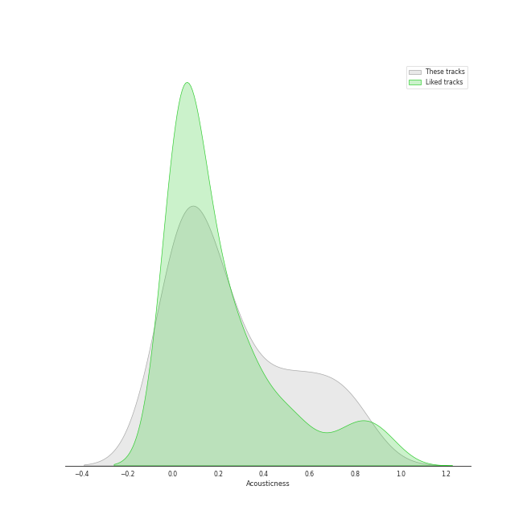
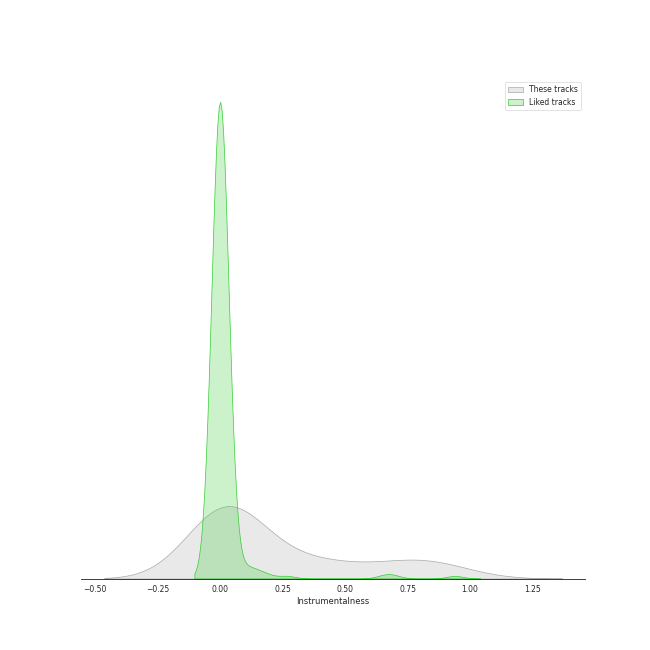
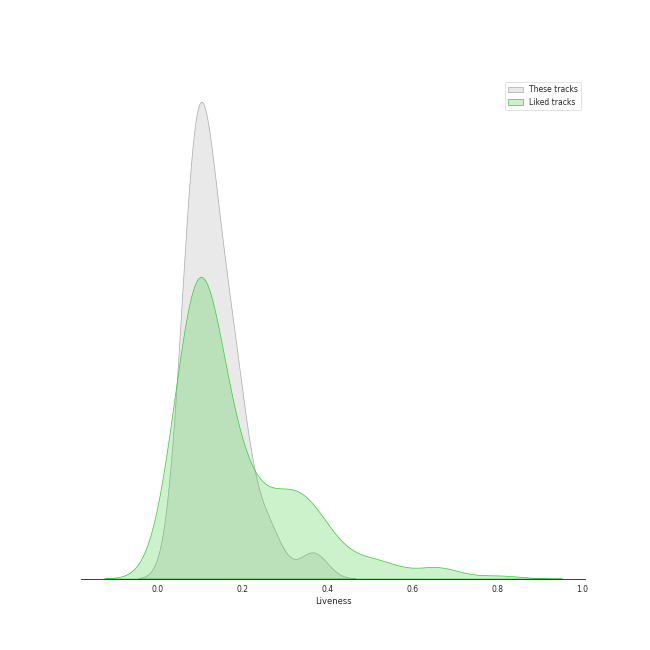
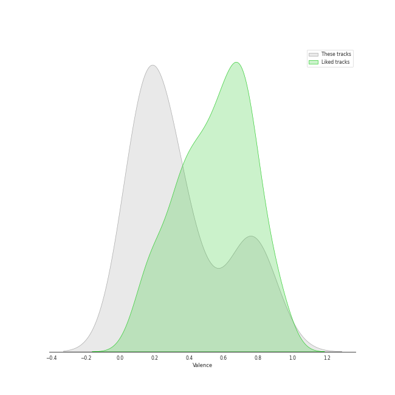
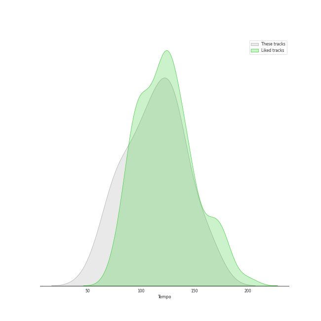

# Track Features for art rock

## Danceability

| ​ | 10 most Danceable tracks | ​​ | 10 least Danceable tracks |
|:---|:---|:---|:---|
|  | Dreadlock Holiday (0.837) |  | Pyramid Song (0.12) |
|  | Don't Eat The Yellow Snow (0.747) |  | Nature Boy - From "Moulin Rouge" Soundtrack (0.214) |
|  | Good Morning Judge (0.737) |  | Paranoid Android (0.251) |
|  | Another Brick in the Wall, Pt. 2 (0.693) |  | No Surprises (0.255) |
|  | All I Need (0.67) |  | The Great Gig in the Sky (0.274) |
|  | There, There (0.614) |  | Exit Music (For A Film) (0.293) |
|  | Hey You (0.587) |  | Everything In Its Right Place (0.296) |
|  | Weird Fishes/ Arpeggi (0.531) |  | Set the Controls for the Heart of the Sun (0.297) |
|  | Reckoner (0.523) |  | Space Oddity - 2015 Remaster (0.31) |
|  | Creep (0.515) |  | Subterranean Homesick Alien (0.312) |

## Energy

| ​ | 10 most Energetic tracks | ​​ | 10 least Energetic tracks |
|:---|:---|:---|:---|
|  | Paranoid Android (0.848) |  | Nature Boy - From "Moulin Rouge" Soundtrack (0.084) |
|  | Jigsaw Falling Into Place (0.832) |  | The Great Gig in the Sky (0.217) |
|  | Peaches En Regalia (0.689) |  | Fake Plastic Trees (0.229) |
|  | There, There (0.677) |  | Brain Damage (0.265) |
|  | Let Down (0.676) |  | Exit Music (For A Film) (0.276) |
|  | Don't Eat The Yellow Snow (0.672) |  | Hey You (0.302) |
|  | Uncle Remus (0.66) |  | Set the Controls for the Heart of the Sun (0.327) |
|  | Reckoner (0.656) |  | Pyramid Song (0.336) |
|  | Good Morning Judge (0.642) |  | Comfortably Numb (0.366) |
|  | Weird Fishes/ Arpeggi (0.61) |  | Breathe (In the Air) (0.373) |

## Speechiness

| ​ | 10 most Speechy tracks | ​​ | 10 least Speechy tracks |
|:---|:---|:---|:---|
|  | Money (0.144) |  | High and Dry (0.0256) |
|  | Don't Eat The Yellow Snow (0.112) |  | Karma Police (0.0258) |
|  | Good Morning Judge (0.0916) |  | Reckoner (0.0262) |
|  | Time (0.0841) |  | No Surprises (0.0278) |
|  | Dreadlock Holiday (0.064) |  | Comfortably Numb (0.0286) |
|  | Paranoid Android (0.0579) |  | Hey You (0.0293) |
|  | Set the Controls for the Heart of the Sun (0.0482) |  | Peaches En Regalia (0.0294) |
|  | Jigsaw Falling Into Place (0.0479) |  | Fake Plastic Trees (0.0297) |
|  | Everything In Its Right Place (0.0449) |  | Subterranean Homesick Alien (0.0298) |
|  | Another Brick in the Wall, Pt. 2 (0.0428) |  | Brain Damage (0.0302) |

## Acousticness

| ​ | 10 most Acoustic tracks | ​​ | 10 least Acoustic tracks |
|:---|:---|:---|:---|
|  | Pyramid Song (0.786) |  | Let Down (0.000121) |
|  | Weird Fishes/ Arpeggi (0.772) |  | Creep (0.0097) |
|  | The Great Gig in the Sky (0.767) |  | Good Morning Judge (0.0185) |
|  | Everything In Its Right Place (0.705) |  | There, There (0.0193) |
|  | Set the Controls for the Heart of the Sun (0.673) |  | Money (0.024) |
|  | Dreadlock Holiday (0.541) |  | Uncle Remus (0.034) |
|  | All I Need (0.531) |  | Paranoid Android (0.0377) |
|  | Time (0.521) |  | Subterranean Homesick Alien (0.0484) |
|  | Reckoner (0.511) |  | No Surprises (0.0577) |
|  | Breathe (In the Air) (0.389) |  | Karma Police (0.0638) |

## Instrumentalness

| ​ | 10 most Instrumental tracks | ​​ | 10 least Instrumental tracks |
|:---|:---|:---|:---|
|  | Set the Controls for the Heart of the Sun (0.905) |  | Space Oddity - 2015 Remaster (9.27e-05) |
|  | The Great Gig in the Sky (0.896) |  | Karma Police (9.32e-05) |
|  | Peaches En Regalia (0.835) |  | Creep (0.000133) |
|  | Weird Fishes/ Arpeggi (0.756) |  | Nature Boy - From "Moulin Rouge" Soundtrack (0.000281) |
|  | Breathe (In the Air) (0.728) |  | Another Brick in the Wall, Pt. 2 (0.000694) |
|  | Street Spirit (Fade Out) (0.694) |  | Subterranean Homesick Alien (0.00139) |
|  | There, There (0.52) |  | Money (0.00199) |
|  | All I Need (0.428) |  | Hey You (0.00216) |
|  | Pyramid Song (0.404) |  | No Surprises (0.00361) |
|  | Brain Damage (0.341) |  | Good Morning Judge (0.00415) |

## Liveness

| ​ | 10 most Live tracks | ​​ | 10 least Live tracks |
|:---|:---|:---|:---|
|  | Brain Damage (0.366) |  | Paranoid Android (0.0545) |
|  | Money (0.269) |  | Reckoner (0.0679) |
|  | Another Brick in the Wall, Pt. 2 (0.247) |  | Good Morning Judge (0.0726) |
|  | Fake Plastic Trees (0.202) |  | Jigsaw Falling Into Place (0.0741) |
|  | Dreadlock Holiday (0.198) |  | Set the Controls for the Heart of the Sun (0.0786) |
|  | Let Down (0.18) |  | The Great Gig in the Sky (0.0832) |
|  | Street Spirit (Fade Out) (0.179) |  | Comfortably Numb (0.0837) |
|  | Time (0.178) |  | Peaches En Regalia (0.0848) |
|  | Karma Police (0.172) |  | Uncle Remus (0.0893) |
|  | Exit Music (For A Film) (0.167) |  | High and Dry (0.0896) |

## Valence

| ​ | 10 most Happy tracks | ​​ | 10 least Happy tracks |
|:---|:---|:---|:---|
|  | Dreadlock Holiday (0.892) |  | Everything In Its Right Place (0.0629) |
|  | Jigsaw Falling Into Place (0.807) |  | Pyramid Song (0.0679) |
|  | Money (0.785) |  | Nature Boy - From "Moulin Rouge" Soundtrack (0.0692) |
|  | Peaches En Regalia (0.777) |  | All I Need (0.0997) |
|  | Uncle Remus (0.742) |  | Creep (0.104) |
|  | Don't Eat The Yellow Snow (0.742) |  | No Surprises (0.118) |
|  | Another Brick in the Wall, Pt. 2 (0.721) |  | Street Spirit (Fade Out) (0.131) |
|  | There, There (0.716) |  | Fake Plastic Trees (0.135) |
|  | Good Morning Judge (0.467) |  | Let Down (0.143) |
|  | Space Oddity - 2015 Remaster (0.466) |  | Comfortably Numb (0.171) |

## Tempo

| ​ | 10 most Fast tracks | ​​ | 10 least Fast tracks |
|:---|:---|:---|:---|
|  | Jigsaw Falling Into Place (165.653) |  | Nature Boy - From "Moulin Rouge" Soundtrack (57.307) |
|  | Paranoid Android (163.709) |  | Pyramid Song (72.64) |
|  | Weird Fishes/ Arpeggi (152.958) |  | Fake Plastic Trees (73.543) |
|  | Subterranean Homesick Alien (150.502) |  | Karma Police (74.807) |
|  | Street Spirit (Fade Out) (138.076) |  | No Surprises (76.426) |
|  | Don't Eat The Yellow Snow (137.392) |  | Uncle Remus (78.591) |
|  | Space Oddity - 2015 Remaster (134.48) |  | High and Dry (87.568) |
|  | Brain Damage (133.568) |  | All I Need (88.014) |
|  | Set the Controls for the Heart of the Sun (130.852) |  | Creep (91.844) |
|  | Breathe (In the Air) (128.153) |  | Peaches En Regalia (101.894) |
