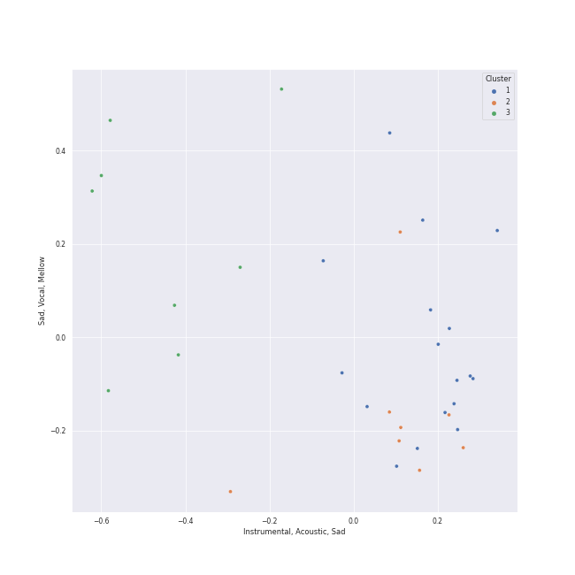

# Clusters in art rock

## Cluster #1

17 tracks

| Art | Track | Album | Artists | Label | Rank | 💚 | 🔗 |
|:---|:---|:---|:---|:---|---:|:---|:---|
|  | Reckoner | In Rainbows | [Radiohead](../../../../artists/radiohead/overview.md) | [XL Recordings](../../../../labels/xl_recordings) | nan | 💚 | [🔗](https://open.spotify.com/track/02ppMPbg1OtEdHgoPqoqju) |
|  | Exit Music (For A Film) | OK Computer | [Radiohead](../../../../artists/radiohead/overview.md) | [XL Recordings](../../../../labels/xl_recordings) | 309 | 💚 | [🔗](https://open.spotify.com/track/0z1o5L7HJx562xZSATcIpY) |
|  | No Surprises | OK Computer | [Radiohead](../../../../artists/radiohead/overview.md) | [XL Recordings](../../../../labels/xl_recordings) | nan | 💚 | [🔗](https://open.spotify.com/track/10nyNJ6zNy2YVYLrcwLccB) |
|  | Subterranean Homesick Alien | OK Computer | [Radiohead](../../../../artists/radiohead/overview.md) | [XL Recordings](../../../../labels/xl_recordings) | nan | 💚 | [🔗](https://open.spotify.com/track/2CVV8PtUYYsux8XOzWkCP0) |
|  | Karma Police | OK Computer | [Radiohead](../../../../artists/radiohead/overview.md) | [XL Recordings](../../../../labels/xl_recordings) | 564 | 💚 | [🔗](https://open.spotify.com/track/63OQupATfueTdZMWTxW03A) |
|  | High and Dry | The Bends | [Radiohead](../../../../artists/radiohead/overview.md) | [XL Recordings](../../../../labels/xl_recordings) | nan | 💚 | [🔗](https://open.spotify.com/track/2a1iMaoWQ5MnvLFBDv4qkf) |
|  | Fake Plastic Trees | The Bends | [Radiohead](../../../../artists/radiohead/overview.md) | [XL Recordings](../../../../labels/xl_recordings) | 428 | 💚 | [🔗](https://open.spotify.com/track/73CKjW3vsUXRpy3NnX4H7F) |
|  | Creep | Pablo Honey | [Radiohead](../../../../artists/radiohead/overview.md) | [XL Recordings](../../../../labels/xl_recordings) | 459 | 💚 | [🔗](https://open.spotify.com/track/70LcF31zb1H0PyJoS1Sx1r) |
|  | Comfortably Numb | The Wall | Pink Floyd | Pink Floyd Records | nan | | [🔗](https://open.spotify.com/track/5HNCy40Ni5BZJFw1TKzRsC) |
|  | Hey You | The Wall | Pink Floyd | Pink Floyd Records | nan | | [🔗](https://open.spotify.com/track/7F02x6EKYIQV3VcTaTm7oN) |
## Cluster #2

8 tracks

| Art | Track | Album | Artists | Label | Rank | 💚 | 🔗 |
|:---|:---|:---|:---|:---|---:|:---|:---|
|  | Jigsaw Falling Into Place | In Rainbows | [Radiohead](../../../../artists/radiohead/overview.md) | [XL Recordings](../../../../labels/xl_recordings) | 493 | 💚 | [🔗](https://open.spotify.com/track/0YJ9FWWHn9EfnN0lHwbzvV) |
|  | There, There | Hail To the Thief | [Radiohead](../../../../artists/radiohead/overview.md) | [XL Recordings](../../../../labels/xl_recordings) | nan | 💚 | [🔗](https://open.spotify.com/track/5h4y42RUKwYKYWgutNwvKP) |
|  | Money | The Dark Side of the Moon | Pink Floyd | Pink Floyd Records | nan | 💚 | [🔗](https://open.spotify.com/track/0vFOzaXqZHahrZp6enQwQb) |
|  | Another Brick in the Wall, Pt. 2 | The Wall | Pink Floyd | Pink Floyd Records | nan | | [🔗](https://open.spotify.com/track/4gMgiXfqyzZLMhsksGmbQV) |
|  | Dreadlock Holiday | Bloody Tourists | 10cc | [EMI](../../../../labels/emi) | nan | 💚 | [🔗](https://open.spotify.com/track/1LOZMYF5s8qhW7Rv4w2gun) |
|  | Good Morning Judge | Deceptive Bends | 10cc | [EMI](../../../../labels/emi) | nan | 💚 | [🔗](https://open.spotify.com/track/1fMGRxKRtIKNyaMMGrzInM) |
|  | Don't Eat The Yellow Snow | Apostrophe(') | Frank Zappa | Frank Zappa Catalog | nan | | [🔗](https://open.spotify.com/track/1QY4TdhuNIOX2SHLdElzd5) |
|  | Uncle Remus | Apostrophe(') | Frank Zappa | Frank Zappa Catalog | nan | | [🔗](https://open.spotify.com/track/4PPwkLq2ld1k09Bl5NkyZB) |
## Cluster #3

8 tracks

| Art | Track | Album | Artists | Label | Rank | 💚 | 🔗 |
|:---|:---|:---|:---|:---|---:|:---|:---|
|  | Weird Fishes/ Arpeggi | In Rainbows | [Radiohead](../../../../artists/radiohead/overview.md) | [XL Recordings](../../../../labels/xl_recordings) | nan | | [🔗](https://open.spotify.com/track/4wajJ1o7jWIg62YqpkHC7S) |
|  | All I Need | In Rainbows | [Radiohead](../../../../artists/radiohead/overview.md) | [XL Recordings](../../../../labels/xl_recordings) | nan | | [🔗](https://open.spotify.com/track/5Qv2Nby1xTr9pQyjkrc94J) |
|  | Street Spirit (Fade Out) | The Bends | [Radiohead](../../../../artists/radiohead/overview.md) | [XL Recordings](../../../../labels/xl_recordings) | 555 | 💚 | [🔗](https://open.spotify.com/track/2QwObYJWyJTiozvs0RI7CF) |
|  | Pyramid Song | Amnesiac | [Radiohead](../../../../artists/radiohead/overview.md) | [XL Recordings](../../../../labels/xl_recordings) | nan | 💚 | [🔗](https://open.spotify.com/track/3A9vIxzGBjEfqmDK7H9exS) |
|  | The Great Gig in the Sky | The Dark Side of the Moon | Pink Floyd | Pink Floyd Records | 642 | | [🔗](https://open.spotify.com/track/2TjdnqlpwOjhijHCwHCP2d) |
|  | Breathe (In the Air) | The Dark Side of the Moon | Pink Floyd | Pink Floyd Records | nan | 💚 | [🔗](https://open.spotify.com/track/2ctvdKmETyOzPb2GiJJT53) |
|  | Set the Controls for the Heart of the Sun | A Saucerful of Secrets | Pink Floyd | Pink Floyd Records | nan | 💚 | [🔗](https://open.spotify.com/track/6p9UFDNfGrzS5Byd2r9KPk) |
|  | Peaches En Regalia | Hot Rats | Frank Zappa | Frank Zappa Catalog | nan | | [🔗](https://open.spotify.com/track/5uDu2qOoDou7cFXsipAo8l) |