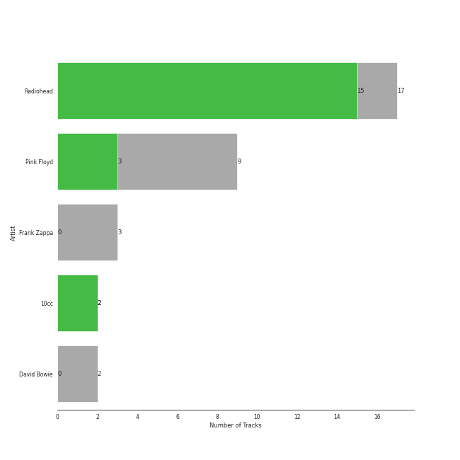
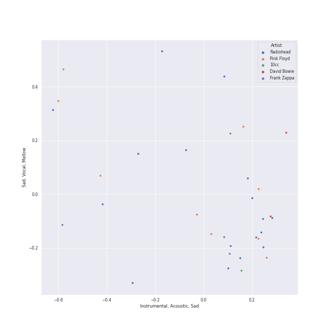
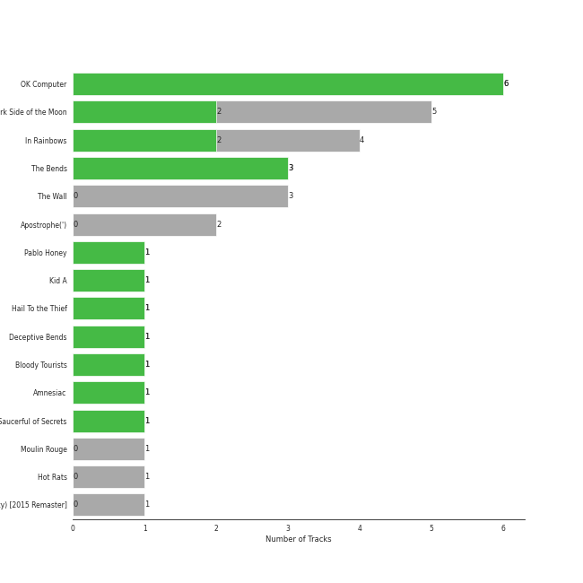
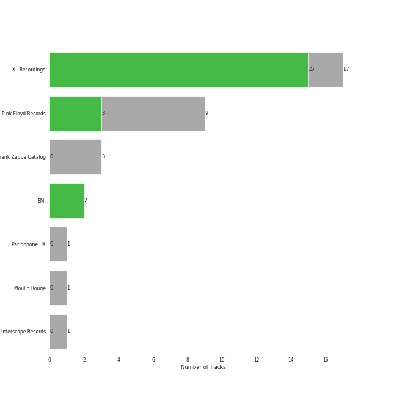
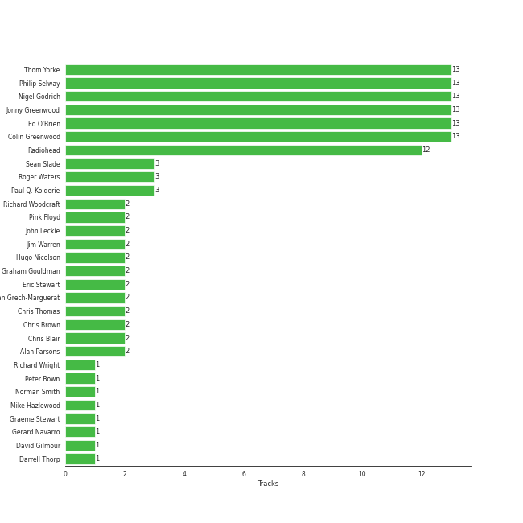
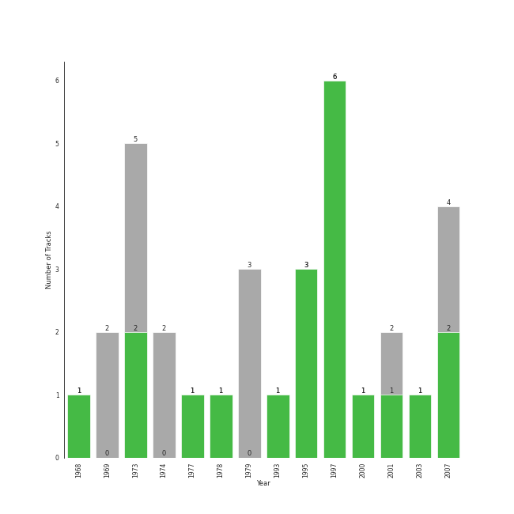

# art rock

33 songs

[See Track Features](audio_features.md)

[See Clusters](clusters/overview.md)

## Top Artists

| Art | Rank | Tracks | 💚 | Artist | 🔗 |
|:---|---:|---:|---:|:---|:---|
|  | 48 | 17 | 15 | [Radiohead](../../artists/radiohead/overview.md) | [🔗](https://open.spotify.com/artist/4Z8W4fKeB5YxbusRsdQVPb) |
|  | 106 | 9 | 3 | Pink Floyd | [🔗](https://open.spotify.com/artist/0k17h0D3J5VfsdmQ1iZtE9) |
|  | 286 | 2 | 2 | 10cc | [🔗](https://open.spotify.com/artist/6i6WlGzQtXtz7GcC5H5st5) |
|  | 236 | 3 | 0 | Frank Zappa | [🔗](https://open.spotify.com/artist/6ra4GIOgCZQZMOaUECftGN) |
|  | 432 | 2 | 0 | David Bowie | [🔗](https://open.spotify.com/artist/0oSGxfWSnnOXhD2fKuz2Gy) |

## Most and least listened tracks
| Rank | ​ | Most listened tracks | Rank | ​​ | Least listened tracks |
|---:|:---|:---|---:|:---|:---|
| 276 |  | [Paranoid Android](../../artists/radiohead/overview.md) | 1010 |  | Hey You |
| 291 |  | [Fake Plastic Trees](../../artists/radiohead/overview.md) | 1010 |  | Space Oddity - 2015 Remaster |
| 460 |  | [Exit Music (For A Film)](../../artists/radiohead/overview.md) | 1010 |  | Set the Controls for the Heart of the Sun |
| 654 |  | [Creep](../../artists/radiohead/overview.md) | 1010 |  | Peaches En Regalia |
| 691 |  | [Jigsaw Falling Into Place](../../artists/radiohead/overview.md) | 1010 |  | [There, There](../../artists/radiohead/overview.md) |
| 744 |  | [Let Down](../../artists/radiohead/overview.md) | 1010 |  | [All I Need](../../artists/radiohead/overview.md) |
| 768 |  | [Street Spirit (Fade Out)](../../artists/radiohead/overview.md) | 1010 |  | Comfortably Numb |
| 777 |  | [Karma Police](../../artists/radiohead/overview.md) | 1010 |  | Nature Boy - From "Moulin Rouge" Soundtrack |
| 881 |  | The Great Gig in the Sky | 1010 |  | [Pyramid Song](../../artists/radiohead/overview.md) |
| 1010 |  | [Reckoner](../../artists/radiohead/overview.md) | 1010 |  | [Weird Fishes/ Arpeggi](../../artists/radiohead/overview.md) |

## Top Albums

| Art | Rank | Tracks | 💚 | Album | Release Date | 🔗 |
|:---|---:|---:|---:|:---|:---|:---|
|  | 179 | 6 | 6 | OK Computer | 1997-05-28 | [🔗](https://open.spotify.com/album/6dVIqQ8qmQ5GBnJ9shOYGE) |
|  | 583 | 5 | 2 | The Dark Side of the Moon | 1973-03-01 | [🔗](https://open.spotify.com/album/4LH4d3cOWNNsVw41Gqt2kv) |
|  | 466 | 4 | 2 | In Rainbows | 2007-12-28 | [🔗](https://open.spotify.com/album/5vkqYmiPBYLaalcmjujWxK) |
|  | 204 | 3 | 3 | The Bends | 1995-03-13 | [🔗](https://open.spotify.com/album/35UJLpClj5EDrhpNIi4DFg) |
|  | 662 | 3 | 0 | The Wall | 1979-11-30 | [🔗](https://open.spotify.com/album/5Dbax7G8SWrP9xyzkOvy2F) |
|  | 662 | 2 | 0 | Apostrophe(') | 1974-03-22 | [🔗](https://open.spotify.com/album/3EbtMJsHbspjhN6Xd4plIu) |
|  | 435 | 1 | 1 | Pablo Honey | 1993-02-22 | [🔗](https://open.spotify.com/album/3gBVdu4a1MMJVMy6vwPEb8) |
|  | 662 | 1 | 1 | Kid A | 2000-10-02 | [🔗](https://open.spotify.com/album/6GjwtEZcfenmOf6l18N7T7) |
|  | 662 | 1 | 1 | Hail To the Thief | 2003-06-09 | [🔗](https://open.spotify.com/album/5mzoI3VH0ZWk1pLFR6RoYy) |
|  | 662 | 1 | 1 | Deceptive Bends | 1977 | [🔗](https://open.spotify.com/album/6D3RQD5AQZ4P2aDzsZmBI4) |

See all 16 albums

| Art | Rank | Tracks | 💚 | Album | Release Date | 🔗 |
|:---|---:|---:|---:|:---|:---|:---|
|  | 662 | 1 | 1 | Bloody Tourists | 1978 | [🔗](https://open.spotify.com/album/3MecVG0PeBObAhjwEAczFG) |
|  | 662 | 1 | 1 | Amnesiac | 2001-03-12 | [🔗](https://open.spotify.com/album/1HrMmB5useeZ0F5lHrMvl0) |
|  | 662 | 1 | 1 | A Saucerful of Secrets | 1968-06-29 | [🔗](https://open.spotify.com/album/2vnJKtGjZXRUg0mYPZ3HGH) |
|  | 662 | 1 | 0 | Moulin Rouge | 2001-01-01 | [🔗](https://open.spotify.com/album/1Kg7AyuyIMTfD6geg9VghI) |
|  | 662 | 1 | 0 | Hot Rats | 1969-10-10 | [🔗](https://open.spotify.com/album/0WYYrC9My9rYWigac003hw) |
|  | 662 | 1 | 0 | David Bowie (aka Space Oddity) [2015 Remaster] | 1969-11-04 | [🔗](https://open.spotify.com/album/1ay9Z4R5ZYI2TY7WiDhNYQ) |

## Top Record Labels

| Tracks | 💚 | Label |
|---:|---:|:---|
| 17 | 15 | [XL Recordings](../../labels/xl_recordings/overview.md) |
| 9 | 3 | Pink Floyd Records |
| 2 | 2 | [EMI](../../labels/emi/overview.md) |
| 3 | 0 | Frank Zappa Catalog |
| 1 | 0 | [Parlophone UK](../../labels/parlophone_uk/overview.md) |
| 1 | 0 | Moulin Rouge |
| 1 | 0 | [Interscope Records](../../labels/interscope_records/overview.md) |

## Top Producers

| Art | Producer | Tracks | Credit Types |
|:---|:---|---:|:---|
| | [Colin Greenwood](../../producers/colin_greenwood/overview.md) | 13 | Songwriter |
| | [Ed O'Brien](../../producers/ed_o_brien/overview.md) | 13 | Songwriter |
| | [Jonny Greenwood](../../producers/jonny_greenwood/overview.md) | 13 | Songwriter, Arranger, Producer |
| | [Philip Selway](../../producers/philip_selway/overview.md) | 13 | Songwriter |
| | [Nigel Godrich](../../producers/nigel_godrich/overview.md) | 13 | Producer |
| | [Thom Yorke](../../producers/thom_yorke/overview.md) | 13 | Lyricist, Producer, Songwriter, Arranger |
|  | [Radiohead](../../artists/radiohead/overview.md) | 12 | Arranger, Producer, Lyricist, Songwriter |
| | Sean Slade | 3 | Producer |
| | Paul Q. Kolderie | 3 | Producer |
| | Roger Waters | 3 | Lyricist, Songwriter |

View all

| Art | Producer | Tracks | Credit Types |
|:---|:---|---:|:---|
| | Graham Gouldman | 2 | Producer, Songwriter |
|  | Chris Brown | 2 | Producer |
| | Alan Parsons | 2 | Producer |
| | Dan Grech-Marguerat | 2 | Producer |
| | Eric Stewart | 2 | Producer, Songwriter |
| | Hugo Nicolson | 2 | Producer |
|  | Pink Floyd | 2 | Producer |
| | John Leckie | 2 | Producer |
| | Richard Woodcraft | 2 | Producer |
| | Chris Thomas | 2 | Producer |
| | Chris Blair | 2 | Producer |
| | Jim Warren | 2 | Producer |
| | Gerard Navarro | 1 | Producer |
| | Graeme Stewart | 1 | Producer |
| | Peter Bown | 1 | Producer |
| | Mike Hazlewood | 1 | Songwriter |
| | Darrell Thorp | 1 | Producer |
| | Richard Wright | 1 | Songwriter |
| | Norman Smith | 1 | Producer |
| | Albert Hammond | 1 | Songwriter |
| | David Gilmour | 1 | Songwriter |
|  | 10cc | 1 | Producer |

## Years

| ​ | 10 newest albums | ​​ | 10 oldest albums |
|:---|:---|:---|:---|
|  | In Rainbows (2007-12-28) |  | A Saucerful of Secrets (1968-06-29) |
|  | Hail To the Thief (2003-06-09) |  | Hot Rats (1969-10-10) |
|  | Amnesiac (2001-03-12) |  | David Bowie (aka Space Oddity) [2015 Remaster] (1969-11-04) |
|  | Moulin Rouge (2001-01-01) |  | The Dark Side of the Moon (1973-03-01) |
|  | Kid A (2000-10-02) |  | Apostrophe(') (1974-03-22) |
|  | OK Computer (1997-05-28) |  | Deceptive Bends (1977) |
|  | The Bends (1995-03-13) |  | Bloody Tourists (1978) |
|  | Pablo Honey (1993-02-22) |  | The Wall (1979-11-30) |
|  | The Wall (1979-11-30) |  | Pablo Honey (1993-02-22) |
|  | Bloody Tourists (1978) |  | The Bends (1995-03-13) |

