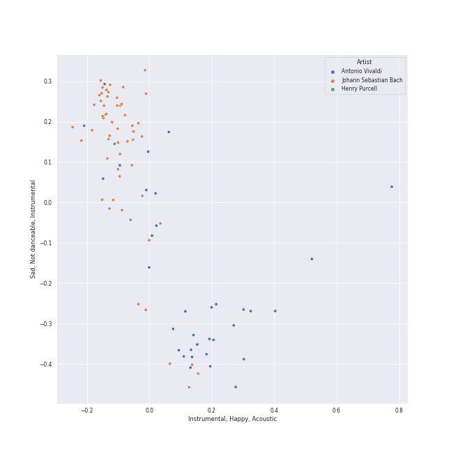
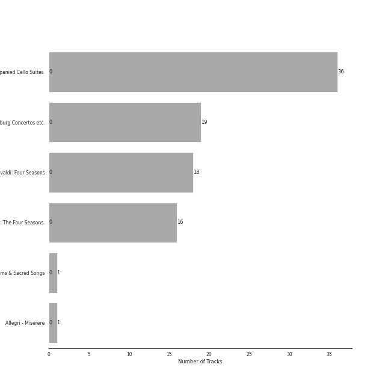

# baroque

[91 songs](baroque_tracks.md)

## Top Artists

See all 18 artists

| Number of Tracks | Art | Artist | 🔗 |
|---:|:---|:---|:---|
| 55 |  | [Johann Sebastian Bach](../artists/johann_sebastian_bach.md) | [🔗](https://open.spotify.com/artist/5aIqB5nVVvmFsvSdExz408) |
| 36 |  | [Yo-Yo Ma](../artists/yo_yo_ma.md) | [🔗](https://open.spotify.com/artist/5Dl3HXZjG6ZOWT5cV375lk) |
| 34 |  | [Antonio Vivaldi](../artists/antonio_vivaldi.md) | [🔗](https://open.spotify.com/artist/2QOIawHpSlOwXDvSqQ9YJR) |
| 19 |  | [Benjamin Britten](../artists/benjamin_britten.md) | [🔗](https://open.spotify.com/artist/7MJ1pB5d6Vjmzep2zQlorn) |
| 19 |  | [English Chamber Orchestra](../artists/english_chamber_orchestra.md) | [🔗](https://open.spotify.com/artist/2DO4p3CPDnInsJfg0jFfaF) |
| 18 |  | [Simon Standage](../artists/simon_standage.md) | [🔗](https://open.spotify.com/artist/2jIBkRzVUboTbp05rJnKeT) |
| 18 |  | [The English Concert](../artists/the_english_concert.md) | [🔗](https://open.spotify.com/artist/2Oz3z7PPQUMU2KNYgcO1sA) |
| 18 |  | [Trevor Pinnock](../artists/trevor_pinnock.md) | [🔗](https://open.spotify.com/artist/25mbgceDJKxXGP8c5FmC83) |
| 16 |  | [Sarah Chang](../artists/sarah_chang.md) | [🔗](https://open.spotify.com/artist/5duxfFAQVkDT9g261fKlMP) |
| 16 |  | [Orpheus Chamber Orchestra](../artists/orpheus_chamber_orchestra.md) | [🔗](https://open.spotify.com/artist/35pZsti1RSA5Zv98jAm8kX) |
| 3 |  | David Reichenberg | [🔗](https://open.spotify.com/artist/5xA5sW0D3BUAyL02XcDkYv) |
| 3 |  | Elizabeth Wilcock | [🔗](https://open.spotify.com/artist/1OfYCRcS14pyRVrO0qTCbs) |
| 2 |  | Henry Purcell | [🔗](https://open.spotify.com/artist/3tMLo1k3iUo82coMLWXzxq) |
| 1 |  | Capriccio Stravagante | [🔗](https://open.spotify.com/artist/7Hb8ewIvJmuQPAQ5MMVXJE) |
| 1 |  | Joseph Jennings | [🔗](https://open.spotify.com/artist/5A3ntUGTCKttzOwkoF9AUY) |
| 1 |  | Chanticleer | [🔗](https://open.spotify.com/artist/4p6DfIA6NnKmWeRgDJPLT0) |
| 1 |  | The Choir Of Trinity College, Cambridge | [🔗](https://open.spotify.com/artist/3x8rZy1i6FwWOWKwfRT1Ab) |
| 1 |  | Skip Sempé | [🔗](https://open.spotify.com/artist/3DSclbx4DSkyIvouHCxHHZ) |

## Top Albums

See all 6 albums

| Number of Tracks | Art | Album | Release Date | 🔗 |
|---:|:---|:---|:---|:---|
| 36 |  | Bach: Unaccompanied Cello Suites (Remastered) | 1983 | [🔗](https://open.spotify.com/album/2OpnKgmVYPEN2GldgBponI) |
| 19 |  | Bach, J.S.: Brandenburg Concertos etc. | 1995-01-01 | [🔗](https://open.spotify.com/album/11FzhwtOFCPB4vpgWo33xV) |
| 18 |  | Vivaldi: Four Seasons | 2008-01-01 | [🔗](https://open.spotify.com/album/4Uc1Cus3I9LjkI2XwtQnfc) |
| 16 |  | Vivaldi: The Four Seasons. | 2007-10-01 | [🔗](https://open.spotify.com/album/4YpaKMCcb65yOoee75UUOh) |
| 1 |  | Purcell : Anthems & Sacred Songs [Evening Prayer] | 2003-08-29 | [🔗](https://open.spotify.com/album/7K8qhv7euF0xd6DiqoReDK) |
| 1 |  | Allegri - Miserere | 1994-02-15 | [🔗](https://open.spotify.com/album/6DXPSePAsqcD40WQsSnasD) |

## Top Record Labels

See all 6 labels

| Number of Tracks | Label |
|---:|:---|
| 36 | [Sony Classical](../labels/sony_classical.md) |
| 19 | [Decca Music Group Ltd.](../labels/decca_music_group_ltd_.md) |
| 18 | [Decca (UMO)](../labels/decca__umo_.md) |
| 16 | [Warner Classics](../labels/warner_classics.md) |
| 1 | Warner Classics International |
| 1 | Conifer Classics |

## Audio Features

| 10 most Danceable tracks | 10 least Danceable tracks |
|:---|:---|
| Brandenburg Concerto No. 2 in F, BWV 1047: 3. Allegro assai (0.691) | Cello Suite No. 5 in C Minor, BWV 1011: IV. Sarabande (0.0874) |
| Brandenburg Concerto No. 2 in F, BWV 1047: 1. (Allegro) (0.687) | Cello Suite No. 2 in D Minor, BWV 1008: IV. Sarabande (0.098) |
| Concerto for Oboe, Violin, Strings and Continuo in B Flat Major, RV 548: I. (Allegro) (0.603) | Cello Suite No. 5 in C Minor, BWV 1011: II. Allemande (0.103) |
| Concerto for Oboe, Violin, Strings and Continuo in B Flat Major, RV 548: III. Allegro (0.602) | Concerto for Violin and Strings in E Major, Op. 8, No. 1, RV 269 "La Primavera": II. Largo (0.11) |
| Vivaldi: L'estro armonico, Violin Concerto in A Minor, Op. 3 No. 6, RV 356: I. Allegro (0.601) | Cello Suite No. 1 in G Major, BWV 1007: IV. Sarabande (0.113) |
| Brandenburg Concerto No. 3 in G, BWV 1048: 3. Allegro (0.594) | Brandenburg Concerto No. 6 in B flat, BWV 1051: 2. Adagio ma non tanto (0.115) |
| Violin Concerto in E Major, Op. 8, No. 1, RV 269 "La Primavera": I. Allegro (0.557) | Cello Suite No. 3 in C Major, BWV 1009: IV. Sarabande (0.12) |
| Brandenburg Concerto No. 1 in F, BWV 1046: 5. Polacca; Trio II (0.534) | Cello Suite No. 4 in E-Flat Major, BWV 1010: IV. Sarabande (0.125) |
| Vivaldi: Violin Concerto in G Minor, Op. 12 No. 1, RV 317: I. Allegro aperto (0.534) | Cello Suite No. 6 in D Major, BWV 1012: II. Allemande (0.141) |
| Brandenburg Concerto No. 6 in B flat, BWV 1051: 3. Allegro (0.528) | Cello Suite No. 6 in D Major, BWV 1012: IV. Sarabande (0.142) |

| 10 most Energetic tracks | 10 least Energetic tracks |
|:---|:---|
| Violin Concerto in G Minor, Op. 8, No. 2, RV 315 "L'estate": III. Presto (Tempo impetuoso d'estate) (0.449) | Vivaldi: The Four Seasons, Violin Concerto in F Major, Op. 8 No. 3, RV 293 "Autumn": II. Adagio molto (0.00782) |
| Vivaldi: The Four Seasons, Violin Concerto in G Minor, Op. 8 No. 2, RV 315 "Summer": III. Presto (0.445) | Cello Suite No. 5 in C Minor, BWV 1011: IV. Sarabande (0.0169) |
| Brandenburg Concerto No. 2 in F, BWV 1047: 3. Allegro assai (0.441) | Concerto for Violin and Strings in F Major, Op. 8, No. 3, RV 293 "L'autunno": II. Adagio molto (Ubriachi dormienti) (0.0216) |
| Brandenburg Concerto No. 3 in G, BWV 1048: 3. Allegro (0.426) | Hear my prayer, O Lord (0.0236) |
| Brandenburg Concerto No. 2 in F, BWV 1047: 1. (Allegro) (0.398) | Vivaldi: The Four Seasons, Violin Concerto in G Minor, Op. 8 No. 2, RV 315 "Summer": II. Adagio (0.0243) |
| Brandenburg Concerto No. 4 in G, BWV 1049: 3. Presto (0.286) | Concerto for Oboe, Violin, Strings and Continuo in B Flat Major, RV 548: II. Largo (0.027) |
| Brandenburg Concerto No. 1 in F, BWV 1046: 3. Allegro (0.284) | Cello Suite No. 1 in G Major, BWV 1007: IV. Sarabande (0.0283) |
| Violin Concerto in F Minor, Op. 8, No. 4, RV 297 "L'inverno": I. Allegro non molto (0.282) | Vivaldi: Violin Concerto in G Minor, Op. 12 No. 1, RV 317: II. Largo (0.0288) |
| Brandenburg Concerto No. 1 in F, BWV 1046: 1. (Allegro) (0.275) | Vivaldi: The Four Seasons, Violin Concerto in E Major, Op. 8 No. 1, RV 269 "Spring": II. Largo e pianissimo sempre (0.0289) |
| Brandenburg Concerto No. 3 in G, BWV 1048: 1. (Allegro) (0.26) | Concerto for 2 Violins, Strings and Continuo in G Major, RV 516: II. Andante (molto) (0.0306) |

| 10 most Speechy tracks | 10 least Speechy tracks |
|:---|:---|
| Vivaldi: The Four Seasons, Violin Concerto in F Minor, Op. 8 No. 4, RV 297 "Winter": III. Allegro (0.0963) | Violin Concerto in G Minor, Op. 8, No. 2, RV 315 "L'estate": III. Presto (Tempo impetuoso d'estate) (0.0336) |
| Cello Suite No. 1 in G Major, BWV 1007: II. Allemande (0.0672) | Concerto for Oboe, Violin, Strings and Continuo in B Flat Major, RV 548: III. Allegro (0.0353) |
| Cello Suite No. 6 in D Major, BWV 1012: I. Prélude (0.0604) | Violin Concerto in E Major, Op. 8, No. 1, RV 269 "La Primavera": I. Allegro (0.036) |
| Cello Suite No. 1 in G Major, BWV 1007: I. Prélude (0.0597) | Concerto for Violin and Strings in F Major, Op. 8, No. 3, RV 293 "L'autunno": II. Adagio molto (Ubriachi dormienti) (0.0374) |
| Brandenburg Concerto No. 5 in D, BWV 1050: 3. Allegro (0.0596) | Concerto for Violin and Strings in E Major, Op. 8, No. 1, RV 269 "La Primavera": III. Allegro (Danza pastorale) (0.0375) |
| Brandenburg Concerto No. 3 in G, BWV 1048: 1. (Allegro) (0.0572) | Concerto for Oboe, Violin, Strings and Continuo in B Flat Major, RV 548: I. (Allegro) (0.0376) |
| Brandenburg Concerto No. 2 in F, BWV 1047: 3. Allegro assai (0.0568) | Brandenburg Concerto No. 4 in G, BWV 1049: 3. Presto (0.038) |
| Brandenburg Concerto No. 4 in G, BWV 1049: 1. Allegro (0.0566) | Cello Suite No. 1 in G Major, BWV 1007: III. Courante (0.0381) |
| Concerto for 2 Violins, Strings and Continuo in G Major, RV 516: I. Allegro molto (0.0557) | Purcell: Hear My Prayer, O Lord, Z. 15 (0.0397) |
| Cello Suite No. 1 in G Major, BWV 1007: VI. Gigue (0.0555) | Brandenburg Concerto No. 1 in F, BWV 1046: 2. Adagio (0.04) |

| 10 most Acoustic tracks | 10 least Acoustic tracks |
|:---|:---|
| Purcell: Hear My Prayer, O Lord, Z. 15 (0.99) | Vivaldi: The Four Seasons, Violin Concerto in F Major, Op. 8 No. 3, RV 293 "Autumn": II. Adagio molto (0.0524) |
| Hear my prayer, O Lord (0.99) | Concerto for Violin and Strings in F Major, Op. 8, No. 3, RV 293 "L'autunno": II. Adagio molto (Ubriachi dormienti) (0.386) |
| Cello Suite No. 6 in D Major, BWV 1012: I. Prélude (0.982) | Vivaldi: The Four Seasons, Violin Concerto in F Minor, Op. 8 No. 4, RV 297 "Winter": II. Largo (0.596) |
| Cello Suite No. 6 in D Major, BWV 1012: II. Allemande (0.981) | Concerto for Violin and Strings in E Major, Op. 8, No. 1, RV 269 "La Primavera": III. Allegro (Danza pastorale) (0.644) |
| Cello Suite No. 2 in D Minor, BWV 1008: V. Menuets I & II (0.98) | Violin Concerto in F Minor, Op. 8, No. 4, RV 297 "L'inverno": II. Largo (0.65) |
| Brandenburg Concerto No. 1 in F, BWV 1046: 4. Menuetto: Trio I (0.978) | Vivaldi: The Four Seasons, Violin Concerto in G Minor, Op. 8 No. 2, RV 315 "Summer": I. Allegro non molto (0.71) |
| Cello Suite No. 6 in D Major, BWV 1012: V. Gavottes I & II (0.978) | Vivaldi: The Four Seasons, Violin Concerto in E Major, Op. 8 No. 1, RV 269 "Spring": III. Allegro (0.761) |
| Cello Suite No. 2 in D Minor, BWV 1008: VI. Gigue (0.977) | Concerto for Violin and Strings in G Minor, Op. 8, No. 2, RV 315 "L'estate": I. Allegro non molto - Allegro (0.762) |
| Vivaldi: The Four Seasons, Violin Concerto in E Major, Op. 8 No. 1, RV 269 "Spring": II. Largo e pianissimo sempre (0.977) | Concerto for Oboe, Violin, Strings and Continuo in B Flat Major, RV 548: II. Largo (0.763) |
| Brandenburg Concerto No. 5 in D, BWV 1050: 2. Affetuoso (0.976) | Concerto for Violin and Strings in G Minor, Op. 8, No. 2, RV 315 "L'estate": II. Adagio - Presto - Adagio (0.78) |

| 10 most Instrumental tracks | 10 least Instrumental tracks |
|:---|:---|
| Cello Suite No. 2 in D Minor, BWV 1008: I. Prélude (0.934) | Violin Concerto in F Minor, Op. 8, No. 4, RV 297 "L'inverno": II. Largo (0.0) |
| Cello Suite No. 2 in D Minor, BWV 1008: III. Courante (0.933) | Concerto for Violin and Strings in F Major, Op. 8, No. 3, RV 293 "L'autunno": II. Adagio molto (Ubriachi dormienti) (2.04e-06) |
| Cello Suite No. 2 in D Minor, BWV 1008: II. Allemande (0.928) | Concerto for 2 Violins, Strings and Continuo in G Major, RV 516: II. Andante (molto) (1.26e-05) |
| Cello Suite No. 5 in C Minor, BWV 1011: II. Allemande (0.918) | Concerto for Violin and Strings in E Major, Op. 8, No. 1, RV 269 "La Primavera": III. Allegro (Danza pastorale) (1.42e-05) |
| Cello Suite No. 4 in E-Flat Major, BWV 1010: III. Courante (0.917) | Concerto for 2 Violins, Strings and Continuo in G Major, RV 516: I. Allegro molto (5.38e-05) |
| Cello Suite No. 3 in C Major, BWV 1009: V. Bourrées I & II (0.91) | Concerto for 2 Violins, Strings and Continuo in G Major, RV 516: III. Allegro (0.000132) |
| Cello Suite No. 2 in D Minor, BWV 1008: VI. Gigue (0.908) | Vivaldi: The Four Seasons, Violin Concerto in F Minor, Op. 8 No. 4, RV 297 "Winter": II. Largo (0.000226) |
| Cello Suite No. 5 in C Minor, BWV 1011: VI. Gigue (0.906) | Violin Concerto in F Minor, Op. 8, No. 4, RV 297 "L'inverno": III. Allegro (0.000243) |
| Cello Suite No. 6 in D Major, BWV 1012: III. Courante (0.903) | Concerto for Violin and Strings in G Minor, Op. 8, No. 2, RV 315 "L'estate": I. Allegro non molto - Allegro (0.000308) |
| Cello Suite No. 1 in G Major, BWV 1007: II. Allemande (0.901) | Concerto for Violin and Strings in G Minor, Op. 8, No. 2, RV 315 "L'estate": II. Adagio - Presto - Adagio (0.000318) |

| 10 most Live tracks | 10 least Live tracks |
|:---|:---|
| Cello Suite No. 6 in D Major, BWV 1012: V. Gavottes I & II (0.407) | Concerto for Violin and Strings in F Major, Op. 8, No. 3, RV 293 "L'autunno": II. Adagio molto (Ubriachi dormienti) (0.0551) |
| Brandenburg Concerto No. 4 in G, BWV 1049: 1. Allegro (0.354) | Concerto for Violin and Strings in E Major, Op. 8, No. 1, RV 269 "La Primavera": III. Allegro (Danza pastorale) (0.0639) |
| Concerto for Oboe, Violin, Strings and Continuo in B Flat Major, RV 548: I. (Allegro) (0.341) | Vivaldi: The Four Seasons, Violin Concerto in F Minor, Op. 8 No. 4, RV 297 "Winter": I. Allegro non molto (0.0703) |
| Vivaldi: The Four Seasons, Violin Concerto in G Minor, Op. 8 No. 2, RV 315 "Summer": II. Adagio (0.293) | Vivaldi: The Four Seasons, Violin Concerto in E Major, Op. 8 No. 1, RV 269 "Spring": II. Largo e pianissimo sempre (0.0705) |
| Violin Concerto in G Minor, Op. 8, No. 2, RV 315 "L'estate": III. Presto (Tempo impetuoso d'estate) (0.279) | Concerto for Violin and Strings in E Major, Op. 8, No. 1, RV 269 "La Primavera": II. Largo (0.0715) |
| Cello Suite No. 4 in E-Flat Major, BWV 1010: II. Allemande (0.26) | Violin Concerto in F Major, Op. 8, No. 3, RV 293 "L'autunno": I. Allegro (Ballo, e canto de' villanelli) (0.0717) |
| Cello Suite No. 3 in C Major, BWV 1009: I. Prélude (0.255) | Concerto for 2 Violins, Strings and Continuo in G Major, RV 516: III. Allegro (0.0731) |
| Brandenburg Concerto No. 4 in G, BWV 1049: 3. Presto (0.241) | Cello Suite No. 1 in G Major, BWV 1007: I. Prélude (0.0762) |
| Cello Suite No. 1 in G Major, BWV 1007: V. Menuets I & II (0.24) | Violin Concerto in F Minor, Op. 8, No. 4, RV 297 "L'inverno": I. Allegro non molto (0.0771) |
| Concerto for Violin and Strings in G Minor, Op. 8, No. 2, RV 315 "L'estate": II. Adagio - Presto - Adagio (0.239) | Concerto for 2 Violins, Strings and Continuo in G Major, RV 516: I. Allegro molto (0.0827) |

| 10 most Happy tracks | 10 least Happy tracks |
|:---|:---|
| Brandenburg Concerto No. 2 in F, BWV 1047: 3. Allegro assai (0.931) | Vivaldi: The Four Seasons, Violin Concerto in F Major, Op. 8 No. 3, RV 293 "Autumn": II. Adagio molto (0.0323) |
| Cello Suite No. 3 in C Major, BWV 1009: III. Courante (0.871) | Concerto for Violin and Strings in F Major, Op. 8, No. 3, RV 293 "L'autunno": II. Adagio molto (Ubriachi dormienti) (0.0357) |
| Cello Suite No. 4 in E-Flat Major, BWV 1010: VI. Gigue (0.869) | Hear my prayer, O Lord (0.0357) |
| Cello Suite No. 2 in D Minor, BWV 1008: III. Courante (0.852) | Vivaldi: The Four Seasons, Violin Concerto in G Minor, Op. 8 No. 2, RV 315 "Summer": II. Adagio (0.0375) |
| Cello Suite No. 6 in D Major, BWV 1012: V. Gavottes I & II (0.82) | Purcell: Hear My Prayer, O Lord, Z. 15 (0.0382) |
| Brandenburg Concerto No. 3 in G, BWV 1048: 3. Allegro (0.809) | Brandenburg Concerto No. 1 in F, BWV 1046: 2. Adagio (0.0385) |
| Brandenburg Concerto No. 2 in F, BWV 1047: 1. (Allegro) (0.79) | Vivaldi: Violin Concerto in G Minor, Op. 12 No. 1, RV 317: II. Largo (0.0389) |
| Brandenburg Concerto No. 1 in F, BWV 1046: 3. Allegro (0.786) | Cello Suite No. 2 in D Minor, BWV 1008: IV. Sarabande (0.0495) |
| Cello Suite No. 6 in D Major, BWV 1012: III. Courante (0.76) | Cello Suite No. 5 in C Minor, BWV 1011: IV. Sarabande (0.05) |
| Cello Suite No. 2 in D Minor, BWV 1008: VI. Gigue (0.759) | Vivaldi: The Four Seasons, Violin Concerto in E Major, Op. 8 No. 1, RV 269 "Spring": II. Largo e pianissimo sempre (0.0514) |
